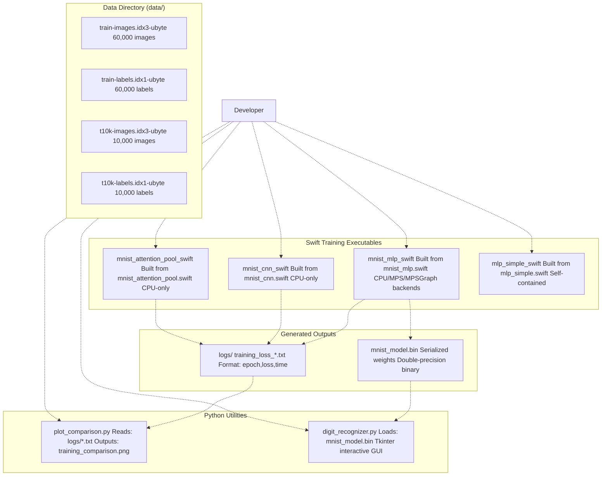
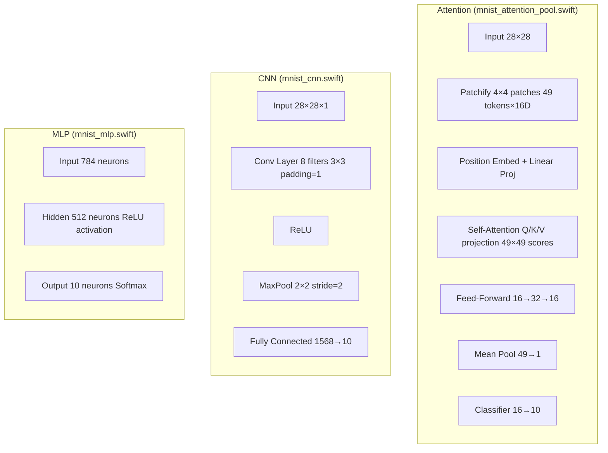
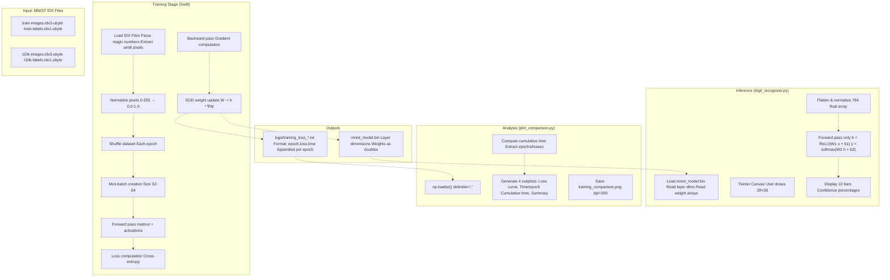

# Home

> **Relevant source files**
> * [README.md](https://github.com/ThalesMMS/Swift-Neural-Networks/blob/3a1c4fc2/README.md)
> * [plot_comparison.py](https://github.com/ThalesMMS/Swift-Neural-Networks/blob/3a1c4fc2/plot_comparison.py)
> * [requirements.txt](https://github.com/ThalesMMS/Swift-Neural-Networks/blob/3a1c4fc2/requirements.txt)

## Purpose and Scope

This wiki documents the Swift-Neural-Networks repository, a collection of neural network implementations written in Swift with Python utilities for analysis and inference. The repository focuses on MNIST digit classification using three distinct architectures (Multi-Layer Perceptron, Convolutional Neural Network, and Self-Attention), plus an educational XOR toy example. All implementations are trained from scratch using custom backpropagation code without external deep learning frameworks.

For step-by-step instructions on building and running models, see [Quick Start Guide](#2). For detailed documentation of individual implementations, see [Training Systems](#4). For GPU acceleration options, see [GPU Acceleration](#5).

**Sources:** [README.md L1-L11](https://github.com/ThalesMMS/Swift-Neural-Networks/blob/3a1c4fc2/README.md#L1-L11)

## Project Overview

The repository implements four neural network training systems:

| Implementation | File | Purpose | Input/Output |
| --- | --- | --- | --- |
| MNIST MLP | `mnist_mlp.swift` | Production-quality MLP with GPU backends | 784→512→10, ~98% accuracy |
| MNIST CNN | `mnist_cnn.swift` | Convolutional network with pooling | 28×28→Conv8→Pool→1568→10, ~92% accuracy |
| MNIST Attention | `mnist_attention_pool.swift` | Transformer-style self-attention | 49 patches→Attention→Pool→10, ~24% accuracy |
| XOR Example | `mlp_simple.swift` | Educational toy problem | 2→4→1, 100% on XOR |

Two Python utilities provide post-training analysis and deployment:

| Utility | File | Purpose |
| --- | --- | --- |
| Training Visualizer | `plot_comparison.py` | Generates 4-panel plots from training logs |
| Digit Recognizer | `digit_recognizer.py` | Interactive GUI for drawing and classifying digits |

**Sources:** [README.md L5-L9](https://github.com/ThalesMMS/Swift-Neural-Networks/blob/3a1c4fc2/README.md#L5-L9)

 [README.md L14-L31](https://github.com/ThalesMMS/Swift-Neural-Networks/blob/3a1c4fc2/README.md#L14-L31)

 [README.md L165-L175](https://github.com/ThalesMMS/Swift-Neural-Networks/blob/3a1c4fc2/README.md#L165-L175)

## System Components

The following diagram shows the complete system architecture with actual file names and directories:



**Key Files and Directories:**

* `data/`: MNIST dataset in IDX binary format (4 files totaling ~50MB)
* `mnist_mlp.swift`, `mnist_cnn.swift`, `mnist_attention_pool.swift`, `mlp_simple.swift`: Source implementations
* `logs/`: CSV training logs (gitignored, generated at runtime)
* `mnist_model.bin`: Binary model file (gitignored, generated by `mnist_mlp_swift`)
* `plot_comparison.py`: Visualization script requiring matplotlib and numpy
* `digit_recognizer.py`: Inference GUI requiring numpy

**Sources:** [README.md L14-L31](https://github.com/ThalesMMS/Swift-Neural-Networks/blob/3a1c4fc2/README.md#L14-L31)

 [README.md L178-L191](https://github.com/ThalesMMS/Swift-Neural-Networks/blob/3a1c4fc2/README.md#L178-L191)

 [README.md L193-L213](https://github.com/ThalesMMS/Swift-Neural-Networks/blob/3a1c4fc2/README.md#L193-L213)

## Neural Network Architectures

Each implementation uses a distinct architecture optimized for different learning objectives:

### Architecture Comparison



**Architecture Details:**

| Model | Parameters | Default Epochs | Default Batch | Expected Accuracy |
| --- | --- | --- | --- | --- |
| MLP | ~406K (784×512 + 512×10) | 10 | 64 | 94-97% |
| CNN | ~16K (8×3×3 + 1568×10) | 3 | 32 | ~92% |
| Attention | ~5K (small D=16, FF=32) | 5 | 32 | ~24% (undertrained) |
| XOR | ~21 (2×4 + 4×1) | 1,000,000 | - | 100% |

**Training Parameters:** All models use learning rate 0.01 by default. MLP supports command-line configuration via `--lr`, `--batch`, `--hidden`, `--epochs` flags. CNN and Attention use fixed hyperparameters (no CLI flags).

**Sources:** [README.md L32-L89](https://github.com/ThalesMMS/Swift-Neural-Networks/blob/3a1c4fc2/README.md#L32-L89)

 [README.md L165-L175](https://github.com/ThalesMMS/Swift-Neural-Networks/blob/3a1c4fc2/README.md#L165-L175)

## Data Flow Pipeline

The following diagram traces data transformations from raw MNIST files through training to inference:



**Pipeline Stages:**

1. **Training Stage:** Swift executables read IDX files, normalize pixels to [0,1], shuffle data per epoch, perform mini-batch SGD with backpropagation, and write outputs.
2. **Analysis Stage:** `plot_comparison.py` parses CSV logs (format: `epoch,loss,time`), computes statistics, and generates 4-panel visualization with matplotlib.
3. **Inference Stage:** `digit_recognizer.py` loads the binary model, provides a Tkinter drawing canvas, performs forward pass inference on user input, and displays prediction probabilities.

**Sources:** [README.md L178-L213](https://github.com/ThalesMMS/Swift-Neural-Networks/blob/3a1c4fc2/README.md#L178-L213)

 [plot_comparison.py L18-L43](https://github.com/ThalesMMS/Swift-Neural-Networks/blob/3a1c4fc2/plot_comparison.py#L18-L43)

 [plot_comparison.py L45-L116](https://github.com/ThalesMMS/Swift-Neural-Networks/blob/3a1c4fc2/plot_comparison.py#L45-L116)

## GPU Acceleration (MLP Only)

The `mnist_mlp.swift` implementation provides three execution backends selected via command-line flags:

| Backend | Flag | Description | Key Functions/APIs |
| --- | --- | --- | --- |
| CPU | (default) | Accelerate/vDSP BLAS | `CpuGemmEngine`, `vDSP_mmul` |
| MPS Hybrid | `--mps` | GPU GEMM + custom Metal kernels | `MpsGemmEngine`, `MPSMatrixMultiplication`, custom `.metal` shaders |
| MPSGraph | `--mpsgraph` | Full GPU declarative graph | `MPSGraph`, automatic gradient computation |

**Example Usage:**

```
./mnist_mlp_swift              # CPU backend./mnist_mlp_swift --mps        # MPS hybrid./mnist_mlp_swift --mpsgraph   # Full GPU
```

For detailed backend documentation, see [GPU Acceleration](#5) and its subsections.

**Sources:** [README.md L91-L100](https://github.com/ThalesMMS/Swift-Neural-Networks/blob/3a1c4fc2/README.md#L91-L100)

 [README.md L115-L151](https://github.com/ThalesMMS/Swift-Neural-Networks/blob/3a1c4fc2/README.md#L115-L151)

## File Organization

### Tracked Files (Git)

| Category | Files | Purpose |
| --- | --- | --- |
| Swift Source | `mnist_mlp.swift`, `mnist_cnn.swift`, `mnist_attention_pool.swift`, `mlp_simple.swift` | Training implementations |
| Python Scripts | `plot_comparison.py`, `digit_recognizer.py` | Post-processing utilities |
| Configuration | `requirements.txt`, `README.md`, `.gitignore` | Dependencies and documentation |
| MNIST Data | `data/train-images.idx3-ubyte`, `data/train-labels.idx1-ubyte`, `data/t10k-images.idx3-ubyte`, `data/t10k-labels.idx1-ubyte` | Dataset files (~50MB total) |

### Generated Files (Gitignored)

| Category | Files | Description |
| --- | --- | --- |
| Executables | `mnist_mlp_swift`, `mnist_cnn_swift`, `mnist_attention_pool_swift`, `mlp_simple_swift` | Compiled Swift binaries |
| Training Logs | `logs/training_loss_*.txt` | CSV format: `epoch,loss,time` |
| Models | `mnist_model.bin` | Binary serialized weights |
| Visualizations | `training_comparison.png` | Generated by `plot_comparison.py` |

**Sources:** [README.md L14-L31](https://github.com/ThalesMMS/Swift-Neural-Networks/blob/3a1c4fc2/README.md#L14-L31)

## Quick Links

The following wiki pages provide detailed documentation:

* **Getting Started:** [Quick Start Guide](#2) - Build, train, and evaluate models
* **Architecture Details:** [Training Systems](#4) - In-depth architecture documentation * [MNIST MLP Implementation](#4.1) * [MNIST CNN Implementation](#4.2) * [Attention Model Implementation](#4.3) * [Simple MLP (XOR Example)](#4.4)
* **Performance:** [GPU Acceleration](#5) - Backend selection and optimization
* **Utilities:** [Python Utilities](#6) * [Training Visualization](#6.1) * [Interactive Digit Recognizer](#6.2)
* **Data Formats:** * [MNIST Dataset](#7) - IDX file format * [Model Binary Format](#8) - Serialization specification * [Training Logs Format](#9) - CSV schema
* **Development:** [Development Guide](#10) - Repository structure and contribution guidelines

**Sources:** [README.md L1-L218](https://github.com/ThalesMMS/Swift-Neural-Networks/blob/3a1c4fc2/README.md#L1-L218)

Refresh this wiki

Last indexed: 5 January 2026 ([3a1c4f](https://github.com/ThalesMMS/Swift-Neural-Networks/commit/3a1c4fc2))

### On this page

* [Home](#1-home)
* [Purpose and Scope](#1-purpose-and-scope)
* [Project Overview](#1-project-overview)
* [System Components](#1-system-components)
* [Neural Network Architectures](#1-neural-network-architectures)
* [Architecture Comparison](#1-architecture-comparison)
* [Data Flow Pipeline](#1-data-flow-pipeline)
* [GPU Acceleration (MLP Only)](#1-gpu-acceleration-mlp-only)
* [File Organization](#1-file-organization)
* [Tracked Files (Git)](#1-tracked-files-git)
* [Generated Files (Gitignored)](#1-generated-files-gitignored)
* [Quick Links](#1-quick-links)

Ask Devin about Swift-Neural-Networks