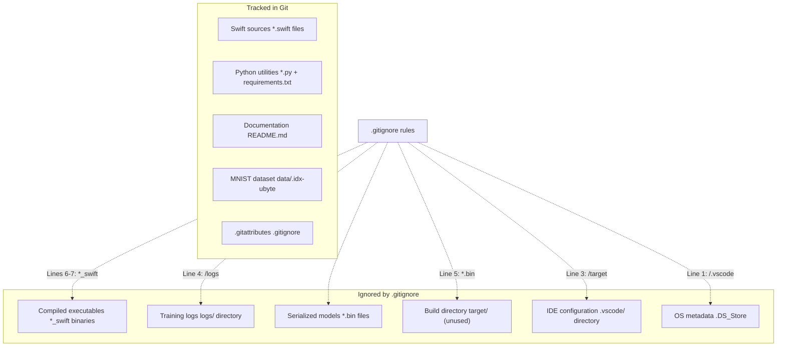
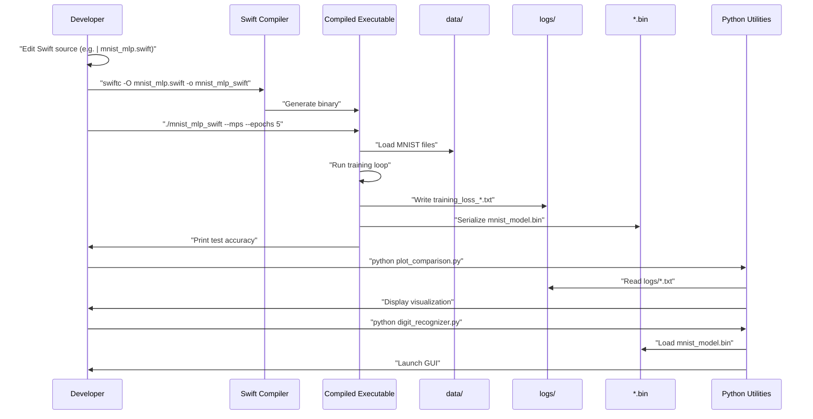
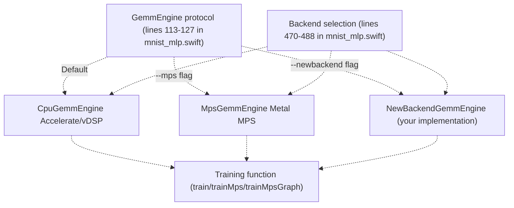

# Development Guide

> **Relevant source files**
> * [.gitattributes](https://github.com/ThalesMMS/Swift-Neural-Networks/blob/3a1c4fc2/.gitattributes)
> * [.gitignore](https://github.com/ThalesMMS/Swift-Neural-Networks/blob/3a1c4fc2/.gitignore)
> * [README.md](https://github.com/ThalesMMS/Swift-Neural-Networks/blob/3a1c4fc2/README.md)

## Purpose and Scope

This guide provides technical documentation for developers working on the Swift-Neural-Networks codebase. It covers repository structure, build configuration, version control patterns, and development workflows.

For information about specific training systems and their architectures, see [Training Systems](#4). For GPU backend implementation details, see [GPU Acceleration](#5). For dataset and serialization format specifications, see [MNIST Dataset](#7) and [Model Binary Format](#8).

**Sources:** [README.md L1-L218](https://github.com/ThalesMMS/Swift-Neural-Networks/blob/3a1c4fc2/README.md#L1-L218)

---

## Repository Structure

The repository follows a flat directory structure with clear separation between source code, data files, and generated outputs.

### Directory Layout

```markdown
Swift-Neural-Networks/
├── mnist_mlp.swift              # MLP with CPU/MPS/MPSGraph backends
├── mnist_cnn.swift              # CNN implementation (CPU-only)
├── mnist_attention_pool.swift   # Self-attention model
├── mlp_simple.swift             # XOR toy example
├── plot_comparison.py           # Training visualization utility
├── digit_recognizer.py          # Interactive inference GUI
├── requirements.txt             # Python dependencies
├── README.md                    # Project documentation
├── .gitignore                   # Version control exclusions
├── .gitattributes              # Line ending configuration
├── data/                        # MNIST dataset (tracked)
│   ├── train-images.idx3-ubyte
│   ├── train-labels.idx1-ubyte
│   ├── t10k-images.idx3-ubyte
│   └── t10k-labels.idx1-ubyte
├── logs/                        # Training logs (generated, ignored)
│   ├── training_loss_*.txt
│   └── ...
├── mnist_model.bin             # Serialized model (generated, ignored)
├── mnist_mlp_swift             # Compiled executable (ignored)
├── mnist_cnn_swift             # Compiled executable (ignored)
├── mnist_attention_pool_swift  # Compiled executable (ignored)
└── mlp_simple_swift            # Compiled executable (ignored)
```

### File Categories

| Category | Files | Version Controlled | Purpose |
| --- | --- | --- | --- |
| **Swift Sources** | `*.swift` | ✓ | Neural network implementations |
| **Python Utilities** | `*.py`, `requirements.txt` | ✓ | Analysis and inference tools |
| **Configuration** | `README.md`, `.gitignore`, `.gitattributes` | ✓ | Documentation and VCS config |
| **Dataset** | `data/*.idx*-ubyte` | ✓ | MNIST training/test data |
| **Build Artifacts** | `*_swift` executables | ✗ | Compiled binaries |
| **Training Outputs** | `logs/*.txt`, `*.bin` | ✗ | Logs and serialized models |
| **IDE/OS Files** | `.vscode/`, `.DS_Store` | ✗ | Environment-specific |

**Sources:** [README.md L14-L28](https://github.com/ThalesMMS/Swift-Neural-Networks/blob/3a1c4fc2/README.md#L14-L28)

 [.gitignore L1-L8](https://github.com/ThalesMMS/Swift-Neural-Networks/blob/3a1c4fc2/.gitignore#L1-L8)

---

## Build System

### Swift Compilation

The project uses the Swift compiler (`swiftc`) directly without build system dependencies like Swift Package Manager or Xcode projects. All source files are self-contained single-file executables.

#### Compilation Commands

```
# MNIST MLP with all backendsswiftc -O mnist_mlp.swift -o mnist_mlp_swift# MNIST CNN (CPU-only)swiftc -O mnist_cnn.swift -o mnist_cnn_swift# MNIST Attentionswiftc -O mnist_attention_pool.swift -o mnist_attention_pool_swift# XOR exampleswiftc -O mlp_simple.swift -o mlp_simple_swift
```

The `-O` flag enables Swift optimization, which is critical for numerical computation performance. Without optimization, training can be 10-100x slower.

#### Build Flags and Frameworks

All Swift implementations automatically link against:

* **Foundation**: Core Swift types and I/O
* **Accelerate**: `vDSP` for CPU matrix operations
* **Metal** (MPS only): GPU computation on Apple Silicon
* **MetalPerformanceShaders** (MPS only): Optimized GPU kernels
* **MetalPerformanceShadersGraph** (MPSGraph only): Graph-based GPU execution

No explicit framework flags are required; Swift automatically links these system frameworks when referenced.

**Sources:** [README.md L106-L113](https://github.com/ThalesMMS/Swift-Neural-Networks/blob/3a1c4fc2/README.md#L106-L113)

---

## Version Control Configuration

### Git Ignore Patterns

The [.gitignore L1-L8](https://github.com/ThalesMMS/Swift-Neural-Networks/blob/3a1c4fc2/.gitignore#L1-L8)

 file defines exclusion rules that prevent generated artifacts from being tracked:



### Exclusion Rationale

| Pattern | Reason for Exclusion |
| --- | --- |
| `/.vscode` | IDE-specific configuration varies per developer |
| `.DS_Store` | macOS filesystem metadata |
| `/target` | Reserved for potential future build system |
| `/logs` | Training logs are machine-generated and large |
| `*.bin` | Binary models are machine-generated, may be large |
| `mlp_simple_swift`, `mnist_mlp_swift`, etc. | Compiled executables are platform-specific |

### Line Ending Configuration

The [.gitattributes L1-L3](https://github.com/ThalesMMS/Swift-Neural-Networks/blob/3a1c4fc2/.gitattributes#L1-L3)

 file ensures consistent line endings across platforms:

```
* text=auto
```

This setting enables Git to automatically handle CRLF/LF conversion based on the operating system, preventing mixed line ending issues in cross-platform development.

**Sources:** [.gitignore L1-L8](https://github.com/ThalesMMS/Swift-Neural-Networks/blob/3a1c4fc2/.gitignore#L1-L8)

 [.gitattributes L1-L3](https://github.com/ThalesMMS/Swift-Neural-Networks/blob/3a1c4fc2/.gitattributes#L1-L3)

---

## Development Workflow

### Typical Development Cycle



### Compilation Best Practices

1. **Always use `-O` flag**: Optimization is essential for numerical code performance
2. **Verify output binary name**: Each executable has a conventional name (e.g., `mnist_mlp_swift`)
3. **Check for warnings**: Swift will emit warnings for unused variables, potential bugs
4. **Clean builds**: Delete old executables before recompiling to avoid confusion

### Running Experiments

Typical workflow for comparing training approaches:

```
# Train with different backends./mnist_mlp_swift --epochs 10 --batch 64 --lr 0.01  # CPU./mnist_mlp_swift --mps --epochs 10 --batch 64 --lr 0.01  # MPS./mnist_mlp_swift --mpsgraph --epochs 10 --batch 64 --lr 0.01  # MPSGraph# Compare resultspython plot_comparison.py# Test inferencepython digit_recognizer.py
```

### Debugging Strategies

| Issue | Approach |
| --- | --- |
| Numerical instability | Add print statements for gradient/loss magnitudes |
| GPU memory errors | Reduce batch size with `--batch` flag |
| Poor convergence | Adjust learning rate with `--lr` flag |
| Slow training | Switch backend (CPU → MPS → MPSGraph) |
| Build errors | Check Swift version (`swiftc --version`), ensure macOS 13+ |

**Sources:** [README.md L102-L163](https://github.com/ThalesMMS/Swift-Neural-Networks/blob/3a1c4fc2/README.md#L102-L163)

---

## Adding New Features

### Adding a New Model Architecture

To add a new neural network model (e.g., RNN for sequence modeling):

1. **Create new Swift file**: `mnist_rnn.swift` following existing naming conventions
2. **Implement core components**: * Data loading functions (reuse MNIST loading logic from existing files) * Model struct with weight/bias arrays * Forward pass function * Loss computation * Backward pass with gradient computation * SGD update function
3. **Add training loop**: * Iterate over epochs * Shuffle data * Mini-batch processing * Log writing to `logs/training_loss_rnn.txt`
4. **Add evaluation**: * Test set accuracy computation * Model serialization to `*.bin` format (see [Model Binary Format](#8))
5. **Update documentation**: * Add section to [README.md](https://github.com/ThalesMMS/Swift-Neural-Networks/blob/3a1c4fc2/README.md)  describing architecture and hyperparameters * Update build commands
6. **Update `.gitignore`**: * Add `mnist_rnn_swift` to [.gitignore L6-L7](https://github.com/ThalesMMS/Swift-Neural-Networks/blob/3a1c4fc2/.gitignore#L6-L7)  if following naming convention

### Adding a New Backend

To add a new compute backend (e.g., OpenCL):



**Implementation steps:**

1. **Define engine struct**: Implement `GemmEngine` protocol with `gemm` function
2. **Add backend flag**: Modify command-line parsing to accept new flag (e.g., `--opencl`)
3. **Create training function**: Similar to `train`, `trainMps`, or `trainMpsGraph`
4. **Handle data transfers**: Manage host/device memory if applicable
5. **Implement operations**: Matrix multiplication, activations, loss, gradients, SGD

**Key interfaces to implement:**

* `gemm(_ transA: Bool, _ transB: Bool, _ M: Int, _ N: Int, _ K: Int, _ A: [Double], _ B: [Double]) -> [Double]`: General matrix-matrix multiplication
* Forward pass operations (ReLU, softmax)
* Backward pass operations (ReLU derivative, loss gradient)
* Weight update (SGD)

### Extending Python Utilities

To add new analysis or visualization tools:

1. **Create Python script**: Follow naming convention (e.g., `analyze_gradients.py`)
2. **Add dependencies**: Update [requirements.txt](https://github.com/ThalesMMS/Swift-Neural-Networks/blob/3a1c4fc2/requirements.txt)  if using new packages
3. **Read standard formats**: * CSV logs from `logs/` (see [Training Logs Format](#9)) * Binary models from `*.bin` (see [Model Binary Format](#8))
4. **Generate outputs**: Save visualizations to PNG files (not tracked in Git)

**Sources:** [README.md L16-L17](https://github.com/ThalesMMS/Swift-Neural-Networks/blob/3a1c4fc2/README.md#L16-L17)

 [README.md L92-L100](https://github.com/ThalesMMS/Swift-Neural-Networks/blob/3a1c4fc2/README.md#L92-L100)

---

## Code Organization Patterns

### Swift File Structure

All Swift training implementations follow a consistent structure:

```sql
1. Import statements
   - Foundation, Accelerate, Metal (if GPU)

2. Data loading functions
   - readInt32BigEndian, readMNISTImages, readMNISTLabels

3. Neural network operations
   - Forward pass functions (matmul, relu, softmax)
   - Loss computation
   - Backward pass functions
   - SGD update

4. Backend-specific implementations
   - CPU: Accelerate/vDSP
   - MPS: Metal kernels
   - MPSGraph: Graph construction

5. Training loop
   - Epoch iteration
   - Mini-batch processing
   - Logging

6. Evaluation
   - Test accuracy computation

7. Model serialization
   - Binary format writing

8. Main function
   - Command-line parsing
   - Backend selection
   - Training invocation
```

### Function Naming Conventions

| Pattern | Example | Purpose |
| --- | --- | --- |
| `read*` | `readMNISTImages`, `readMNISTLabels` | Data loading |
| `train*` | `train`, `trainMps`, `trainMpsGraph` | Main training loops |
| `*Gradient` | `reluGradient`, `softmaxCrossEntropyGradient` | Backward pass |
| `update*` | `updateWeightsSGD` | Parameter updates |
| `create*` | `createKernel`, `createBuffer` | Resource initialization |

### Memory Management

Swift uses automatic reference counting (ARC), but GPU resources require explicit management:

```
// Metal buffers are explicitly created and retainedlet buffer = device.makeBuffer(...)// Buffers are deallocated when going out of scope
```

For large arrays in CPU code, use `[Double]` or `UnsafeBufferPointer` for efficiency. Avoid copying data unnecessarily.

**Sources:** [README.md L1-L218](https://github.com/ThalesMMS/Swift-Neural-Networks/blob/3a1c4fc2/README.md#L1-L218)

---

## Testing and Validation

### Verifying New Implementations

When adding or modifying code, validate correctness using these approaches:

#### 1. Numerical Gradient Checking

Compare analytical gradients (backpropagation) against numerical gradients (finite differences):

```
// In forward pass, compute loss L(θ)let loss = computeLoss(...)// In backward pass, compute dL/dθ analyticallylet analyticalGradient = backprop(...)// Numerically: dL/dθ ≈ (L(θ + ε) - L(θ - ε)) / (2ε)let epsilon = 1e-5let numericalGradient = (computeLoss(theta + epsilon) - computeLoss(theta - epsilon)) / (2 * epsilon)// Should match within 1e-4 to 1e-6assert(abs(analyticalGradient - numericalGradient) < 1e-4)
```

#### 2. Known Problem Validation

Use the XOR problem (`mlp_simple.swift`) as a sanity check:

```
./mlp_simple_swift
```

Expected output: 100% accuracy on all 4 XOR patterns after training.

#### 3. Backend Consistency

Train identical models on different backends and verify outputs match:

```
# Train on CPU./mnist_mlp_swift --epochs 5 --seed 42 > cpu_output.txt# Train on MPS with same seed./mnist_mlp_swift --mps --epochs 5 --seed 42 > mps_output.txt# Compare final test accuracy (should be within 0.5%)diff cpu_output.txt mps_output.txt
```

#### 4. Benchmark Against Known Results

Compare against documented benchmark results from [README.md L165-L175](https://github.com/ThalesMMS/Swift-Neural-Networks/blob/3a1c4fc2/README.md#L165-L175)

:

| Model | Expected Accuracy | Training Time Range |
| --- | --- | --- |
| MLP (CPU) | 11-97% | 5-10s |
| MLP (MPS) | 94-97% | 3-7s |
| CNN | ~92% | 50-60s |
| Attention | ~24% | 90-110s |
| XOR | 100% | 1-2s |

Large deviations indicate potential implementation issues.

### Performance Profiling

Use Instruments (Xcode tool) to profile GPU/CPU usage:

```
# Profile GPU usagexcrun xctrace record --template 'GPU' --launch ./mnist_mlp_swift --mps# Profile CPU usagexcrun xctrace record --template 'Time Profiler' --launch ./mnist_mlp_swift
```

**Sources:** [README.md L165-L176](https://github.com/ThalesMMS/Swift-Neural-Networks/blob/3a1c4fc2/README.md#L165-L176)

---

## Common Development Tasks

### Modifying Hyperparameters

Hyperparameters are exposed via command-line flags. To add a new hyperparameter:

1. **Define variable in main**: ``` var momentum: Double = 0.9  // New hyperparameter ```
2. **Add parsing logic**: ``` case "--momentum":    momentum = Double(args[i+1])!    i += 1 ```
3. **Update help text**: ```python print("--momentum F  SGD momentum (default: 0.9)") ```
4. **Use in training function**: ``` func train(..., momentum: Double) {    // Apply momentum to weight updates} ```

### Logging Additional Metrics

The current logging format is CSV: `epoch,loss,time`. To add metrics:

1. **Modify log writing**: ``` // Current formatlogLine = "\(epoch),\(avgLoss),\(epochTime)\n"// Extended formatlogLine = "\(epoch),\(avgLoss),\(epochTime),\(trainAccuracy),\(testAccuracy)\n" ```
2. **Update Python parsers**: Modify `plot_comparison.py` to read new columns
3. **Maintain backward compatibility**: Check for header row or column count

### Changing Data Format

To use a different dataset (e.g., Fashion-MNIST):

1. **Download data**: Obtain IDX files in same format as MNIST
2. **Place in `data/` directory**: Use same filenames or update loading code
3. **Verify dimensions**: Ensure 28×28 images, 60k train + 10k test
4. **Adjust model if needed**: May need different hidden layer sizes

**Sources:** [README.md L140-L161](https://github.com/ThalesMMS/Swift-Neural-Networks/blob/3a1c4fc2/README.md#L140-L161)

 [README.md L178-L190](https://github.com/ThalesMMS/Swift-Neural-Networks/blob/3a1c4fc2/README.md#L178-L190)

---

## Troubleshooting

### Common Build Errors

| Error | Cause | Solution |
| --- | --- | --- |
| `error: no such module 'Accelerate'` | Missing macOS SDK | Update Xcode: `xcode-select --install` |
| `error: no such module 'Metal'` | Not on macOS | Use CPU backend only, remove MPS code |
| `Undefined symbols for architecture` | Missing framework | Add `-framework Metal -framework MetalPerformanceShaders` |
| `Segmentation fault: 11` | No optimization, stack overflow | Always use `-O` flag |

### Runtime Errors

| Error | Cause | Solution |
| --- | --- | --- |
| `Cannot allocate buffer` | Insufficient GPU memory | Reduce batch size with `--batch` |
| `File not found: data/train-images.idx3-ubyte` | Missing dataset | Download MNIST to `data/` directory |
| `Graph execution failed` | Fixed batch size mismatch | Ensure dataset size is divisible by batch size |
| `NaN loss detected` | Numerical instability | Reduce learning rate, check for division by zero |

### Performance Issues

| Symptom | Likely Cause | Solution |
| --- | --- | --- |
| Slow CPU training | No optimization flag | Rebuild with `swiftc -O` |
| Slow GPU training | Data transfers | Use MPSGraph for full GPU execution |
| High memory usage | Large batch size | Reduce `--batch` parameter |
| Inconsistent timing | Background processes | Close other apps, use `nice` priority |

**Sources:** [README.md L92-L101](https://github.com/ThalesMMS/Swift-Neural-Networks/blob/3a1c4fc2/README.md#L92-L101)

 [README.md L165-L176](https://github.com/ThalesMMS/Swift-Neural-Networks/blob/3a1c4fc2/README.md#L165-L176)

---

## Contributing Guidelines

### Code Style

1. **Indentation**: 4 spaces (Swift convention)
2. **Naming**: camelCase for variables/functions, PascalCase for types
3. **Comments**: Document non-obvious numerical algorithms
4. **Line length**: Prefer < 100 characters for readability

### Commit Messages

Follow conventional commit format:

```sql
feat: add momentum support to SGD optimizer
fix: correct gradient computation in attention layer
docs: update README with new backend instructions
perf: optimize matrix multiplication for small batches
```

### Pull Request Process

1. **Test locally**: Verify builds and runs on your machine
2. **Check accuracy**: Ensure test accuracy is within expected range
3. **Update documentation**: Modify README.md if adding features
4. **Clean commits**: Squash WIP commits before submitting

### File Management

**Do not commit:**

* Compiled executables (`*_swift`)
* Training logs (`logs/*.txt`)
* Binary models (`*.bin`)
* IDE configurations (`.vscode/`, `.idea/`)
* OS metadata (`.DS_Store`)

**Do commit:**

* Source code changes (`.swift`, `.py`)
* Documentation updates (`README.md`)
* Dependency changes (`requirements.txt`)
* Configuration files (`.gitignore`, `.gitattributes`)

**Sources:** [.gitignore L1-L8](https://github.com/ThalesMMS/Swift-Neural-Networks/blob/3a1c4fc2/.gitignore#L1-L8)

 [README.md L1-L218](https://github.com/ThalesMMS/Swift-Neural-Networks/blob/3a1c4fc2/README.md#L1-L218)

Refresh this wiki

Last indexed: 5 January 2026 ([3a1c4f](https://github.com/ThalesMMS/Swift-Neural-Networks/commit/3a1c4fc2))

### On this page

* [Development Guide](#10-development-guide)
* [Purpose and Scope](#10-purpose-and-scope)
* [Repository Structure](#10-repository-structure)
* [Directory Layout](#10-directory-layout)
* [File Categories](#10-file-categories)
* [Build System](#10-build-system)
* [Swift Compilation](#10-swift-compilation)
* [Version Control Configuration](#10-version-control-configuration)
* [Git Ignore Patterns](#10-git-ignore-patterns)
* [Exclusion Rationale](#10-exclusion-rationale)
* [Line Ending Configuration](#10-line-ending-configuration)
* [Development Workflow](#10-development-workflow)
* [Typical Development Cycle](#10-typical-development-cycle)
* [Compilation Best Practices](#10-compilation-best-practices)
* [Running Experiments](#10-running-experiments)
* [Debugging Strategies](#10-debugging-strategies)
* [Adding New Features](#10-adding-new-features)
* [Adding a New Model Architecture](#10-adding-a-new-model-architecture)
* [Adding a New Backend](#10-adding-a-new-backend)
* [Extending Python Utilities](#10-extending-python-utilities)
* [Code Organization Patterns](#10-code-organization-patterns)
* [Swift File Structure](#10-swift-file-structure)
* [Function Naming Conventions](#10-function-naming-conventions)
* [Memory Management](#10-memory-management)
* [Testing and Validation](#10-testing-and-validation)
* [Verifying New Implementations](#10-verifying-new-implementations)
* [Performance Profiling](#10-performance-profiling)
* [Common Development Tasks](#10-common-development-tasks)
* [Modifying Hyperparameters](#10-modifying-hyperparameters)
* [Logging Additional Metrics](#10-logging-additional-metrics)
* [Changing Data Format](#10-changing-data-format)
* [Troubleshooting](#10-troubleshooting)
* [Common Build Errors](#10-common-build-errors)
* [Runtime Errors](#10-runtime-errors)
* [Performance Issues](#10-performance-issues)
* [Contributing Guidelines](#10-contributing-guidelines)
* [Code Style](#10-code-style)
* [Commit Messages](#10-commit-messages)
* [Pull Request Process](#10-pull-request-process)
* [File Management](#10-file-management)

Ask Devin about Swift-Neural-Networks