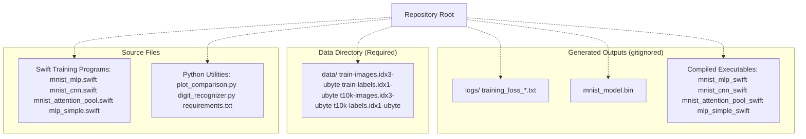
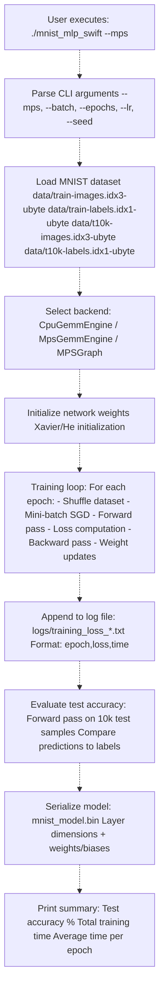
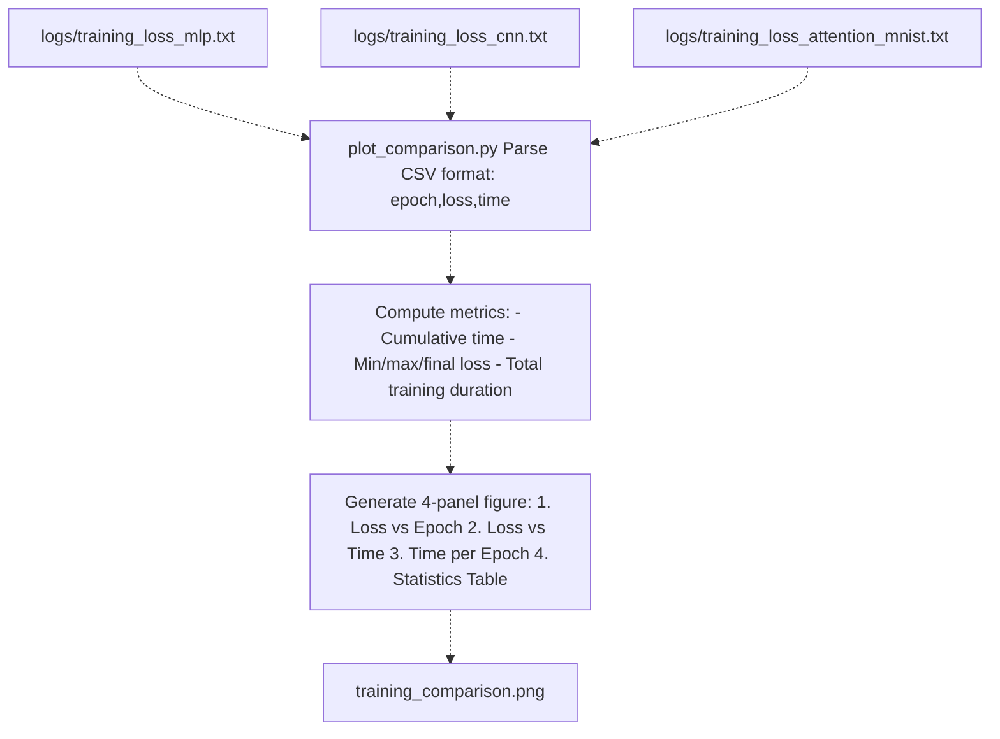
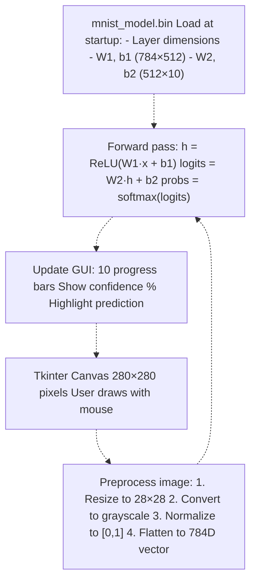

# Quick Start Guide

> **Relevant source files**
> * [.gitignore](https://github.com/ThalesMMS/Swift-Neural-Networks/blob/3a1c4fc2/.gitignore)
> * [README.md](https://github.com/ThalesMMS/Swift-Neural-Networks/blob/3a1c4fc2/README.md)

## Purpose and Scope

This page provides step-by-step instructions for building, training, and evaluating neural network models in the Swift-Neural-Networks repository. It covers prerequisites, compilation commands, basic training workflows, and visualization of results. This guide is designed to get you from zero to a trained model in minutes.

For detailed architecture information about specific models, see [MNIST MLP Implementation](#4.1), [MNIST CNN Implementation](#4.2), and [Attention Model Implementation](#4.3). For GPU acceleration options, see [GPU Acceleration](#5). For development and contribution guidelines, see [Development Guide](#10).

---

## Prerequisites

The following tools and dependencies must be installed before proceeding:

| Component | Requirement | Purpose |
| --- | --- | --- |
| **Swift Compiler** | Swift 5.0+ (macOS includes this via Xcode) | Compiling training executables |
| **Python** | Python 3.7+ | Running visualization and inference utilities |
| **Python Packages** | `numpy`, `matplotlib`, `Pillow`, `tkinter` | Required by `plot_comparison.py` and `digit_recognizer.py` |
| **MNIST Dataset** | 4 IDX files (~50 MB total) | Training and testing data |

### Installing Python Dependencies

Install required Python packages using the provided requirements file:

```
pip install -r requirements.txt
```

**Sources:** [README.md L209-L212](https://github.com/ThalesMMS/Swift-Neural-Networks/blob/3a1c4fc2/README.md#L209-L212)

---

## Dataset Setup

### Required Files

The MNIST dataset consists of four binary files in IDX format that must be placed in the `data/` directory:

```
data/
├── train-images.idx3-ubyte  (60,000 training images)
├── train-labels.idx1-ubyte  (60,000 training labels)
├── t10k-images.idx3-ubyte   (10,000 test images)
└── t10k-labels.idx1-ubyte   (10,000 test labels)
```

### Downloading the Dataset

Download from one of these sources:

1. **Kaggle**: [https://www.kaggle.com/datasets/hojjatk/mnist-dataset](https://www.kaggle.com/datasets/hojjatk/mnist-dataset)
2. **Official MNIST**: [http://yann.lecun.com/exdb/mnist/](http://yann.lecun.com/exdb/mnist/)

After downloading, ensure all four files are placed directly in the `data/` directory at the repository root.

**Diagram: Repository Structure with Data Files**



**Sources:** [README.md L178-L190](https://github.com/ThalesMMS/Swift-Neural-Networks/blob/3a1c4fc2/README.md#L178-L190)

 [.gitignore L1-L8](https://github.com/ThalesMMS/Swift-Neural-Networks/blob/3a1c4fc2/.gitignore#L1-L8)

---

## Building Executables

Each Swift source file must be compiled into an executable before use. The `-O` flag enables optimizations for better performance.

### Compilation Commands

| Target | Command | Output Executable |
| --- | --- | --- |
| **MNIST MLP** | `swiftc -O mnist_mlp.swift -o mnist_mlp_swift` | `mnist_mlp_swift` |
| **MNIST CNN** | `swiftc -O mnist_cnn.swift -o mnist_cnn_swift` | `mnist_cnn_swift` |
| **MNIST Attention** | `swiftc -O mnist_attention_pool.swift -o mnist_attention_pool_swift` | `mnist_attention_pool_swift` |
| **XOR Example** | `swiftc -O mlp_simple.swift -o mlp_simple_swift` | `mlp_simple_swift` |

### Build All at Once

To compile all executables in sequence:

```
swiftc -O mnist_mlp.swift -o mnist_mlp_swiftswiftc -O mnist_cnn.swift -o mnist_cnn_swiftswiftc -O mnist_attention_pool.swift -o mnist_attention_pool_swiftswiftc -O mlp_simple.swift -o mlp_simple_swift
```

**Note**: These executables are ignored by Git (see [.gitignore L6-L7](https://github.com/ThalesMMS/Swift-Neural-Networks/blob/3a1c4fc2/.gitignore#L6-L7)

) and must be rebuilt after cloning the repository.

**Sources:** [README.md L106-L113](https://github.com/ThalesMMS/Swift-Neural-Networks/blob/3a1c4fc2/README.md#L106-L113)

---

## Training Your First Model

The simplest way to verify your setup is to train the XOR toy example, which requires no dataset files.

### XOR Model Training

```
./mlp_simple_swift
```

**Expected Output:**

* Training will run for 1,000,000 epochs (completes in ~2 seconds)
* Final accuracy should be 100% with a 0.5 threshold
* No files are saved; output is printed to console

This verifies that Swift compilation and basic training loops work correctly.

**Sources:** [README.md L134-L138](https://github.com/ThalesMMS/Swift-Neural-Networks/blob/3a1c4fc2/README.md#L134-L138)

 [README.md L174](https://github.com/ThalesMMS/Swift-Neural-Networks/blob/3a1c4fc2/README.md#L174-L174)

---

## Training MNIST Models

Once the dataset is in place, you can train any of the three MNIST classification models.

### MNIST MLP (Recommended Starting Point)

The MLP implementation supports multiple execution backends and is the most flexible option.

**Basic CPU Training:**

```
./mnist_mlp_swift
```

**GPU-Accelerated Training (macOS only):**

```
./mnist_mlp_swift --mps
```

**Full GPU with MPSGraph (fastest):**

```
./mnist_mlp_swift --mpsgraph
```

**Default Configuration:**

* **Architecture**: 784 → 512 (ReLU) → 10 (Softmax)
* **Learning rate**: 0.01
* **Batch size**: 64
* **Epochs**: 10
* **Expected accuracy**: ~94-97%

### MNIST CNN

```
./mnist_cnn_swift
```

**Configuration:**

* **Architecture**: Conv(8 filters, 3×3) → ReLU → MaxPool(2×2) → FC(1568→10)
* **Learning rate**: 0.01
* **Batch size**: 32
* **Epochs**: 3
* **Expected accuracy**: ~92%
* **Note**: CPU-only implementation, no GPU flags

### MNIST Attention Model

```
./mnist_attention_pool_swift
```

**Configuration:**

* **Architecture**: 49 patches (4×4) → Position Embeddings → Self-Attention → FFN → Mean Pool → Classifier
* **Model dimension (D)**: 16
* **Feed-forward dimension (FF)**: 32
* **Learning rate**: 0.01
* **Batch size**: 32
* **Epochs**: 5
* **Expected accuracy**: ~24% (requires hyperparameter tuning)

**Diagram: Training Execution Flow**



**Sources:** [README.md L115-L138](https://github.com/ThalesMMS/Swift-Neural-Networks/blob/3a1c4fc2/README.md#L115-L138)

 [README.md L140-L163](https://github.com/ThalesMMS/Swift-Neural-Networks/blob/3a1c4fc2/README.md#L140-L163)

---

## Command-Line Options

### MNIST MLP Options

The `mnist_mlp_swift` executable accepts the following flags:

| Flag | Type | Default | Description |
| --- | --- | --- | --- |
| `--mps` | boolean | off | Use MPS GEMM + custom Metal kernels (GPU hybrid) |
| `--mpsgraph` | boolean | off | Use MPSGraph for full GPU execution |
| `--batch N` | integer | 64 | Mini-batch size |
| `--hidden N` | integer | 512 | Number of hidden layer neurons |
| `--epochs N` | integer | 10 | Number of training epochs |
| `--lr F` | float | 0.01 | Learning rate for SGD |
| `--seed N` | integer | 1 | Random number generator seed |
| `--help` | boolean | - | Print usage information |

**Example:**

```
./mnist_mlp_swift --mps --batch 128 --epochs 20 --lr 0.005
```

**Important**: `--mpsgraph` requires a fixed batch size; samples that don't fit into complete batches are dropped.

### MNIST Attention Options

| Flag | Type | Default | Description |
| --- | --- | --- | --- |
| `--batch N` | integer | 32 | Mini-batch size |
| `--epochs N` | integer | 5 | Number of training epochs |
| `--lr F` | float | 0.01 | Learning rate for SGD |
| `--seed N` | integer | 1 | Random number generator seed |
| `--help` | boolean | - | Print usage information |

**Note**: The CNN implementation (`mnist_cnn_swift`) has no command-line flags and uses fixed defaults.

**Sources:** [README.md L140-L163](https://github.com/ThalesMMS/Swift-Neural-Networks/blob/3a1c4fc2/README.md#L140-L163)

---

## Visualizing Training Results

After training, use `plot_comparison.py` to generate visualizations of training loss curves.

### Generating Plots

```
python plot_comparison.py
```

**What It Does:**

1. Reads all `logs/training_loss_*.txt` files
2. Parses epoch, loss, and time columns
3. Generates a 4-panel comparison plot: * Loss vs. Epoch (all models) * Loss vs. Time (all models) * Cumulative time per epoch * Summary statistics table
4. Saves output as `training_comparison.png`
5. Displays the plot window

**Prerequisites:**

* At least one training run must have completed and generated a log file
* Python packages: `matplotlib`, `numpy`

**Diagram: Log File Processing**



**Sources:** [README.md L193-L198](https://github.com/ThalesMMS/Swift-Neural-Networks/blob/3a1c4fc2/README.md#L193-L198)

---

## Interactive Inference

The `digit_recognizer.py` script provides a graphical interface for drawing digits and obtaining real-time predictions.

### Running the Digit Recognizer

```
python digit_recognizer.py
```

**Prerequisites:**

* `mnist_model.bin` must exist (generated by `mnist_mlp_swift` after training)
* Python packages: `numpy`, `Pillow`, `tkinter`

### Using the Interface

1. **Draw**: Use your mouse to draw a digit on the 280×280 canvas
2. **Predict**: The model automatically runs inference on the drawn digit
3. **View Results**: 10 progress bars show predicted probabilities for each digit (0-9)
4. **Clear**: Click "Clear" to reset the canvas

**Diagram: Inference Pipeline**



**Sources:** [README.md L200-L206](https://github.com/ThalesMMS/Swift-Neural-Networks/blob/3a1c4fc2/README.md#L200-L206)

---

## Complete Workflow Example

Here is a complete end-to-end workflow from setup to inference:

```
# Step 1: Install Python dependenciespip install -r requirements.txt# Step 2: Ensure MNIST data is in placels data/# Should show: train-images.idx3-ubyte, train-labels.idx1-ubyte, #              t10k-images.idx3-ubyte, t10k-labels.idx1-ubyte# Step 3: Build the MLP executableswiftc -O mnist_mlp.swift -o mnist_mlp_swift# Step 4: Train the model with GPU acceleration./mnist_mlp_swift --mps --epochs 15# Step 5: Visualize training progresspython plot_comparison.py# Step 6: Test the trained model interactivelypython digit_recognizer.py
```

**Expected Timeline:**

* **Step 3** (Build): ~5-10 seconds
* **Step 4** (Training): ~20-60 seconds depending on backend
* **Step 5** (Plotting): <1 second
* **Step 6** (Inference): Real-time per drawn digit

**Sources:** [README.md L102-L212](https://github.com/ThalesMMS/Swift-Neural-Networks/blob/3a1c4fc2/README.md#L102-L212)

---

## Output Files Reference

Training and inference operations generate several output files:

| File Path | Generated By | Content | Tracked in Git |
| --- | --- | --- | --- |
| `logs/training_loss_mlp.txt` | `mnist_mlp_swift` | CSV: epoch, loss, time | No ([.gitignore L4](https://github.com/ThalesMMS/Swift-Neural-Networks/blob/3a1c4fc2/.gitignore#L4-L4) <br> ) |
| `logs/training_loss_cnn.txt` | `mnist_cnn_swift` | CSV: epoch, loss, time | No ([.gitignore L4](https://github.com/ThalesMMS/Swift-Neural-Networks/blob/3a1c4fc2/.gitignore#L4-L4) <br> ) |
| `logs/training_loss_attention_mnist.txt` | `mnist_attention_pool_swift` | CSV: epoch, loss, time | No ([.gitignore L4](https://github.com/ThalesMMS/Swift-Neural-Networks/blob/3a1c4fc2/.gitignore#L4-L4) <br> ) |
| `mnist_model.bin` | `mnist_mlp_swift` | Binary model weights | No ([.gitignore L5](https://github.com/ThalesMMS/Swift-Neural-Networks/blob/3a1c4fc2/.gitignore#L5-L5) <br> ) |
| `training_comparison.png` | `plot_comparison.py` | Multi-panel plot | Not generated by default |

**Note**: The `logs/` directory and `*.bin` files are automatically created during training if they don't exist. These are ignored by Git to avoid committing large generated files.

**Sources:** [README.md L24-L31](https://github.com/ThalesMMS/Swift-Neural-Networks/blob/3a1c4fc2/README.md#L24-L31)

 [.gitignore L4-L5](https://github.com/ThalesMMS/Swift-Neural-Networks/blob/3a1c4fc2/.gitignore#L4-L5)

---

## Troubleshooting

### Common Issues

**Problem**: `data/train-images.idx3-ubyte: No such file or directory`

**Solution**: Download the MNIST dataset and place all four files in the `data/` directory at the repository root.

---

**Problem**: `swiftc: command not found`

**Solution**: Install Xcode (macOS) or the Swift toolchain for your platform. Verify with `swift --version`.

---

**Problem**: Training accuracy stays at ~11% (random guessing)

**Solution**:

* The CPU backend may converge slowly; try `--mps` or `--mpsgraph` flags
* Increase the number of epochs: `--epochs 20`
* Adjust the learning rate: `--lr 0.005`

---

**Problem**: `ModuleNotFoundError: No module named 'matplotlib'`

**Solution**: Install Python dependencies: `pip install -r requirements.txt`

---

**Problem**: `mnist_model.bin` not found when running `digit_recognizer.py`

**Solution**: Train a model first using `./mnist_mlp_swift`. The binary file is only generated after successful training completion.

---

**Problem**: MPSGraph backend drops samples / reports different dataset size

**Explanation**: `--mpsgraph` requires a fixed batch size for graph compilation. If the dataset size is not evenly divisible by the batch size, remaining samples are dropped. This is expected behavior documented in [README.md L100](https://github.com/ThalesMMS/Swift-Neural-Networks/blob/3a1c4fc2/README.md#L100-L100)

**Sources:** [README.md L178-L190](https://github.com/ThalesMMS/Swift-Neural-Networks/blob/3a1c4fc2/README.md#L178-L190)

 [README.md L100](https://github.com/ThalesMMS/Swift-Neural-Networks/blob/3a1c4fc2/README.md#L100-L100)

---

## Next Steps

After completing this quick start guide, you may want to:

* **Explore model architectures**: See [Architecture Overview](#3) for system design details
* **Understand GPU acceleration**: See [GPU Acceleration](#5) for backend comparison and performance tuning
* **Learn about specific implementations**: See [Training Systems](#4) for detailed documentation of each model
* **Examine training logs**: See [Training Logs Format](#9) for CSV schema details
* **Understand model serialization**: See [Model Binary Format](#8) for binary file structure
* **Contribute to development**: See [Development Guide](#10) for repository organization and contribution guidelines

**Sources:** [README.md L1-L218](https://github.com/ThalesMMS/Swift-Neural-Networks/blob/3a1c4fc2/README.md#L1-L218)

Refresh this wiki

Last indexed: 5 January 2026 ([3a1c4f](https://github.com/ThalesMMS/Swift-Neural-Networks/commit/3a1c4fc2))

### On this page

* [Quick Start Guide](#2-quick-start-guide)
* [Purpose and Scope](#2-purpose-and-scope)
* [Prerequisites](#2-prerequisites)
* [Installing Python Dependencies](#2-installing-python-dependencies)
* [Dataset Setup](#2-dataset-setup)
* [Required Files](#2-required-files)
* [Downloading the Dataset](#2-downloading-the-dataset)
* [Building Executables](#2-building-executables)
* [Compilation Commands](#2-compilation-commands)
* [Build All at Once](#2-build-all-at-once)
* [Training Your First Model](#2-training-your-first-model)
* [XOR Model Training](#2-xor-model-training)
* [Training MNIST Models](#2-training-mnist-models)
* [MNIST MLP (Recommended Starting Point)](#2-mnist-mlp-recommended-starting-point)
* [MNIST CNN](#2-mnist-cnn)
* [MNIST Attention Model](#2-mnist-attention-model)
* [Command-Line Options](#2-command-line-options)
* [MNIST MLP Options](#2-mnist-mlp-options)
* [MNIST Attention Options](#2-mnist-attention-options)
* [Visualizing Training Results](#2-visualizing-training-results)
* [Generating Plots](#2-generating-plots)
* [Interactive Inference](#2-interactive-inference)
* [Running the Digit Recognizer](#2-running-the-digit-recognizer)
* [Using the Interface](#2-using-the-interface)
* [Complete Workflow Example](#2-complete-workflow-example)
* [Output Files Reference](#2-output-files-reference)
* [Troubleshooting](#2-troubleshooting)
* [Common Issues](#2-common-issues)
* [Next Steps](#2-next-steps)

Ask Devin about Swift-Neural-Networks