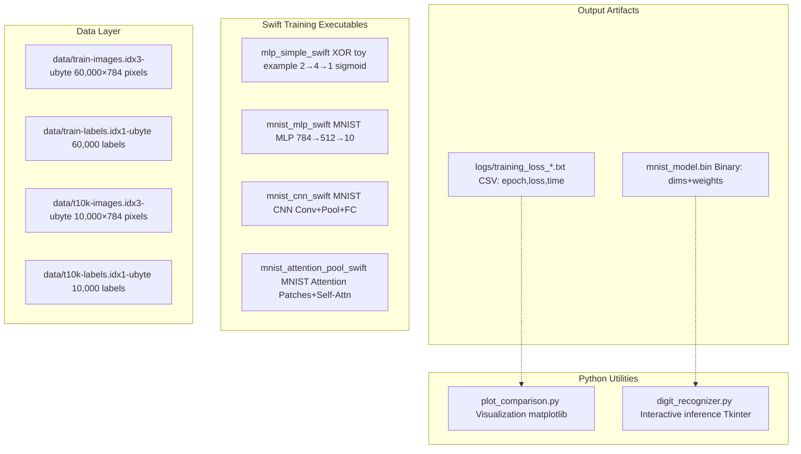
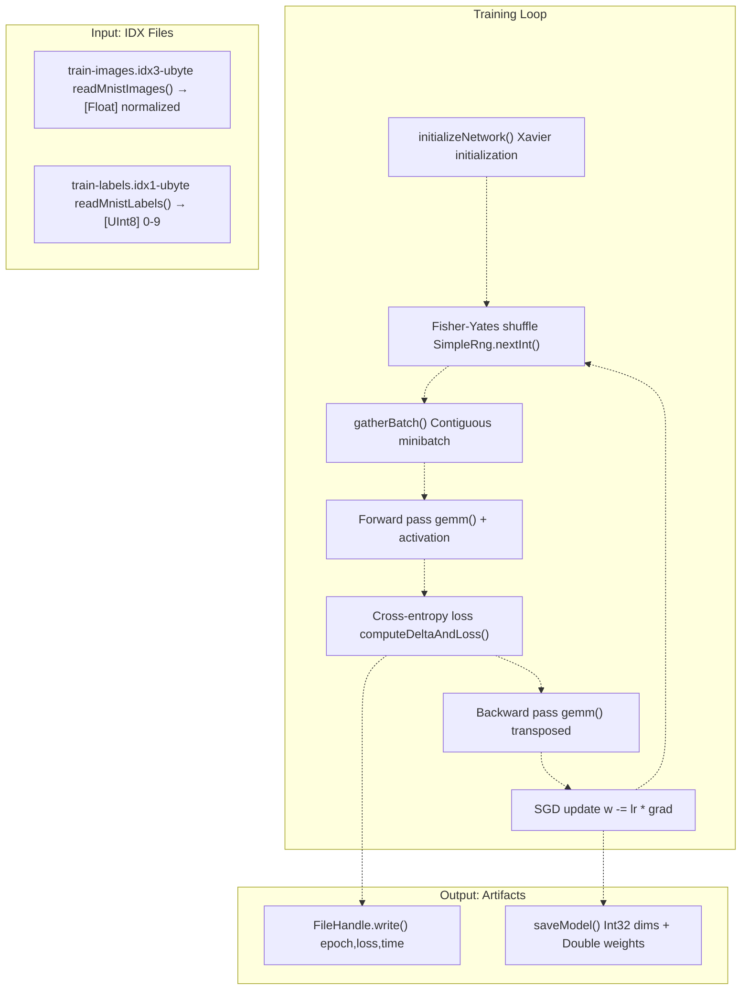
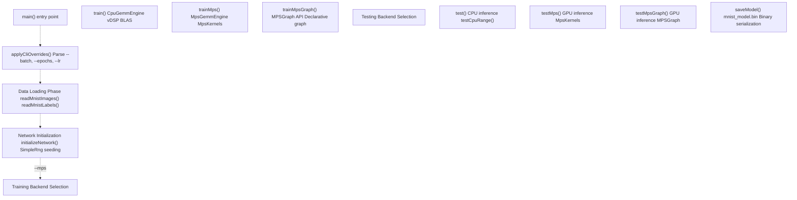
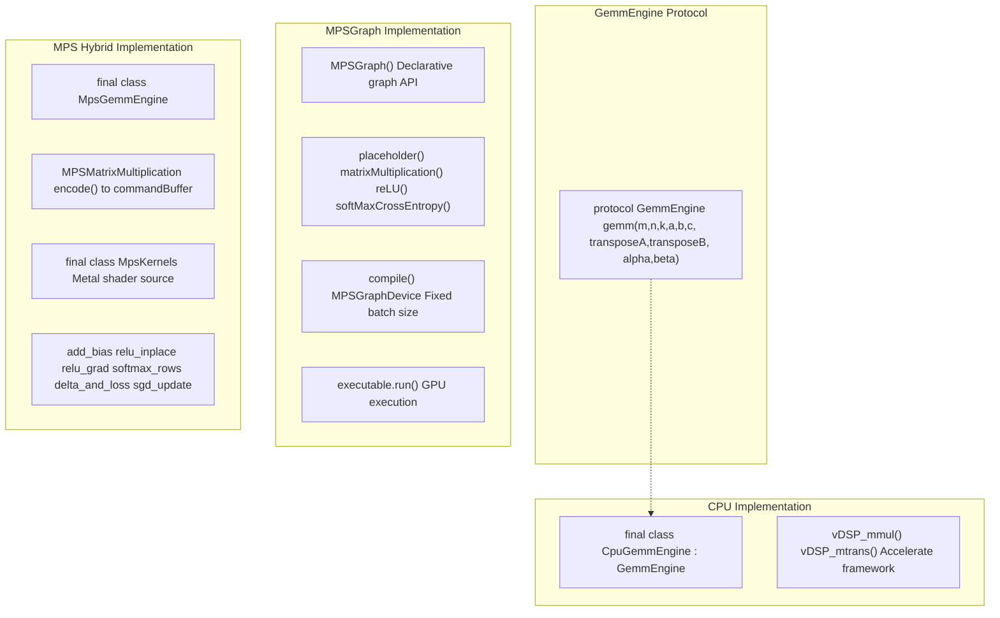
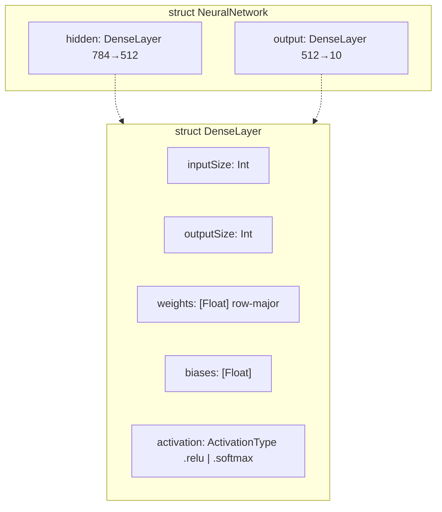
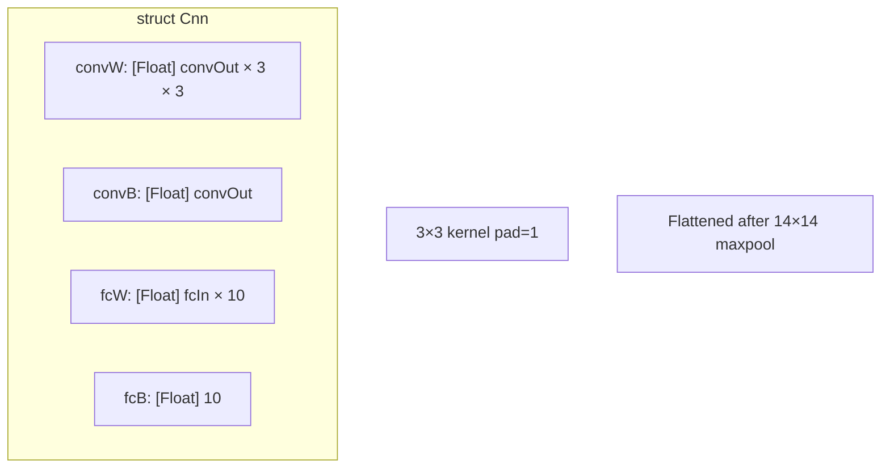
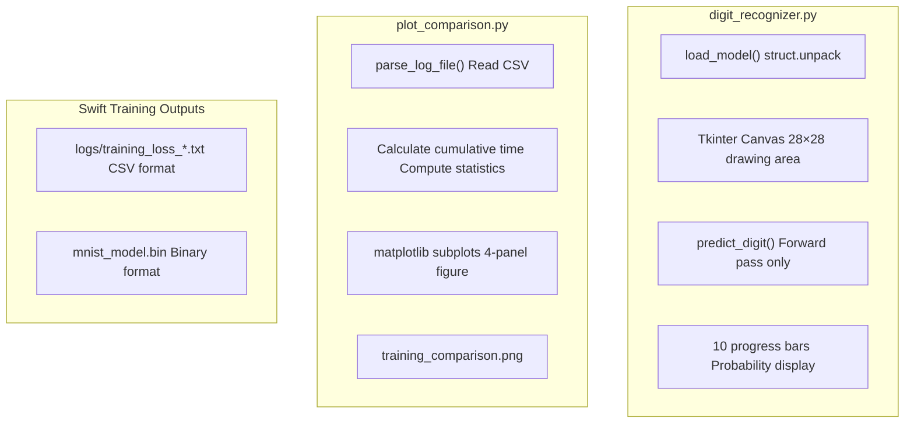
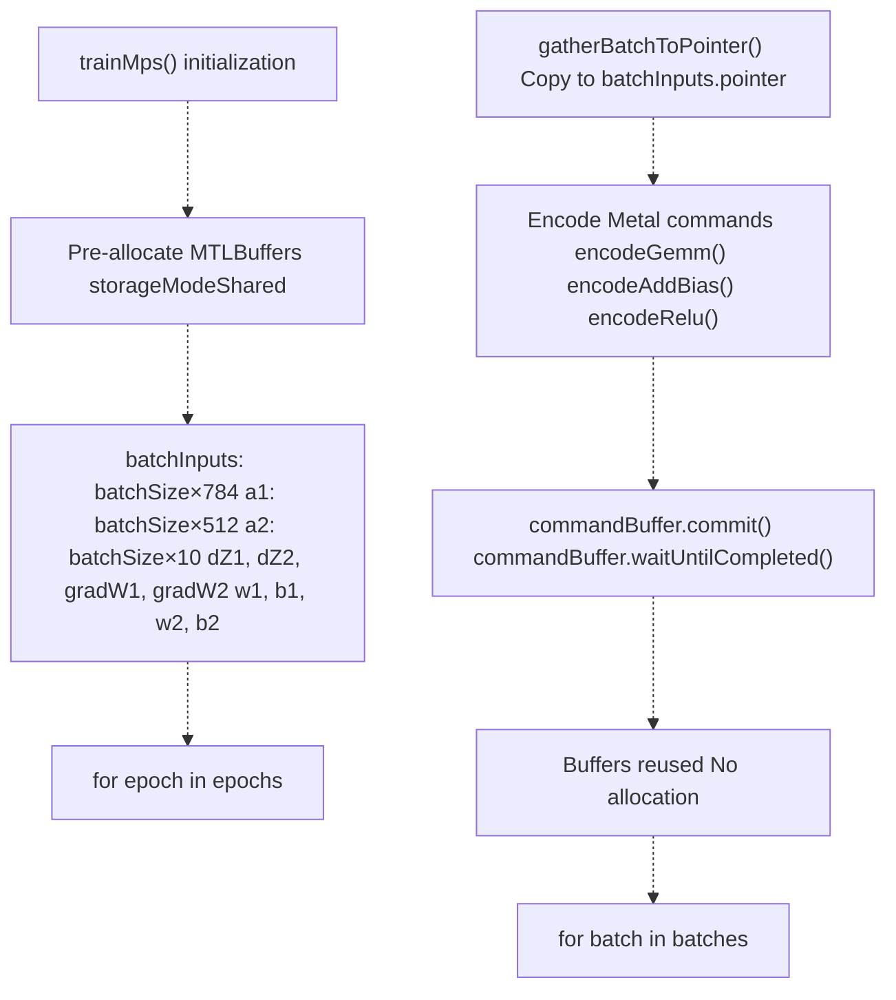

# Architecture Overview

> **Relevant source files**
> * [README.md](https://github.com/ThalesMMS/Swift-Neural-Networks/blob/3a1c4fc2/README.md)
> * [mlp_simple.swift](https://github.com/ThalesMMS/Swift-Neural-Networks/blob/3a1c4fc2/mlp_simple.swift)
> * [mnist_cnn.swift](https://github.com/ThalesMMS/Swift-Neural-Networks/blob/3a1c4fc2/mnist_cnn.swift)
> * [mnist_mlp.swift](https://github.com/ThalesMMS/Swift-Neural-Networks/blob/3a1c4fc2/mnist_mlp.swift)

## Purpose and Scope

This page describes the high-level architecture of the Swift-Neural-Networks repository, explaining how the Swift training executables, Python analysis utilities, and MNIST data files interact to form a complete machine learning pipeline. It covers the system's major components, data flow patterns, and the separation between training (Swift) and analysis/inference (Python) subsystems.

For detailed information about individual training implementations, see [Training Systems](#4). For GPU acceleration specifics, see [GPU Acceleration](#5). For Python utility details, see [Python Utilities](#6).

## System Components

The repository implements a **batch training** → **offline analysis** → **interactive inference** pipeline with clear phase separation. All components operate on the same MNIST dataset and binary model format, but execute independently.

### Component Diagram



**Sources:** [README.md L1-L218](https://github.com/ThalesMMS/Swift-Neural-Networks/blob/3a1c4fc2/README.md#L1-L218)

 [mnist_mlp.swift L358-L367](https://github.com/ThalesMMS/Swift-Neural-Networks/blob/3a1c4fc2/mnist_mlp.swift#L358-L367)

 [mnist_cnn.swift L16-L37](https://github.com/ThalesMMS/Swift-Neural-Networks/blob/3a1c4fc2/mnist_cnn.swift#L16-L37)

## Data Flow Architecture

The system follows a unidirectional data flow from raw MNIST files through training to output artifacts. There are no cyclic dependencies between components.

### End-to-End Data Pipeline



**Sources:** [mnist_mlp.swift L1963-L2039](https://github.com/ThalesMMS/Swift-Neural-Networks/blob/3a1c4fc2/mnist_mlp.swift#L1963-L2039)

 [mnist_mlp.swift L1329-L1515](https://github.com/ThalesMMS/Swift-Neural-Networks/blob/3a1c4fc2/mnist_mlp.swift#L1329-L1515)

 [mnist_mlp.swift L1924-L1961](https://github.com/ThalesMMS/Swift-Neural-Networks/blob/3a1c4fc2/mnist_mlp.swift#L1924-L1961)

## Training Executable Architecture

All Swift training executables follow a similar internal structure with four main phases: data loading, network initialization, training loop, and testing/saving.

### Generic Training Executable Flow



**Sources:** [mnist_mlp.swift L2094-L2222](https://github.com/ThalesMMS/Swift-Neural-Networks/blob/3a1c4fc2/mnist_mlp.swift#L2094-L2222)

 [mnist_mlp.swift L2041-L2092](https://github.com/ThalesMMS/Swift-Neural-Networks/blob/3a1c4fc2/mnist_mlp.swift#L2041-L2092)

## Backend Selection Architecture

The `mnist_mlp.swift` executable implements a plugin-style backend architecture using the `GemmEngine` protocol. This allows runtime selection between CPU and GPU execution paths without code duplication.

### GemmEngine Protocol and Implementations



**Sources:** [mnist_mlp.swift L433-L449](https://github.com/ThalesMMS/Swift-Neural-Networks/blob/3a1c4fc2/mnist_mlp.swift#L433-L449)

 [mnist_mlp.swift L452-L559](https://github.com/ThalesMMS/Swift-Neural-Networks/blob/3a1c4fc2/mnist_mlp.swift#L452-L559)

 [mnist_mlp.swift L882-L989](https://github.com/ThalesMMS/Swift-Neural-Networks/blob/3a1c4fc2/mnist_mlp.swift#L882-L989)

 [mnist_mlp.swift L622-L880](https://github.com/ThalesMMS/Swift-Neural-Networks/blob/3a1c4fc2/mnist_mlp.swift#L622-L880)

 [mnist_mlp.swift L11-L222](https://github.com/ThalesMMS/Swift-Neural-Networks/blob/3a1c4fc2/mnist_mlp.swift#L11-L222)

### Backend Selection Logic

The backend selection occurs in `main()` based on command-line flags:

| Flag | Backend | Implementation | Training Function | Testing Function |
| --- | --- | --- | --- | --- |
| (none) | CPU | `CpuGemmEngine` | `train()` | `test()` |
| `--mps` | MPS Hybrid | `MpsGemmEngine` + `MpsKernels` | `trainMps()` | `testMps()` |
| `--mpsgraph` | MPSGraph | `MPSGraph` | `trainMpsGraph()` | `testMpsGraph()` |

**Sources:** [mnist_mlp.swift L2097-L2098](https://github.com/ThalesMMS/Swift-Neural-Networks/blob/3a1c4fc2/mnist_mlp.swift#L2097-L2098)

 [mnist_mlp.swift L2138-L2161](https://github.com/ThalesMMS/Swift-Neural-Networks/blob/3a1c4fc2/mnist_mlp.swift#L2138-L2161)

 [mnist_mlp.swift L2169-L2196](https://github.com/ThalesMMS/Swift-Neural-Networks/blob/3a1c4fc2/mnist_mlp.swift#L2169-L2196)

## Network Architecture Data Structures

Each training executable defines its own network structure, but all follow a similar pattern with layer-wise weight storage.

### MLP Network Structure



**Sources:** [mnist_mlp.swift L418-L430](https://github.com/ThalesMMS/Swift-Neural-Networks/blob/3a1c4fc2/mnist_mlp.swift#L418-L430)

 [mnist_mlp.swift L410-L415](https://github.com/ThalesMMS/Swift-Neural-Networks/blob/3a1c4fc2/mnist_mlp.swift#L410-L415)

### CNN Network Structure



**Sources:** [mnist_cnn.swift L173-L180](https://github.com/ThalesMMS/Swift-Neural-Networks/blob/3a1c4fc2/mnist_cnn.swift#L173-L180)

 [mnist_cnn.swift L24-L32](https://github.com/ThalesMMS/Swift-Neural-Networks/blob/3a1c4fc2/mnist_cnn.swift#L24-L32)

## Output Artifacts

Training produces two types of output files with different formats and purposes.

### Training Logs Format

**File:** `logs/training_loss_*.txt`

**Format:** CSV with three columns

```
epoch,loss,time
1,0.234567,1.234567
2,0.123456,1.234567
...
```

Each line is written by:

```
let line = "\(epoch + 1),\(avgLoss),\(duration)\n"handle.write(Data(line.utf8))
```

**Sources:** [mnist_mlp.swift L1338-L1343](https://github.com/ThalesMMS/Swift-Neural-Networks/blob/3a1c4fc2/mnist_mlp.swift#L1338-L1343)

 [mnist_mlp.swift L1509-L1514](https://github.com/ThalesMMS/Swift-Neural-Networks/blob/3a1c4fc2/mnist_mlp.swift#L1509-L1514)

 [mnist_cnn.swift L568-L574](https://github.com/ThalesMMS/Swift-Neural-Networks/blob/3a1c4fc2/mnist_cnn.swift#L568-L574)

### Binary Model Format

**File:** `mnist_model.bin`

**Format:** Native-endian binary

```
[Int32] inputSize    (4 bytes)
[Int32] hiddenSize   (4 bytes)
[Int32] outputSize   (4 bytes)
[Double] hidden.weights[] (inputSize × hiddenSize × 8 bytes)
[Double] hidden.biases[]  (hiddenSize × 8 bytes)
[Double] output.weights[] (hiddenSize × outputSize × 8 bytes)
[Double] output.biases[]  (outputSize × 8 bytes)
```

Written by `saveModel()` at [mnist_mlp.swift L1924-L1961](https://github.com/ThalesMMS/Swift-Neural-Networks/blob/3a1c4fc2/mnist_mlp.swift#L1924-L1961)

:

```
func saveModel(nn: NeuralNetwork, filename: String) {    // Write layer dimensions as Int32    writeInt32(Int32(nn.hidden.inputSize))    writeInt32(Int32(nn.hidden.outputSize))    writeInt32(Int32(nn.output.outputSize))        // Write all weights/biases as Double    for w in nn.hidden.weights { writeDouble(Double(w)) }    for b in nn.hidden.biases { writeDouble(Double(b)) }    for w in nn.output.weights { writeDouble(Double(w)) }    for b in nn.output.biases { writeDouble(Double(b)) }}
```

**Sources:** [mnist_mlp.swift L1924-L1961](https://github.com/ThalesMMS/Swift-Neural-Networks/blob/3a1c4fc2/mnist_mlp.swift#L1924-L1961)

## Python Integration Architecture

Python utilities operate post-training, consuming the artifacts produced by Swift executables. They are temporally decoupled and run independently.

### Python Component Interactions



**Sources:** [README.md L193-L212](https://github.com/ThalesMMS/Swift-Neural-Networks/blob/3a1c4fc2/README.md#L193-L212)

 Python files referenced in README

## Memory Management Strategy

The Swift implementations use pre-allocated buffers to avoid per-batch allocations during training, which is critical for GPU performance.

### Buffer Reuse Pattern (MPS Training)



**Sources:** [mnist_mlp.swift L1519-L1559](https://github.com/ThalesMMS/Swift-Neural-Networks/blob/3a1c4fc2/mnist_mlp.swift#L1519-L1559)

 [mnist_mlp.swift L1574-L1741](https://github.com/ThalesMMS/Swift-Neural-Networks/blob/3a1c4fc2/mnist_mlp.swift#L1574-L1741)

## Execution Flow Summary

### Complete System Execution Sequence

1. **Compilation:** `swiftc -O mnist_mlp.swift -o mnist_mlp_swift`
2. **Execution:** `./mnist_mlp_swift --mps --batch 64 --epochs 10`
3. **Data Loading:** [mnist_mlp.swift L2102-L2111](https://github.com/ThalesMMS/Swift-Neural-Networks/blob/3a1c4fc2/mnist_mlp.swift#L2102-L2111)  reads IDX files
4. **Training:** [mnist_mlp.swift L2118-L2163](https://github.com/ThalesMMS/Swift-Neural-Networks/blob/3a1c4fc2/mnist_mlp.swift#L2118-L2163)  runs selected backend
5. **Testing:** [mnist_mlp.swift L2165-L2205](https://github.com/ThalesMMS/Swift-Neural-Networks/blob/3a1c4fc2/mnist_mlp.swift#L2165-L2205)  evaluates accuracy
6. **Saving:** [mnist_mlp.swift L2210-L2211](https://github.com/ThalesMMS/Swift-Neural-Networks/blob/3a1c4fc2/mnist_mlp.swift#L2210-L2211)  writes binary model
7. **Analysis:** `python plot_comparison.py` generates visualizations
8. **Inference:** `python digit_recognizer.py` loads model for interactive use

**Sources:** [README.md L102-L151](https://github.com/ThalesMMS/Swift-Neural-Networks/blob/3a1c4fc2/README.md#L102-L151)

 [mnist_mlp.swift L2094-L2222](https://github.com/ThalesMMS/Swift-Neural-Networks/blob/3a1c4fc2/mnist_mlp.swift#L2094-L2222)

## Component Responsibilities

| Component | Language | Responsibility | Input | Output |
| --- | --- | --- | --- | --- |
| `mlp_simple.swift` | Swift | XOR toy example | Synthetic data | Console output |
| `mnist_mlp.swift` | Swift | MNIST MLP training | IDX files | Binary model + logs |
| `mnist_cnn.swift` | Swift | MNIST CNN training | IDX files | Logs only |
| `mnist_attention_pool.swift` | Swift | MNIST attention training | IDX files | Logs only |
| `plot_comparison.py` | Python | Training visualization | CSV logs | PNG plot |
| `digit_recognizer.py` | Python | Interactive inference | Binary model | GUI display |

**Sources:** [README.md L14-L31](https://github.com/ThalesMMS/Swift-Neural-Networks/blob/3a1c4fc2/README.md#L14-L31)

Refresh this wiki

Last indexed: 5 January 2026 ([3a1c4f](https://github.com/ThalesMMS/Swift-Neural-Networks/commit/3a1c4fc2))

### On this page

* [Architecture Overview](#3-architecture-overview)
* [Purpose and Scope](#3-purpose-and-scope)
* [System Components](#3-system-components)
* [Component Diagram](#3-component-diagram)
* [Data Flow Architecture](#3-data-flow-architecture)
* [End-to-End Data Pipeline](#3-end-to-end-data-pipeline)
* [Training Executable Architecture](#3-training-executable-architecture)
* [Generic Training Executable Flow](#3-generic-training-executable-flow)
* [Backend Selection Architecture](#3-backend-selection-architecture)
* [GemmEngine Protocol and Implementations](#3-gemmengine-protocol-and-implementations)
* [Backend Selection Logic](#3-backend-selection-logic)
* [Network Architecture Data Structures](#3-network-architecture-data-structures)
* [MLP Network Structure](#3-mlp-network-structure)
* [CNN Network Structure](#3-cnn-network-structure)
* [Output Artifacts](#3-output-artifacts)
* [Training Logs Format](#3-training-logs-format)
* [Binary Model Format](#3-binary-model-format)
* [Python Integration Architecture](#3-python-integration-architecture)
* [Python Component Interactions](#3-python-component-interactions)
* [Memory Management Strategy](#3-memory-management-strategy)
* [Buffer Reuse Pattern (MPS Training)](#3-buffer-reuse-pattern-mps-training)
* [Execution Flow Summary](#3-execution-flow-summary)
* [Complete System Execution Sequence](#3-complete-system-execution-sequence)
* [Component Responsibilities](#3-component-responsibilities)

Ask Devin about Swift-Neural-Networks