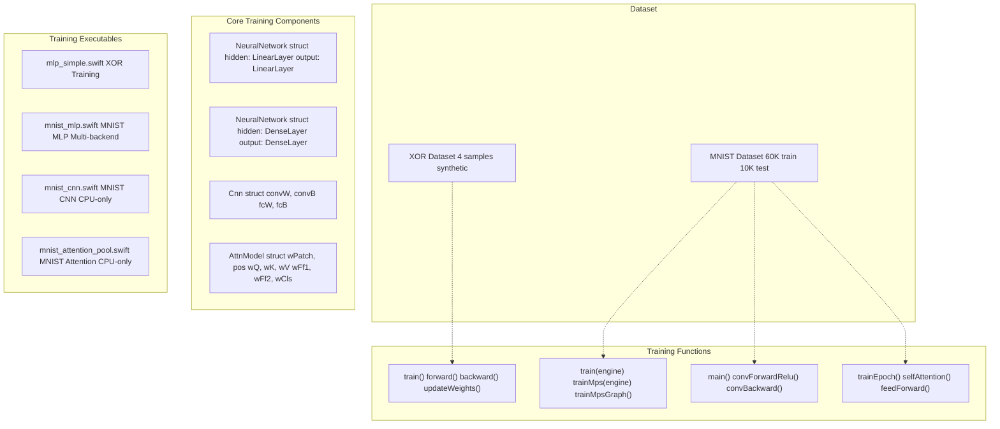
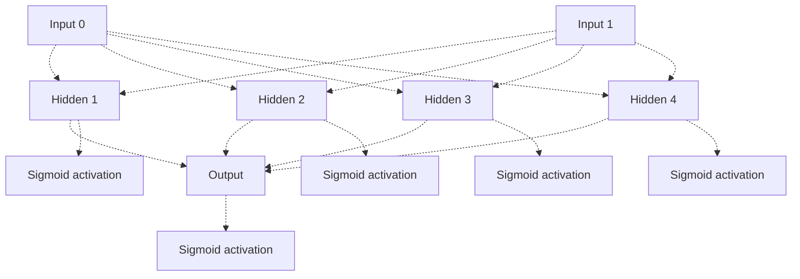
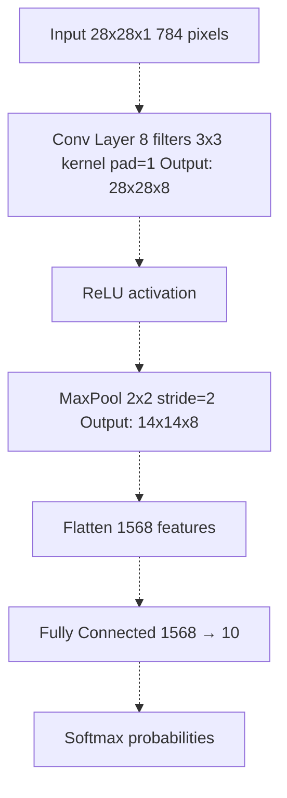
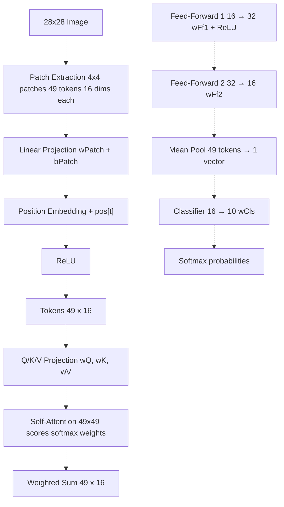

# Training Systems

> **Relevant source files**
> * [README.md](https://github.com/ThalesMMS/Swift-Neural-Networks/blob/3a1c4fc2/README.md)
> * [mlp_simple.swift](https://github.com/ThalesMMS/Swift-Neural-Networks/blob/3a1c4fc2/mlp_simple.swift)
> * [mnist_attention_pool.swift](https://github.com/ThalesMMS/Swift-Neural-Networks/blob/3a1c4fc2/mnist_attention_pool.swift)
> * [mnist_cnn.swift](https://github.com/ThalesMMS/Swift-Neural-Networks/blob/3a1c4fc2/mnist_cnn.swift)
> * [mnist_mlp.swift](https://github.com/ThalesMMS/Swift-Neural-Networks/blob/3a1c4fc2/mnist_mlp.swift)

## Purpose and Scope

This page provides an overview of the four neural network training implementations in the repository. Each implementation represents a different architecture or learning problem, ranging from toy examples to production-ready MNIST classifiers. This page compares their architectures, training loops, and use cases.

For detailed documentation of specific implementations, see:

* MNIST MLP with GPU acceleration: [MNIST MLP Implementation](4a%20MNIST-MLP-Implementation.md)
* CNN architecture details: [MNIST CNN Implementation](4b%20MNIST-CNN-Implementation.md)
* Self-attention mechanism: [Attention Model Implementation](4c%20Attention-Model-Implementation.md)
* Educational XOR example: [Simple MLP (XOR Example)](4d%20Simple-MLP-%28XOR-Example%29.md)

For GPU acceleration options available in the MLP implementation, see [GPU Acceleration](5%20GPU-Acceleration.md).

**Sources:** [README.md L1-L18](https://github.com/ThalesMMS/Swift-Neural-Networks/blob/3a1c4fc2/README.md#L1-L18)

## Training System Overview

The repository contains four distinct training systems, each designed for specific pedagogical or practical purposes:

| System | File | Problem | Architecture | Backend Options | Primary Use Case |
| --- | --- | --- | --- | --- | --- |
| Simple MLP | `mlp_simple.swift` | XOR (2 inputs) | 2→4→1 (Sigmoid) | CPU only | Educational toy example |
| MNIST MLP | `mnist_mlp.swift` | MNIST classification | 784→512→10 (ReLU+Softmax) | CPU, MPS, MPSGraph | Production-ready, GPU-accelerated |
| MNIST CNN | `mnist_cnn.swift` | MNIST classification | Conv8→MaxPool→FC(10) | CPU only | Spatial feature learning |
| MNIST Attention | `mnist_attention_pool.swift` | MNIST classification | Patches→Attention→FFN→Pool | CPU only | Transformer-style architecture |

**Sources:** [README.md L5-L8](https://github.com/ThalesMMS/Swift-Neural-Networks/blob/3a1c4fc2/README.md#L5-L8)

 README.md

## Training System Architecture



**Training System Files and Core Structures**

This diagram shows how each executable file connects to its model structure and training functions. The Simple MLP uses basic `LinearLayer` structures with sigmoid activation. The MNIST MLP defines `DenseLayer` with configurable activation types and supports multiple training backends. The CNN uses a `Cnn` struct with separate convolution and fully-connected parameters. The Attention model uses `AttnModel` with patch projection, attention weights, and feed-forward layers.

**Sources:** [mlp_simple.swift L58-L69](https://github.com/ThalesMMS/Swift-Neural-Networks/blob/3a1c4fc2/mlp_simple.swift#L58-L69)

 [mnist_mlp.swift L418-L430](https://github.com/ThalesMMS/Swift-Neural-Networks/blob/3a1c4fc2/mnist_mlp.swift#L418-L430)

 [mnist_cnn.swift L173-L180](https://github.com/ThalesMMS/Swift-Neural-Networks/blob/3a1c4fc2/mnist_cnn.swift#L173-L180)

 [mnist_attention_pool.swift L196-L212](https://github.com/ThalesMMS/Swift-Neural-Networks/blob/3a1c4fc2/mnist_attention_pool.swift#L196-L212)

## Training Loop Comparison


**Training Loop Structures by Implementation**

Each training system implements a different loop structure. The Simple MLP runs 1 million epochs over 4 samples with per-sample updates. MNIST MLP uses mini-batch SGD with shuffling and flexible backend selection. CNN follows a similar pattern but with convolutional and pooling operations. Attention uses patch-based tokenization with self-attention and mean pooling.

**Sources:** [mlp_simple.swift L144-L184](https://github.com/ThalesMMS/Swift-Neural-Networks/blob/3a1c4fc2/mlp_simple.swift#L144-L184)

 [mnist_mlp.swift L1330-L1515](https://github.com/ThalesMMS/Swift-Neural-Networks/blob/3a1c4fc2/mnist_mlp.swift#L1330-L1515)

 [mnist_cnn.swift L525-L575](https://github.com/ThalesMMS/Swift-Neural-Networks/blob/3a1c4fc2/mnist_cnn.swift#L525-L575)

 [mnist_attention_pool.swift L494-L814](https://github.com/ThalesMMS/Swift-Neural-Networks/blob/3a1c4fc2/mnist_attention_pool.swift#L494-L814)

## Model Architecture Details

### Simple MLP (XOR)

The educational XOR example demonstrates basic MLP concepts using a minimal 2→4→1 architecture:



**XOR Network Architecture**

The network uses sigmoid activation throughout, with 4 hidden neurons sufficient to learn the XOR function. Weights are initialized uniformly in [-0.5, 0.5], and training uses full-batch gradient descent (all 4 samples per update).

**Key Components:**

* **Data Structures:** `LinearLayer` (weights, biases) defined at [mlp_simple.swift L58-L63](https://github.com/ThalesMMS/Swift-Neural-Networks/blob/3a1c4fc2/mlp_simple.swift#L58-L63)
* **Network:** `NeuralNetwork` struct with `hidden` and `output` layers at [mlp_simple.swift L66-L69](https://github.com/ThalesMMS/Swift-Neural-Networks/blob/3a1c4fc2/mlp_simple.swift#L66-L69)
* **Initialization:** Xavier-like uniform initialization at [mlp_simple.swift L72-L86](https://github.com/ThalesMMS/Swift-Neural-Networks/blob/3a1c4fc2/mlp_simple.swift#L72-L86)
* **Training:** Per-sample forward/backward passes at [mlp_simple.swift L144-L184](https://github.com/ThalesMMS/Swift-Neural-Networks/blob/3a1c4fc2/mlp_simple.swift#L144-L184)
* **Parameters:** `learningRate = 0.01`, `epochs = 1_000_000` at [mlp_simple.swift L8-L9](https://github.com/ThalesMMS/Swift-Neural-Networks/blob/3a1c4fc2/mlp_simple.swift#L8-L9)

**Sources:** [mlp_simple.swift L1-L235](https://github.com/ThalesMMS/Swift-Neural-Networks/blob/3a1c4fc2/mlp_simple.swift#L1-L235)

 README.md

### MNIST MLP

The production-ready MLP implements a standard feedforward network for digit classification:

| Layer | Input Size | Output Size | Activation | Parameters |
| --- | --- | --- | --- | --- |
| Hidden | 784 | 512 | ReLU | 401,920 weights + 512 biases |
| Output | 512 | 10 | Softmax | 5,120 weights + 10 biases |
| **Total** | - | - | - | **407,562 parameters** |

**Key Implementation Details:**

* **Protocol-Based Backends:** `GemmEngine` protocol at [mnist_mlp.swift L433-L449](https://github.com/ThalesMMS/Swift-Neural-Networks/blob/3a1c4fc2/mnist_mlp.swift#L433-L449)  allows pluggable matrix multiplication backends
* **CPU Implementation:** `CpuGemmEngine` using vDSP at [mnist_mlp.swift L452-L559](https://github.com/ThalesMMS/Swift-Neural-Networks/blob/3a1c4fc2/mnist_mlp.swift#L452-L559)
* **MPS Implementation:** `MpsGemmEngine` with shared buffers at [mnist_mlp.swift L883-L989](https://github.com/ThalesMMS/Swift-Neural-Networks/blob/3a1c4fc2/mnist_mlp.swift#L883-L989)
* **MPSGraph Implementation:** Full GPU execution with automatic differentiation at [mnist_mlp.swift L11-L222](https://github.com/ThalesMMS/Swift-Neural-Networks/blob/3a1c4fc2/mnist_mlp.swift#L11-L222)
* **Training Loop:** Mini-batch SGD with shuffling at [mnist_mlp.swift L1330-L1515](https://github.com/ThalesMMS/Swift-Neural-Networks/blob/3a1c4fc2/mnist_mlp.swift#L1330-L1515)
* **Forward Pass:** GEMM → Add Bias → ReLU → GEMM → Add Bias → Softmax at [mnist_mlp.swift L1388-L1417](https://github.com/ThalesMMS/Swift-Neural-Networks/blob/3a1c4fc2/mnist_mlp.swift#L1388-L1417)
* **Loss Function:** Cross-entropy with numerical stability at [mnist_mlp.swift L1145-L1163](https://github.com/ThalesMMS/Swift-Neural-Networks/blob/3a1c4fc2/mnist_mlp.swift#L1145-L1163)

**Sources:** [mnist_mlp.swift L358-L430](https://github.com/ThalesMMS/Swift-Neural-Networks/blob/3a1c4fc2/mnist_mlp.swift#L358-L430)

 README.md

### MNIST CNN

The CNN architecture introduces spatial inductive bias through convolution and pooling:



**CNN Architecture with Spatial Processing**

The CNN reduces parameter count significantly (16,090 total parameters) compared to the MLP while achieving competitive accuracy through convolution and pooling operations.

**Key Implementation Details:**

* **Model Structure:** `Cnn` struct with `convW`, `convB`, `fcW`, `fcB` at [mnist_cnn.swift L173-L180](https://github.com/ThalesMMS/Swift-Neural-Networks/blob/3a1c4fc2/mnist_cnn.swift#L173-L180)
* **Convolution:** `convForwardRelu()` with zero-padding at [mnist_cnn.swift L209-L241](https://github.com/ThalesMMS/Swift-Neural-Networks/blob/3a1c4fc2/mnist_cnn.swift#L209-L241)
* **Max Pooling:** `maxPoolForward()` stores argmax indices for backprop at [mnist_cnn.swift L244-L286](https://github.com/ThalesMMS/Swift-Neural-Networks/blob/3a1c4fc2/mnist_cnn.swift#L244-L286)
* **Backward Pass:** Separate functions for FC, pooling, and conv layers at [mnist_cnn.swift L332-L442](https://github.com/ThalesMMS/Swift-Neural-Networks/blob/3a1c4fc2/mnist_cnn.swift#L332-L442)
* **Training Parameters:** `batchSize = 32`, `epochs = 3`, `learningRate = 0.01` at [mnist_cnn.swift L35-L37](https://github.com/ThalesMMS/Swift-Neural-Networks/blob/3a1c4fc2/mnist_cnn.swift#L35-L37)
* **Parameter Count:** * Conv: 8 × 3 × 3 = 72 weights + 8 biases * FC: 1568 × 10 = 15,680 weights + 10 biases * Total: 15,770 parameters

**Sources:** [mnist_cnn.swift L1-L583](https://github.com/ThalesMMS/Swift-Neural-Networks/blob/3a1c4fc2/mnist_cnn.swift#L1-L583)

 README.md

### MNIST Attention

The Transformer-style attention model processes images as sequences of patch tokens:



**Attention-Based Architecture with Patch Tokenization**

The attention model treats the image as a sequence of 49 patch tokens (7×7 grid of 4×4 patches). Each token undergoes self-attention to model spatial relationships, followed by per-token feed-forward processing and mean pooling.

**Key Implementation Details:**

* **Model Structure:** `AttnModel` with 14 parameter arrays at [mnist_attention_pool.swift L196-L212](https://github.com/ThalesMMS/Swift-Neural-Networks/blob/3a1c4fc2/mnist_attention_pool.swift#L196-L212)
* **Patch Extraction:** `extractPatches()` creates 49 tokens per image at [mnist_attention_pool.swift L326-L346](https://github.com/ThalesMMS/Swift-Neural-Networks/blob/3a1c4fc2/mnist_attention_pool.swift#L326-L346)
* **Token Projection:** `makeTokens()` applies linear projection + position embeddings + ReLU at [mnist_attention_pool.swift L349-L366](https://github.com/ThalesMMS/Swift-Neural-Networks/blob/3a1c4fc2/mnist_attention_pool.swift#L349-L366)
* **Self-Attention:** `selfAttention()` computes Q/K/V, attention scores, and weighted sum at [mnist_attention_pool.swift L369-L427](https://github.com/ThalesMMS/Swift-Neural-Networks/blob/3a1c4fc2/mnist_attention_pool.swift#L369-L427)
* **Feed-Forward:** `feedForward()` applies two-layer MLP per token at [mnist_attention_pool.swift L430-L460](https://github.com/ThalesMMS/Swift-Neural-Networks/blob/3a1c4fc2/mnist_attention_pool.swift#L430-L460)
* **Pooling:** `meanPoolTokens()` averages across sequence dimension at [mnist_attention_pool.swift L463-L475](https://github.com/ThalesMMS/Swift-Neural-Networks/blob/3a1c4fc2/mnist_attention_pool.swift#L463-L475)
* **Training:** `trainEpoch()` with manual gradient computation at [mnist_attention_pool.swift L495-L814](https://github.com/ThalesMMS/Swift-Neural-Networks/blob/3a1c4fc2/mnist_attention_pool.swift#L495-L814)
* **Architecture Constants:** * `patch = 4`, `seqLen = 49` at [mnist_attention_pool.swift L32-L34](https://github.com/ThalesMMS/Swift-Neural-Networks/blob/3a1c4fc2/mnist_attention_pool.swift#L32-L34) * `dModel = 16`, `ffDim = 32` at [mnist_attention_pool.swift L36-L37](https://github.com/ThalesMMS/Swift-Neural-Networks/blob/3a1c4fc2/mnist_attention_pool.swift#L36-L37) * Total parameters: ~5,000

**Sources:** [mnist_attention_pool.swift L1-L972](https://github.com/ThalesMMS/Swift-Neural-Networks/blob/3a1c4fc2/mnist_attention_pool.swift#L1-L972)

 README.md

## Training Configuration

### Command-Line Interface

Each training system exposes different configuration options:

**Simple MLP (XOR):**

* No command-line options
* Fixed parameters in source code at [mlp_simple.swift L4-L9](https://github.com/ThalesMMS/Swift-Neural-Networks/blob/3a1c4fc2/mlp_simple.swift#L4-L9)

**MNIST MLP:**

```
./mnist_mlp_swift [--mps] [--mpsgraph] [--batch N] [--hidden N] [--epochs N] [--lr F] [--seed N]
```

Configuration parsing at [mnist_mlp.swift L2182-L2254](https://github.com/ThalesMMS/Swift-Neural-Networks/blob/3a1c4fc2/mnist_mlp.swift#L2182-L2254)

| Flag | Type | Default | Description |
| --- | --- | --- | --- |
| `--mps` | Boolean | false | Use MPS hybrid backend |
| `--mpsgraph` | Boolean | false | Use MPSGraph full GPU backend |
| `--batch` | Integer | 64 | Mini-batch size |
| `--hidden` | Integer | 512 | Hidden layer size |
| `--epochs` | Integer | 10 | Number of training epochs |
| `--lr` | Float | 0.01 | Learning rate |
| `--seed` | Integer | 1 | Random seed |

**MNIST CNN:**

* No command-line options
* Fixed parameters: `batchSize = 32`, `epochs = 3`, `learningRate = 0.01` at [mnist_cnn.swift L35-L37](https://github.com/ThalesMMS/Swift-Neural-Networks/blob/3a1c4fc2/mnist_cnn.swift#L35-L37)

**MNIST Attention:**

```
./mnist_attention_pool_swift [--batch N] [--epochs N] [--lr F] [--seed N]
```

Configuration parsing at [mnist_attention_pool.swift L880-L912](https://github.com/ThalesMMS/Swift-Neural-Networks/blob/3a1c4fc2/mnist_attention_pool.swift#L880-L912)

| Flag | Type | Default | Description |
| --- | --- | --- | --- |
| `--batch` | Integer | 32 | Mini-batch size |
| `--epochs` | Integer | 5 | Number of training epochs |
| `--lr` | Float | 0.01 | Learning rate |
| `--seed` | Integer | 1 | Random seed |

**Sources:** [Project overview and setup](https://github.com/ThalesMMS/Swift-Neural-Networks/blob/3a1c4fc2/README.md#L140-L163)

 [mnist_mlp.swift L2182-L2254](https://github.com/ThalesMMS/Swift-Neural-Networks/blob/3a1c4fc2/mnist_mlp.swift#L2182-L2254)

 [mnist_attention_pool.swift L880-L912](https://github.com/ThalesMMS/Swift-Neural-Networks/blob/3a1c4fc2/mnist_attention_pool.swift#L880-L912)

### Initialization Strategies

All systems use Xavier/Glorot initialization for stable training:

**Simple MLP:**

* Uniform initialization in [-0.5, 0.5] at [mlp_simple.swift L76-L77](https://github.com/ThalesMMS/Swift-Neural-Networks/blob/3a1c4fc2/mlp_simple.swift#L76-L77)

**MNIST MLP:**

* Xavier uniform: `limit = sqrt(6.0 / (fan_in + fan_out))` at [mnist_mlp.swift L1066](https://github.com/ThalesMMS/Swift-Neural-Networks/blob/3a1c4fc2/mnist_mlp.swift#L1066-L1066)
* Applied at [mnist_mlp.swift L1060-L1079](https://github.com/ThalesMMS/Swift-Neural-Networks/blob/3a1c4fc2/mnist_mlp.swift#L1060-L1079)

**MNIST CNN:**

* Xavier limits calculated separately for conv and FC layers at [mnist_cnn.swift L191-L202](https://github.com/ThalesMMS/Swift-Neural-Networks/blob/3a1c4fc2/mnist_cnn.swift#L191-L202)

**MNIST Attention:**

* Xavier initialization for all weight matrices at [mnist_attention_pool.swift L268-L304](https://github.com/ThalesMMS/Swift-Neural-Networks/blob/3a1c4fc2/mnist_attention_pool.swift#L268-L304)
* Position embeddings initialized with small uniform noise at [mnist_attention_pool.swift L276-L278](https://github.com/ThalesMMS/Swift-Neural-Networks/blob/3a1c4fc2/mnist_attention_pool.swift#L276-L278)

**Sources:** [mlp_simple.swift L72-L86](https://github.com/ThalesMMS/Swift-Neural-Networks/blob/3a1c4fc2/mlp_simple.swift#L72-L86)

 [mnist_mlp.swift L1060-L1079](https://github.com/ThalesMMS/Swift-Neural-Networks/blob/3a1c4fc2/mnist_mlp.swift#L1060-L1079)

 [mnist_cnn.swift L189-L205](https://github.com/ThalesMMS/Swift-Neural-Networks/blob/3a1c4fc2/mnist_cnn.swift#L189-L205)

 [mnist_attention_pool.swift L268-L323](https://github.com/ThalesMMS/Swift-Neural-Networks/blob/3a1c4fc2/mnist_attention_pool.swift#L268-L323)

## Output Artifacts

### Training Logs

All MNIST implementations produce CSV training logs with epoch-level metrics:

| System | Log File | Format | Columns |
| --- | --- | --- | --- |
| MNIST MLP | `logs/training_loss_c.txt` | CSV | epoch, loss, time |
| MNIST CNN | `logs/training_loss_cnn.txt` | CSV | epoch, loss, time |
| MNIST Attention | `logs/training_loss_attention_mnist.txt` | CSV | epoch, loss, time, test_acc |

**Log Writing Implementation:**

* MLP: [mnist_mlp.swift L1338-L1343](https://github.com/ThalesMMS/Swift-Neural-Networks/blob/3a1c4fc2/mnist_mlp.swift#L1338-L1343)  writes at [mnist_mlp.swift L1510-L1513](https://github.com/ThalesMMS/Swift-Neural-Networks/blob/3a1c4fc2/mnist_mlp.swift#L1510-L1513)
* CNN: [mnist_cnn.swift L498-L501](https://github.com/ThalesMMS/Swift-Neural-Networks/blob/3a1c4fc2/mnist_cnn.swift#L498-L501)  writes at [mnist_cnn.swift L571-L574](https://github.com/ThalesMMS/Swift-Neural-Networks/blob/3a1c4fc2/mnist_cnn.swift#L571-L574)
* Attention: [mnist_attention_pool.swift L935-L938](https://github.com/ThalesMMS/Swift-Neural-Networks/blob/3a1c4fc2/mnist_attention_pool.swift#L935-L938)  writes at [mnist_attention_pool.swift L953-L956](https://github.com/ThalesMMS/Swift-Neural-Networks/blob/3a1c4fc2/mnist_attention_pool.swift#L953-L956)

**Sources:** README.md

 [mnist_mlp.swift L1338-L1513](https://github.com/ThalesMMS/Swift-Neural-Networks/blob/3a1c4fc2/mnist_mlp.swift#L1338-L1513)

 [mnist_cnn.swift L498-L574](https://github.com/ThalesMMS/Swift-Neural-Networks/blob/3a1c4fc2/mnist_cnn.swift#L498-L574)

 [mnist_attention_pool.swift L935-L956](https://github.com/ThalesMMS/Swift-Neural-Networks/blob/3a1c4fc2/mnist_attention_pool.swift#L935-L956)

### Model Serialization

Only the MNIST MLP system supports model serialization:

* **Binary Format:** Double-precision weights and biases
* **File:** `mnist_model.bin`
* **Writing:** `saveModelBinary()` at [mnist_mlp.swift L1906-L1967](https://github.com/ThalesMMS/Swift-Neural-Networks/blob/3a1c4fc2/mnist_mlp.swift#L1906-L1967)
* **Structure:** 1. Hidden layer dimensions (2 × Int32) 2. Output layer dimensions (2 × Int32) 3. Hidden weights (inputSize × hiddenSize × Double) 4. Hidden biases (hiddenSize × Double) 5. Output weights (hiddenSize × outputSize × Double) 6. Output biases (outputSize × Double)

For details on the binary format, see [Model Binary Format](8%20Model-Binary-Format.md).

**Sources:** [mnist_mlp.swift L1906-L1967](https://github.com/ThalesMMS/Swift-Neural-Networks/blob/3a1c4fc2/mnist_mlp.swift#L1906-L1967)

 README.md

## Performance Characteristics

Based on default configurations (from benchmark table in README):

| Model | Epochs | Batch Size | Training Time | Test Accuracy | Notes |
| --- | --- | --- | --- | --- | --- |
| XOR MLP | 1,000,000 | 4 (full batch) | 1.78s | 100.00% | Synthetic data, threshold 0.5 |
| MNIST MLP (CPU) | 10 | 64 | 7.30s | 11.90% | Poor convergence without GPU |
| MNIST CNN | 3 | 32 | 53.21s | 92.35% | CPU-only, parameter efficient |
| MNIST Attention | 5 | 32 | 101.71s | 24.53% | Underfitted with default hyperparameters |

**Key Observations:**

1. **Simple MLP:** Achieves perfect accuracy on XOR due to simplicity of the problem
2. **MNIST MLP:** Requires GPU backends (`--mps` or `--mpsgraph`) for proper convergence; CPU-only training fails to converge effectively
3. **MNIST CNN:** Best accuracy-to-time ratio for CPU training; spatial inductive bias helps despite fewer parameters
4. **MNIST Attention:** Requires longer training or different hyperparameters to match other architectures

**Sources:** [Project overview and setup](https://github.com/ThalesMMS/Swift-Neural-Networks/blob/3a1c4fc2/README.md#L165-L176)

## Training System Selection Guide

**Use Simple MLP (`mlp_simple.swift`) when:**

* Learning basic neural network concepts
* Experimenting with toy problems
* Understanding backpropagation mechanics
* No external dependencies beyond Foundation

**Use MNIST MLP (`mnist_mlp.swift`) when:**

* Need production-ready digit classification
* Have access to Metal-compatible GPU
* Want to experiment with different backends
* Require model serialization for inference
* Need fast training with large batch sizes

**Use MNIST CNN (`mnist_cnn.swift`) when:**

* Learning convolutional neural networks
* Training on CPU without GPU acceleration
* Want parameter efficiency (16K vs 407K parameters)
* Exploring spatial feature extraction

**Use MNIST Attention (`mnist_attention_pool.swift`) when:**

* Studying Transformer-style architectures
* Learning self-attention mechanisms
* Experimenting with patch-based image processing
* Understanding attention backward passes

**Sources:** README.md


### On this page

* [Training Systems](4%20Training-Systems.md)
* [Purpose and Scope](4%20Training-Systems.md)
* [Training System Overview](4%20Training-Systems.md)
* [Training System Architecture](4%20Training-Systems.md)
* [Training Loop Comparison](4%20Training-Systems.md)
* [Model Architecture Details](4%20Training-Systems.md)
* [Simple MLP (XOR)](4%20Training-Systems.md)
* [MNIST MLP](4%20Training-Systems.md)
* [MNIST CNN](4%20Training-Systems.md)
* [MNIST Attention](4%20Training-Systems.md)
* [Training Configuration](4%20Training-Systems.md)
* [Command-Line Interface](4%20Training-Systems.md)
* [Initialization Strategies](4%20Training-Systems.md)
* [Output Artifacts](4%20Training-Systems.md)
* [Training Logs](4%20Training-Systems.md)
* [Model Serialization](4%20Training-Systems.md)
* [Performance Characteristics](4%20Training-Systems.md)
* [Training System Selection Guide](4%20Training-Systems.md)

Ask Devin about Swift-Neural-Networks