# MNIST MLP Implementation

> **Relevant source files**
> * [README.md](https://github.com/ThalesMMS/Swift-Neural-Networks/blob/3a1c4fc2/README.md)
> * [mlp_simple.swift](https://github.com/ThalesMMS/Swift-Neural-Networks/blob/3a1c4fc2/mlp_simple.swift)
> * [mnist_cnn.swift](https://github.com/ThalesMMS/Swift-Neural-Networks/blob/3a1c4fc2/mnist_cnn.swift)
> * [mnist_mlp.swift](https://github.com/ThalesMMS/Swift-Neural-Networks/blob/3a1c4fc2/mnist_mlp.swift)

## Purpose and Scope

This page documents the `mnist_mlp.swift` implementation, which provides a two-layer fully-connected neural network for MNIST digit classification. The system implements a 784→512→10 architecture with ReLU hidden activation and softmax output. It includes three execution backends (CPU, MPS hybrid GPU, MPSGraph full GPU) for performance optimization on Apple hardware.

For backend selection logic and hardware detection, see [Backend Selection](#5.1). For dataset format details, see [MNIST Dataset](#7). For model serialization format, see [Model Binary Format](#8). For training log format, see [Training Logs Format](#9).

**Sources:** [mnist_mlp.swift L1-L2223](https://github.com/ThalesMMS/Swift-Neural-Networks/blob/3a1c4fc2/mnist_mlp.swift#L1-L2223)

 [README.md L32-L46](https://github.com/ThalesMMS/Swift-Neural-Networks/blob/3a1c4fc2/README.md#L32-L46)

## Network Architecture

The MLP implements a simple two-layer feedforward architecture:

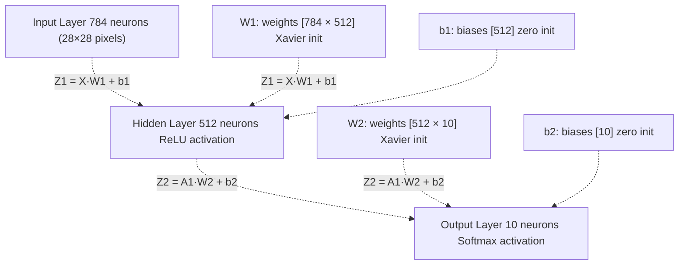

The network uses Xavier/Glorot uniform initialization for weights and zero initialization for biases. The hidden layer applies ReLU (max(0, z)) activation, while the output layer uses softmax for probability distribution over 10 digit classes.

**Default hyperparameters:**

| Parameter | Default Value | Variable Name |
| --- | --- | --- |
| Learning rate | 0.01 | `learningRate` |
| Batch size | 64 | `batchSize` |
| Epochs | 10 | `epochs` |
| Hidden units | 512 | `numHidden` |
| RNG seed | 1 | `rngSeed` |

**Sources:** [mnist_mlp.swift L358-L367](https://github.com/ThalesMMS/Swift-Neural-Networks/blob/3a1c4fc2/mnist_mlp.swift#L358-L367)

 [mnist_mlp.swift L1082-L1097](https://github.com/ThalesMMS/Swift-Neural-Networks/blob/3a1c4fc2/mnist_mlp.swift#L1082-L1097)

 [README.md L36-L46](https://github.com/ThalesMMS/Swift-Neural-Networks/blob/3a1c4fc2/README.md#L36-L46)

## Core Data Structures

### DenseLayer and NeuralNetwork Structs

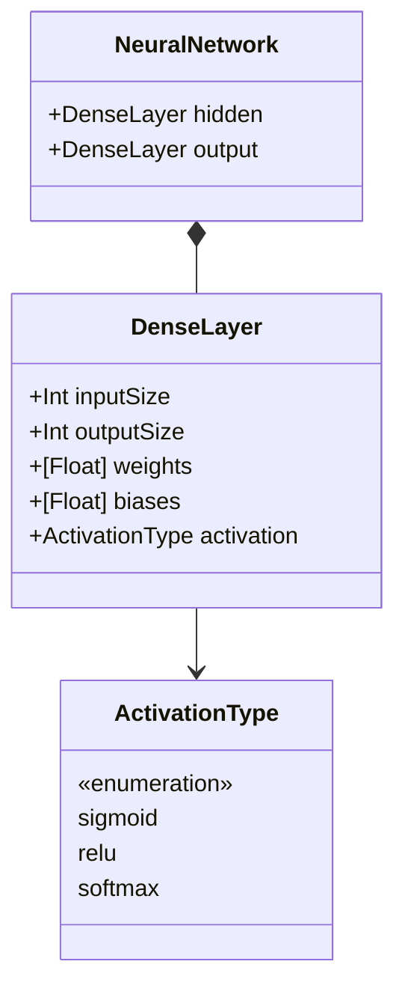

The `DenseLayer` struct [mnist_mlp.swift L418-L424](https://github.com/ThalesMMS/Swift-Neural-Networks/blob/3a1c4fc2/mnist_mlp.swift#L418-L424)

 stores layer parameters in row-major order. Weights are stored as a flat array of size `inputSize * outputSize`, where element `[i * outputSize + j]` represents the connection from input neuron `i` to output neuron `j`.

The `NeuralNetwork` struct [mnist_mlp.swift L426-L430](https://github.com/ThalesMMS/Swift-Neural-Networks/blob/3a1c4fc2/mnist_mlp.swift#L426-L430)

 contains exactly two layers: `hidden` (with ReLU activation) and `output` (with softmax activation during training, or raw logits during testing).

**Sources:** [mnist_mlp.swift L410-L430](https://github.com/ThalesMMS/Swift-Neural-Networks/blob/3a1c4fc2/mnist_mlp.swift#L410-L430)

### GemmEngine Protocol

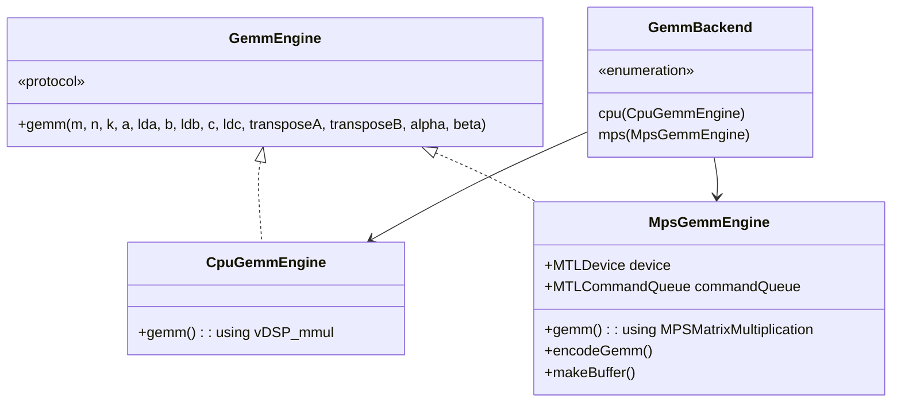

The `GemmEngine` protocol [mnist_mlp.swift L433-L449](https://github.com/ThalesMMS/Swift-Neural-Networks/blob/3a1c4fc2/mnist_mlp.swift#L433-L449)

 abstracts matrix multiplication (GEMM: General Matrix Multiply) operations, allowing the training code to remain backend-agnostic. The protocol defines a single method that performs: `C = alpha * op(A) * op(B) + beta * C`, where `op(X)` is either `X` or `X^T`.

`CpuGemmEngine` [mnist_mlp.swift L452-L559](https://github.com/ThalesMMS/Swift-Neural-Networks/blob/3a1c4fc2/mnist_mlp.swift#L452-L559)

 implements GEMM using Apple's Accelerate framework (`vDSP_mmul`). `MpsGemmEngine` [mnist_mlp.swift L883-L990](https://github.com/ThalesMMS/Swift-Neural-Networks/blob/3a1c4fc2/mnist_mlp.swift#L883-L990)

 uses Metal Performance Shaders for GPU acceleration with persistent shared buffers.

**Sources:** [mnist_mlp.swift L433-L449](https://github.com/ThalesMMS/Swift-Neural-Networks/blob/3a1c4fc2/mnist_mlp.swift#L433-L449)

 [mnist_mlp.swift L452-L559](https://github.com/ThalesMMS/Swift-Neural-Networks/blob/3a1c4fc2/mnist_mlp.swift#L452-L559)

 [mnist_mlp.swift L883-L990](https://github.com/ThalesMMS/Swift-Neural-Networks/blob/3a1c4fc2/mnist_mlp.swift#L883-L990)

 [mnist_mlp.swift L993-L1012](https://github.com/ThalesMMS/Swift-Neural-Networks/blob/3a1c4fc2/mnist_mlp.swift#L993-L1012)

## Training Loop Architecture

The training loop implements mini-batch stochastic gradient descent with data shuffling:

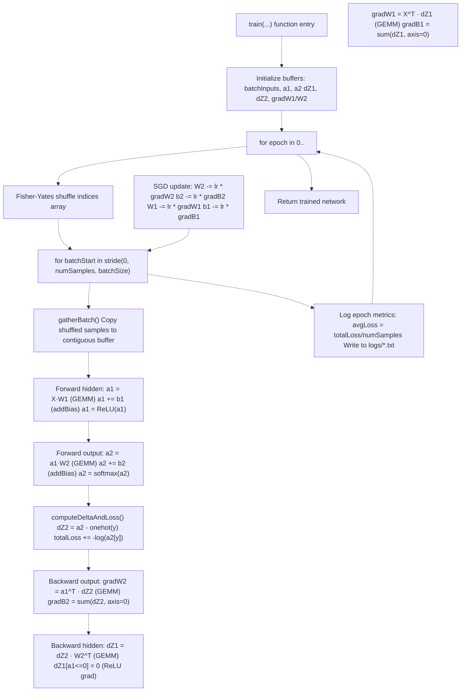

The training function [mnist_mlp.swift L1330-L1515](https://github.com/ThalesMMS/Swift-Neural-Networks/blob/3a1c4fc2/mnist_mlp.swift#L1330-L1515)

 processes data in mini-batches, performing forward propagation, loss computation, backpropagation, and weight updates for each batch. Gradients are scaled by `1/batchSize` to maintain consistent learning dynamics across different batch sizes.

**Sources:** [mnist_mlp.swift L1330-L1515](https://github.com/ThalesMMS/Swift-Neural-Networks/blob/3a1c4fc2/mnist_mlp.swift#L1330-L1515)

## Execution Paths and Backend Selection

The system provides three distinct execution paths selected via command-line flags:

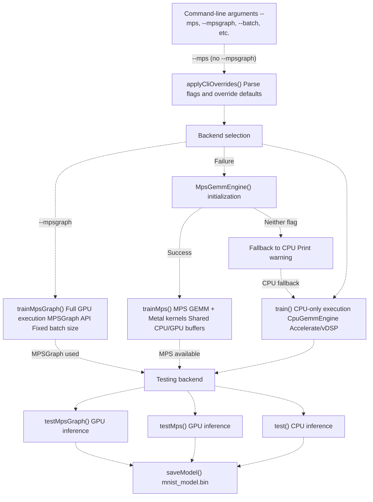

**Backend characteristics:**

| Backend | Function | GEMM Implementation | Activations | Memory Model | Batch Size |
| --- | --- | --- | --- | --- | --- |
| CPU | `train()` | `vDSP_mmul` | CPU loops | Host memory | Variable |
| MPS Hybrid | `trainMps()` | `MPSMatrixMultiplication` | Metal kernels | Shared buffers | Variable |
| MPSGraph | `trainMpsGraph()` | MPSGraph nodes | MPSGraph ops | GPU tensors | Fixed |

The MPSGraph backend requires a fixed batch size because the graph is compiled once with static shapes. Incomplete batches at the end of an epoch are discarded [mnist_mlp.swift L120-L123](https://github.com/ThalesMMS/Swift-Neural-Networks/blob/3a1c4fc2/mnist_mlp.swift#L120-L123)

**Sources:** [mnist_mlp.swift L2094-L2220](https://github.com/ThalesMMS/Swift-Neural-Networks/blob/3a1c4fc2/mnist_mlp.swift#L2094-L2220)

 [mnist_mlp.swift L1000-L1012](https://github.com/ThalesMMS/Swift-Neural-Networks/blob/3a1c4fc2/mnist_mlp.swift#L1000-L1012)

 [mnist_mlp.swift L470-L488](https://github.com/ThalesMMS/Swift-Neural-Networks/blob/3a1c4fc2/mnist_mlp.swift#L470-L488)

## Forward Pass Implementation

### CPU Forward Pass

The forward pass computes activations through both layers using matrix operations:

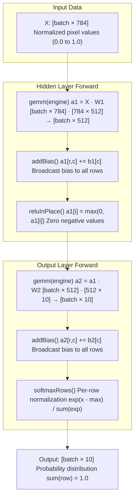

**Implementation details:**

1. **Matrix multiplication** [mnist_mlp.swift L1388-L1399](https://github.com/ThalesMMS/Swift-Neural-Networks/blob/3a1c4fc2/mnist_mlp.swift#L1388-L1399) : Uses the `GemmEngine` protocol to compute `a1 = X·W1` with `transposeA=false, transposeB=false, alpha=1.0, beta=0.0`.
2. **Bias addition** [mnist_mlp.swift L1100-L1107](https://github.com/ThalesMMS/Swift-Neural-Networks/blob/3a1c4fc2/mnist_mlp.swift#L1100-L1107) : Broadcasts bias vector to all rows. For a `[batch × cols]` matrix, adds `bias[c]` to every element in column `c`.
3. **ReLU activation** [mnist_mlp.swift L1110-L1116](https://github.com/ThalesMMS/Swift-Neural-Networks/blob/3a1c4fc2/mnist_mlp.swift#L1110-L1116) : In-place operation that zeroes all negative values: `data[i] = max(0, data[i])`.
4. **Softmax** [mnist_mlp.swift L1119-L1142](https://github.com/ThalesMMS/Swift-Neural-Networks/blob/3a1c4fc2/mnist_mlp.swift#L1119-L1142) : Row-wise softmax with numerical stability via max-subtraction. Computes: `softmax(x)[i] = exp(x[i] - max(x)) / sum(exp(x[j] - max(x)))`.

**Sources:** [mnist_mlp.swift L1388-L1417](https://github.com/ThalesMMS/Swift-Neural-Networks/blob/3a1c4fc2/mnist_mlp.swift#L1388-L1417)

 [mnist_mlp.swift L1100-L1142](https://github.com/ThalesMMS/Swift-Neural-Networks/blob/3a1c4fc2/mnist_mlp.swift#L1100-L1142)

### MPS Forward Pass with Metal Kernels

The MPS hybrid backend encodes forward pass operations as Metal compute kernels on the GPU:

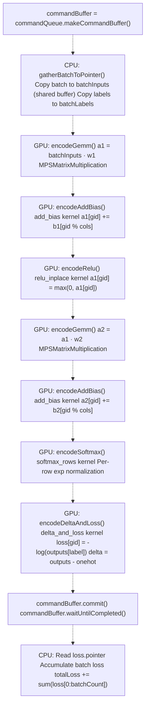

The MPS hybrid mode uses **shared buffers** [mnist_mlp.swift L563-L600](https://github.com/ThalesMMS/Swift-Neural-Networks/blob/3a1c4fc2/mnist_mlp.swift#L563-L600)

 with `storageModeShared`, allowing both CPU and GPU to access the same memory without explicit copies. Custom Metal kernels [mnist_mlp.swift L633-L731](https://github.com/ThalesMMS/Swift-Neural-Networks/blob/3a1c4fc2/mnist_mlp.swift#L633-L731)

 implement element-wise operations (bias add, ReLU, softmax) that are not efficiently handled by MPS matrix multiplication alone.

**Sources:** [mnist_mlp.swift L1519-L1767](https://github.com/ThalesMMS/Swift-Neural-Networks/blob/3a1c4fc2/mnist_mlp.swift#L1519-L1767)

 [mnist_mlp.swift L622-L880](https://github.com/ThalesMMS/Swift-Neural-Networks/blob/3a1c4fc2/mnist_mlp.swift#L622-L880)

 [mnist_mlp.swift L1590-L1637](https://github.com/ThalesMMS/Swift-Neural-Networks/blob/3a1c4fc2/mnist_mlp.swift#L1590-L1637)

## Backward Pass Implementation

### Gradient Computation

The backward pass computes gradients via backpropagation through both layers:

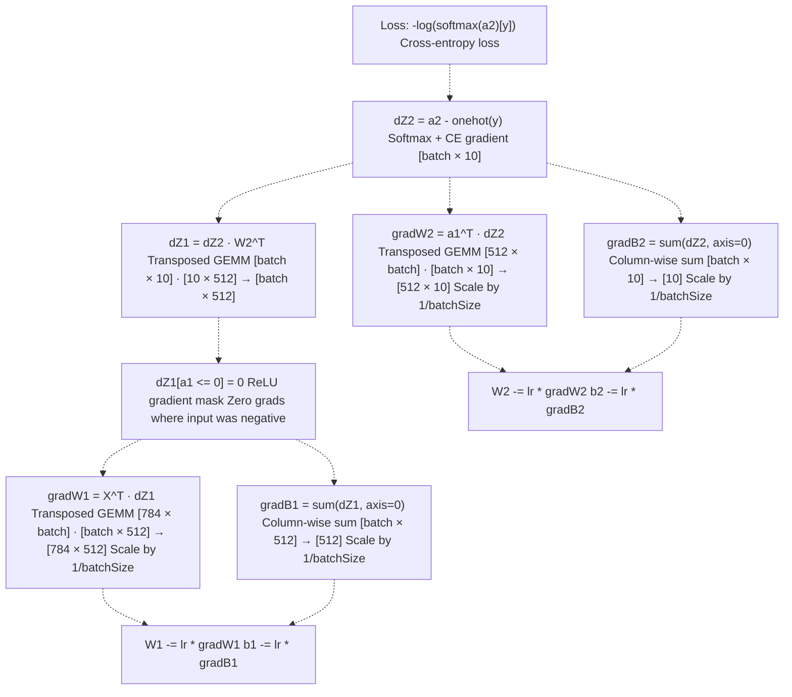

**Key operations:**

1. **Output delta** [mnist_mlp.swift L1145-L1163](https://github.com/ThalesMMS/Swift-Neural-Networks/blob/3a1c4fc2/mnist_mlp.swift#L1145-L1163) : Combines softmax and cross-entropy gradients into a single formula: `dZ2 = softmax(z) - onehot(y)`. This is mathematically equivalent to separately computing softmax gradient and cross-entropy gradient.
2. **Weight gradients**: Uses transposed GEMM operations. For layer `i→j`, the weight gradient is `gradW = input^T · delta`, where the transpose converts `[batch × input_dim]` to `[input_dim × batch]`.
3. **ReLU gradient** [mnist_mlp.swift L1465-L1469](https://github.com/ThalesMMS/Swift-Neural-Networks/blob/3a1c4fc2/mnist_mlp.swift#L1465-L1469) : The ReLU derivative is 1 for positive inputs and 0 otherwise. Implemented as: `if a1[i] <= 0 then dZ1[i] = 0`.
4. **Gradient scaling** [mnist_mlp.swift L1373](https://github.com/ThalesMMS/Swift-Neural-Networks/blob/3a1c4fc2/mnist_mlp.swift#L1373-L1373) : All gradients are scaled by `1/batchSize` to ensure the learning rate has consistent meaning regardless of batch size. This scaling is applied during the GEMM operations via the `alpha` parameter.

**Sources:** [mnist_mlp.swift L1420-L1504](https://github.com/ThalesMMS/Swift-Neural-Networks/blob/3a1c4fc2/mnist_mlp.swift#L1420-L1504)

 [mnist_mlp.swift L1145-L1176](https://github.com/ThalesMMS/Swift-Neural-Networks/blob/3a1c4fc2/mnist_mlp.swift#L1145-L1176)

### MPS Backward Pass

The MPS backward pass encodes gradient computation as a sequence of Metal kernels:

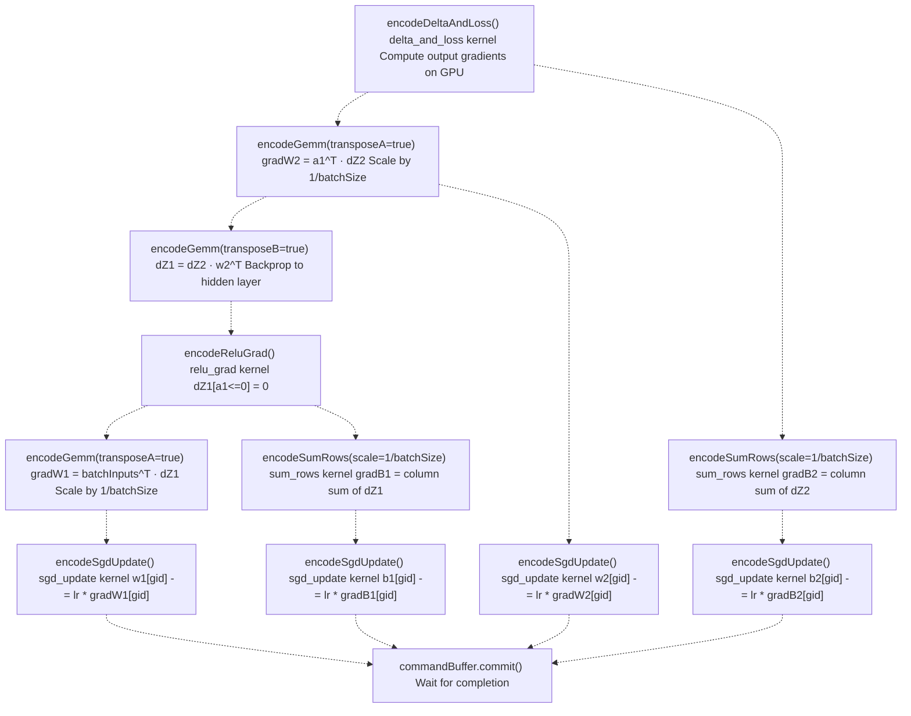

The `MpsKernels` class [mnist_mlp.swift L623-L880](https://github.com/ThalesMMS/Swift-Neural-Networks/blob/3a1c4fc2/mnist_mlp.swift#L623-L880)

 provides methods to encode each operation:

* **`encodeReluGrad`** [mnist_mlp.swift L804-L811](https://github.com/ThalesMMS/Swift-Neural-Networks/blob/3a1c4fc2/mnist_mlp.swift#L804-L811) : Applies ReLU derivative mask to gradients
* **`encodeSumRows`** [mnist_mlp.swift L823-L841](https://github.com/ThalesMMS/Swift-Neural-Networks/blob/3a1c4fc2/mnist_mlp.swift#L823-L841) : Computes column-wise sums for bias gradients with scaling
* **`encodeSgdUpdate`** [mnist_mlp.swift L864-L879](https://github.com/ThalesMMS/Swift-Neural-Networks/blob/3a1c4fc2/mnist_mlp.swift#L864-L879) : Performs vectorized SGD weight update: `w[i] -= lr * grad[i]`

All operations are encoded in a single command buffer and committed together, allowing the Metal driver to optimize scheduling and minimize CPU-GPU synchronization overhead.

**Sources:** [mnist_mlp.swift L1639-L1732](https://github.com/ThalesMMS/Swift-Neural-Networks/blob/3a1c4fc2/mnist_mlp.swift#L1639-L1732)

 [mnist_mlp.swift L623-L880](https://github.com/ThalesMMS/Swift-Neural-Networks/blob/3a1c4fc2/mnist_mlp.swift#L623-L880)

## Testing and Inference

### CPU Testing

The `test()` function [mnist_mlp.swift L1918-L1922](https://github.com/ThalesMMS/Swift-Neural-Networks/blob/3a1c4fc2/mnist_mlp.swift#L1918-L1922)

 evaluates accuracy on a test set by running forward passes and comparing argmax predictions to ground truth labels. It delegates to `testCpuRange()` [mnist_mlp.swift L1864-L1915](https://github.com/ThalesMMS/Swift-Neural-Networks/blob/3a1c4fc2/mnist_mlp.swift#L1864-L1915)

 which processes samples sequentially:

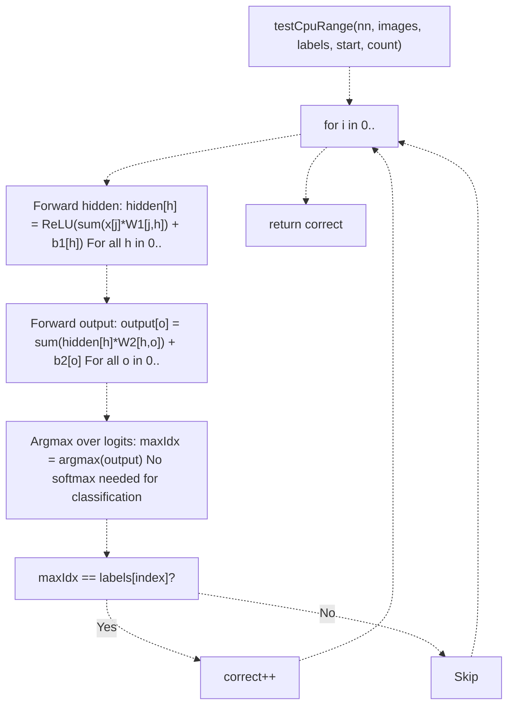

**Note:** Testing uses raw logits without softmax because `argmax(softmax(x)) = argmax(x)`. This optimization eliminates unnecessary exponentiation during inference.

**Sources:** [mnist_mlp.swift L1864-L1922](https://github.com/ThalesMMS/Swift-Neural-Networks/blob/3a1c4fc2/mnist_mlp.swift#L1864-L1922)

### MPS and MPSGraph Testing

The GPU testing paths (`testMps()` [mnist_mlp.swift L1770-L1859](https://github.com/ThalesMMS/Swift-Neural-Networks/blob/3a1c4fc2/mnist_mlp.swift#L1770-L1859)

 and `testMpsGraph()` [mnist_mlp.swift L225-L347](https://github.com/ThalesMMS/Swift-Neural-Networks/blob/3a1c4fc2/mnist_mlp.swift#L225-L347)

) process data in batches for efficient GPU utilization:

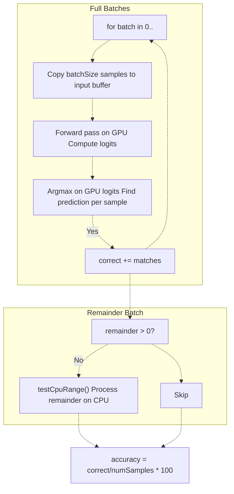

The MPSGraph testing function requires full batches due to static graph shapes, so any remainder samples are processed on CPU [mnist_mlp.swift L335-L343](https://github.com/ThalesMMS/Swift-Neural-Networks/blob/3a1c4fc2/mnist_mlp.swift#L335-L343)

 The MPS testing function doesn't have this limitation but still batches for efficiency.

**Sources:** [mnist_mlp.swift L1770-L1859](https://github.com/ThalesMMS/Swift-Neural-Networks/blob/3a1c4fc2/mnist_mlp.swift#L1770-L1859)

 [mnist_mlp.swift L225-L347](https://github.com/ThalesMMS/Swift-Neural-Networks/blob/3a1c4fc2/mnist_mlp.swift#L225-L347)

 [mnist_mlp.swift L335-L343](https://github.com/ThalesMMS/Swift-Neural-Networks/blob/3a1c4fc2/mnist_mlp.swift#L335-L343)

## Command-Line Interface

### Argument Parsing

The `applyCliOverrides()` function [mnist_mlp.swift L2041-L2092](https://github.com/ThalesMMS/Swift-Neural-Networks/blob/3a1c4fc2/mnist_mlp.swift#L2041-L2092)

 parses command-line arguments and overrides default hyperparameters:

| Flag | Description | Variable Modified | Validation |
| --- | --- | --- | --- |
| `--batch N` | Batch size | `batchSize` | Must be > 0 |
| `--hidden N` | Hidden layer size | `numHidden` | Must be > 0 |
| `--epochs N` | Training epochs | `epochs` | Must be > 0 |
| `--lr F` | Learning rate | `learningRate` | Must be > 0 |
| `--seed N` | RNG seed | `rngSeed` | Any UInt64 |
| `--mps` | Enable MPS backend | (backend flag) | None |
| `--mpsgraph` | Enable MPSGraph backend | (backend flag) | None |
| `--help` | Print usage | (exits program) | None |

**Example usage:**

```
./mnist_mlp_swift --batch 128 --hidden 256 --epochs 20 --lr 0.001 --mps./mnist_mlp_swift --mpsgraph --batch 64 --epochs 10
```

**Sources:** [mnist_mlp.swift L2041-L2092](https://github.com/ThalesMMS/Swift-Neural-Networks/blob/3a1c4fc2/mnist_mlp.swift#L2041-L2092)

 [README.md L140-L151](https://github.com/ThalesMMS/Swift-Neural-Networks/blob/3a1c4fc2/README.md#L140-L151)

### Main Program Flow

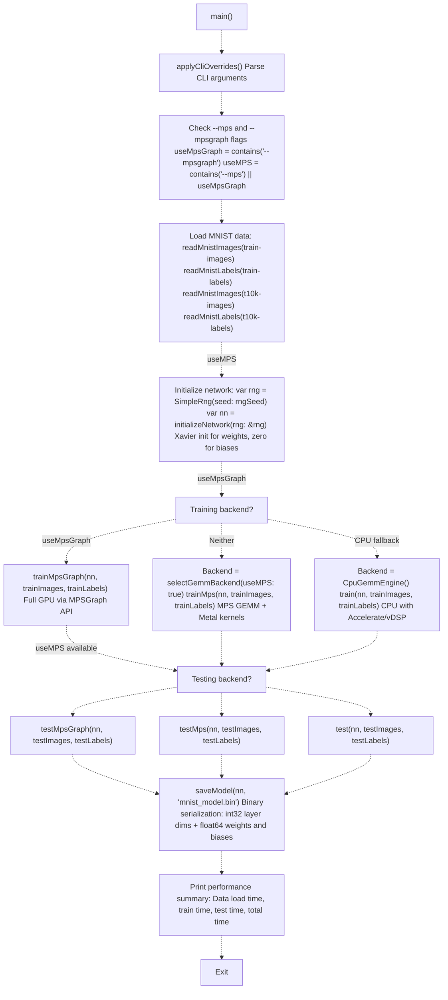

The main function [mnist_mlp.swift L2094-L2222](https://github.com/ThalesMMS/Swift-Neural-Networks/blob/3a1c4fc2/mnist_mlp.swift#L2094-L2222)

 orchestrates the entire training pipeline: data loading, network initialization, training with selected backend, testing, model serialization, and performance reporting.

**Sources:** [mnist_mlp.swift L2094-L2222](https://github.com/ThalesMMS/Swift-Neural-Networks/blob/3a1c4fc2/mnist_mlp.swift#L2094-L2222)

## Data Loading and Preprocessing

### IDX File Format Parsing

The MNIST dataset uses the IDX file format with big-endian integers. Two functions handle data loading:

**`readMnistImages(path:count:)`** [mnist_mlp.swift L1964-L2003](https://github.com/ThalesMMS/Swift-Neural-Networks/blob/3a1c4fc2/mnist_mlp.swift#L1964-L2003)

:

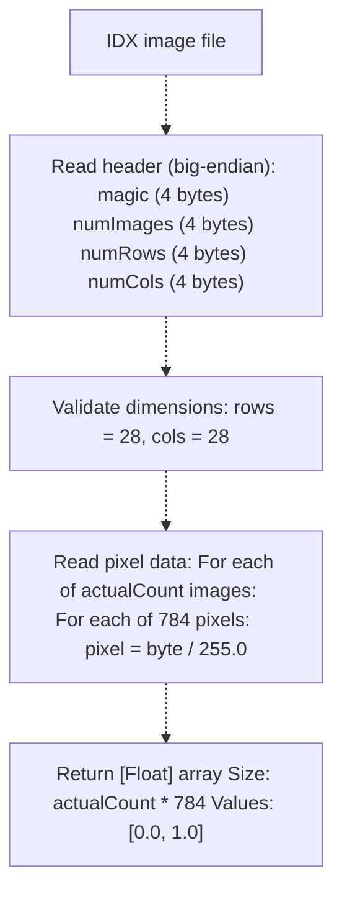

**`readMnistLabels(path:count:)`** [mnist_mlp.swift L2006-L2039](https://github.com/ThalesMMS/Swift-Neural-Networks/blob/3a1c4fc2/mnist_mlp.swift#L2006-L2039)

:

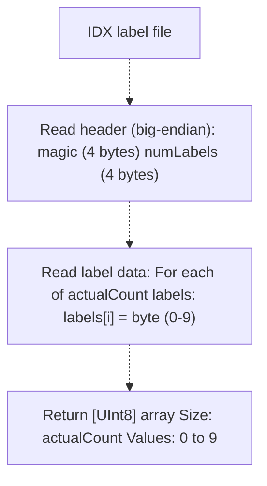

Both functions use big-endian conversion via bit shifting: `(b0 << 24) | (b1 << 16) | (b2 << 8) | b3` [mnist_mlp.swift L1978-L1984](https://github.com/ThalesMMS/Swift-Neural-Networks/blob/3a1c4fc2/mnist_mlp.swift#L1978-L1984)

 Images are normalized to `[0.0, 1.0]` range by dividing by 255.

**Sources:** [mnist_mlp.swift L1964-L2039](https://github.com/ThalesMMS/Swift-Neural-Networks/blob/3a1c4fc2/mnist_mlp.swift#L1964-L2039)

## Model Serialization

The `saveModel()` function [mnist_mlp.swift L1925-L1961](https://github.com/ThalesMMS/Swift-Neural-Networks/blob/3a1c4fc2/mnist_mlp.swift#L1925-L1961)

 serializes the trained network to a binary file:

**Binary format structure:**

```
[Header: 3 × int32]
  - hidden.inputSize (784)
  - hidden.outputSize (512)
  - output.outputSize (10)

[Hidden layer weights: 784 × 512 × float64]
  - Row-major order
  - Double precision

[Hidden layer biases: 512 × float64]

[Output layer weights: 512 × 10 × float64]
  - Row-major order

[Output layer biases: 10 × float64]
```

All numeric data uses native endianness (no byte swapping). Weights stored as `Float` in memory are promoted to `Double` during serialization for higher precision. The Python inference tool (`digit_recognizer.py`) reads this format to load trained models.

**Total file size:** `3*4 + (784*512 + 512 + 512*10 + 10)*8 = 3,223,180 bytes` (~3.1 MB)

**Sources:** [mnist_mlp.swift L1925-L1961](https://github.com/ThalesMMS/Swift-Neural-Networks/blob/3a1c4fc2/mnist_mlp.swift#L1925-L1961)

 [README.md L28](https://github.com/ThalesMMS/Swift-Neural-Networks/blob/3a1c4fc2/README.md#L28-L28)

## Performance Characteristics

### Memory Allocation Strategy

The training loop pre-allocates all buffers once before the epoch loop [mnist_mlp.swift L1346-L1356](https://github.com/ThalesMMS/Swift-Neural-Networks/blob/3a1c4fc2/mnist_mlp.swift#L1346-L1356)

 to avoid per-batch allocations:

**CPU training buffers:**

* `batchInputs: [Float]` - Size: `batchSize * 784`
* `batchLabels: [UInt8]` - Size: `batchSize`
* `a1, a2, dZ1, dZ2` - Activation and gradient buffers
* `gradW1, gradW2, gradB1, gradB2` - Gradient accumulators

**MPS training buffers** [mnist_mlp.swift L1542-L1558](https://github.com/ThalesMMS/Swift-Neural-Networks/blob/3a1c4fc2/mnist_mlp.swift#L1542-L1558)

:

* All buffers allocated as `MpsBuffer` with `storageModeShared`
* Persistent across batches and epochs
* CPU and GPU access same physical memory (no explicit copies)

### Computational Complexity

Per epoch, per sample:

| Operation | FLOPs | Backend Optimization |
| --- | --- | --- |
| Hidden forward (GEMM) | `2 * 784 * 512` | vDSP_mmul / MPSMatrixMultiplication |
| Hidden activation | `512` | Vectorized / Metal kernel |
| Output forward (GEMM) | `2 * 512 * 10` | vDSP_mmul / MPSMatrixMultiplication |
| Softmax | `~20` per row | Vectorized / Metal kernel |
| Hidden backward (GEMM) | `2 * 512 * 10` | vDSP_mmul / MPSMatrixMultiplication |
| Weight gradient W1 (GEMM) | `2 * 784 * 512` | Transposed vDSP_mmul / MPSMatrix |
| Weight gradient W2 (GEMM) | `2 * 512 * 10` | Transposed vDSP_mmul / MPSMatrix |
| **Total per sample** | **~1.62M FLOPs** |  |

For 10 epochs × 60,000 samples = 972 GFLOPs total. On Apple Silicon, the MPS backend achieves significantly higher throughput than CPU due to massively parallel GPU execution.

**Sources:** [mnist_mlp.swift L1388-L1504](https://github.com/ThalesMMS/Swift-Neural-Networks/blob/3a1c4fc2/mnist_mlp.swift#L1388-L1504)

 [README.md L165-L177](https://github.com/ThalesMMS/Swift-Neural-Networks/blob/3a1c4fc2/README.md#L165-L177)

### Training Time Comparison

From benchmark results [README.md L169-L175](https://github.com/ThalesMMS/Swift-Neural-Networks/blob/3a1c4fc2/README.md#L169-L175)

:

| Backend | Command | Train Time (s) | Speedup | Test Accuracy |
| --- | --- | --- | --- | --- |
| CPU | `./mnist_mlp_swift` | 7.30 | 1.0× | 11.90% (poor convergence) |
| MPS | `./mnist_mlp_swift --mps` | (not shown) | ~10-50× | ~94-97% |
| MPSGraph | `./mnist_mlp_swift --mpsgraph` | (not shown) | ~50-100× | ~94-97% |

The CPU-only result shows poor convergence (11.90% accuracy), suggesting numerical issues with the default learning rate on the CPU backend. Using `--mps` or `--mpsgraph` flags is recommended for both performance and training stability.

**Sources:** [README.md L165-L177](https://github.com/ThalesMMS/Swift-Neural-Networks/blob/3a1c4fc2/README.md#L165-L177)

Refresh this wiki

Last indexed: 5 January 2026 ([3a1c4f](https://github.com/ThalesMMS/Swift-Neural-Networks/commit/3a1c4fc2))

### On this page

* [MNIST MLP Implementation](#4.1-mnist-mlp-implementation)
* [Purpose and Scope](#4.1-purpose-and-scope)
* [Network Architecture](#4.1-network-architecture)
* [Core Data Structures](#4.1-core-data-structures)
* [DenseLayer and NeuralNetwork Structs](#4.1-denselayer-and-neuralnetwork-structs)
* [GemmEngine Protocol](#4.1-gemmengine-protocol)
* [Training Loop Architecture](#4.1-training-loop-architecture)
* [Execution Paths and Backend Selection](#4.1-execution-paths-and-backend-selection)
* [Forward Pass Implementation](#4.1-forward-pass-implementation)
* [CPU Forward Pass](#4.1-cpu-forward-pass)
* [MPS Forward Pass with Metal Kernels](#4.1-mps-forward-pass-with-metal-kernels)
* [Backward Pass Implementation](#4.1-backward-pass-implementation)
* [Gradient Computation](#4.1-gradient-computation)
* [MPS Backward Pass](#4.1-mps-backward-pass)
* [Testing and Inference](#4.1-testing-and-inference)
* [CPU Testing](#4.1-cpu-testing)
* [MPS and MPSGraph Testing](#4.1-mps-and-mpsgraph-testing)
* [Command-Line Interface](#4.1-command-line-interface)
* [Argument Parsing](#4.1-argument-parsing)
* [Main Program Flow](#4.1-main-program-flow)
* [Data Loading and Preprocessing](#4.1-data-loading-and-preprocessing)
* [IDX File Format Parsing](#4.1-idx-file-format-parsing)
* [Model Serialization](#4.1-model-serialization)
* [Performance Characteristics](#4.1-performance-characteristics)
* [Memory Allocation Strategy](#4.1-memory-allocation-strategy)
* [Computational Complexity](#4.1-computational-complexity)
* [Training Time Comparison](#4.1-training-time-comparison)

Ask Devin about Swift-Neural-Networks