# MNIST CNN Implementation

> **Relevant source files**
> * [README.md](https://github.com/ThalesMMS/Swift-Neural-Networks/blob/3a1c4fc2/README.md)
> * [mlp_simple.swift](https://github.com/ThalesMMS/Swift-Neural-Networks/blob/3a1c4fc2/mlp_simple.swift)
> * [mnist_cnn.swift](https://github.com/ThalesMMS/Swift-Neural-Networks/blob/3a1c4fc2/mnist_cnn.swift)
> * [mnist_mlp.swift](https://github.com/ThalesMMS/Swift-Neural-Networks/blob/3a1c4fc2/mnist_mlp.swift)

## Purpose and Scope

This page documents the convolutional neural network (CNN) implementation for MNIST digit classification in [mnist_cnn.swift](https://github.com/ThalesMMS/Swift-Neural-Networks/blob/3a1c4fc2/mnist_cnn.swift)

 The CNN uses a simple architecture with one convolutional layer, max pooling, and a fully connected output layer. Unlike the MLP implementation (see [MNIST MLP Implementation](4a%20MNIST-MLP-Implementation.md)), this model operates exclusively on CPU using explicit loop-based operations without GPU acceleration. For information about GPU-accelerated training backends, see [GPU Acceleration](5%20GPU-Acceleration.md).

**Sources:** README.md

 [mnist_cnn.swift L1-L12](https://github.com/ThalesMMS/Swift-Neural-Networks/blob/3a1c4fc2/mnist_cnn.swift#L1-L12)

---

## Architecture Overview

The CNN implements a minimal but effective architecture for MNIST classification. The network transforms 28×28 grayscale images through spatial feature extraction (convolution and pooling) before classification via a fully connected layer.

### Network Topology

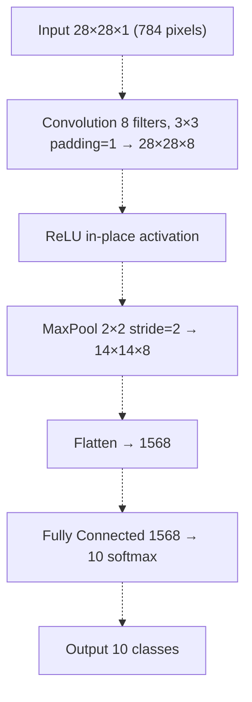

**Architecture Parameters:**

| Component | Parameters | Output Shape | Details |
| --- | --- | --- | --- |
| Input | - | 28×28×1 | Normalized to [0,1] |
| Convolution | 8×(3×3) + 8 biases = 80 params | 28×28×8 | Zero padding preserves spatial dimensions |
| ReLU | - | 28×28×8 | Element-wise activation |
| MaxPool | - | 14×14×8 | Reduces spatial resolution by 2× |
| Fully Connected | 1568×10 + 10 biases = 15,690 params | 10 | Classification layer |
| **Total** | **15,770 parameters** | - | ~16K params vs ~406K in MLP |

**Sources:** README.md

 [mnist_cnn.swift L16-L33](https://github.com/ThalesMMS/Swift-Neural-Networks/blob/3a1c4fc2/mnist_cnn.swift#L16-L33)

---

## Implementation Approach

### CPU-Only Design Philosophy

The CNN implementation prioritizes simplicity and educational clarity over performance:

* **No External Dependencies:** Uses only Foundation and Darwin standard libraries
* **Explicit Loops:** All operations implemented as readable nested loops rather than optimized BLAS calls
* **Fixed Architecture:** No command-line configuration options (unlike `mnist_mlp.swift`)
* **Single Backend:** CPU execution only, no MPS/MPSGraph acceleration paths

This design makes the code suitable for understanding CNN mechanics at a low level, though it sacrifices training speed compared to the GPU-accelerated MLP.

**Key Design Decisions:**

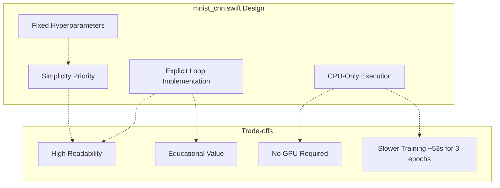

**Sources:** [mnist_cnn.swift L1-L14](https://github.com/ThalesMMS/Swift-Neural-Networks/blob/3a1c4fc2/mnist_cnn.swift#L1-L14)

 **Sources**: [Project overview and setup](https://github.com/ThalesMMS/Swift-Neural-Networks/blob/3a1c4fc2/README.md#L164-L176)

---

## Network Structure and Initialization

### Model Representation

The CNN parameters are stored in flat arrays for cache-friendly sequential access during forward and backward passes:

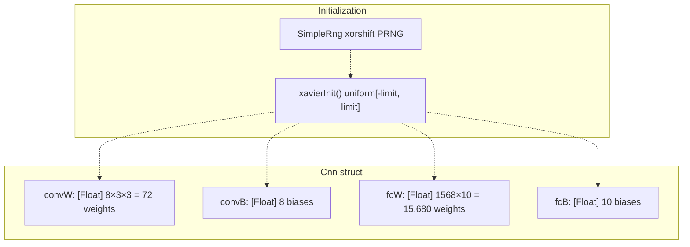

**Initialization Logic:**

The `initCnn()` function [mnist_cnn.swift L189-L205](https://github.com/ThalesMMS/Swift-Neural-Networks/blob/3a1c4fc2/mnist_cnn.swift#L189-L205)

 uses Xavier/Glorot uniform initialization to prevent vanishing/exploding gradients:

* **Convolution Layer:** `limit = sqrt(6 / (fan_in + fan_out))` where `fan_in = 3×3 = 9`, `fan_out = 8×3×3 = 72`
* **FC Layer:** `limit = sqrt(6 / (1568 + 10))`
* **Biases:** Initialized to zero

The `SimpleRng` struct [mnist_cnn.swift L40-L73](https://github.com/ThalesMMS/Swift-Neural-Networks/blob/3a1c4fc2/mnist_cnn.swift#L40-L73)

 provides a reproducible xorshift random number generator seeded with `reseedFromTime()` for weight initialization and dataset shuffling.

**Sources:** [mnist_cnn.swift L173-L205](https://github.com/ThalesMMS/Swift-Neural-Networks/blob/3a1c4fc2/mnist_cnn.swift#L173-L205)

 [mnist_cnn.swift L40-L73](https://github.com/ThalesMMS/Swift-Neural-Networks/blob/3a1c4fc2/mnist_cnn.swift#L40-L73)

---

## Forward Pass Implementation

### Convolution with Zero Padding

The `convForwardRelu()` function [mnist_cnn.swift L209-L241](https://github.com/ThalesMMS/Swift-Neural-Networks/blob/3a1c4fc2/mnist_cnn.swift#L209-L241)

 implements 2D convolution with zero padding and ReLU activation in a single pass:

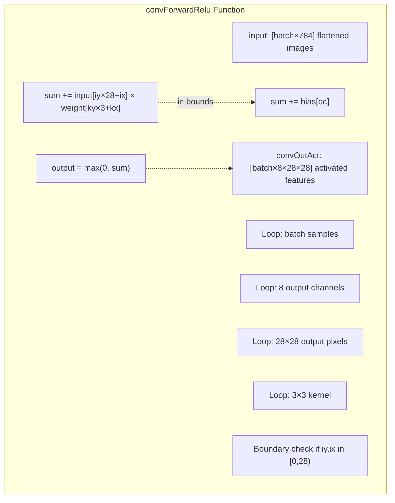

**Implementation Details:**

| Aspect | Implementation |
| --- | --- |
| Padding Strategy | Zero padding (`pad=1`) applied via boundary checks in inner loop |
| Kernel Indexing | `wBase + ky * kernel + kx` for 3×3 weights per filter |
| Spatial Indexing | `oy * imgW + ox` for row-major output access |
| Activation | ReLU applied in-place: `(sum > 0) ? sum : 0` |
| Memory Layout | Contiguous: `[batch][output_channel][height][width]` |

**Sources:** [mnist_cnn.swift L207-L241](https://github.com/ThalesMMS/Swift-Neural-Networks/blob/3a1c4fc2/mnist_cnn.swift#L207-L241)

---

### Max Pooling with Argmax Tracking

The `maxPoolForward()` function [mnist_cnn.swift L244-L286](https://github.com/ThalesMMS/Swift-Neural-Networks/blob/3a1c4fc2/mnist_cnn.swift#L244-L286)

 reduces spatial dimensions by 2× while storing argmax indices for backward pass gradient routing:

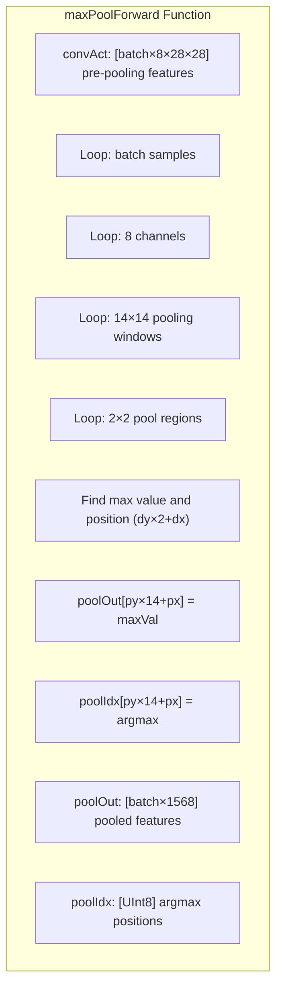

**Argmax Encoding:**

Each 2×2 pooling window produces one output value and one index `(dy, dx) → dy×2 + dx ∈ {0,1,2,3}`. This index is stored as `UInt8` and used during backpropagation to route gradients only to the max-activated neuron in each window.

**Sources:** [mnist_cnn.swift L244-L286](https://github.com/ThalesMMS/Swift-Neural-Networks/blob/3a1c4fc2/mnist_cnn.swift#L244-L286)

---

### Fully Connected Layer

The `fcForward()` function [mnist_cnn.swift L288-L302](https://github.com/ThalesMMS/Swift-Neural-Networks/blob/3a1c4fc2/mnist_cnn.swift#L288-L302)

 implements the classification layer as a matrix multiplication followed by bias addition:

**Operation:** `logits[b,j] = Σᵢ poolOut[b,i] × fcW[i,j] + fcB[j]`

This produces raw logits for each of the 10 digit classes, which are later converted to probabilities via softmax during loss computation.

**Sources:** [mnist_cnn.swift L288-L302](https://github.com/ThalesMMS/Swift-Neural-Networks/blob/3a1c4fc2/mnist_cnn.swift#L288-L302)

---

## Backward Pass and Gradient Computation

### Softmax Cross-Entropy Gradient

The `softmaxXentBackward()` function [mnist_cnn.swift L305-L329](https://github.com/ThalesMMS/Swift-Neural-Networks/blob/3a1c4fc2/mnist_cnn.swift#L305-L329)

 combines three operations:

1. **Softmax:** Convert logits to probabilities via stable softmax [mnist_cnn.swift L157-L170](https://github.com/ThalesMMS/Swift-Neural-Networks/blob/3a1c4fc2/mnist_cnn.swift#L157-L170)
2. **Cross-Entropy Loss:** Compute `-log(p[label])` for each sample
3. **Gradient:** Compute `delta[j] = (prob[j] - onehot[j]) × scale`

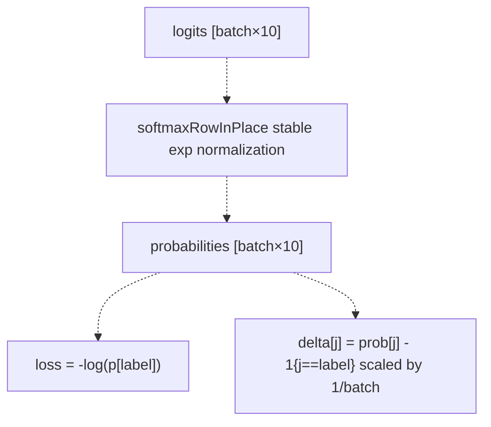

The gradient simplifies due to the softmax-cross-entropy combination: the derivative is simply the probability minus the one-hot label, scaled by batch size for averaging.

**Sources:** [mnist_cnn.swift L305-L329](https://github.com/ThalesMMS/Swift-Neural-Networks/blob/3a1c4fc2/mnist_cnn.swift#L305-L329)

 [mnist_cnn.swift L157-L170](https://github.com/ThalesMMS/Swift-Neural-Networks/blob/3a1c4fc2/mnist_cnn.swift#L157-L170)

---

### FC Layer Backpropagation

The `fcBackward()` function [mnist_cnn.swift L332-L366](https://github.com/ThalesMMS/Swift-Neural-Networks/blob/3a1c4fc2/mnist_cnn.swift#L332-L366)

 computes three quantities:

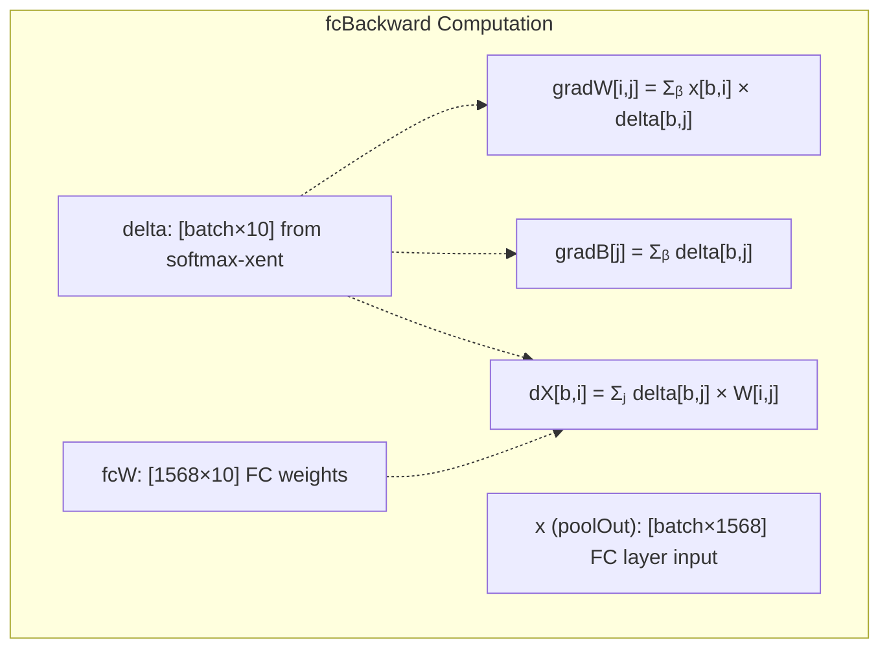

**Gradient Accumulation:**

* **Weight Gradients:** Outer product of inputs and deltas, accumulated over batch
* **Bias Gradients:** Sum of deltas over batch dimension
* **Input Gradients:** Delta backpropagated through weight matrix transpose

**Sources:** [mnist_cnn.swift L332-L366](https://github.com/ThalesMMS/Swift-Neural-Networks/blob/3a1c4fc2/mnist_cnn.swift#L332-L366)

---

### Max Pool Backpropagation

The `maxPoolBackwardRelu()` function [mnist_cnn.swift L369-L405](https://github.com/ThalesMMS/Swift-Neural-Networks/blob/3a1c4fc2/mnist_cnn.swift#L369-L405)

 scatters gradients from the pooled representation back to the pre-pool activations:

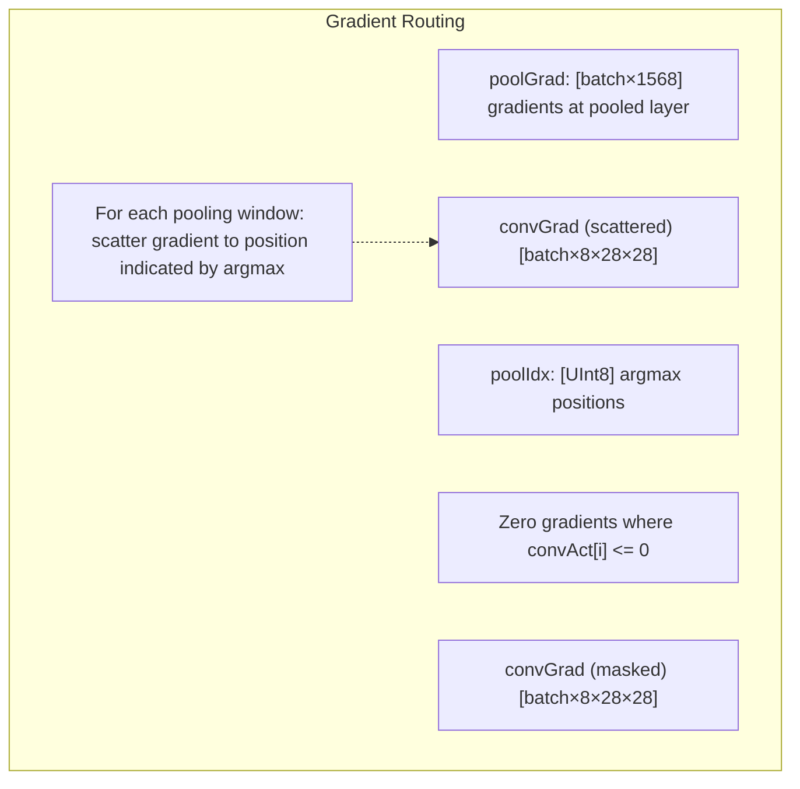

**Two-Stage Process:**

1. **Scatter:** Route gradients from 14×14 pooled features to 28×28 pre-pool features using argmax indices
2. **ReLU Mask:** Zero out gradients where the forward pass activation was non-positive

**Sources:** [mnist_cnn.swift L369-L405](https://github.com/ThalesMMS/Swift-Neural-Networks/blob/3a1c4fc2/mnist_cnn.swift#L369-L405)

---

### Convolution Backpropagation

The `convBackward()` function [mnist_cnn.swift L408-L442](https://github.com/ThalesMMS/Swift-Neural-Networks/blob/3a1c4fc2/mnist_cnn.swift#L408-L442)

 computes weight and bias gradients for the convolutional layer. Input gradients are not computed since convolution is the first layer.

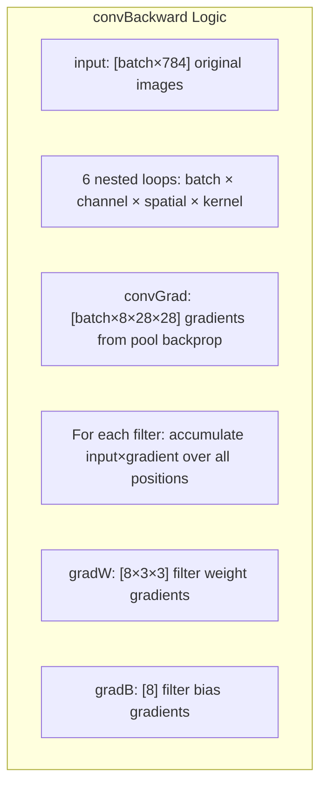

**Gradient Accumulation:**

For each output position `(oy, ox)` with gradient `g`:

* **Weight Gradient:** `gradW[oc,ky,kx] += g × input[iy,ix]` where `(iy,ix) = (oy+ky-pad, ox+kx-pad)`
* **Bias Gradient:** `gradB[oc] += g`

The function accounts for zero padding by checking boundary conditions before accumulating gradients.

**Sources:** [mnist_cnn.swift L408-L442](https://github.com/ThalesMMS/Swift-Neural-Networks/blob/3a1c4fc2/mnist_cnn.swift#L408-L442)

---

## Training Loop

### Training Configuration

The training process uses fixed hyperparameters defined at the top of [mnist_cnn.swift L35-L37](https://github.com/ThalesMMS/Swift-Neural-Networks/blob/3a1c4fc2/mnist_cnn.swift#L35-L37)

:

| Parameter | Value | Description |
| --- | --- | --- |
| `learningRate` | 0.01 | Fixed SGD learning rate |
| `epochs` | 3 | Number of training epochs |
| `batchSize` | 32 | Mini-batch size |

Unlike `mnist_mlp.swift`, there are no command-line options to override these values.

**Sources:** README.md

 [mnist_cnn.swift L35-L37](https://github.com/ThalesMMS/Swift-Neural-Networks/blob/3a1c4fc2/mnist_cnn.swift#L35-L37)

---

### Training Execution Flow

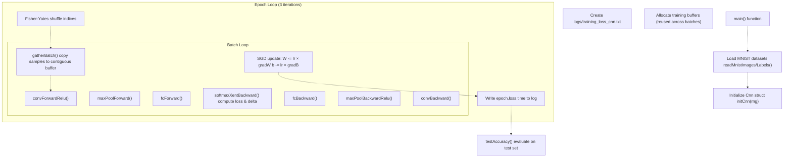

**Buffer Reuse Strategy:**

Training allocates all necessary buffers once [mnist_cnn.swift L504-L520](https://github.com/ThalesMMS/Swift-Neural-Networks/blob/3a1c4fc2/mnist_cnn.swift#L504-L520)

 and reuses them across batches to minimize memory allocations:

* `batchInputs`, `batchLabels`: Gathered mini-batch data
* `convAct`, `poolOut`, `poolIdx`, `logits`, `delta`: Forward pass activations
* `dPool`, `dConv`: Backward pass gradients
* `gradFcW`, `gradFcB`, `gradConvW`, `gradConvB`: Parameter gradients

**Sources:** [mnist_cnn.swift L485-L576](https://github.com/ThalesMMS/Swift-Neural-Networks/blob/3a1c4fc2/mnist_cnn.swift#L485-L576)

---

### Mini-Batch Processing

For each batch, the training loop [mnist_cnn.swift L536-L566](https://github.com/ThalesMMS/Swift-Neural-Networks/blob/3a1c4fc2/mnist_cnn.swift#L536-L566)

 performs:

1. **Gather:** Copy samples at shuffled indices into contiguous `batchInputs` array
2. **Forward Pass:** Sequential execution of conv → pool → FC layers
3. **Loss Computation:** Softmax cross-entropy with scaled gradient `delta`
4. **Backward Pass:** Reverse execution of gradients through FC → pool → conv
5. **Parameter Update:** Vanilla SGD with no momentum or weight decay

**SGD Update Formula:**

```
model.fcW[i] -= learningRate × gradFcW[i]
model.fcB[i] -= learningRate × gradFcB[i]
model.convW[i] -= learningRate × gradConvW[i]
model.convB[i] -= learningRate × gradConvB[i]
```

**Sources:** [mnist_cnn.swift L536-L566](https://github.com/ThalesMMS/Swift-Neural-Networks/blob/3a1c4fc2/mnist_cnn.swift#L536-L566)

---

## Testing and Evaluation

### Test Accuracy Computation

The `testAccuracy()` function [mnist_cnn.swift L445-L483](https://github.com/ThalesMMS/Swift-Neural-Networks/blob/3a1c4fc2/mnist_cnn.swift#L445-L483)

 evaluates the trained model on the test set by running forward passes in batches:

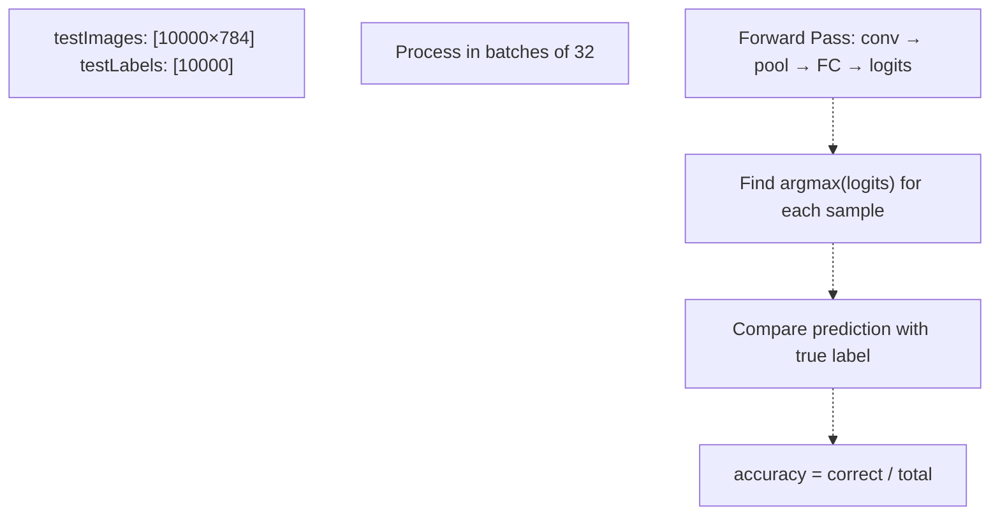

**Evaluation Process:**

1. Process test samples in mini-batches (same size as training)
2. Run forward pass to compute logits (no softmax needed for argmax)
3. Compare predicted class (argmax of logits) with ground truth label
4. Compute accuracy as percentage of correct predictions

The function reuses the same buffer allocations as training to avoid unnecessary memory operations.

**Sources:** [mnist_cnn.swift L445-L483](https://github.com/ThalesMMS/Swift-Neural-Networks/blob/3a1c4fc2/mnist_cnn.swift#L445-L483)

---

### Output Files and Logging

**Training Log Format:**

The CNN writes per-epoch metrics to `logs/training_loss_cnn.txt` [mnist_cnn.swift L498-L501](https://github.com/ThalesMMS/Swift-Neural-Networks/blob/3a1c4fc2/mnist_cnn.swift#L498-L501)

 in CSV format:

```
<epoch>,<average_loss>,<epoch_time_seconds>
```

Example:

```
1,0.234567,17.832
2,0.156234,17.691
3,0.123456,17.698
```

**Console Output:**

The training process prints:

* Dataset loading confirmation
* Per-epoch loss and timing
* Final test accuracy

Example output **Sources**: [Project overview and setup](https://github.com/ThalesMMS/Swift-Neural-Networks/blob/3a1c4fc2/README.md#L172-L172)

:

```
Epoch 3 | loss=0.123456 | time=17.698s
Testing...
Test Accuracy: 92.35%
```

**Sources:** [mnist_cnn.swift L498-L501](https://github.com/ThalesMMS/Swift-Neural-Networks/blob/3a1c4fc2/mnist_cnn.swift#L498-L501)

 [mnist_cnn.swift L570-L579](https://github.com/ThalesMMS/Swift-Neural-Networks/blob/3a1c4fc2/mnist_cnn.swift#L570-L579)

 **Sources**: [Project overview and setup](https://github.com/ThalesMMS/Swift-Neural-Networks/blob/3a1c4fc2/README.md#L172-L172)

---

## Performance Characteristics

### Training Performance

Based on benchmark results **Sources**: [Project overview and setup](https://github.com/ThalesMMS/Swift-Neural-Networks/blob/3a1c4fc2/README.md#L172-L172)

:

| Metric | Value | Notes |
| --- | --- | --- |
| Training Time | 53.21 seconds | 3 epochs, CPU-only |
| Time per Epoch | ~17.7 seconds | Including forward/backward passes |
| Test Accuracy | 92.35% | On 10,000 test samples |
| Parameters | 15,770 | ~97% fewer than MLP (406K) |

**Performance Bottlenecks:**

1. **Explicit Loops:** The 6-level nested loop in `convForwardRelu()` [mnist_cnn.swift L211-L240](https://github.com/ThalesMMS/Swift-Neural-Networks/blob/3a1c4fc2/mnist_cnn.swift#L211-L240)  is not vectorized
2. **No SIMD:** Element-wise operations use scalar arithmetic rather than SIMD instructions
3. **No GPU:** All computations run on CPU without Metal acceleration
4. **Memory Access Patterns:** Non-contiguous memory access during convolution may cause cache misses

**Sources:** [Project overview and setup](https://github.com/ThalesMMS/Swift-Neural-Networks/blob/3a1c4fc2/README.md#L172-L172)

 [mnist_cnn.swift L1-L14](https://github.com/ThalesMMS/Swift-Neural-Networks/blob/3a1c4fc2/mnist_cnn.swift#L1-L14)

---

### Comparison with MLP Implementation

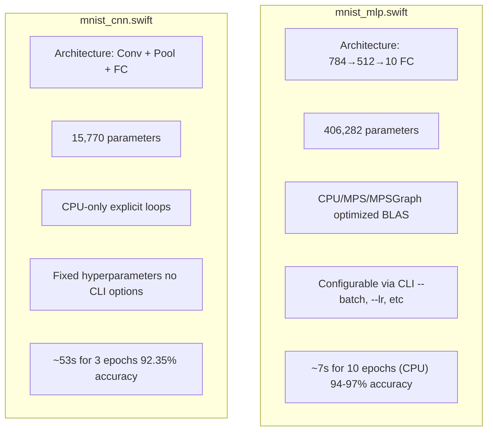

**Key Differences:**

| Aspect | CNN | MLP |
| --- | --- | --- |
| **Architecture** | Convolutional layers with spatial inductive bias | Fully connected with no spatial awareness |
| **Parameter Count** | 15,770 | 406,282 |
| **Acceleration** | CPU-only | CPU/MPS/MPSGraph options |
| **Configurability** | Fixed | CLI flags for all hyperparameters |
| **Code Complexity** | ~580 lines | ~2,220 lines |
| **Training Speed** | Slower (explicit loops) | Faster (optimized BLAS/GPU) |
| **Educational Value** | High (transparent operations) | Medium (abstracted backends) |

**Sources:** README.md

 **Sources**: [Project overview and setup](https://github.com/ThalesMMS/Swift-Neural-Networks/blob/3a1c4fc2/README.md#L165-L176)

 [mnist_cnn.swift](https://github.com/ThalesMMS/Swift-Neural-Networks/blob/3a1c4fc2/mnist_cnn.swift)

 [mnist_mlp.swift](https://github.com/ThalesMMS/Swift-Neural-Networks/blob/3a1c4fc2/mnist_mlp.swift)

---

## Code Organization

### File Structure

The entire CNN implementation resides in a single file [mnist_cnn.swift](https://github.com/ThalesMMS/Swift-Neural-Networks/blob/3a1c4fc2/mnist_cnn.swift)

 with clear functional organization:

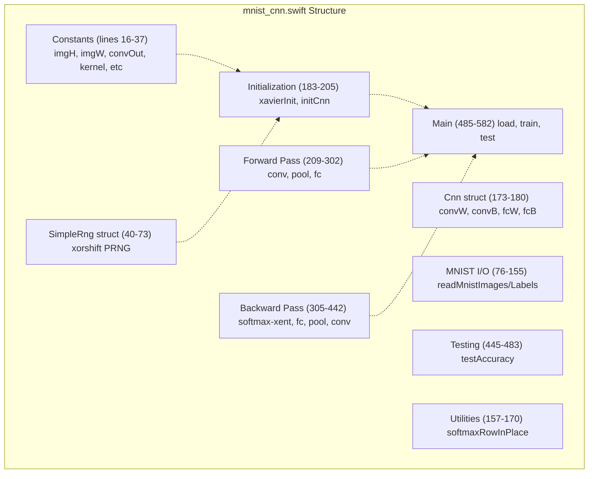

**Function Reference:**

| Function | Lines | Purpose |
| --- | --- | --- |
| `readMnistImages` | 76-121 | Parse IDX3 format, normalize to [0,1] |
| `readMnistLabels` | 124-155 | Parse IDX1 format, read labels 0-9 |
| `initCnn` | 189-205 | Initialize CNN with Xavier weights |
| `convForwardRelu` | 209-241 | Convolution + ReLU activation |
| `maxPoolForward` | 244-286 | 2×2 max pooling with argmax |
| `fcForward` | 288-302 | Fully connected layer |
| `softmaxXentBackward` | 305-329 | Combined loss and gradient |
| `fcBackward` | 332-366 | FC layer gradients |
| `maxPoolBackwardRelu` | 369-405 | Pool + ReLU gradients |
| `convBackward` | 408-442 | Convolution gradients |
| `testAccuracy` | 445-483 | Evaluate model on test set |
| `main` | 485-582 | Training orchestration |

**Sources:** [mnist_cnn.swift L1-L583](https://github.com/ThalesMMS/Swift-Neural-Networks/blob/3a1c4fc2/mnist_cnn.swift#L1-L583)

---

## Usage and Execution

### Building and Running

**Compilation:**

```
swiftc -O mnist_cnn.swift -o mnist_cnn_swift
```

The `-O` flag enables Swift compiler optimizations, which are essential for reasonable performance given the explicit loop-based implementation.

**Execution:**

```
./mnist_cnn_swift
```

No command-line arguments are supported. All hyperparameters are fixed in the source code.

**Prerequisites:**

* MNIST dataset files in `./data/`: * `train-images.idx3-ubyte` * `train-labels.idx1-ubyte` * `t10k-images.idx3-ubyte` * `t10k-labels.idx1-ubyte`
* Writable `./logs/` directory (created automatically if missing)

**Sources:** [Project overview and setup](https://github.com/ThalesMMS/Swift-Neural-Networks/blob/3a1c4fc2/README.md#L106-L126)

 [mnist_cnn.swift L3-L7](https://github.com/ThalesMMS/Swift-Neural-Networks/blob/3a1c4fc2/mnist_cnn.swift#L3-L7)

---

## Relationship to Other Components

This CNN implementation exists as part of a larger ecosystem of MNIST training systems:

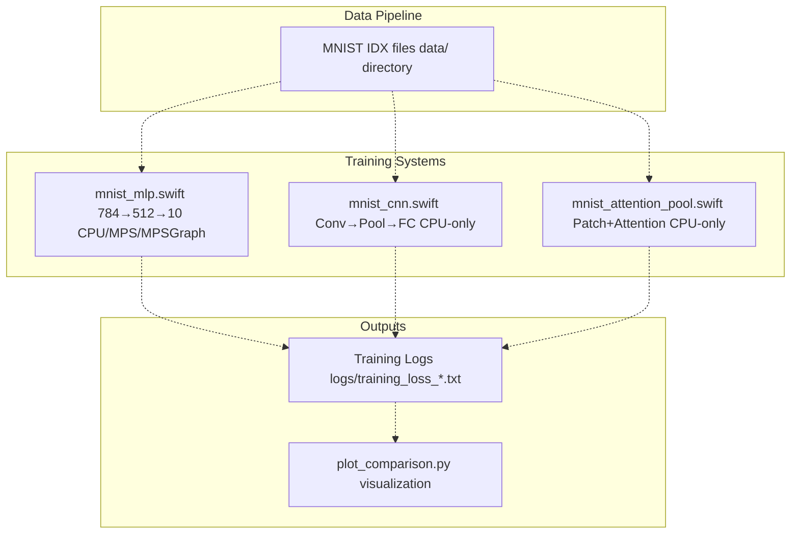

**Integration Points:**

* **Shared Data Format:** All three implementations read the same IDX files via similar parsing logic
* **Shared Log Format:** CSV logs with `epoch,loss,time` structure for consistent analysis
* **Independent Execution:** Each implementation is standalone without shared code dependencies

For details on the other implementations, see:

* [MNIST MLP Implementation](4a%20MNIST-MLP-Implementation.md) - Multi-backend fully connected network
* [Attention Model Implementation](4c%20Attention-Model-Implementation.md) - Transformer-style self-attention
* [Training Visualization](6a%20Training-Visualization.md) - Log analysis and plotting

**Sources:** README.md

 **Sources**: [Project overview and setup](https://github.com/ThalesMMS/Swift-Neural-Networks/blob/3a1c4fc2/README.md#L192-L198)


### On this page

* [MNIST CNN Implementation](#4.2-mnist-cnn-implementation)
* [Purpose and Scope](#4.2-purpose-and-scope)
* [Architecture Overview](#4.2-architecture-overview)
* [Network Topology](#4.2-network-topology)
* [Implementation Approach](#4.2-implementation-approach)
* [CPU-Only Design Philosophy](#4.2-cpu-only-design-philosophy)
* [Network Structure and Initialization](#4.2-network-structure-and-initialization)
* [Model Representation](#4.2-model-representation)
* [Forward Pass Implementation](#4.2-forward-pass-implementation)
* [Convolution with Zero Padding](#4.2-convolution-with-zero-padding)
* [Max Pooling with Argmax Tracking](#4.2-max-pooling-with-argmax-tracking)
* [Fully Connected Layer](#4.2-fully-connected-layer)
* [Backward Pass and Gradient Computation](#4.2-backward-pass-and-gradient-computation)
* [Softmax Cross-Entropy Gradient](#4.2-softmax-cross-entropy-gradient)
* [FC Layer Backpropagation](#4.2-fc-layer-backpropagation)
* [Max Pool Backpropagation](#4.2-max-pool-backpropagation)
* [Convolution Backpropagation](#4.2-convolution-backpropagation)
* [Training Loop](#4.2-training-loop)
* [Training Configuration](#4.2-training-configuration)
* [Training Execution Flow](#4.2-training-execution-flow)
* [Mini-Batch Processing](#4.2-mini-batch-processing)
* [Testing and Evaluation](#4.2-testing-and-evaluation)
* [Test Accuracy Computation](#4.2-test-accuracy-computation)
* [Output Files and Logging](#4.2-output-files-and-logging)
* [Performance Characteristics](#4.2-performance-characteristics)
* [Training Performance](#4.2-training-performance)
* [Comparison with MLP Implementation](#4.2-comparison-with-mlp-implementation)
* [Code Organization](#4.2-code-organization)
* [File Structure](#4.2-file-structure)
* [Usage and Execution](#4.2-usage-and-execution)
* [Building and Running](#4.2-building-and-running)
* [Relationship to Other Components](#4.2-relationship-to-other-components)

Ask Devin about Swift-Neural-Networks