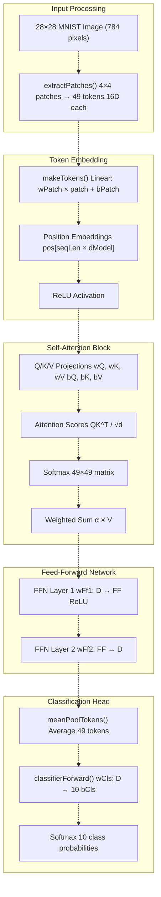
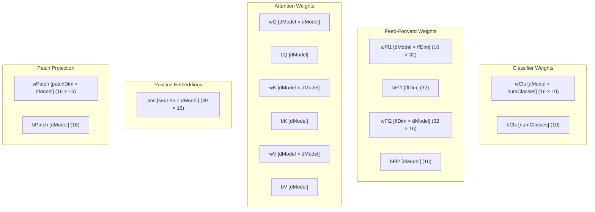
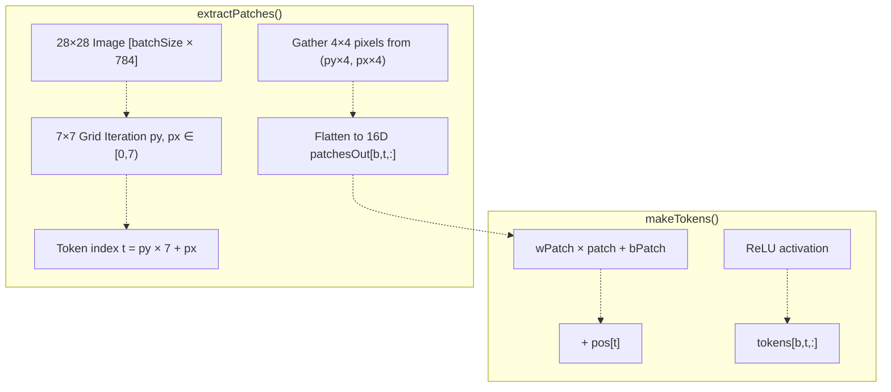
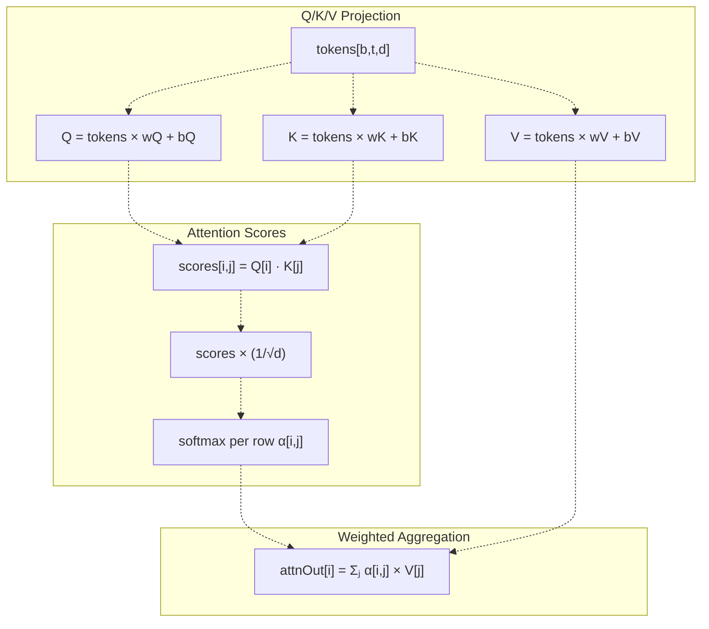
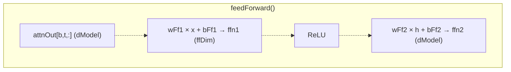
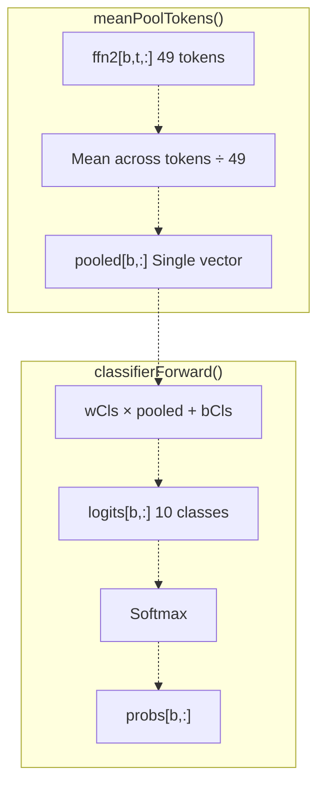
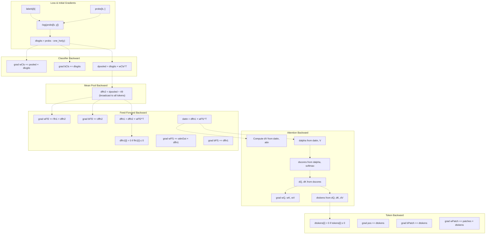
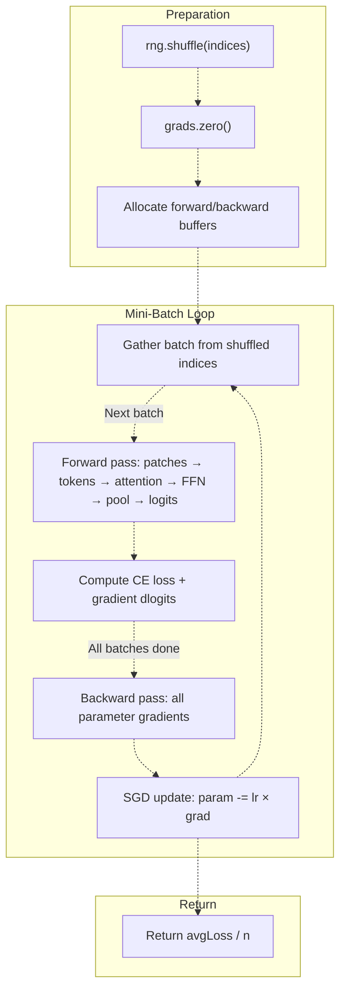
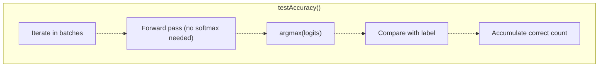
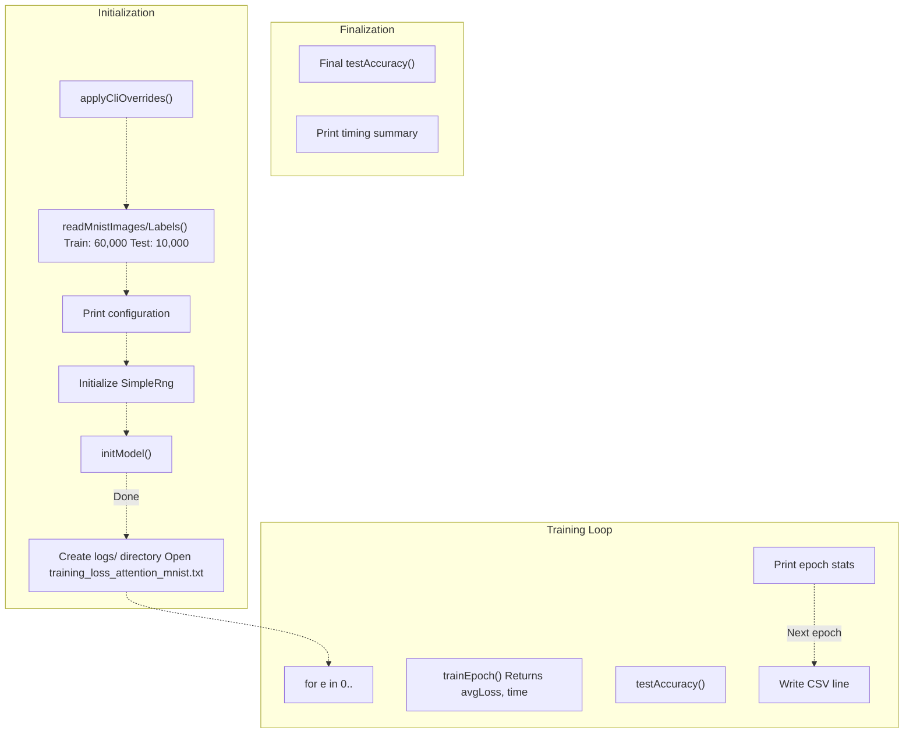

# Attention Model Implementation

> **Relevant source files**
> * [README.md](https://github.com/ThalesMMS/Swift-Neural-Networks/blob/3a1c4fc2/README.md)
> * [mnist_attention_pool.swift](https://github.com/ThalesMMS/Swift-Neural-Networks/blob/3a1c4fc2/mnist_attention_pool.swift)

## Purpose and Scope

This document describes the Transformer-style self-attention model implementation for MNIST digit classification located in [mnist_attention_pool.swift](https://github.com/ThalesMMS/Swift-Neural-Networks/blob/3a1c4fc2/mnist_attention_pool.swift)

 This is an educational implementation demonstrating single-head self-attention with patch tokenization, position embeddings, feed-forward networks, and mean pooling. The model operates on CPU only and uses pure Swift with manual gradient computation.

For information about other MNIST training systems, see [Training Systems](4%20Training-Systems.md). For GPU-accelerated implementations, see [MNIST MLP Implementation](4a%20MNIST-MLP-Implementation.md).

**Sources:** README.md

 [mnist_attention_pool.swift L1-L16](https://github.com/ThalesMMS/Swift-Neural-Networks/blob/3a1c4fc2/mnist_attention_pool.swift#L1-L16)

---

## Architecture Overview

The attention model follows a Transformer-inspired architecture adapted for vision tasks. Images are decomposed into spatial patches, each patch is projected into a token embedding, self-attention computes relationships between tokens, a feed-forward network processes each token, and mean pooling aggregates tokens into a single classification vector.

### High-Level Architecture Flow



**Sources:** [mnist_attention_pool.swift L1-L16](https://github.com/ThalesMMS/Swift-Neural-Networks/blob/3a1c4fc2/mnist_attention_pool.swift#L1-L16)

 README.md

---

## Model Constants and Hyperparameters

The model uses fixed architectural constants and configurable training hyperparameters.

| Constant | Value | Description | Code Reference |
| --- | --- | --- | --- |
| `imgH` | 28 | Image height | [mnist_attention_pool.swift L26](https://github.com/ThalesMMS/Swift-Neural-Networks/blob/3a1c4fc2/mnist_attention_pool.swift#L26-L26) |
| `imgW` | 28 | Image width | [mnist_attention_pool.swift L27](https://github.com/ThalesMMS/Swift-Neural-Networks/blob/3a1c4fc2/mnist_attention_pool.swift#L27-L27) |
| `patch` | 4 | Patch size (4×4) | [mnist_attention_pool.swift L32](https://github.com/ThalesMMS/Swift-Neural-Networks/blob/3a1c4fc2/mnist_attention_pool.swift#L32-L32) |
| `grid` | 7 | Patches per dimension (28/4) | [mnist_attention_pool.swift L33](https://github.com/ThalesMMS/Swift-Neural-Networks/blob/3a1c4fc2/mnist_attention_pool.swift#L33-L33) |
| `seqLen` | 49 | Total tokens (7×7) | [mnist_attention_pool.swift L34](https://github.com/ThalesMMS/Swift-Neural-Networks/blob/3a1c4fc2/mnist_attention_pool.swift#L34-L34) |
| `patchDim` | 16 | Flattened patch dimension (4×4) | [mnist_attention_pool.swift L35](https://github.com/ThalesMMS/Swift-Neural-Networks/blob/3a1c4fc2/mnist_attention_pool.swift#L35-L35) |
| `dModel` | 16 | Token embedding dimension | [mnist_attention_pool.swift L36](https://github.com/ThalesMMS/Swift-Neural-Networks/blob/3a1c4fc2/mnist_attention_pool.swift#L36-L36) |
| `ffDim` | 32 | Feed-forward hidden dimension | [mnist_attention_pool.swift L37](https://github.com/ThalesMMS/Swift-Neural-Networks/blob/3a1c4fc2/mnist_attention_pool.swift#L37-L37) |
| `numClasses` | 10 | Output classes | [mnist_attention_pool.swift L29](https://github.com/ThalesMMS/Swift-Neural-Networks/blob/3a1c4fc2/mnist_attention_pool.swift#L29-L29) |

| Hyperparameter | Default | Description | CLI Flag |
| --- | --- | --- | --- |
| `learningRate` | 0.01 | SGD learning rate | `--lr` |
| `epochs` | 5 | Training epochs | `--epochs` |
| `batchSize` | 32 | Mini-batch size | `--batch` |
| `rngSeed` | 1 | Random seed | `--seed` |

**Sources:** [mnist_attention_pool.swift L26-L47](https://github.com/ThalesMMS/Swift-Neural-Networks/blob/3a1c4fc2/mnist_attention_pool.swift#L26-L47)

 README.md

---

## Model Structure

### AttnModel Parameters

The `AttnModel` struct stores all trainable parameters as flat Float arrays in row-major order.



The `Grads` struct mirrors this structure for storing gradients during backpropagation.

**Sources:** [mnist_attention_pool.swift L196-L212](https://github.com/ThalesMMS/Swift-Neural-Networks/blob/3a1c4fc2/mnist_attention_pool.swift#L196-L212)

 [mnist_attention_pool.swift L214-L266](https://github.com/ThalesMMS/Swift-Neural-Networks/blob/3a1c4fc2/mnist_attention_pool.swift#L214-L266)

---

## Weight Initialization

Weights are initialized using Xavier/Glorot initialization to maintain variance across layers.

| Parameter Group | Initialization | Limit Calculation |
| --- | --- | --- |
| `wPatch` | Xavier uniform | `√(6 / (patchDim + dModel))` |
| `bPatch` | Zero | - |
| `pos` | Uniform[-0.1, 0.1] | Fixed scale |
| `wQ, wK, wV` | Xavier uniform | `√(6 / (dModel + dModel))` |
| `bQ, bK, bV` | Zero | - |
| `wFf1` | Xavier uniform | `√(6 / (dModel + ffDim))` |
| `bFf1` | Zero | - |
| `wFf2` | Xavier uniform | `√(6 / (ffDim + dModel))` |
| `bFf2` | Zero | - |
| `wCls` | Xavier uniform | `√(6 / (dModel + numClasses))` |
| `bCls` | Zero | - |

**Sources:** [mnist_attention_pool.swift L268-L323](https://github.com/ThalesMMS/Swift-Neural-Networks/blob/3a1c4fc2/mnist_attention_pool.swift#L268-L323)

---

## Forward Pass Pipeline

### Patch Extraction and Token Embedding



**Implementation Details:**

* [extractPatches L326-L346](https://github.com/ThalesMMS/Swift-Neural-Networks/blob/3a1c4fc2/extractPatches()#L326-L346)  - Iterates over 7×7 grid, extracts 4×4 pixel windows
* [makeTokens L348-L366](https://github.com/ThalesMMS/Swift-Neural-Networks/blob/3a1c4fc2/makeTokens()#L348-L366)  - Linear projection + position embeddings + ReLU per token

**Sources:** [mnist_attention_pool.swift L326-L366](https://github.com/ThalesMMS/Swift-Neural-Networks/blob/3a1c4fc2/mnist_attention_pool.swift#L326-L366)

### Self-Attention Computation

The attention mechanism computes relationships between all pairs of tokens using scaled dot-product attention.



**Implementation:** [selfAttention L368-L427](https://github.com/ThalesMMS/Swift-Neural-Networks/blob/3a1c4fc2/selfAttention()#L368-L427)

The function performs:

1. **Q/K/V projection** [mnist_attention_pool.swift L381-L399](https://github.com/ThalesMMS/Swift-Neural-Networks/blob/3a1c4fc2/mnist_attention_pool.swift#L381-L399) : Linear transformations for each token
2. **Score computation** [mnist_attention_pool.swift L401-L413](https://github.com/ThalesMMS/Swift-Neural-Networks/blob/3a1c4fc2/mnist_attention_pool.swift#L401-L413) : Dot products between all query-key pairs, scaled by `1/√dModel`
3. **Softmax normalization** [mnist_attention_pool.swift L414](https://github.com/ThalesMMS/Swift-Neural-Networks/blob/3a1c4fc2/mnist_attention_pool.swift#L414) : Per-row softmax creates attention weights
4. **Value aggregation** [mnist_attention_pool.swift L416-L424](https://github.com/ThalesMMS/Swift-Neural-Networks/blob/3a1c4fc2/mnist_attention_pool.swift#L416-L424) : Weighted sum of values using attention weights

**Sources:** [mnist_attention_pool.swift L368-L427](https://github.com/ThalesMMS/Swift-Neural-Networks/blob/3a1c4fc2/mnist_attention_pool.swift#L368-L427)

### Feed-Forward Network

Each token independently passes through a two-layer MLP.



**Implementation:** [feedForward L429-L460](https://github.com/ThalesMMS/Swift-Neural-Networks/blob/3a1c4fc2/feedForward()#L429-L460)

* Layer 1 [mnist_attention_pool.swift L443-L448](https://github.com/ThalesMMS/Swift-Neural-Networks/blob/3a1c4fc2/mnist_attention_pool.swift#L443-L448) : Expands from `dModel=16` to `ffDim=32` with ReLU
* Layer 2 [mnist_attention_pool.swift L451-L456](https://github.com/ThalesMMS/Swift-Neural-Networks/blob/3a1c4fc2/mnist_attention_pool.swift#L451-L456) : Projects back to `dModel=16` (no activation)

**Sources:** [mnist_attention_pool.swift L429-L460](https://github.com/ThalesMMS/Swift-Neural-Networks/blob/3a1c4fc2/mnist_attention_pool.swift#L429-L460)

### Classification Head

Final stages aggregate tokens and produce class logits.



**Implementation:**

* [meanPoolTokens L462-L475](https://github.com/ThalesMMS/Swift-Neural-Networks/blob/3a1c4fc2/meanPoolTokens()#L462-L475)  - Averages 49 token vectors into single vector per sample
* [classifierForward L477-L492](https://github.com/ThalesMMS/Swift-Neural-Networks/blob/3a1c4fc2/classifierForward()#L477-L492)  - Linear projection to 10 classes + softmax

**Sources:** [mnist_attention_pool.swift L462-L492](https://github.com/ThalesMMS/Swift-Neural-Networks/blob/3a1c4fc2/mnist_attention_pool.swift#L462-L492)

---

## Backward Pass and Gradient Computation

The backward pass manually computes gradients for all parameters using chain rule. Gradients flow in reverse order through the architecture.

### Gradient Flow Architecture



**Sources:** [mnist_attention_pool.swift L576-L791](https://github.com/ThalesMMS/Swift-Neural-Networks/blob/3a1c4fc2/mnist_attention_pool.swift#L576-L791)

### Attention Backward Pass Detail

The attention mechanism backward pass is the most complex component, computing gradients through the softmax and dot products.

**Key Steps:**

1. **dV computation** [mnist_attention_pool.swift L684-L704](https://github.com/ThalesMMS/Swift-Neural-Networks/blob/3a1c4fc2/mnist_attention_pool.swift#L684-L704) : Gradient w.r.t. values from attention-weighted upstream gradient
2. **dalpha computation** [mnist_attention_pool.swift L689-L696](https://github.com/ThalesMMS/Swift-Neural-Networks/blob/3a1c4fc2/mnist_attention_pool.swift#L689-L696) : Gradient w.r.t. attention weights from dot product with V
3. **Softmax backward** [mnist_attention_pool.swift L706-L713](https://github.com/ThalesMMS/Swift-Neural-Networks/blob/3a1c4fc2/mnist_attention_pool.swift#L706-L713) : Converts dalpha to dscores accounting for softmax Jacobian
4. **dQ and dK computation** [mnist_attention_pool.swift L717-L732](https://github.com/ThalesMMS/Swift-Neural-Networks/blob/3a1c4fc2/mnist_attention_pool.swift#L717-L732) : Gradients w.r.t. queries and keys from scaled dot products
5. **Weight gradients** [mnist_attention_pool.swift L735-L761](https://github.com/ThalesMMS/Swift-Neural-Networks/blob/3a1c4fc2/mnist_attention_pool.swift#L735-L761) : Accumulate gradients for wQ, wK, wV, bQ, bK, bV
6. **dtokens accumulation** [mnist_attention_pool.swift L756-L760](https://github.com/ThalesMMS/Swift-Neural-Networks/blob/3a1c4fc2/mnist_attention_pool.swift#L756-L760) : Backprop to token embeddings

**Sources:** [mnist_attention_pool.swift L683-L763](https://github.com/ThalesMMS/Swift-Neural-Networks/blob/3a1c4fc2/mnist_attention_pool.swift#L683-L763)

---

## Training Loop Implementation

### Epoch Training Flow



**Function:** [trainEpoch L494-L814](https://github.com/ThalesMMS/Swift-Neural-Networks/blob/3a1c4fc2/trainEpoch()#L494-L814)

**Buffer Allocation** [lines 506-534](https://github.com/ThalesMMS/Swift-Neural-Networks/blob/3a1c4fc2/lines 506-534)

:
The function pre-allocates all forward and backward buffers to avoid per-batch memory allocation overhead:

* Forward: `patches`, `tokens`, `q`, `k`, `v`, `attn`, `attnOut`, `ffn1`, `ffn2`, `pooled`, `logits`, `probs`
* Backward: `dlogits`, `dpooled`, `dffn2`, `dffn1`, `dattn`, `dalpha`, `dscores`, `dQ`, `dK`, `dV`, `dtokens`

**Mini-Batch Processing** [lines 540-810](https://github.com/ThalesMMS/Swift-Neural-Networks/blob/3a1c4fc2/lines 540-810)

:

* Shuffle indices and iterate over dataset
* Handle variable-sized final batch
* Scale gradients by `1/batchSize` for proper averaging
* Accumulate cross-entropy loss

**SGD Update** [lines 793-808](https://github.com/ThalesMMS/Swift-Neural-Networks/blob/3a1c4fc2/lines 793-808)

:
Simple stochastic gradient descent without momentum or weight decay:

```
param[i] -= learningRate × grads.param[i]
```

**Sources:** [mnist_attention_pool.swift L494-L814](https://github.com/ThalesMMS/Swift-Neural-Networks/blob/3a1c4fc2/mnist_attention_pool.swift#L494-L814)

---

## Evaluation Function

The `testAccuracy()` function evaluates model performance on a dataset without computing gradients.



**Optimization:** The function computes only logits, not probabilities, since argmax is invariant to monotonic transformations like softmax [lines 851-860](https://github.com/ThalesMMS/Swift-Neural-Networks/blob/3a1c4fc2/lines 851-860)

**Sources:** [mnist_attention_pool.swift L816-L878](https://github.com/ThalesMMS/Swift-Neural-Networks/blob/3a1c4fc2/mnist_attention_pool.swift#L816-L878)

---

## Command-Line Interface

The program supports runtime configuration via command-line arguments.

| Flag | Type | Description | Validation |
| --- | --- | --- | --- |
| `--batch N` | Int | Mini-batch size | Must be > 0 |
| `--epochs N` | Int | Number of training epochs | Must be > 0 |
| `--lr F` | Float | Learning rate | Must be > 0 |
| `--seed N` | UInt64 | Random number seed | Any value |
| `--help` | - | Print usage and exit | - |

**Implementation:** [applyCliOverrides L880-L912](https://github.com/ThalesMMS/Swift-Neural-Networks/blob/3a1c4fc2/applyCliOverrides()#L880-L912)

The function parses `CommandLine.arguments` and validates each parameter before assignment.

**Sources:** [mnist_attention_pool.swift L880-L912](https://github.com/ThalesMMS/Swift-Neural-Networks/blob/3a1c4fc2/mnist_attention_pool.swift#L880-L912)

 **Sources**: [Project overview and setup](https://github.com/ThalesMMS/Swift-Neural-Networks/blob/3a1c4fc2/README.md#L153-L161)

---

## Main Execution Flow

The `main()` function orchestrates the complete training and evaluation pipeline.



**Sources:** [mnist_attention_pool.swift L914-L971](https://github.com/ThalesMMS/Swift-Neural-Networks/blob/3a1c4fc2/mnist_attention_pool.swift#L914-L971)

**Log Format** [lines 934-956](https://github.com/ThalesMMS/Swift-Neural-Networks/blob/3a1c4fc2/lines 934-956)

:
Each epoch writes a CSV line to `logs/training_loss_attention_mnist.txt`:

```
epoch,loss,time,test_accuracy
```

---

## Performance Characteristics

### Computational Complexity

| Operation | Complexity per Sample | Dominant Term |
| --- | --- | --- |
| Patch extraction | O(784) | Linear in pixels |
| Token embedding | O(49 × 16 × 16) | 12,544 ops |
| Q/K/V projection | O(3 × 49 × 16 × 16) | 37,632 ops |
| Attention scores | O(49 × 49 × 16) | 38,416 ops |
| Value aggregation | O(49 × 49 × 16) | 38,416 ops |
| Feed-forward | O(49 × (16×32 + 32×16)) | 50,176 ops |
| Classifier | O(16 × 10) | 160 ops |
| **Total forward** | **≈177K ops** | Attention + FFN dominate |

The backward pass has approximately 2-3× the computational cost of the forward pass due to gradient accumulation.

### Memory Footprint

For batch size `B=32`:

| Buffer | Shape | Elements | Bytes (Float) |
| --- | --- | --- | --- |
| `patches` | [32, 49, 16] | 25,088 | 100 KB |
| `tokens` | [32, 49, 16] | 25,088 | 100 KB |
| `q`, `k`, `v` | [32, 49, 16] × 3 | 75,264 | 301 KB |
| `attn` | [32, 49, 49] | 76,832 | 307 KB |
| `attnOut` | [32, 49, 16] | 25,088 | 100 KB |
| `ffn1` | [32, 49, 32] | 50,176 | 201 KB |
| `ffn2` | [32, 49, 16] | 25,088 | 100 KB |
| Backward buffers | Similar | ≈300K | ≈1.2 MB |
| **Total** | - | **≈600K** | **≈2.4 MB** |

**Sources:** [mnist_attention_pool.swift L506-L534](https://github.com/ThalesMMS/Swift-Neural-Networks/blob/3a1c4fc2/mnist_attention_pool.swift#L506-L534)

### Benchmark Results

From README.md benchmarks:

| Metric | Value | Notes |
| --- | --- | --- |
| Training time | 101.71s | 5 epochs, batch=32 |
| Time per epoch | ≈20.3s | Average |
| Test accuracy | 24.53% | Undertrained |
| Parameters | ≈5K | Minimal architecture |

The low accuracy (24.53% vs. 10% random) suggests the model requires:

* Higher `dModel` (e.g., 64 or 128)
* More epochs (e.g., 20-50)
* Lower learning rate (e.g., 0.001)
* Possible architecture changes (multiple attention heads, residual connections)

**Sources:** [Project overview and setup](https://github.com/ThalesMMS/Swift-Neural-Networks/blob/3a1c4fc2/README.md#L169-L176)

---

## Code Entity Reference

### Primary Functions

| Function | Lines | Purpose |
| --- | --- | --- |
| `extractPatches()` | 326-346 | Convert images to patch tokens |
| `makeTokens()` | 348-366 | Token embedding with position |
| `selfAttention()` | 368-427 | Q/K/V attention mechanism |
| `feedForward()` | 429-460 | Per-token MLP |
| `meanPoolTokens()` | 462-475 | Aggregate tokens |
| `classifierForward()` | 477-492 | Final classification |
| `trainEpoch()` | 494-814 | Mini-batch training loop |
| `testAccuracy()` | 816-878 | Evaluate on dataset |
| `initModel()` | 268-323 | Xavier initialization |
| `main()` | 914-971 | Program entry point |

### Data Structures

| Struct | Lines | Description |
| --- | --- | --- |
| `AttnModel` | 196-212 | All trainable parameters |
| `Grads` | 214-266 | Gradient storage mirror |
| `SimpleRng` | 50-89 | Xorshift PRNG |

**Sources:** [mnist_attention_pool.swift L1-L971](https://github.com/ThalesMMS/Swift-Neural-Networks/blob/3a1c4fc2/mnist_attention_pool.swift#L1-L971)


### On this page

* [Attention Model Implementation](#4.3-attention-model-implementation)
* [Purpose and Scope](#4.3-purpose-and-scope)
* [Architecture Overview](#4.3-architecture-overview)
* [High-Level Architecture Flow](#4.3-high-level-architecture-flow)
* [Model Constants and Hyperparameters](#4.3-model-constants-and-hyperparameters)
* [Model Structure](#4.3-model-structure)
* [AttnModel Parameters](#4.3-attnmodel-parameters)
* [Weight Initialization](#4.3-weight-initialization)
* [Forward Pass Pipeline](#4.3-forward-pass-pipeline)
* [Patch Extraction and Token Embedding](#4.3-patch-extraction-and-token-embedding)
* [Self-Attention Computation](#4.3-self-attention-computation)
* [Feed-Forward Network](#4.3-feed-forward-network)
* [Classification Head](#4.3-classification-head)
* [Backward Pass and Gradient Computation](#4.3-backward-pass-and-gradient-computation)
* [Gradient Flow Architecture](#4.3-gradient-flow-architecture)
* [Attention Backward Pass Detail](#4.3-attention-backward-pass-detail)
* [Training Loop Implementation](#4.3-training-loop-implementation)
* [Epoch Training Flow](#4.3-epoch-training-flow)
* [Evaluation Function](#4.3-evaluation-function)
* [Command-Line Interface](#4.3-command-line-interface)
* [Main Execution Flow](#4.3-main-execution-flow)
* [Performance Characteristics](#4.3-performance-characteristics)
* [Computational Complexity](#4.3-computational-complexity)
* [Memory Footprint](#4.3-memory-footprint)
* [Benchmark Results](#4.3-benchmark-results)
* [Code Entity Reference](#4.3-code-entity-reference)
* [Primary Functions](#4.3-primary-functions)
* [Data Structures](#4.3-data-structures)

Ask Devin about Swift-Neural-Networks