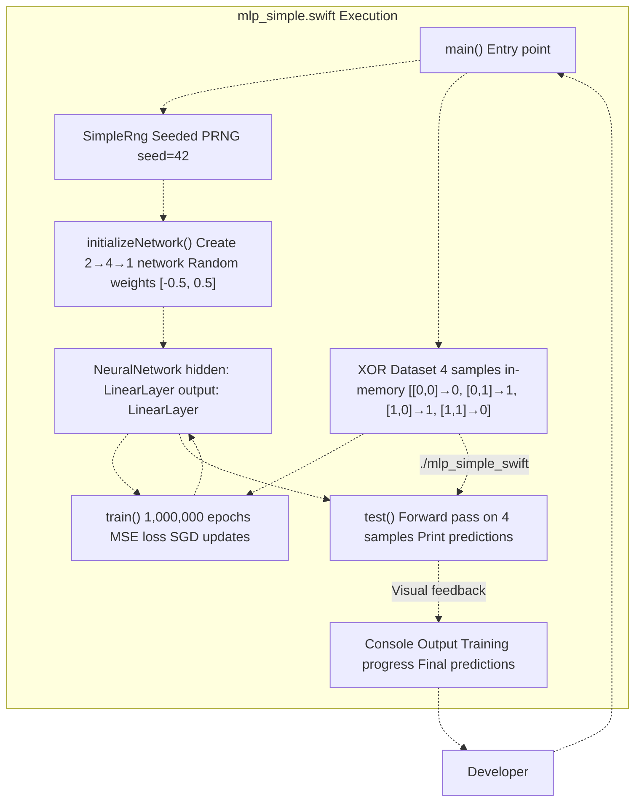
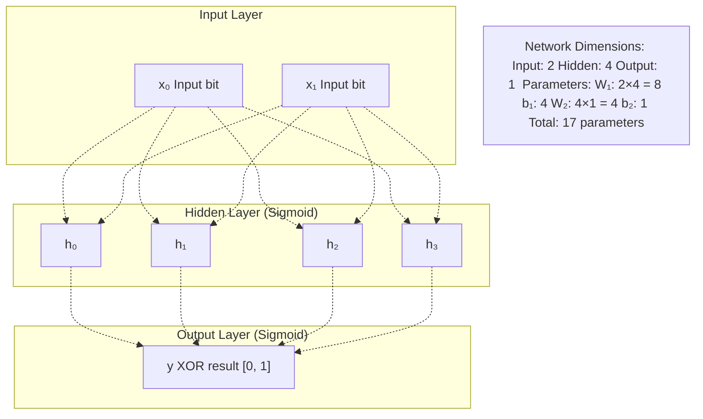
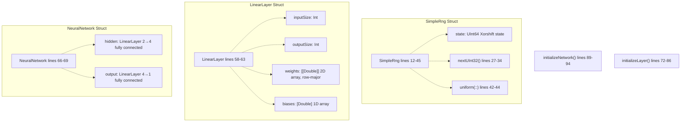
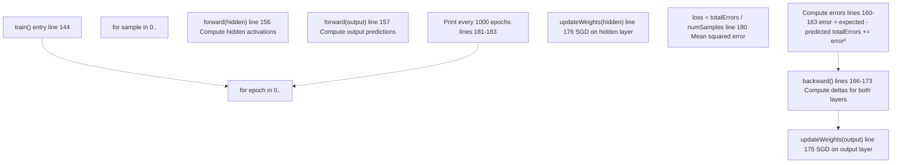
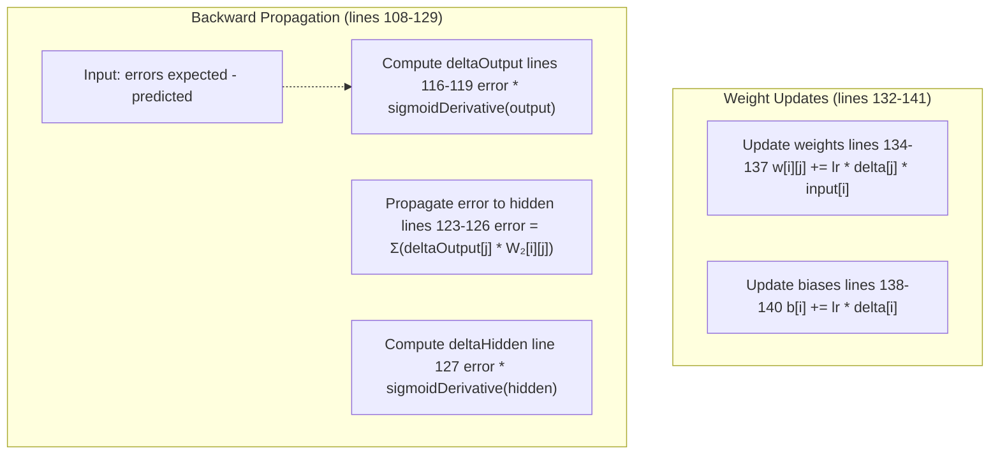
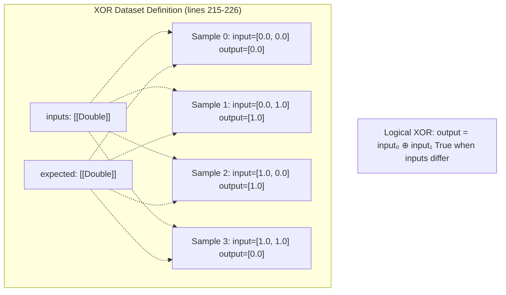
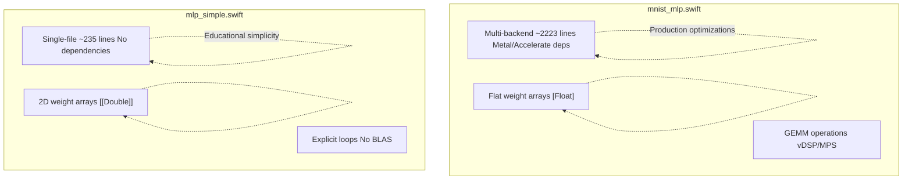

# Simple MLP (XOR Example)

> **Relevant source files**
> * [README.md](https://github.com/ThalesMMS/Swift-Neural-Networks/blob/3a1c4fc2/README.md)
> * [mlp_simple.swift](https://github.com/ThalesMMS/Swift-Neural-Networks/blob/3a1c4fc2/mlp_simple.swift)
> * [mnist_cnn.swift](https://github.com/ThalesMMS/Swift-Neural-Networks/blob/3a1c4fc2/mnist_cnn.swift)
> * [mnist_mlp.swift](https://github.com/ThalesMMS/Swift-Neural-Networks/blob/3a1c4fc2/mnist_mlp.swift)

## Purpose and Scope

This document covers the `mlp_simple.swift` implementation, a self-contained educational example that demonstrates fundamental multilayer perceptron (MLP) concepts using the XOR problem. Unlike the MNIST implementations ([MNIST MLP](4a%20MNIST-MLP-Implementation.md), [MNIST CNN](4b%20MNIST-CNN-Implementation.md), [MNIST Attention](4c%20Attention-Model-Implementation.md)), this toy example uses synthetic data, operates on a minimal 2→4→1 architecture, and trains for an extended number of epochs to illustrate convergence behavior on a non-linearly separable problem.

**Sources:** README.md

 [mlp_simple.swift L1-L235](https://github.com/ThalesMMS/Swift-Neural-Networks/blob/3a1c4fc2/mlp_simple.swift#L1-L235)

---

## System Overview

The XOR example is a standalone executable with no external dependencies beyond the Swift Foundation library. It generates its own training data, performs in-memory training, and evaluates the learned function—all within a single process.

### Self-Contained System Architecture



**Sources:** [mlp_simple.swift L210-L234](https://github.com/ThalesMMS/Swift-Neural-Networks/blob/3a1c4fc2/mlp_simple.swift#L210-L234)

 [mlp_simple.swift L144-L185](https://github.com/ThalesMMS/Swift-Neural-Networks/blob/3a1c4fc2/mlp_simple.swift#L144-L185)

 [mlp_simple.swift L188-L208](https://github.com/ThalesMMS/Swift-Neural-Networks/blob/3a1c4fc2/mlp_simple.swift#L188-L208)

---

## Network Architecture

The XOR network uses a classic two-layer architecture designed to learn a non-linearly separable Boolean function. Both layers use sigmoid activation, which was historically standard for this type of demonstration before ReLU became prevalent.

### Architecture Diagram



| Component | Size | Activation | Purpose |
| --- | --- | --- | --- |
| Input layer | 2 neurons | None | Binary inputs (0 or 1) |
| Hidden layer | 4 neurons | Sigmoid | Capture non-linear decision boundary |
| Output layer | 1 neuron | Sigmoid | Binary classification output |

**Sources:** README.md

 [mlp_simple.swift L4-L9](https://github.com/ThalesMMS/Swift-Neural-Networks/blob/3a1c4fc2/mlp_simple.swift#L4-L9)

 [mlp_simple.swift L89-L94](https://github.com/ThalesMMS/Swift-Neural-Networks/blob/3a1c4fc2/mlp_simple.swift#L89-L94)

---

## Core Data Structures

### Code Entity Mapping



**Sources:** [mlp_simple.swift L12-L45](https://github.com/ThalesMMS/Swift-Neural-Networks/blob/3a1c4fc2/mlp_simple.swift#L12-L45)

 [mlp_simple.swift L58-L63](https://github.com/ThalesMMS/Swift-Neural-Networks/blob/3a1c4fc2/mlp_simple.swift#L58-L63)

 [mlp_simple.swift L66-L69](https://github.com/ThalesMMS/Swift-Neural-Networks/blob/3a1c4fc2/mlp_simple.swift#L66-L69)

 [mlp_simple.swift L72-L94](https://github.com/ThalesMMS/Swift-Neural-Networks/blob/3a1c4fc2/mlp_simple.swift#L72-L94)

### Weight Initialization

Weights and biases are initialized using uniform random values in the range [-0.5, 0.5]. This initialization strategy, while simple, is sufficient for the small XOR problem.

```
Layer initialization (lines 72-86):
  For each weight: w[i][j] = uniform(-0.5, 0.5)
  For each bias: b[i] = uniform(-0.5, 0.5)
```

**Sources:** [mlp_simple.swift L72-L86](https://github.com/ThalesMMS/Swift-Neural-Networks/blob/3a1c4fc2/mlp_simple.swift#L72-L86)

---

## Training Process

### Training Loop Architecture



**Sources:** [mlp_simple.swift L144-L185](https://github.com/ThalesMMS/Swift-Neural-Networks/blob/3a1c4fc2/mlp_simple.swift#L144-L185)

### Hyperparameters

| Parameter | Value | Location | Description |
| --- | --- | --- | --- |
| `learningRate` | 0.01 | line 8 | SGD step size |
| `epochs` | 1,000,000 | line 9 | Number of training iterations |
| `numSamples` | 4 | line 7 | XOR truth table entries |
| Initial seed | 42 | line 212 | Fixed for reproducibility |

**Sources:** [mlp_simple.swift L4-L9](https://github.com/ThalesMMS/Swift-Neural-Networks/blob/3a1c4fc2/mlp_simple.swift#L4-L9)

 [mlp_simple.swift L212](https://github.com/ThalesMMS/Swift-Neural-Networks/blob/3a1c4fc2/mlp_simple.swift#L212-L212)

---

## Forward and Backward Propagation

### Forward Pass Implementation

The `forward()` function implements a single layer's forward pass using explicit loops:

```
forward(layer, inputs, outputs) at lines 97-105:
  For each output neuron i:
    activation = bias[i]
    For each input j:
      activation += input[j] * weight[j][i]
    output[i] = sigmoid(activation)
```

The sigmoid activation function is defined as:

* `sigmoid(x) = 1.0 / (1.0 + exp(-x))` (line 49)
* `sigmoidDerivative(x) = x * (1.0 - x)` where x is already sigmoid(z) (line 54)

**Sources:** [mlp_simple.swift L48-L55](https://github.com/ThalesMMS/Swift-Neural-Networks/blob/3a1c4fc2/mlp_simple.swift#L48-L55)

 [mlp_simple.swift L97-L105](https://github.com/ThalesMMS/Swift-Neural-Networks/blob/3a1c4fc2/mlp_simple.swift#L97-L105)

### Backward Pass Flow



**Sources:** [mlp_simple.swift L108-L141](https://github.com/ThalesMMS/Swift-Neural-Networks/blob/3a1c4fc2/mlp_simple.swift#L108-L141)

### Gradient Computation Details

The backpropagation algorithm computes gradients layer-by-layer:

1. **Output layer delta** (lines 116-119): * For each output neuron: `δ_out = error × σ'(output)` * Uses sigmoid derivative for the gradient
2. **Hidden layer error propagation** (lines 123-126): * Backpropagate through weights: `error_hidden = Σ(δ_out × W₂)` * Implements chain rule for multi-layer network
3. **Hidden layer delta** (line 127): * For each hidden neuron: `δ_hidden = error_hidden × σ'(hidden)`
4. **Weight updates** (lines 134-137, 138-140): * Standard SGD: `W ← W + η × δ × input` * Bias update: `b ← b + η × δ`

**Sources:** [mlp_simple.swift L108-L141](https://github.com/ThalesMMS/Swift-Neural-Networks/blob/3a1c4fc2/mlp_simple.swift#L108-L141)

---

## XOR Dataset and Evaluation

### XOR Truth Table

The training data is hardcoded in the `main()` function:



**Sources:** [mlp_simple.swift L215-L226](https://github.com/ThalesMMS/Swift-Neural-Networks/blob/3a1c4fc2/mlp_simple.swift#L215-L226)

### Test Function

The `test()` function evaluates the trained network on all four XOR samples:

```
test(nn, inputs, expected) at lines 188-208:
  For each sample:
    1. Run forward pass through both layers
    2. Print input values
    3. Print expected output
    4. Print predicted output (3 decimal places)
```

Output format:

```yaml
Input: 0.0, 0.0, Expected Output: 0.0, Predicted Output: 0.XXX
```

**Sources:** [mlp_simple.swift L188-L208](https://github.com/ThalesMMS/Swift-Neural-Networks/blob/3a1c4fc2/mlp_simple.swift#L188-L208)

### Accuracy Metric

Unlike the MNIST implementations which report percentage accuracy, the XOR example reports:

* **Training loss** (printed every 1000 epochs): Mean squared error across all samples
* **Final predictions**: Raw continuous outputs in [0, 1] range
* Threshold interpretation: Values > 0.5 typically considered "1", ≤ 0.5 considered "0"

**Sources:** [mlp_simple.swift L180-L183](https://github.com/ThalesMMS/Swift-Neural-Networks/blob/3a1c4fc2/mlp_simple.swift#L180-L183)

 **Sources**: [Project overview and setup](https://github.com/ThalesMMS/Swift-Neural-Networks/blob/3a1c4fc2/README.md#L167-L174)

---

## Comparison with MNIST Implementations

### Key Differences

| Aspect | XOR Example | MNIST MLP |
| --- | --- | --- |
| **Data source** | Synthetic (4 samples) | External IDX files (60,000 samples) |
| **Network size** | 2→4→1 (17 params) | 784→512→10 (~406K params) |
| **Activation** | Sigmoid throughout | ReLU (hidden), Softmax (output) |
| **Loss function** | Mean squared error | Cross-entropy |
| **Epochs** | 1,000,000 | 10 |
| **Batch processing** | No batching | Mini-batches of 64 |
| **Backend options** | CPU only | CPU, MPS, MPSGraph |
| **Purpose** | Educational demo | Production-like training |
| **Output files** | None | Model binary + training logs |

**Sources:** [mlp_simple.swift L1-L235](https://github.com/ThalesMMS/Swift-Neural-Networks/blob/3a1c4fc2/mlp_simple.swift#L1-L235)

 [mnist_mlp.swift L358-L367](https://github.com/ThalesMMS/Swift-Neural-Networks/blob/3a1c4fc2/mnist_mlp.swift#L358-L367)

 README.md

 README.md

### Code Architecture Comparison



**Sources:** [mlp_simple.swift L1-L235](https://github.com/ThalesMMS/Swift-Neural-Networks/blob/3a1c4fc2/mlp_simple.swift#L1-L235)

 [mnist_mlp.swift L1-L2223](https://github.com/ThalesMMS/Swift-Neural-Networks/blob/3a1c4fc2/mnist_mlp.swift#L1-L2223)

 [mnist_mlp.swift L433-L449](https://github.com/ThalesMMS/Swift-Neural-Networks/blob/3a1c4fc2/mnist_mlp.swift#L433-L449)

---

## Execution and Output

### Build and Run

```
# Compile with optimizationswiftc -O mlp_simple.swift -o mlp_simple_swift# Execute./mlp_simple_swift
```

**Sources:** [Project overview and setup](https://github.com/ThalesMMS/Swift-Neural-Networks/blob/3a1c4fc2/README.md#L108-L113)

 **Sources**: [Project overview and setup](https://github.com/ThalesMMS/Swift-Neural-Networks/blob/3a1c4fc2/README.md#L134-L138)

### Expected Output Pattern

The program prints training progress every 1000 epochs:

```yaml
Epoch 1000, Error: 0.XXXXXX
Epoch 2000, Error: 0.XXXXXX
...
Epoch 1000000, Error: 0.XXXXXX

Testing the trained network:
Input: 0.0, 0.0, Expected Output: 0.0, Predicted Output: 0.001
Input: 0.0, 1.0, Expected Output: 1.0, Predicted Output: 0.998
Input: 1.0, 0.0, Expected Output: 1.0, Predicted Output: 0.998
Input: 1.0, 1.0, Expected Output: 0.0, Predicted Output: 0.002
```

As reported in benchmarks, the implementation achieves 100% accuracy (using a 0.5 threshold) after 1 million epochs, completing in approximately 1.78 seconds.

**Sources:** [mlp_simple.swift L181-L183](https://github.com/ThalesMMS/Swift-Neural-Networks/blob/3a1c4fc2/mlp_simple.swift#L181-L183)

 [mlp_simple.swift L198-L207](https://github.com/ThalesMMS/Swift-Neural-Networks/blob/3a1c4fc2/mlp_simple.swift#L198-L207)

 **Sources**: [Project overview and setup](https://github.com/ThalesMMS/Swift-Neural-Networks/blob/3a1c4fc2/README.md#L167-L174)

---

## Implementation Notes

### Reproducibility

The implementation uses a fixed initial seed (42) for the RNG, then reseeds from system time before weight initialization. This provides partial reproducibility—the same binary will behave consistently across runs on the same system, but results may vary across platforms due to floating-point arithmetic differences.

**Sources:** [mlp_simple.swift L212](https://github.com/ThalesMMS/Swift-Neural-Networks/blob/3a1c4fc2/mlp_simple.swift#L212-L212)

 [mlp_simple.swift L21-L24](https://github.com/ThalesMMS/Swift-Neural-Networks/blob/3a1c4fc2/mlp_simple.swift#L21-L24)

### Memory Layout

Weights are stored as 2D arrays `[[Double]]`, which is intuitive but not cache-optimal. This design choice prioritizes readability over performance, suitable for an educational example with only 17 parameters.

**Sources:** [mlp_simple.swift L61](https://github.com/ThalesMMS/Swift-Neural-Networks/blob/3a1c4fc2/mlp_simple.swift#L61-L61)

### Numerical Stability

No explicit numerical stability measures are implemented (e.g., gradient clipping, weight regularization). The sigmoid activation can suffer from vanishing gradients, but the small network size and extended training duration mitigate this issue for the simple XOR problem.

**Sources:** [mlp_simple.swift L48-L55](https://github.com/ThalesMMS/Swift-Neural-Networks/blob/3a1c4fc2/mlp_simple.swift#L48-L55)

---

## Pedagogical Value

This implementation serves as an excellent introduction to neural networks because:

1. **Complete visibility**: All computation is explicit with no hidden library abstractions
2. **Minimal complexity**: Small enough to step through with a debugger
3. **Classic problem**: XOR demonstrates why non-linearity is necessary
4. **Observable convergence**: Million-epoch training shows loss decreasing over time
5. **No external dependencies**: Runs with only Swift Foundation library

For developers new to neural networks, this is the recommended starting point before exploring the more complex MNIST implementations.

**Sources:** [README.md L1-L10](https://github.com/ThalesMMS/Swift-Neural-Networks/blob/3a1c4fc2/README.md#L1-L10)

 [mlp_simple.swift L3](https://github.com/ThalesMMS/Swift-Neural-Networks/blob/3a1c4fc2/mlp_simple.swift#L3-L3)


### On this page

* [Simple MLP (XOR Example)](#4.4-simple-mlp-xor-example)
* [Purpose and Scope](#4.4-purpose-and-scope)
* [System Overview](#4.4-system-overview)
* [Self-Contained System Architecture](#4.4-self-contained-system-architecture)
* [Network Architecture](#4.4-network-architecture)
* [Architecture Diagram](#4.4-architecture-diagram)
* [Core Data Structures](#4.4-core-data-structures)
* [Code Entity Mapping](#4.4-code-entity-mapping)
* [Weight Initialization](#4.4-weight-initialization)
* [Training Process](#4.4-training-process)
* [Training Loop Architecture](#4.4-training-loop-architecture)
* [Hyperparameters](#4.4-hyperparameters)
* [Forward and Backward Propagation](#4.4-forward-and-backward-propagation)
* [Forward Pass Implementation](#4.4-forward-pass-implementation)
* [Backward Pass Flow](#4.4-backward-pass-flow)
* [Gradient Computation Details](#4.4-gradient-computation-details)
* [XOR Dataset and Evaluation](#4.4-xor-dataset-and-evaluation)
* [XOR Truth Table](#4.4-xor-truth-table)
* [Test Function](#4.4-test-function)
* [Accuracy Metric](#4.4-accuracy-metric)
* [Comparison with MNIST Implementations](#4.4-comparison-with-mnist-implementations)
* [Key Differences](#4.4-key-differences)
* [Code Architecture Comparison](#4.4-code-architecture-comparison)
* [Execution and Output](#4.4-execution-and-output)
* [Build and Run](#4.4-build-and-run)
* [Expected Output Pattern](#4.4-expected-output-pattern)
* [Implementation Notes](#4.4-implementation-notes)
* [Reproducibility](#4.4-reproducibility)
* [Memory Layout](#4.4-memory-layout)
* [Numerical Stability](#4.4-numerical-stability)
* [Pedagogical Value](#4.4-pedagogical-value)

Ask Devin about Swift-Neural-Networks