# GPU Acceleration

> **Relevant source files**
> * [README.md](https://github.com/ThalesMMS/Swift-Neural-Networks/blob/3a1c4fc2/README.md)
> * [mlp_simple.swift](https://github.com/ThalesMMS/Swift-Neural-Networks/blob/3a1c4fc2/mlp_simple.swift)
> * [mnist_cnn.swift](https://github.com/ThalesMMS/Swift-Neural-Networks/blob/3a1c4fc2/mnist_cnn.swift)
> * [mnist_mlp.swift](https://github.com/ThalesMMS/Swift-Neural-Networks/blob/3a1c4fc2/mnist_mlp.swift)

## Purpose and Scope

This page provides an overview of the three execution backends available in the MLP implementation for MNIST digit classification. The system supports CPU-based training using Apple's Accelerate framework, GPU-accelerated training using Metal Performance Shaders (MPS) with hybrid CPU/GPU execution, and fully declarative GPU training using MPSGraph. Each backend offers different performance characteristics and implementation complexity.

For detailed information about specific backends, see:

* Backend selection logic: [Backend Selection](#5.1)
* CPU implementation details: [Accelerate Framework (CPU)](#5.2)
* Hybrid GPU implementation: [MPS Hybrid Mode](#5.3)
* Full GPU implementation: [MPSGraph Full GPU Mode](#5.4)

Note: GPU acceleration is only available for the MLP implementation in `mnist_mlp.swift`. The CNN ([MNIST CNN Implementation](#4.2)) and Attention ([Attention Model Implementation](#4.3)) models run exclusively on CPU.

**Sources:** [README.md L91-L100](https://github.com/ThalesMMS/Swift-Neural-Networks/blob/3a1c4fc2/README.md#L91-L100)

 [mnist_mlp.swift L1-L2223](https://github.com/ThalesMMS/Swift-Neural-Networks/blob/3a1c4fc2/mnist_mlp.swift#L1-L2223)

## Backend Architecture Overview

The system implements a protocol-based abstraction that allows runtime selection of execution backends. All three backends implement the same training workflow but differ in where computation occurs and how data is transferred between CPU and GPU memory.

**Sources:** [mnist_mlp.swift L433-L449](https://github.com/ThalesMMS/Swift-Neural-Networks/blob/3a1c4fc2/mnist_mlp.swift#L433-L449)

 [mnist_mlp.swift L993-L1012](https://github.com/ThalesMMS/Swift-Neural-Networks/blob/3a1c4fc2/mnist_mlp.swift#L993-L1012)

 [mnist_mlp.swift L2094-L2222](https://github.com/ThalesMMS/Swift-Neural-Networks/blob/3a1c4fc2/mnist_mlp.swift#L2094-L2222)

## Backend Comparison

The three backends offer different tradeoffs between performance, implementation complexity, and flexibility:

| Backend | Invocation | GEMM Implementation | Element-wise Ops | Memory Model | Batch Flexibility | Performance Rank |
| --- | --- | --- | --- | --- | --- | --- |
| **CPU** | Default (no flags) | `vDSP_mmul` (Accelerate) | Swift loops | CPU memory only | Full flexibility | Slowest |
| **MPS Hybrid** | `--mps` | `MPSMatrixMultiplication` | Custom Metal kernels | Shared CPU/GPU buffers | Full flexibility | Medium |
| **MPSGraph** | `--mpsgraph` | MPSGraph matmul ops | MPSGraph ops | GPU memory | Fixed batch size | Fastest |

**Sources:** [README.md L91-L100](https://github.com/ThalesMMS/Swift-Neural-Networks/blob/3a1c4fc2/README.md#L91-L100)

 [mnist_mlp.swift L452-L559](https://github.com/ThalesMMS/Swift-Neural-Networks/blob/3a1c4fc2/mnist_mlp.swift#L452-L559)

 [mnist_mlp.swift L883-L989](https://github.com/ThalesMMS/Swift-Neural-Networks/blob/3a1c4fc2/mnist_mlp.swift#L883-L989)

 [mnist_mlp.swift L11-L222](https://github.com/ThalesMMS/Swift-Neural-Networks/blob/3a1c4fc2/mnist_mlp.swift#L11-L222)

### Execution Model Differences

**Sources:** [mnist_mlp.swift L1330-L1515](https://github.com/ThalesMMS/Swift-Neural-Networks/blob/3a1c4fc2/mnist_mlp.swift#L1330-L1515)

 [mnist_mlp.swift L1519-L1767](https://github.com/ThalesMMS/Swift-Neural-Networks/blob/3a1c4fc2/mnist_mlp.swift#L1519-L1767)

 [mnist_mlp.swift L11-L222](https://github.com/ThalesMMS/Swift-Neural-Networks/blob/3a1c4fc2/mnist_mlp.swift#L11-L222)

## Memory Management Strategies

### CPU Backend: Array Allocation

The CPU backend uses standard Swift arrays allocated in system memory. All operations read from and write to these arrays directly.

**Sources:** [mnist_mlp.swift L1346-L1355](https://github.com/ThalesMMS/Swift-Neural-Networks/blob/3a1c4fc2/mnist_mlp.swift#L1346-L1355)

### MPS Hybrid: Shared Buffer Model

The MPS hybrid backend uses `MTLBuffer` objects with `storageModeShared`, allowing both CPU and GPU to access the same physical memory without explicit copies.

**Sources:** [mnist_mlp.swift L563-L600](https://github.com/ThalesMMS/Swift-Neural-Networks/blob/3a1c4fc2/mnist_mlp.swift#L563-L600)

 [mnist_mlp.swift L1542-L1558](https://github.com/ThalesMMS/Swift-Neural-Networks/blob/3a1c4fc2/mnist_mlp.swift#L1542-L1558)

 [mnist_mlp.swift L1579-L1740](https://github.com/ThalesMMS/Swift-Neural-Networks/blob/3a1c4fc2/mnist_mlp.swift#L1579-L1740)

### MPSGraph: GPU-Resident Tensors

The MPSGraph backend keeps all tensor data on the GPU. Input data is copied once per batch into GPU buffers, and results are read back only when needed for CPU processing.

**Sources:** [mnist_mlp.swift L105-L114](https://github.com/ThalesMMS/Swift-Neural-Networks/blob/3a1c4fc2/mnist_mlp.swift#L105-L114)

 [mnist_mlp.swift L149-L163](https://github.com/ThalesMMS/Swift-Neural-Networks/blob/3a1c4fc2/mnist_mlp.swift#L149-L163)

 [mnist_mlp.swift L194-L221](https://github.com/ThalesMMS/Swift-Neural-Networks/blob/3a1c4fc2/mnist_mlp.swift#L194-L221)

## Operation Distribution

The following table shows which operations execute on which processing unit for each backend:

| Operation | CPU Backend | MPS Hybrid | MPSGraph |
| --- | --- | --- | --- |
| **GEMM** (Matrix Multiply) | CPU (vDSP) | GPU (`MPSMatrixMultiplication`) | GPU (graph op) |
| **Bias Addition** | CPU (Swift loops) | GPU (`add_bias` kernel) | GPU (graph op) |
| **ReLU Activation** | CPU (Swift loops) | GPU (`relu_inplace` kernel) | GPU (graph op) |
| **Softmax** | CPU (Swift loops) | GPU (`softmax_rows` kernel) | GPU (graph op) |
| **Loss Computation** | CPU (Swift loops) | GPU (`delta_and_loss` kernel) | GPU (graph op) |
| **Gradient Computation** | CPU (vDSP) | GPU (GEMM + kernels) | GPU (automatic differentiation) |
| **SGD Update** | CPU (Swift loops) | GPU (`sgd_update` kernel) | GPU (graph op) |
| **Data Shuffling** | CPU | CPU | CPU |
| **Batch Assembly** | CPU | CPU | CPU |

**Sources:** [mnist_mlp.swift L1388-L1504](https://github.com/ThalesMMS/Swift-Neural-Networks/blob/3a1c4fc2/mnist_mlp.swift#L1388-L1504)

 [mnist_mlp.swift L1595-L1729](https://github.com/ThalesMMS/Swift-Neural-Networks/blob/3a1c4fc2/mnist_mlp.swift#L1595-L1729)

 [mnist_mlp.swift L52-L87](https://github.com/ThalesMMS/Swift-Neural-Networks/blob/3a1c4fc2/mnist_mlp.swift#L52-L87)

## Performance Characteristics

### Batch Size Impact

The MPSGraph backend requires a fixed batch size because the computational graph is compiled once with specific tensor dimensions. Leftover samples that don't fit into a complete batch are dropped.

```mermaid
flowchart TD

SAMPLES["60,000 Training Samples"]
BATCH_64["Batch Size: 64"]
EFFECTIVE["Effective Samples 937 batches × 64 = 59,968 samples"]
DROPPED["Dropped: 32 samples mnist_mlp.swift:120-123"]
FLEXIBLE["CPU/MPS: All samples used Last batch size varies"]

SAMPLES -.->|"CPU/MPS Hybrid"| BATCH_64
SAMPLES -.-> FLEXIBLE
```

**Sources:** [mnist_mlp.swift L119-L123](https://github.com/ThalesMMS/Swift-Neural-Networks/blob/3a1c4fc2/mnist_mlp.swift#L119-L123)

 [README.md L100](https://github.com/ThalesMMS/Swift-Neural-Networks/blob/3a1c4fc2/README.md#L100-L100)

### Communication Overhead

Different backends have different communication patterns between CPU and GPU:

| Backend | Per-Batch Communication | Details |
| --- | --- | --- |
| **CPU** | None | All operations in CPU memory |
| **MPS Hybrid** | Zero-copy shared memory | CPU assembles batch in shared buffer, GPU reads directly; GPU writes activations, CPU reads for loss accumulation |
| **MPSGraph** | Explicit copy in/out | Copy batch data to GPU (`inputPtr.update`), execute graph, copy loss back (`ndarray.readBytes`) |

**Sources:** [mnist_mlp.swift L1579-L1588](https://github.com/ThalesMMS/Swift-Neural-Networks/blob/3a1c4fc2/mnist_mlp.swift#L1579-L1588)

 [mnist_mlp.swift L149-L163](https://github.com/ThalesMMS/Swift-Neural-Networks/blob/3a1c4fc2/mnist_mlp.swift#L149-L163)

 [mnist_mlp.swift L174-L179](https://github.com/ThalesMMS/Swift-Neural-Networks/blob/3a1c4fc2/mnist_mlp.swift#L174-L179)

## Custom Metal Kernels (MPS Hybrid)

The MPS hybrid backend implements seven custom Metal compute kernels to handle element-wise operations and reductions efficiently on the GPU:

| Kernel Name | Purpose | Code Location |
| --- | --- | --- |
| `add_bias` | Broadcast-add bias vector to matrix rows | [mnist_mlp.swift L637-L646](https://github.com/ThalesMMS/Swift-Neural-Networks/blob/3a1c4fc2/mnist_mlp.swift#L637-L646) |
| `relu_inplace` | In-place ReLU activation | [mnist_mlp.swift L648-L654](https://github.com/ThalesMMS/Swift-Neural-Networks/blob/3a1c4fc2/mnist_mlp.swift#L648-L654) |
| `relu_grad` | ReLU gradient (zero mask) | [mnist_mlp.swift L656-L664](https://github.com/ThalesMMS/Swift-Neural-Networks/blob/3a1c4fc2/mnist_mlp.swift#L656-L664) |
| `softmax_rows` | Row-wise softmax (stable, in-place) | [mnist_mlp.swift L666-L687](https://github.com/ThalesMMS/Swift-Neural-Networks/blob/3a1c4fc2/mnist_mlp.swift#L666-L687) |
| `sum_rows` | Column reduction (bias gradients) | [mnist_mlp.swift L689-L701](https://github.com/ThalesMMS/Swift-Neural-Networks/blob/3a1c4fc2/mnist_mlp.swift#L689-L701) |
| `delta_and_loss` | Compute output delta and cross-entropy loss | [mnist_mlp.swift L703-L721](https://github.com/ThalesMMS/Swift-Neural-Networks/blob/3a1c4fc2/mnist_mlp.swift#L703-L721) |
| `sgd_update` | SGD weight update: `w -= lr * grad` | [mnist_mlp.swift L723-L730](https://github.com/ThalesMMS/Swift-Neural-Networks/blob/3a1c4fc2/mnist_mlp.swift#L723-L730) |

These kernels are compiled from inline Metal source code and dispatched using `MTLComputeCommandEncoder` with 1D thread grids.

**Sources:** [mnist_mlp.swift L622-L880](https://github.com/ThalesMMS/Swift-Neural-Networks/blob/3a1c4fc2/mnist_mlp.swift#L622-L880)

 [mnist_mlp.swift L633-L731](https://github.com/ThalesMMS/Swift-Neural-Networks/blob/3a1c4fc2/mnist_mlp.swift#L633-L731)

## Runtime Backend Selection Flow

The system determines which backend to use based on command-line flags and hardware availability:

**Sources:** [mnist_mlp.swift L2094-L2222](https://github.com/ThalesMMS/Swift-Neural-Networks/blob/3a1c4fc2/mnist_mlp.swift#L2094-L2222)

 [mnist_mlp.swift L2041-L2092](https://github.com/ThalesMMS/Swift-Neural-Networks/blob/3a1c4fc2/mnist_mlp.swift#L2041-L2092)

 [mnist_mlp.swift L1001-L1012](https://github.com/ThalesMMS/Swift-Neural-Networks/blob/3a1c4fc2/mnist_mlp.swift#L1001-L1012)

 [mnist_mlp.swift L2121-L2161](https://github.com/ThalesMMS/Swift-Neural-Networks/blob/3a1c4fc2/mnist_mlp.swift#L2121-L2161)

## Fallback Mechanisms

All GPU backends include fallback logic to gracefully degrade to CPU execution if GPU resources are unavailable:

**Sources:** [mnist_mlp.swift L18-L24](https://github.com/ThalesMMS/Swift-Neural-Networks/blob/3a1c4fc2/mnist_mlp.swift#L18-L24)

 [mnist_mlp.swift L1534-L1539](https://github.com/ThalesMMS/Swift-Neural-Networks/blob/3a1c4fc2/mnist_mlp.swift#L1534-L1539)

 [mnist_mlp.swift L1001-L1012](https://github.com/ThalesMMS/Swift-Neural-Networks/blob/3a1c4fc2/mnist_mlp.swift#L1001-L1012)

## Training Loop Structure Comparison

### CPU and MPS Hybrid: Flexible Batching

Both the CPU and MPS hybrid backends support variable batch sizes, processing all training samples:

**Sources:** [mnist_mlp.swift L1359-L1514](https://github.com/ThalesMMS/Swift-Neural-Networks/blob/3a1c4fc2/mnist_mlp.swift#L1359-L1514)

 [mnist_mlp.swift L1562-L1750](https://github.com/ThalesMMS/Swift-Neural-Networks/blob/3a1c4fc2/mnist_mlp.swift#L1562-L1750)

### MPSGraph: Fixed Batching

The MPSGraph backend compiles a computational graph with fixed tensor shapes, requiring consistent batch sizes:

**Sources:** [mnist_mlp.swift L97-L103](https://github.com/ThalesMMS/Swift-Neural-Networks/blob/3a1c4fc2/mnist_mlp.swift#L97-L103)

 [mnist_mlp.swift L119-L186](https://github.com/ThalesMMS/Swift-Neural-Networks/blob/3a1c4fc2/mnist_mlp.swift#L119-L186)

## Code Entity Summary

### Key Protocols and Types

| Entity | Type | Purpose | Location |
| --- | --- | --- | --- |
| `GemmEngine` | Protocol | GEMM abstraction for backend polymorphism | [mnist_mlp.swift L433-L449](https://github.com/ThalesMMS/Swift-Neural-Networks/blob/3a1c4fc2/mnist_mlp.swift#L433-L449) |
| `GemmBackend` | Enum | Tagged union of backend engines | [mnist_mlp.swift L993-L998](https://github.com/ThalesMMS/Swift-Neural-Networks/blob/3a1c4fc2/mnist_mlp.swift#L993-L998) |
| `NeuralNetwork` | Struct | Network weights and biases | [mnist_mlp.swift L427-L430](https://github.com/ThalesMMS/Swift-Neural-Networks/blob/3a1c4fc2/mnist_mlp.swift#L427-L430) |
| `DenseLayer` | Struct | Layer weights, biases, activation type | [mnist_mlp.swift L418-L424](https://github.com/ThalesMMS/Swift-Neural-Networks/blob/3a1c4fc2/mnist_mlp.swift#L418-L424) |

### CPU Backend Classes

| Entity | Purpose | Location |
| --- | --- | --- |
| `CpuGemmEngine` | Implements `GemmEngine` using vDSP | [mnist_mlp.swift L452-L559](https://github.com/ThalesMMS/Swift-Neural-Networks/blob/3a1c4fc2/mnist_mlp.swift#L452-L559) |

### MPS Hybrid Backend Classes

| Entity | Purpose | Location |
| --- | --- | --- |
| `MpsGemmEngine` | Implements GPU GEMM with MPS | [mnist_mlp.swift L883-L989](https://github.com/ThalesMMS/Swift-Neural-Networks/blob/3a1c4fc2/mnist_mlp.swift#L883-L989) |
| `MpsBuffer` | Shared CPU/GPU buffer wrapper | [mnist_mlp.swift L563-L600](https://github.com/ThalesMMS/Swift-Neural-Networks/blob/3a1c4fc2/mnist_mlp.swift#L563-L600) |
| `MpsBufferU8` | Shared buffer for UInt8 labels | [mnist_mlp.swift L603-L620](https://github.com/ThalesMMS/Swift-Neural-Networks/blob/3a1c4fc2/mnist_mlp.swift#L603-L620) |
| `MpsKernels` | Custom Metal compute kernels | [mnist_mlp.swift L622-L880](https://github.com/ThalesMMS/Swift-Neural-Networks/blob/3a1c4fc2/mnist_mlp.swift#L622-L880) |

### Training and Testing Functions

| Function | Backend | Purpose | Location |
| --- | --- | --- | --- |
| `train()` | CPU | CPU training loop | [mnist_mlp.swift L1330-L1515](https://github.com/ThalesMMS/Swift-Neural-Networks/blob/3a1c4fc2/mnist_mlp.swift#L1330-L1515) |
| `trainMps()` | MPS Hybrid | GPU training with shared buffers | [mnist_mlp.swift L1519-L1767](https://github.com/ThalesMMS/Swift-Neural-Networks/blob/3a1c4fc2/mnist_mlp.swift#L1519-L1767) |
| `trainMpsGraph()` | MPSGraph | Declarative GPU training | [mnist_mlp.swift L11-L222](https://github.com/ThalesMMS/Swift-Neural-Networks/blob/3a1c4fc2/mnist_mlp.swift#L11-L222) |
| `test()` | CPU | CPU inference and accuracy | [mnist_mlp.swift L1918-L1922](https://github.com/ThalesMMS/Swift-Neural-Networks/blob/3a1c4fc2/mnist_mlp.swift#L1918-L1922) |
| `testMps()` | MPS Hybrid | GPU inference with shared buffers | [mnist_mlp.swift L1770-L1859](https://github.com/ThalesMMS/Swift-Neural-Networks/blob/3a1c4fc2/mnist_mlp.swift#L1770-L1859) |
| `testMpsGraph()` | MPSGraph | Declarative GPU inference | [mnist_mlp.swift L225-L347](https://github.com/ThalesMMS/Swift-Neural-Networks/blob/3a1c4fc2/mnist_mlp.swift#L225-L347) |

**Sources:** [mnist_mlp.swift L418-L449](https://github.com/ThalesMMS/Swift-Neural-Networks/blob/3a1c4fc2/mnist_mlp.swift#L418-L449)

 [mnist_mlp.swift L452-L989](https://github.com/ThalesMMS/Swift-Neural-Networks/blob/3a1c4fc2/mnist_mlp.swift#L452-L989)

 [mnist_mlp.swift L1330-L1922](https://github.com/ThalesMMS/Swift-Neural-Networks/blob/3a1c4fc2/mnist_mlp.swift#L1330-L1922)

 [mnist_mlp.swift L11-L347](https://github.com/ThalesMMS/Swift-Neural-Networks/blob/3a1c4fc2/mnist_mlp.swift#L11-L347)

Refresh this wiki

Last indexed: 5 January 2026 ([3a1c4f](https://github.com/ThalesMMS/Swift-Neural-Networks/commit/3a1c4fc2))

### On this page

* [GPU Acceleration](#5-gpu-acceleration)
* [Purpose and Scope](#5-purpose-and-scope)
* [Backend Architecture Overview](#5-backend-architecture-overview)
* [Backend Comparison](#5-backend-comparison)
* [Execution Model Differences](#5-execution-model-differences)
* [Memory Management Strategies](#5-memory-management-strategies)
* [CPU Backend: Array Allocation](#5-cpu-backend-array-allocation)
* [MPS Hybrid: Shared Buffer Model](#5-mps-hybrid-shared-buffer-model)
* [MPSGraph: GPU-Resident Tensors](#5-mpsgraph-gpu-resident-tensors)
* [Operation Distribution](#5-operation-distribution)
* [Performance Characteristics](#5-performance-characteristics)
* [Batch Size Impact](#5-batch-size-impact)
* [Communication Overhead](#5-communication-overhead)
* [Custom Metal Kernels (MPS Hybrid)](#5-custom-metal-kernels-mps-hybrid)
* [Runtime Backend Selection Flow](#5-runtime-backend-selection-flow)
* [Fallback Mechanisms](#5-fallback-mechanisms)
* [Training Loop Structure Comparison](#5-training-loop-structure-comparison)
* [CPU and MPS Hybrid: Flexible Batching](#5-cpu-and-mps-hybrid-flexible-batching)
* [MPSGraph: Fixed Batching](#5-mpsgraph-fixed-batching)
* [Code Entity Summary](#5-code-entity-summary)
* [Key Protocols and Types](#5-key-protocols-and-types)
* [CPU Backend Classes](#5-cpu-backend-classes)
* [MPS Hybrid Backend Classes](#5-mps-hybrid-backend-classes)
* [Training and Testing Functions](#5-training-and-testing-functions)

Ask Devin about Swift-Neural-Networks