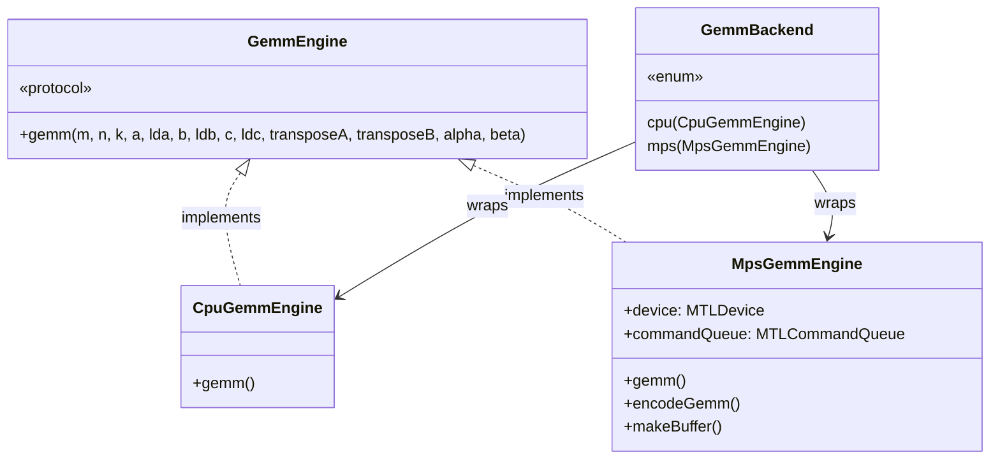
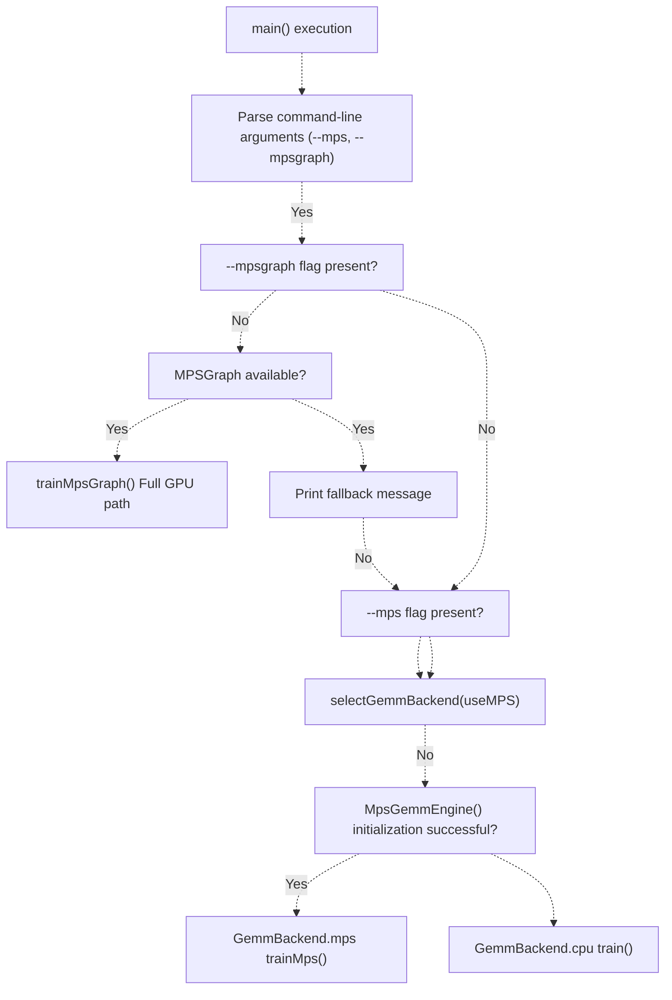
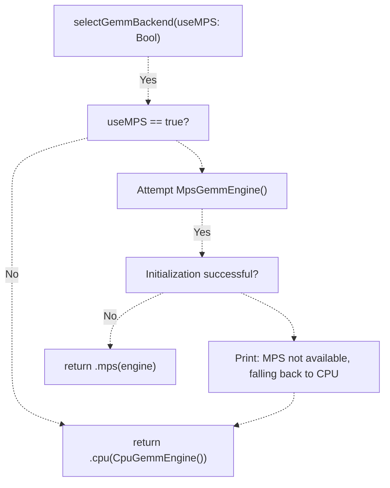
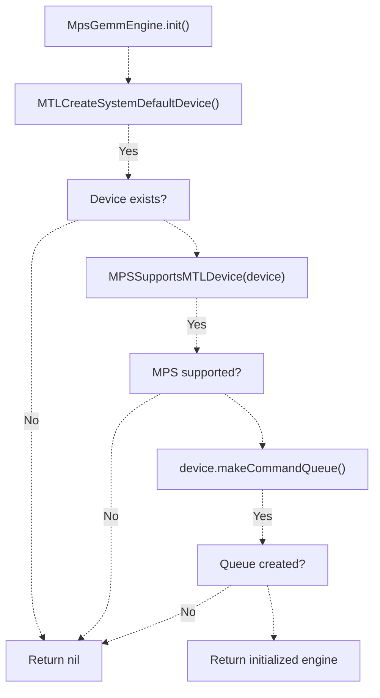
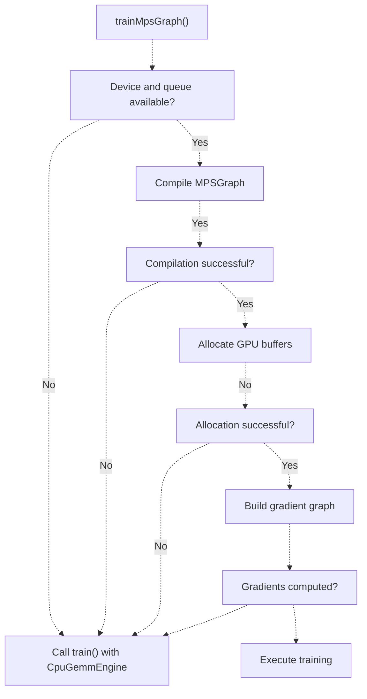
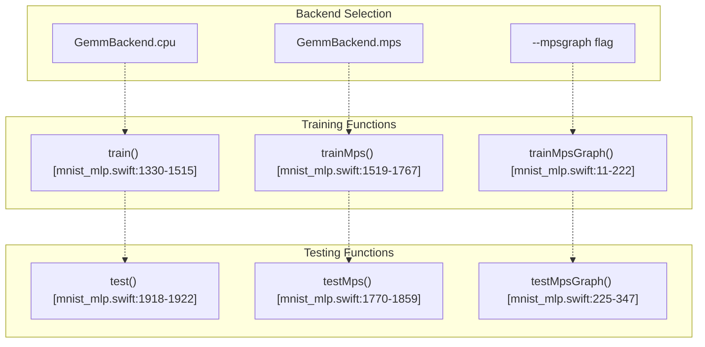
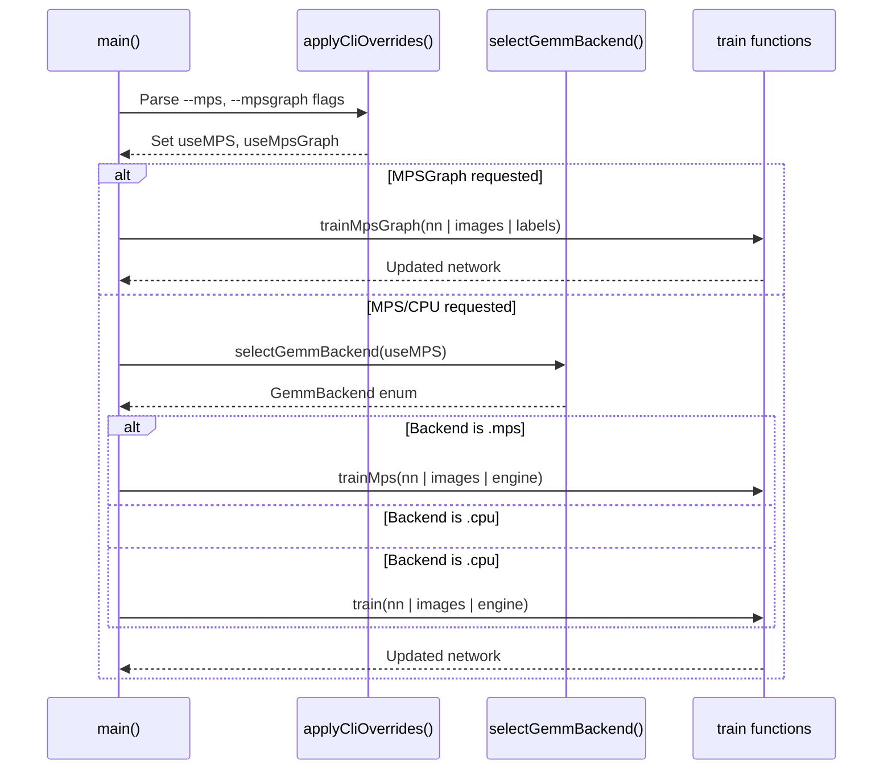
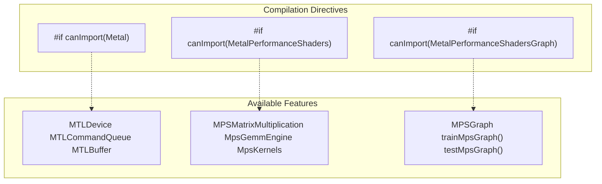

# Backend Selection

> **Relevant source files**
> * [README.md](https://github.com/ThalesMMS/Swift-Neural-Networks/blob/3a1c4fc2/README.md)
> * [mlp_simple.swift](https://github.com/ThalesMMS/Swift-Neural-Networks/blob/3a1c4fc2/mlp_simple.swift)
> * [mnist_cnn.swift](https://github.com/ThalesMMS/Swift-Neural-Networks/blob/3a1c4fc2/mnist_cnn.swift)
> * [mnist_mlp.swift](https://github.com/ThalesMMS/Swift-Neural-Networks/blob/3a1c4fc2/mnist_mlp.swift)

## Purpose and Scope

This page documents the backend selection mechanism in the MNIST MLP implementation, specifically how the system chooses between CPU, MPS, and MPSGraph execution paths at runtime. The backend selection determines which hardware accelerator and API will handle matrix operations during training and inference.

For detailed implementation of each backend, see:

* [Accelerate Framework (CPU)](#5.2) - vDSP-based CPU execution
* [MPS Hybrid Mode](#5.3) - GPU matrix operations with custom Metal kernels
* [MPSGraph Full GPU Mode](#5.4) - Declarative graph-based execution

**Sources:** [mnist_mlp.swift L1-L2223](https://github.com/ThalesMMS/Swift-Neural-Networks/blob/3a1c4fc2/mnist_mlp.swift#L1-L2223)

 [README.md L91-L101](https://github.com/ThalesMMS/Swift-Neural-Networks/blob/3a1c4fc2/README.md#L91-L101)

## Backend Abstraction Layer

The backend selection system is built around the `GemmEngine` protocol, which abstracts the General Matrix Multiply (GEMM) operation. This abstraction allows the training and testing logic to remain backend-agnostic.

### GemmEngine Protocol



The `GemmEngine` protocol defines a single method that performs matrix multiplication: `C = alpha * op(A) * op(B) + beta * C`, where `op()` can optionally transpose matrices. All implementations must conform to this interface.

**Sources:** [mnist_mlp.swift L433-L449](https://github.com/ThalesMMS/Swift-Neural-Networks/blob/3a1c4fc2/mnist_mlp.swift#L433-L449)

### Backend Enumeration

The `GemmBackend` enum provides a type-safe way to represent the selected backend at runtime:

| Backend Case | Description | Availability |
| --- | --- | --- |
| `.cpu(CpuGemmEngine)` | CPU-based execution using Accelerate framework | Always available on macOS |
| `.mps(MpsGemmEngine)` | GPU-based execution using Metal Performance Shaders | Requires Metal-compatible GPU |

**Sources:** [mnist_mlp.swift L993-L998](https://github.com/ThalesMMS/Swift-Neural-Networks/blob/3a1c4fc2/mnist_mlp.swift#L993-L998)

## Backend Selection Flow

### Runtime Selection Process



The selection process follows this priority order:

1. **MPSGraph path** (highest performance, if `--mpsgraph` specified and available)
2. **MPS hybrid path** (if `--mps` specified and GPU available)
3. **CPU path** (default fallback)

**Sources:** [mnist_mlp.swift L2094-L2161](https://github.com/ThalesMMS/Swift-Neural-Networks/blob/3a1c4fc2/mnist_mlp.swift#L2094-L2161)

### Selection Function

The core selection logic resides in the `selectGemmBackend` function:



**Sources:** [mnist_mlp.swift L1001-L1012](https://github.com/ThalesMMS/Swift-Neural-Networks/blob/3a1c4fc2/mnist_mlp.swift#L1001-L1012)

## Command-Line Interface

### Backend Selection Flags

The user controls backend selection through command-line flags:

| Flag | Effect | Backend Selected |
| --- | --- | --- |
| (none) | Default execution | CPU (Accelerate/vDSP) |
| `--mps` | Request GPU acceleration | MPS hybrid (if available, else CPU) |
| `--mpsgraph` | Request full GPU graph execution | MPSGraph (if available, else fallback to MPS/CPU) |

Note that `--mpsgraph` implicitly sets `useMPS = true`, so the system will attempt GPU acceleration even if only `--mpsgraph` is specified.

**Sources:** [mnist_mlp.swift L2097-L2098](https://github.com/ThalesMMS/Swift-Neural-Networks/blob/3a1c4fc2/mnist_mlp.swift#L2097-L2098)

 [README.md L117-L120](https://github.com/ThalesMMS/Swift-Neural-Networks/blob/3a1c4fc2/README.md#L117-L120)

 [README.md L143-L144](https://github.com/ThalesMMS/Swift-Neural-Networks/blob/3a1c4fc2/README.md#L143-L144)

### Usage Examples

```
# CPU backend (default)./mnist_mlp_swift# MPS hybrid backend./mnist_mlp_swift --mps# MPSGraph full GPU backend./mnist_mlp_swift --mpsgraph# Can combine with other hyperparameters./mnist_mlp_swift --mps --batch 128 --epochs 20 --lr 0.005
```

**Sources:** [README.md L115-L120](https://github.com/ThalesMMS/Swift-Neural-Networks/blob/3a1c4fc2/README.md#L115-L120)

 [README.md L140-L151](https://github.com/ThalesMMS/Swift-Neural-Networks/blob/3a1c4fc2/README.md#L140-L151)

## Fallback Logic

### MPS Availability Check

The `MpsGemmEngine` initialization performs several checks to determine GPU availability:



If any of these checks fail, the engine returns `nil`, triggering a fallback to CPU execution.

**Sources:** [mnist_mlp.swift L887-L895](https://github.com/ThalesMMS/Swift-Neural-Networks/blob/3a1c4fc2/mnist_mlp.swift#L887-L895)

### MPSGraph Fallback

The MPSGraph training path includes multiple fallback points:



Each fallback prints a diagnostic message before switching to CPU mode, helping developers identify why GPU acceleration is unavailable.

**Sources:** [mnist_mlp.swift L18-L24](https://github.com/ThalesMMS/Swift-Neural-Networks/blob/3a1c4fc2/mnist_mlp.swift#L18-L24)

 [mnist_mlp.swift L72-L75](https://github.com/ThalesMMS/Swift-Neural-Networks/blob/3a1c4fc2/mnist_mlp.swift#L72-L75)

 [mnist_mlp.swift L110-L114](https://github.com/ThalesMMS/Swift-Neural-Networks/blob/3a1c4fc2/mnist_mlp.swift#L110-L114)

## Backend Mapping to Training Functions

### Training Function Dispatch

The backend selection determines which training function is invoked:

| Backend | Training Function | Testing Function | Memory Model |
| --- | --- | --- | --- |
| CPU | `train()` | `test()` | Swift arrays |
| MPS | `trainMps()` | `testMps()` | Shared CPU/GPU buffers (`MpsBuffer`) |
| MPSGraph | `trainMpsGraph()` | `testMpsGraph()` | GPU-only buffers (`MPSGraphTensorData`) |



**Sources:** [mnist_mlp.swift L2137-L2161](https://github.com/ThalesMMS/Swift-Neural-Networks/blob/3a1c4fc2/mnist_mlp.swift#L2137-L2161)

 [mnist_mlp.swift L2166-L2205](https://github.com/ThalesMMS/Swift-Neural-Networks/blob/3a1c4fc2/mnist_mlp.swift#L2166-L2205)

## Code Entity References

### Key Types and Functions

| Entity | Location | Role |
| --- | --- | --- |
| `GemmEngine` | [mnist_mlp.swift L433-L449](https://github.com/ThalesMMS/Swift-Neural-Networks/blob/3a1c4fc2/mnist_mlp.swift#L433-L449) | Protocol defining GEMM abstraction |
| `CpuGemmEngine` | [mnist_mlp.swift L452-L559](https://github.com/ThalesMMS/Swift-Neural-Networks/blob/3a1c4fc2/mnist_mlp.swift#L452-L559) | CPU implementation using vDSP |
| `MpsGemmEngine` | [mnist_mlp.swift L883-L989](https://github.com/ThalesMMS/Swift-Neural-Networks/blob/3a1c4fc2/mnist_mlp.swift#L883-L989) | GPU implementation using MPS |
| `GemmBackend` | [mnist_mlp.swift L993-L998](https://github.com/ThalesMMS/Swift-Neural-Networks/blob/3a1c4fc2/mnist_mlp.swift#L993-L998) | Enum wrapping backend choices |
| `selectGemmBackend()` | [mnist_mlp.swift L1001-L1012](https://github.com/ThalesMMS/Swift-Neural-Networks/blob/3a1c4fc2/mnist_mlp.swift#L1001-L1012) | Backend selection logic |
| `train()` | [mnist_mlp.swift L1330-L1515](https://github.com/ThalesMMS/Swift-Neural-Networks/blob/3a1c4fc2/mnist_mlp.swift#L1330-L1515) | CPU training loop |
| `trainMps()` | [mnist_mlp.swift L1519-L1767](https://github.com/ThalesMMS/Swift-Neural-Networks/blob/3a1c4fc2/mnist_mlp.swift#L1519-L1767) | MPS training loop |
| `trainMpsGraph()` | [mnist_mlp.swift L11-L222](https://github.com/ThalesMMS/Swift-Neural-Networks/blob/3a1c4fc2/mnist_mlp.swift#L11-L222) | MPSGraph training loop |

**Sources:** [mnist_mlp.swift L1-L2223](https://github.com/ThalesMMS/Swift-Neural-Networks/blob/3a1c4fc2/mnist_mlp.swift#L1-L2223)

### Integration in Main Function

The main execution flow demonstrates how backend selection integrates with the overall program:



**Sources:** [mnist_mlp.swift L2094-L2161](https://github.com/ThalesMMS/Swift-Neural-Networks/blob/3a1c4fc2/mnist_mlp.swift#L2094-L2161)

## Conditional Compilation

The codebase uses Swift's conditional compilation to handle platform-specific Metal features:



These directives ensure the code compiles gracefully on platforms without Metal support, though the implementation is specifically designed for macOS with Metal-compatible GPUs.

**Sources:** [mnist_mlp.swift L5-L7](https://github.com/ThalesMMS/Swift-Neural-Networks/blob/3a1c4fc2/mnist_mlp.swift#L5-L7)

 [mnist_mlp.swift L9-L10](https://github.com/ThalesMMS/Swift-Neural-Networks/blob/3a1c4fc2/mnist_mlp.swift#L9-L10)

 [mnist_mlp.swift L350-L356](https://github.com/ThalesMMS/Swift-Neural-Networks/blob/3a1c4fc2/mnist_mlp.swift#L350-L356)

 [mnist_mlp.swift L561](https://github.com/ThalesMMS/Swift-Neural-Networks/blob/3a1c4fc2/mnist_mlp.swift#L561-L561)

 [mnist_mlp.swift L995-L997](https://github.com/ThalesMMS/Swift-Neural-Networks/blob/3a1c4fc2/mnist_mlp.swift#L995-L997)

Refresh this wiki

Last indexed: 5 January 2026 ([3a1c4f](https://github.com/ThalesMMS/Swift-Neural-Networks/commit/3a1c4fc2))

### On this page

* [Backend Selection](#5.1-backend-selection)
* [Purpose and Scope](#5.1-purpose-and-scope)
* [Backend Abstraction Layer](#5.1-backend-abstraction-layer)
* [GemmEngine Protocol](#5.1-gemmengine-protocol)
* [Backend Enumeration](#5.1-backend-enumeration)
* [Backend Selection Flow](#5.1-backend-selection-flow)
* [Runtime Selection Process](#5.1-runtime-selection-process)
* [Selection Function](#5.1-selection-function)
* [Command-Line Interface](#5.1-command-line-interface)
* [Backend Selection Flags](#5.1-backend-selection-flags)
* [Usage Examples](#5.1-usage-examples)
* [Fallback Logic](#5.1-fallback-logic)
* [MPS Availability Check](#5.1-mps-availability-check)
* [MPSGraph Fallback](#5.1-mpsgraph-fallback)
* [Backend Mapping to Training Functions](#5.1-backend-mapping-to-training-functions)
* [Training Function Dispatch](#5.1-training-function-dispatch)
* [Code Entity References](#5.1-code-entity-references)
* [Key Types and Functions](#5.1-key-types-and-functions)
* [Integration in Main Function](#5.1-integration-in-main-function)
* [Conditional Compilation](#5.1-conditional-compilation)

Ask Devin about Swift-Neural-Networks