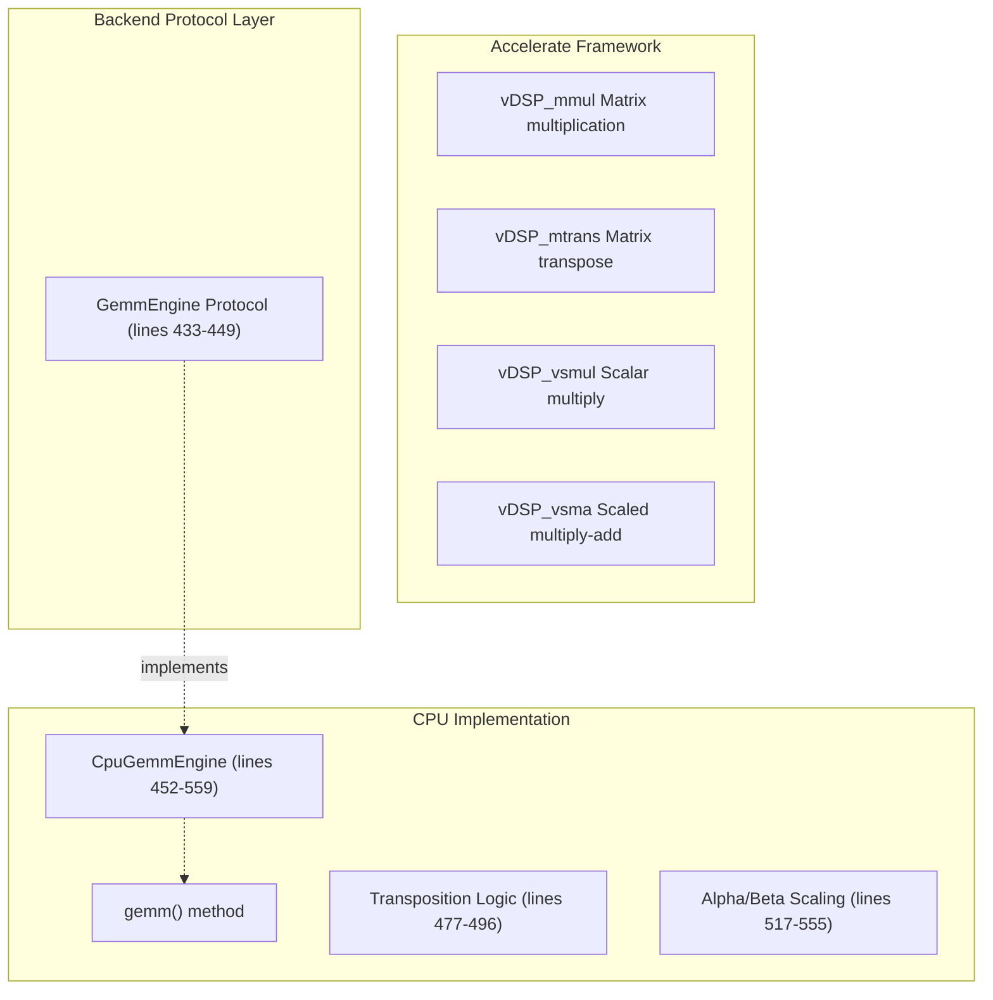
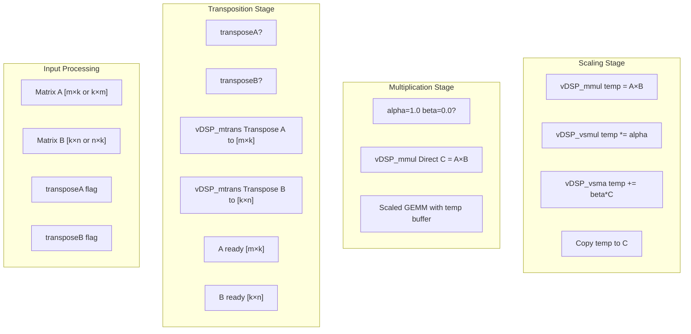
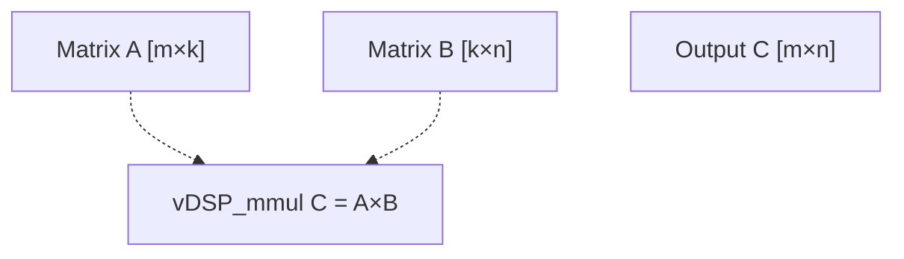
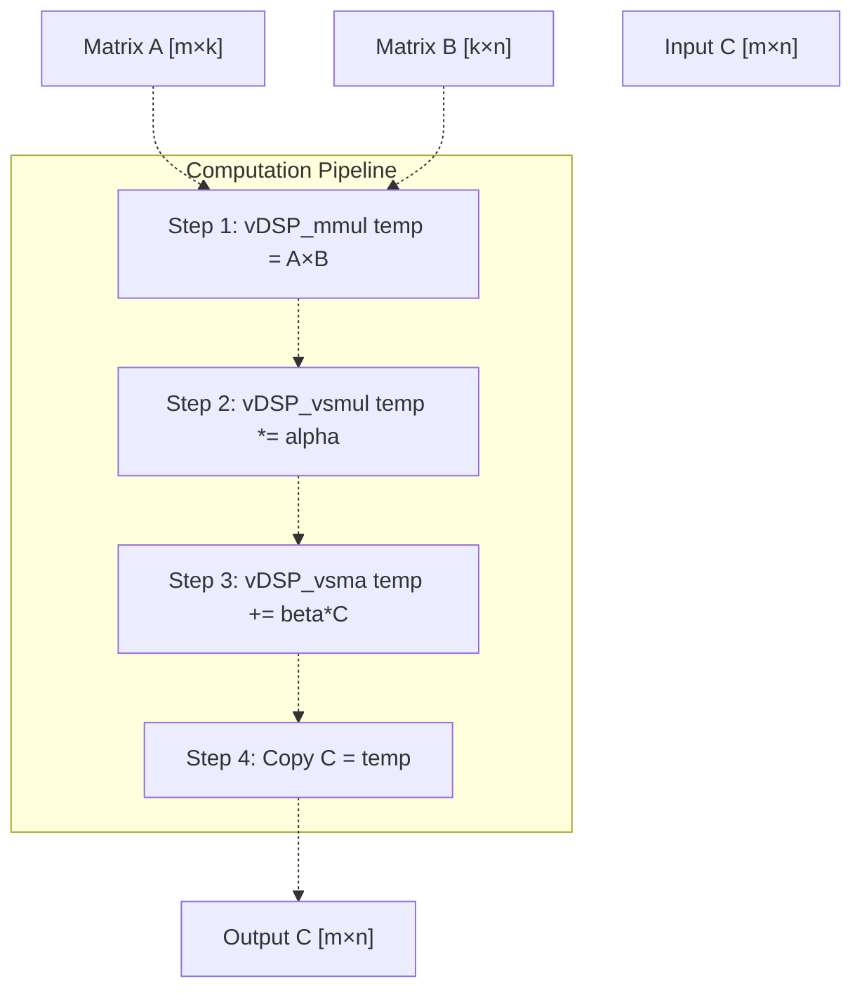
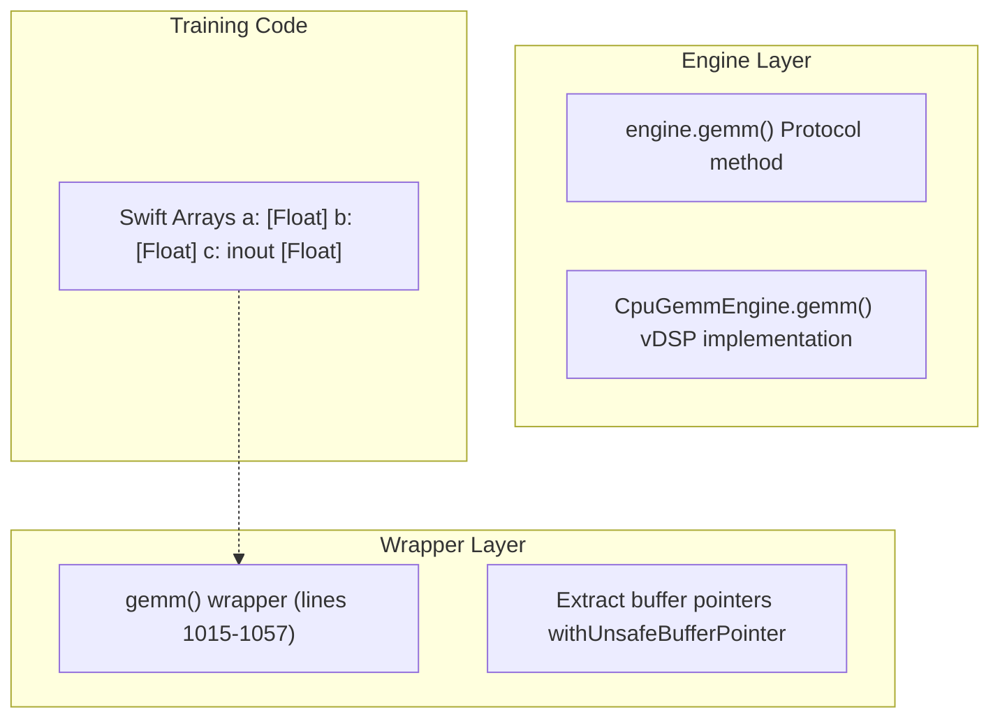
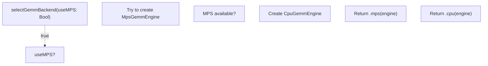

# Accelerate Framework (CPU)

> **Relevant source files**
> * [mlp_simple.swift](https://github.com/ThalesMMS/Swift-Neural-Networks/blob/3a1c4fc2/mlp_simple.swift)
> * [mnist_cnn.swift](https://github.com/ThalesMMS/Swift-Neural-Networks/blob/3a1c4fc2/mnist_cnn.swift)
> * [mnist_mlp.swift](https://github.com/ThalesMMS/Swift-Neural-Networks/blob/3a1c4fc2/mnist_mlp.swift)

## Purpose and Scope

This page documents the CPU-based backend implementation for matrix operations in the MNIST MLP training system. The `CpuGemmEngine` class provides CPU-optimized GEMM (General Matrix Multiply) operations using Apple's Accelerate framework, specifically the vDSP library. This backend serves as the default execution path and fallback option when GPU acceleration is unavailable.

For information about backend selection logic, see [Backend Selection](5a%20Backend-Selection.md). For GPU-accelerated alternatives, see [MPS Hybrid Mode](5c%20MPS-Hybrid-Mode.md) and [MPSGraph Full GPU Mode](5d%20MPSGraph-Full-GPU-Mode.md).

**Sources:** [mnist_mlp.swift L452-L559](https://github.com/ThalesMMS/Swift-Neural-Networks/blob/3a1c4fc2/mnist_mlp.swift#L452-L559)

 [mnist_mlp.swift L433-L449](https://github.com/ThalesMMS/Swift-Neural-Networks/blob/3a1c4fc2/mnist_mlp.swift#L433-L449)

---

## CPU Backend Architecture

The CPU backend is built around the `CpuGemmEngine` class, which implements the `GemmEngine` protocol to provide a unified interface for matrix multiplication across different backends. The implementation leverages Apple's vDSP library from the Accelerate framework to achieve vectorized, cache-efficient matrix operations on CPU.



**Sources:** [mnist_mlp.swift L433-L559](https://github.com/ThalesMMS/Swift-Neural-Networks/blob/3a1c4fc2/mnist_mlp.swift#L433-L559)

---

## GemmEngine Protocol

The `GemmEngine` protocol defines a single method that all backend implementations must provide. This abstraction allows the training code to remain backend-agnostic while supporting multiple execution engines.

### Protocol Definition

| Parameter | Type | Description |
| --- | --- | --- |
| `m` | `Int` | Number of rows in matrix A and output matrix C |
| `n` | `Int` | Number of columns in matrix B and output matrix C |
| `k` | `Int` | Inner dimension (columns of A, rows of B) |
| `a` | `UnsafePointer<Float>` | Pointer to matrix A data |
| `lda` | `Int` | Leading dimension of A (unused in CPU implementation) |
| `b` | `UnsafePointer<Float>` | Pointer to matrix B data |
| `ldb` | `Int` | Leading dimension of B (unused in CPU implementation) |
| `c` | `UnsafeMutablePointer<Float>` | Pointer to output matrix C data |
| `ldc` | `Int` | Leading dimension of C (unused in CPU implementation) |
| `transposeA` | `Bool` | Whether to transpose matrix A before multiplication |
| `transposeB` | `Bool` | Whether to transpose matrix B before multiplication |
| `alpha` | `Float` | Scalar multiplier for the product A×B |
| `beta` | `Float` | Scalar multiplier for existing C values |

The protocol computes: **C = α(A×B) + βC**

**Sources:** [mnist_mlp.swift L433-L449](https://github.com/ThalesMMS/Swift-Neural-Networks/blob/3a1c4fc2/mnist_mlp.swift#L433-L449)

---

## CpuGemmEngine Implementation

The `CpuGemmEngine` class is a final class that implements GEMM operations using vDSP primitives. It handles matrix transposition and alpha/beta scaling through a combination of explicit transposition and vectorized operations.



**Sources:** [mnist_mlp.swift L452-L559](https://github.com/ThalesMMS/Swift-Neural-Networks/blob/3a1c4fc2/mnist_mlp.swift#L452-L559)

---

## Matrix Transposition

The CPU backend handles matrix transposition explicitly before multiplication. When `transposeA` or `transposeB` is true, the implementation allocates temporary buffers and uses `vDSP_mtrans` to perform the transposition.

### Transposition Logic

```
If transposeA is true:
  - Input A has dimensions [k×m]
  - Allocate buffer of size [m×k]
  - Call vDSP_mtrans(a, 1, buffer, 1, k, m)
  - Use transposed buffer for multiplication
  
If transposeB is true:
  - Input B has dimensions [n×k]
  - Allocate buffer of size [k×n]
  - Call vDSP_mtrans(b, 1, buffer, 1, n, k)
  - Use transposed buffer for multiplication
```

The `withMatrixPointer` helper function (lines 498-512) provides a clean abstraction for using either the original pointer or the transposed buffer pointer in subsequent operations.

**Sources:** [mnist_mlp.swift L477-L512](https://github.com/ThalesMMS/Swift-Neural-Networks/blob/3a1c4fc2/mnist_mlp.swift#L477-L512)

---

## Alpha and Beta Scaling

The GEMM operation supports two scaling parameters that modify the computation:

* **alpha (α)**: Scales the matrix product A×B
* **beta (β)**: Scales the existing values in output matrix C

### Fast Path: α=1.0, β=0.0

When alpha is 1.0 and beta is 0.0, the operation simplifies to **C = A×B**, and the implementation uses a direct call to `vDSP_mmul` without additional scaling operations.



**Sources:** [mnist_mlp.swift L517-L529](https://github.com/ThalesMMS/Swift-Neural-Networks/blob/3a1c4fc2/mnist_mlp.swift#L517-L529)

### General Path: Arbitrary α, β

For other alpha/beta values, the implementation uses a temporary buffer and multiple vDSP operations:

1. **Multiply**: Compute `temp = A×B` using `vDSP_mmul`
2. **Scale Product**: Apply `temp *= α` using `vDSP_vsmul`
3. **Add Scaled C**: If `β ≠ 0`, compute `temp += β*C` using `vDSP_vsma`
4. **Copy Result**: Copy `temp` back to `C`



**Sources:** [mnist_mlp.swift L530-L555](https://github.com/ThalesMMS/Swift-Neural-Networks/blob/3a1c4fc2/mnist_mlp.swift#L530-L555)

---

## Integration with Training Pipeline

The CPU backend integrates with the training system through the `train` function, which uses the `GemmEngine` protocol to perform matrix operations. The backend is selected via the `selectGemmBackend` function and passed to the training loop.

### GEMM Operations in Training

The training loop invokes GEMM operations for the following computations:

| Operation | Purpose | Dimensions | Transpose Flags |
| --- | --- | --- | --- |
| `A1 = X × W1` | Hidden layer forward pass | `[batch×784] × [784×512]` | A=false, B=false |
| `A2 = A1 × W2` | Output layer forward pass | `[batch×512] × [512×10]` | A=false, B=false |
| `dW2 = A1ᵀ × dZ2` | Output weight gradients | `[512×batch] × [batch×10]` | A=true, B=false |
| `dZ1 = dZ2 × W2ᵀ` | Hidden layer backprop | `[batch×10] × [10×512]` | A=false, B=true |
| `dW1 = Xᵀ × dZ1` | Hidden weight gradients | `[784×batch] × [batch×512]` | A=true, B=false |

**Sources:** [mnist_mlp.swift L1388-L1399](https://github.com/ThalesMMS/Swift-Neural-Networks/blob/3a1c4fc2/mnist_mlp.swift#L1388-L1399)

 [mnist_mlp.swift L1404-L1417](https://github.com/ThalesMMS/Swift-Neural-Networks/blob/3a1c4fc2/mnist_mlp.swift#L1404-L1417)

 [mnist_mlp.swift L1430-L1444](https://github.com/ThalesMMS/Swift-Neural-Networks/blob/3a1c4fc2/mnist_mlp.swift#L1430-L1444)

 [mnist_mlp.swift L1451-L1464](https://github.com/ThalesMMS/Swift-Neural-Networks/blob/3a1c4fc2/mnist_mlp.swift#L1451-L1464)

 [mnist_mlp.swift L1472-L1486](https://github.com/ThalesMMS/Swift-Neural-Networks/blob/3a1c4fc2/mnist_mlp.swift#L1472-L1486)

### Wrapper Function for Array-Based GEMM

The `gemm` wrapper function (lines 1015-1057) provides a convenient interface that accepts Swift arrays instead of raw pointers. It handles buffer pointer extraction and delegates to the engine's `gemm` method.



**Sources:** [mnist_mlp.swift L1015-L1057](https://github.com/ThalesMMS/Swift-Neural-Networks/blob/3a1c4fc2/mnist_mlp.swift#L1015-L1057)

 [mnist_mlp.swift L1330-L1515](https://github.com/ThalesMMS/Swift-Neural-Networks/blob/3a1c4fc2/mnist_mlp.swift#L1330-L1515)

---

## Backend Selection

The CPU backend is instantiated and selected through the `selectGemmBackend` function. It serves as the default backend and the fallback when GPU backends are unavailable or explicitly disabled.



The function returns a `GemmBackend` enum that encapsulates either a `CpuGemmEngine` or `MpsGemmEngine` instance. The training code uses pattern matching to dispatch to the appropriate training function.

**Sources:** [mnist_mlp.swift L1001-L1012](https://github.com/ThalesMMS/Swift-Neural-Networks/blob/3a1c4fc2/mnist_mlp.swift#L1001-L1012)

 [mnist_mlp.swift L993-L998](https://github.com/ThalesMMS/Swift-Neural-Networks/blob/3a1c4fc2/mnist_mlp.swift#L993-L998)

---

## Performance Characteristics

### Advantages

| Aspect | Description |
| --- | --- |
| **Portability** | Works on all macOS systems without GPU requirements |
| **Debugging** | Simpler execution model facilitates debugging |
| **Memory Overhead** | No GPU memory allocation or data transfer overhead |
| **Determinism** | Consistent numerical results across runs |

### Limitations

| Aspect | Description |
| --- | --- |
| **Speed** | Slower than GPU backends for large batch sizes |
| **Transposition Overhead** | Explicit transposition allocates temporary buffers |
| **Scaling Overhead** | Non-default alpha/beta values require extra operations and temporary buffers |

### Typical Use Cases

The CPU backend is most appropriate for:

* **Development and debugging** where execution clarity is more important than speed
* **Small batch sizes** (≤32) where GPU overhead dominates
* **Systems without Metal/GPU support** where it's the only available option
* **Baseline performance measurements** for comparison with GPU backends

**Sources:** [mnist_mlp.swift L452-L559](https://github.com/ThalesMMS/Swift-Neural-Networks/blob/3a1c4fc2/mnist_mlp.swift#L452-L559)

 [mnist_mlp.swift L1330-L1515](https://github.com/ThalesMMS/Swift-Neural-Networks/blob/3a1c4fc2/mnist_mlp.swift#L1330-L1515)

---

## vDSP Function Reference

The implementation uses the following Accelerate framework functions:

### vDSP_mmul

**Purpose**: Matrix-matrix multiplication
**Signature**: `vDSP_mmul(A, strideA, B, strideB, C, strideC, m, n, k)`
**Operation**: `C[m×n] = A[m×k] × B[k×n]`
**Used at**: [mnist_mlp.swift L518-L528](https://github.com/ThalesMMS/Swift-Neural-Networks/blob/3a1c4fc2/mnist_mlp.swift#L518-L528)

 [mnist_mlp.swift L533-L543](https://github.com/ThalesMMS/Swift-Neural-Networks/blob/3a1c4fc2/mnist_mlp.swift#L533-L543)

### vDSP_mtrans

**Purpose**: Matrix transpose
**Signature**: `vDSP_mtrans(input, 1, output, 1, rows, cols)`
**Operation**: `output[cols×rows] = inputᵀ[rows×cols]`
**Used at**: [mnist_mlp.swift L484](https://github.com/ThalesMMS/Swift-Neural-Networks/blob/3a1c4fc2/mnist_mlp.swift#L484-L484)

 [mnist_mlp.swift L493](https://github.com/ThalesMMS/Swift-Neural-Networks/blob/3a1c4fc2/mnist_mlp.swift#L493-L493)

### vDSP_vsmul

**Purpose**: Vector-scalar multiplication
**Signature**: `vDSP_vsmul(input, 1, &scalar, output, 1, count)`
**Operation**: `output[i] = input[i] × scalar`
**Used at**: [mnist_mlp.swift L546](https://github.com/ThalesMMS/Swift-Neural-Networks/blob/3a1c4fc2/mnist_mlp.swift#L546-L546)

### vDSP_vsma

**Purpose**: Vector-scalar multiply-add
**Signature**: `vDSP_vsma(A, 1, &scalar, B, 1, C, 1, count)`
**Operation**: `C[i] = A[i] × scalar + B[i]`
**Used at**: [mnist_mlp.swift L550](https://github.com/ThalesMMS/Swift-Neural-Networks/blob/3a1c4fc2/mnist_mlp.swift#L550-L550)

**Sources:** [mnist_mlp.swift L452-L559](https://github.com/ThalesMMS/Swift-Neural-Networks/blob/3a1c4fc2/mnist_mlp.swift#L452-L559)


### On this page

- [Accelerate Framework (CPU)](#accelerate-framework-cpu)
  - [Purpose and Scope](#purpose-and-scope)
  - [CPU Backend Architecture](#cpu-backend-architecture)
  - [GemmEngine Protocol](#gemmengine-protocol)
    - [Protocol Definition](#protocol-definition)
  - [CpuGemmEngine Implementation](#cpugemmengine-implementation)
  - [Matrix Transposition](#matrix-transposition)
    - [Transposition Logic](#transposition-logic)
  - [Alpha and Beta Scaling](#alpha-and-beta-scaling)
    - [Fast Path: α=1.0, β=0.0](#fast-path-α10-β00)
    - [General Path: Arbitrary α, β](#general-path-arbitrary-α-β)
  - [Integration with Training Pipeline](#integration-with-training-pipeline)
    - [GEMM Operations in Training](#gemm-operations-in-training)
    - [Wrapper Function for Array-Based GEMM](#wrapper-function-for-array-based-gemm)
  - [Backend Selection](#backend-selection)
  - [Performance Characteristics](#performance-characteristics)
    - [Advantages](#advantages)
    - [Limitations](#limitations)
    - [Typical Use Cases](#typical-use-cases)
  - [vDSP Function Reference](#vdsp-function-reference)
    - [vDSP\_mmul](#vdsp_mmul)
    - [vDSP\_mtrans](#vdsp_mtrans)
    - [vDSP\_vsmul](#vdsp_vsmul)
    - [vDSP\_vsma](#vdsp_vsma)
    - [On this page](#on-this-page)

Ask Devin about Swift-Neural-Networks