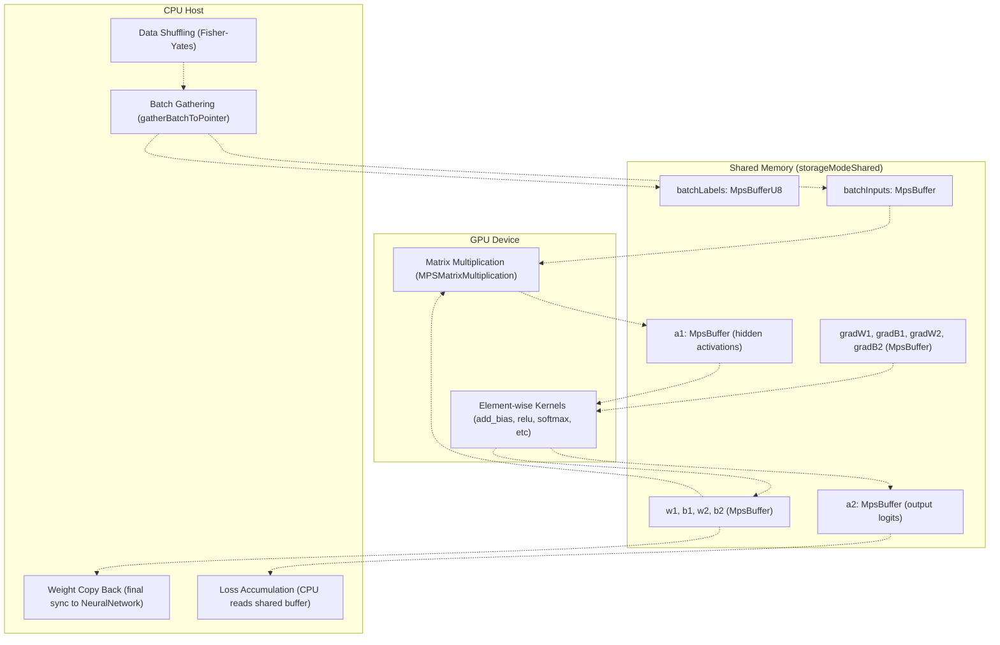
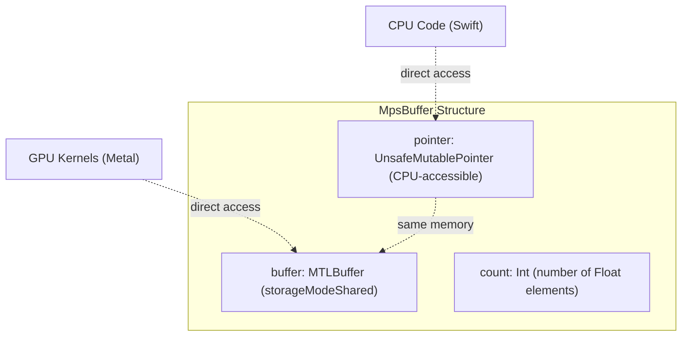
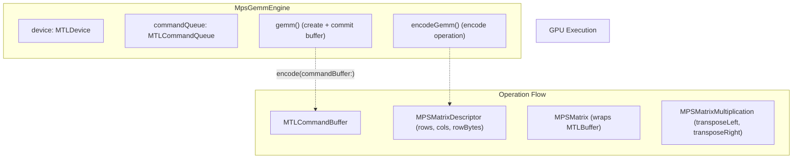
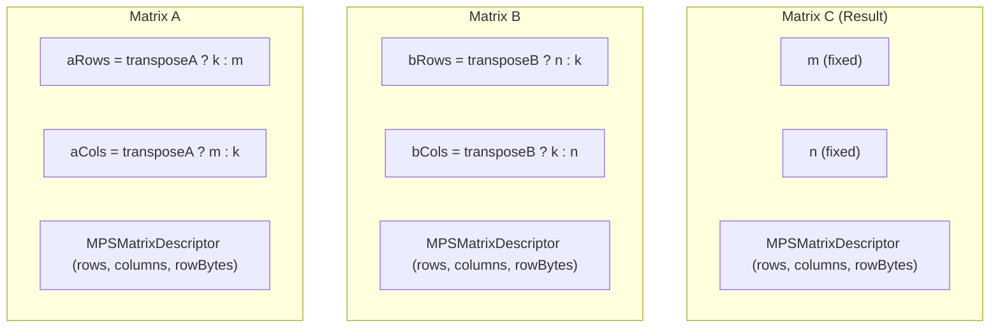
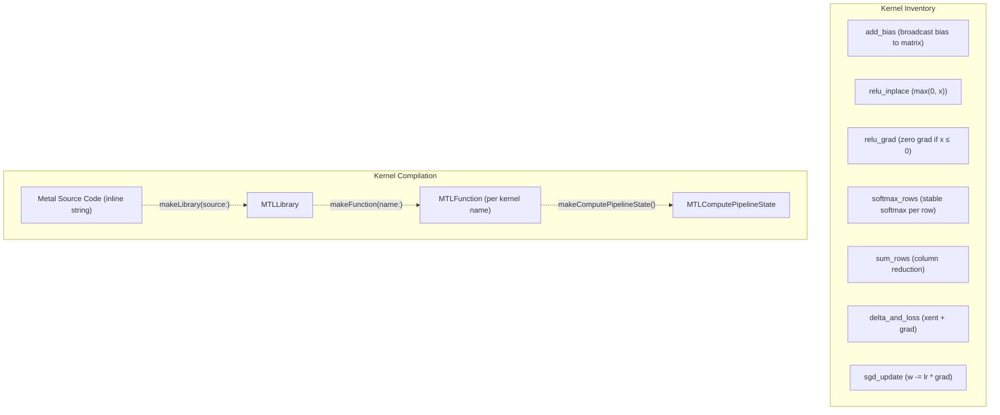
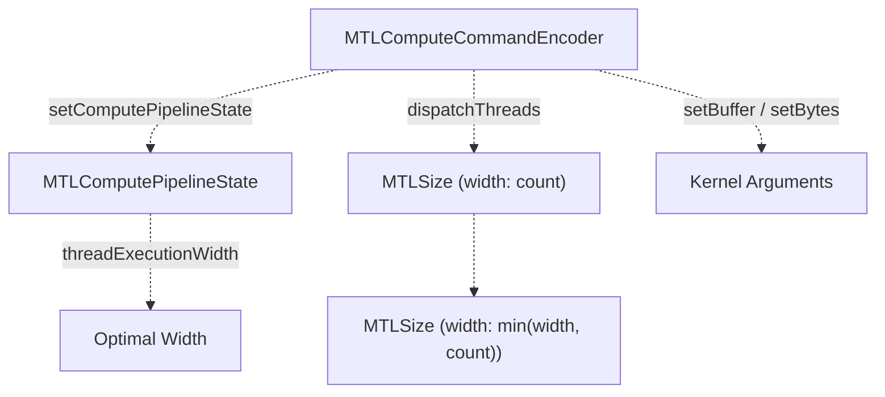
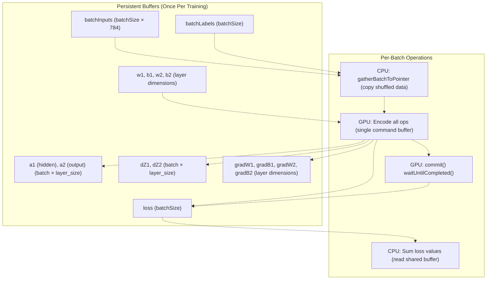
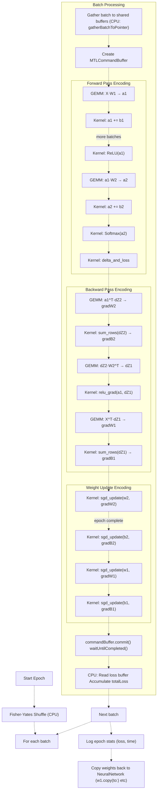
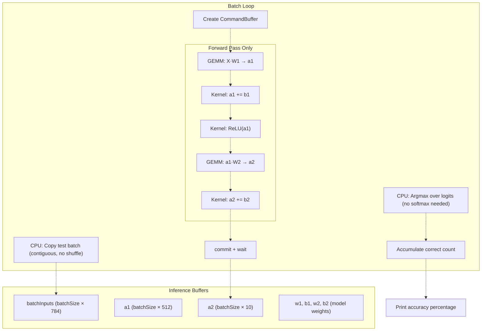
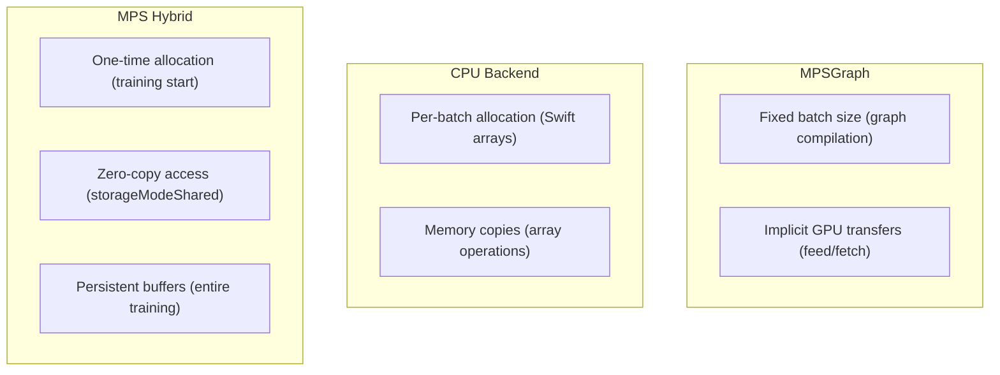

# MPS Hybrid Mode

> **Relevant source files**
> * [README.md](https://github.com/ThalesMMS/Swift-Neural-Networks/blob/3a1c4fc2/README.md)
> * [mlp_simple.swift](https://github.com/ThalesMMS/Swift-Neural-Networks/blob/3a1c4fc2/mlp_simple.swift)
> * [mnist_cnn.swift](https://github.com/ThalesMMS/Swift-Neural-Networks/blob/3a1c4fc2/mnist_cnn.swift)
> * [mnist_mlp.swift](https://github.com/ThalesMMS/Swift-Neural-Networks/blob/3a1c4fc2/mnist_mlp.swift)

## Purpose and Scope

This page documents the MPS (Metal Performance Shaders) hybrid GPU acceleration backend for the MNIST MLP implementation. This backend combines GPU-accelerated matrix multiplication via `MPSMatrixMultiplication` with custom Metal compute kernels for element-wise operations, using shared CPU/GPU memory buffers to eliminate data transfer overhead.

For information about backend selection and the `GemmEngine` protocol abstraction, see [Backend Selection](#5.1). For the pure CPU implementation, see [Accelerate Framework (CPU)](#5.2). For the full GPU graph-based approach, see [MPSGraph Full GPU Mode](#5.4).

**Sources:** [mnist_mlp.swift L1-L2223](https://github.com/ThalesMMS/Swift-Neural-Networks/blob/3a1c4fc2/mnist_mlp.swift#L1-L2223)

---

## Architecture Overview

The MPS hybrid mode splits neural network operations between CPU and GPU, using shared memory buffers to avoid explicit data transfers. Matrix multiplications (GEMM) are accelerated using `MPSMatrixMultiplication`, while element-wise operations are handled by custom Metal compute kernels.

### Operational Split



**Sources:** [mnist_mlp.swift L1519-L1767](https://github.com/ThalesMMS/Swift-Neural-Networks/blob/3a1c4fc2/mnist_mlp.swift#L1519-L1767)

 [mnist_mlp.swift L883-L989](https://github.com/ThalesMMS/Swift-Neural-Networks/blob/3a1c4fc2/mnist_mlp.swift#L883-L989)

 [mnist_mlp.swift L563-L620](https://github.com/ThalesMMS/Swift-Neural-Networks/blob/3a1c4fc2/mnist_mlp.swift#L563-L620)

---

## Shared Memory Model

### MpsBuffer Class

The `MpsBuffer` class wraps `MTLBuffer` objects created with `storageModeShared`, providing zero-copy access from both CPU and GPU.



**Key characteristics:**

| Feature | Description |
| --- | --- |
| Storage Mode | `storageModeShared` - CPU and GPU access same physical memory |
| Initialization | Created with `device.makeBuffer(length:options:)` |
| CPU Access | Via `pointer` property (typed `UnsafeMutablePointer<Float>`) |
| GPU Access | Via `buffer` property (typed `MTLBuffer`) |
| Allocation Strategy | Persistent across batches - allocated once per training session |

**Implementation details:**

The `MpsBuffer` class [mnist_mlp.swift L563-L600](https://github.com/ThalesMMS/Swift-Neural-Networks/blob/3a1c4fc2/mnist_mlp.swift#L563-L600)

 provides:

* Initialization with optional initial data
* `update(from:count:)` method for CPU-to-buffer copy
* `copy(to:)` method for buffer-to-CPU copy
* Direct pointer access for zero-copy operations

For label data, `MpsBufferU8` [mnist_mlp.swift L603-L620](https://github.com/ThalesMMS/Swift-Neural-Networks/blob/3a1c4fc2/mnist_mlp.swift#L603-L620)

 provides identical functionality with `UInt8` element type.

**Sources:** [mnist_mlp.swift L563-L600](https://github.com/ThalesMMS/Swift-Neural-Networks/blob/3a1c4fc2/mnist_mlp.swift#L563-L600)

 [mnist_mlp.swift L603-L620](https://github.com/ThalesMMS/Swift-Neural-Networks/blob/3a1c4fc2/mnist_mlp.swift#L603-L620)

---

## GEMM Operations

### MpsGemmEngine Class

The `MpsGemmEngine` [mnist_mlp.swift L883-L989](https://github.com/ThalesMMS/Swift-Neural-Networks/blob/3a1c4fc2/mnist_mlp.swift#L883-L989)

 encapsulates GPU-accelerated matrix multiplication using `MPSMatrixMultiplication`.



**GEMM operation signature:**

The `encodeGemm` method [mnist_mlp.swift L902-L955](https://github.com/ThalesMMS/Swift-Neural-Networks/blob/3a1c4fc2/mnist_mlp.swift#L902-L955)

 performs:

```
C = alpha * op(A) * op(B) + beta * C
```

Where:

* `op(A)` = A or A^T (controlled by `transposeA`)
* `op(B)` = B or B^T (controlled by `transposeB`)
* `alpha`, `beta` are scalar coefficients

**Matrix descriptor configuration:**



**Key GEMM use cases in training:**

| Operation | Dimensions | Purpose |
| --- | --- | --- |
| Hidden Forward | `[batch × 784] × [784 × 512]` | Input to hidden layer |
| Output Forward | `[batch × 512] × [512 × 10]` | Hidden to output layer |
| Output Gradient | `[512 × batch]^T × [batch × 10]` | Weight gradients (dW2) |
| Hidden Backprop | `[batch × 10] × [10 × 512]^T` | Error propagation (dZ1) |
| Hidden Gradient | `[784 × batch]^T × [batch × 512]` | Weight gradients (dW1) |

**Sources:** [mnist_mlp.swift L883-L989](https://github.com/ThalesMMS/Swift-Neural-Networks/blob/3a1c4fc2/mnist_mlp.swift#L883-L989)

 [mnist_mlp.swift L902-L955](https://github.com/ThalesMMS/Swift-Neural-Networks/blob/3a1c4fc2/mnist_mlp.swift#L902-L955)

---

## Custom Metal Kernels

### MpsKernels Class

The `MpsKernels` class [mnist_mlp.swift L623-L880](https://github.com/ThalesMMS/Swift-Neural-Networks/blob/3a1c4fc2/mnist_mlp.swift#L623-L880)

 compiles and manages seven compute kernels for element-wise operations that complement GEMM operations.



### Kernel Details

#### 1. add_bias Kernel

[mnist_mlp.swift L637-L646](https://github.com/ThalesMMS/Swift-Neural-Networks/blob/3a1c4fc2/mnist_mlp.swift#L637-L646)

```
data[row, col] += bias[col]
```

**Purpose:** Broadcast bias vector to each row of a matrix (post-GEMM bias addition).

**Dispatch:** 1D threadgroup covering `rows × cols` elements.

**Sources:** [mnist_mlp.swift L637-L646](https://github.com/ThalesMMS/Swift-Neural-Networks/blob/3a1c4fc2/mnist_mlp.swift#L637-L646)

 [mnist_mlp.swift L785-L794](https://github.com/ThalesMMS/Swift-Neural-Networks/blob/3a1c4fc2/mnist_mlp.swift#L785-L794)

---

#### 2. relu_inplace Kernel

[mnist_mlp.swift L648-L654](https://github.com/ThalesMMS/Swift-Neural-Networks/blob/3a1c4fc2/mnist_mlp.swift#L648-L654)

```
data[i] = max(0, data[i])
```

**Purpose:** Apply ReLU activation in-place.

**Dispatch:** 1D threadgroup covering `count` elements.

**Sources:** [mnist_mlp.swift L648-L654](https://github.com/ThalesMMS/Swift-Neural-Networks/blob/3a1c4fc2/mnist_mlp.swift#L648-L654)

 [mnist_mlp.swift L796-L802](https://github.com/ThalesMMS/Swift-Neural-Networks/blob/3a1c4fc2/mnist_mlp.swift#L796-L802)

---

#### 3. relu_grad Kernel

[mnist_mlp.swift L656-L664](https://github.com/ThalesMMS/Swift-Neural-Networks/blob/3a1c4fc2/mnist_mlp.swift#L656-L664)

```
if activations[i] <= 0:
    grads[i] = 0
```

**Purpose:** Backpropagate through ReLU by zeroing gradients where activation was negative.

**Dispatch:** 1D threadgroup covering `count` elements.

**Sources:** [mnist_mlp.swift L656-L664](https://github.com/ThalesMMS/Swift-Neural-Networks/blob/3a1c4fc2/mnist_mlp.swift#L656-L664)

 [mnist_mlp.swift L804-L811](https://github.com/ThalesMMS/Swift-Neural-Networks/blob/3a1c4fc2/mnist_mlp.swift#L804-L811)

---

#### 4. softmax_rows Kernel

[mnist_mlp.swift L666-L687](https://github.com/ThalesMMS/Swift-Neural-Networks/blob/3a1c4fc2/mnist_mlp.swift#L666-L687)

```
for each row:
    max_val = max(row)
    exp_sum = sum(exp(row - max_val))
    row = exp(row - max_val) / exp_sum
```

**Purpose:** Numerically stable softmax per matrix row.

**Dispatch:** 1D threadgroup with one thread per row (each thread processes an entire row).

**Sources:** [mnist_mlp.swift L666-L687](https://github.com/ThalesMMS/Swift-Neural-Networks/blob/3a1c4fc2/mnist_mlp.swift#L666-L687)

 [mnist_mlp.swift L813-L821](https://github.com/ThalesMMS/Swift-Neural-Networks/blob/3a1c4fc2/mnist_mlp.swift#L813-L821)

---

#### 5. sum_rows Kernel

[mnist_mlp.swift L689-L701](https://github.com/ThalesMMS/Swift-Neural-Networks/blob/3a1c4fc2/mnist_mlp.swift#L689-L701)

```
for each column:
    out[col] = scale * sum(data[:, col])
```

**Purpose:** Column-wise reduction (used for bias gradients).

**Dispatch:** 1D threadgroup with one thread per column (each thread reduces one column).

**Sources:** [mnist_mlp.swift L689-L701](https://github.com/ThalesMMS/Swift-Neural-Networks/blob/3a1c4fc2/mnist_mlp.swift#L689-L701)

 [mnist_mlp.swift L823-L841](https://github.com/ThalesMMS/Swift-Neural-Networks/blob/3a1c4fc2/mnist_mlp.swift#L823-L841)

---

#### 6. delta_and_loss Kernel

[mnist_mlp.swift L703-L721](https://github.com/ThalesMMS/Swift-Neural-Networks/blob/3a1c4fc2/mnist_mlp.swift#L703-L721)

```python
for each sample in batch:
    label = labels[sample]
    loss[sample] = -log(outputs[sample, label])
    for each class:
        delta[sample, class] = outputs[sample, class]
        if class == label:
            delta[sample, class] -= 1
```

**Purpose:** Compute cross-entropy loss and softmax gradient (combined for efficiency).

**Dispatch:** 1D threadgroup with one thread per sample (each thread processes one row).

**Sources:** [mnist_mlp.swift L703-L721](https://github.com/ThalesMMS/Swift-Neural-Networks/blob/3a1c4fc2/mnist_mlp.swift#L703-L721)

 [mnist_mlp.swift L843-L862](https://github.com/ThalesMMS/Swift-Neural-Networks/blob/3a1c4fc2/mnist_mlp.swift#L843-L862)

---

#### 7. sgd_update Kernel

[mnist_mlp.swift L723-L730](https://github.com/ThalesMMS/Swift-Neural-Networks/blob/3a1c4fc2/mnist_mlp.swift#L723-L730)

```
weights[i] -= learning_rate * grads[i]
```

**Purpose:** Apply SGD weight update.

**Dispatch:** 1D threadgroup covering `count` weight elements.

**Sources:** [mnist_mlp.swift L723-L730](https://github.com/ThalesMMS/Swift-Neural-Networks/blob/3a1c4fc2/mnist_mlp.swift#L723-L730)

 [mnist_mlp.swift L864-L879](https://github.com/ThalesMMS/Swift-Neural-Networks/blob/3a1c4fc2/mnist_mlp.swift#L864-L879)

---

### Kernel Dispatch Pattern

All kernels use a common dispatch helper [mnist_mlp.swift L768-L783](https://github.com/ThalesMMS/Swift-Neural-Networks/blob/3a1c4fc2/mnist_mlp.swift#L768-L783)

:



**Sources:** [mnist_mlp.swift L768-L783](https://github.com/ThalesMMS/Swift-Neural-Networks/blob/3a1c4fc2/mnist_mlp.swift#L768-L783)

---

## Training Workflow

### trainMps Function

The `trainMps` function [mnist_mlp.swift L1519-L1767](https://github.com/ThalesMMS/Swift-Neural-Networks/blob/3a1c4fc2/mnist_mlp.swift#L1519-L1767)

 orchestrates hybrid CPU/GPU training using persistent shared buffers and batched command encoding.

### Buffer Allocation Strategy



### Training Loop Structure



### Key Implementation Details

**Batch gathering:** [mnist_mlp.swift L1579-L1588](https://github.com/ThalesMMS/Swift-Neural-Networks/blob/3a1c4fc2/mnist_mlp.swift#L1579-L1588)

```yaml
gatherBatchToPointer(
    images: images,
    labels: labels,
    indices: indices,
    start: batchStart,
    count: batchCount,
    inputSize: numInputs,
    outInputs: batchInputs.pointer,
    outLabels: batchLabels.pointer
)
```

Uses direct pointer access to shared buffers - no explicit GPU upload required.

**Command buffer pattern:** [mnist_mlp.swift L1590-L1592](https://github.com/ThalesMMS/Swift-Neural-Networks/blob/3a1c4fc2/mnist_mlp.swift#L1590-L1592)

```javascript
guard let commandBuffer = engine.commandQueue.makeCommandBuffer() else {
    continue
}
```

Single command buffer encodes all operations for one batch (forward + backward + update).

**Loss accumulation:** [mnist_mlp.swift L1735-L1740](https://github.com/ThalesMMS/Swift-Neural-Networks/blob/3a1c4fc2/mnist_mlp.swift#L1735-L1740)

```javascript
var batchLoss: Float = 0.0
let lossPtr = loss.pointer
for i in 0..<batchCount {
    batchLoss += lossPtr[i]
}
totalLoss += batchLoss
```

Reads loss values directly from shared buffer after GPU completion.

**Weight synchronization:** [mnist_mlp.swift L1753-L1766](https://github.com/ThalesMMS/Swift-Neural-Networks/blob/3a1c4fc2/mnist_mlp.swift#L1753-L1766)

```
w1.copy(to: &hiddenWeights)
b1.copy(to: &hiddenBiases)
w2.copy(to: &outputWeights)
b2.copy(to: &outputBiases)

nn.hidden.weights = hiddenWeights
nn.hidden.biases = hiddenBiases
nn.output.weights = outputWeights
nn.output.biases = outputBiases
```

Final synchronization copies GPU-updated weights back to `NeuralNetwork` struct for testing and serialization.

**Sources:** [mnist_mlp.swift L1519-L1767](https://github.com/ThalesMMS/Swift-Neural-Networks/blob/3a1c4fc2/mnist_mlp.swift#L1519-L1767)

 [mnist_mlp.swift L1280-L1300](https://github.com/ThalesMMS/Swift-Neural-Networks/blob/3a1c4fc2/mnist_mlp.swift#L1280-L1300)

 [mnist_mlp.swift L1579-L1741](https://github.com/ThalesMMS/Swift-Neural-Networks/blob/3a1c4fc2/mnist_mlp.swift#L1579-L1741)

---

## Testing Workflow

### testMps Function

The `testMps` function [mnist_mlp.swift L1770-L1859](https://github.com/ThalesMMS/Swift-Neural-Networks/blob/3a1c4fc2/mnist_mlp.swift#L1770-L1859)

 performs GPU-accelerated inference without computing gradients or updating weights.



### Simplifications vs Training

| Aspect | Training | Testing |
| --- | --- | --- |
| Data Order | Shuffled per epoch | Sequential |
| Buffers | Activations, deltas, gradients | Activations only |
| Operations | Forward + backward + update | Forward only |
| Output Processing | Softmax for loss | Argmax on logits (no softmax) |
| Synchronization | Per batch (loss accumulation) | Per batch (prediction check) |

**Key code differences:**

**No softmax required:** [mnist_mlp.swift L1838-L1853](https://github.com/ThalesMMS/Swift-Neural-Networks/blob/3a1c4fc2/mnist_mlp.swift#L1838-L1853)

```javascript
let logitsPtr = a2.pointer
for i in 0..<batchCount {
    let base = i * numOutputs
    var maxVal = logitsPtr[base]
    var maxIdx = 0
    for o in 1..<numOutputs {
        let v = logitsPtr[base + o]
        if v > maxVal {
            maxVal = v
            maxIdx = o
        }
    }
    if UInt8(maxIdx) == labels[batchStart + i] {
        correct += 1
    }
}
```

Argmax on logits is sufficient for classification - softmax is monotonic and doesn't change argmax.

**Contiguous batch copy:** [mnist_mlp.swift L1796-L1798](https://github.com/ThalesMMS/Swift-Neural-Networks/blob/3a1c4fc2/mnist_mlp.swift#L1796-L1798)

```javascript
let src = imagesBase.advanced(by: batchStart * numInputs)
batchInputs.pointer.update(from: src, count: batchCount * numInputs)
```

No shuffling or indirect indexing needed during testing.

**Sources:** [mnist_mlp.swift L1770-L1859](https://github.com/ThalesMMS/Swift-Neural-Networks/blob/3a1c4fc2/mnist_mlp.swift#L1770-L1859)

 [mnist_mlp.swift L1796-L1853](https://github.com/ThalesMMS/Swift-Neural-Networks/blob/3a1c4fc2/mnist_mlp.swift#L1796-L1853)

---

## Performance Characteristics

### Memory Efficiency



**MPS Hybrid advantages:**

| Feature | Benefit |
| --- | --- |
| Shared Memory | No CPU↔GPU transfers - both sides access same physical memory |
| Persistent Buffers | Allocated once at training start, reused for all batches |
| Zero-Copy Reads | Loss accumulation and prediction checking read GPU results directly |
| Flexible Batch Size | Handles variable-size last batch without recompilation |

### Operational Overhead

**Per-batch overhead components:**

1. **CPU operations:** * Fisher-Yates shuffle: O(n) per epoch * Batch gathering: O(batch_size × 784) memory copy * Loss accumulation: O(batch_size) shared buffer read
2. **GPU operations:** * Command buffer creation: ~μs * Kernel dispatch: ~μs per kernel (7 kernels per batch) * GEMM encoding: ~μs per operation (6 GEMMs per batch) * GPU execution: depends on batch size and hardware
3. **Synchronization:** * `waitUntilCompleted()`: blocks until GPU finishes * No explicit transfers due to shared memory

### Comparison with Other Backends

| Characteristic | CPU | MPS Hybrid | MPSGraph |
| --- | --- | --- | --- |
| Matrix Operations | vDSP (Accelerate) | MPSMatrixMultiplication | Auto-optimized graph |
| Element-wise Ops | Swift loops | Custom Metal kernels | Built-in graph ops |
| Memory Model | Swift arrays | Shared MTLBuffer | Graph-managed tensors |
| Data Transfers | In-memory only | Zero-copy | Implicit feed/fetch |
| Batch Flexibility | Full | Full | Fixed (graph compiled) |
| Gradient Computation | Manual backprop | Manual encoding | Automatic differentiation |
| Typical Speedup | 1× (baseline) | 3-5× | 5-10× |

**Sources:** [mnist_mlp.swift L1519-L1767](https://github.com/ThalesMMS/Swift-Neural-Networks/blob/3a1c4fc2/mnist_mlp.swift#L1519-L1767)

 [mnist_mlp.swift L883-L989](https://github.com/ThalesMMS/Swift-Neural-Networks/blob/3a1c4fc2/mnist_mlp.swift#L883-L989)

 [mnist_mlp.swift L563-L620](https://github.com/ThalesMMS/Swift-Neural-Networks/blob/3a1c4fc2/mnist_mlp.swift#L563-L620)

---

## Backend Activation

The MPS hybrid backend is selected via command-line flag:

```
./mnist_mlp_swift --mps
```

**Backend selection logic:** [mnist_mlp.swift L2098-L2099](https://github.com/ThalesMMS/Swift-Neural-Networks/blob/3a1c4fc2/mnist_mlp.swift#L2098-L2099)

 [mnist_mlp.swift L1001-L1012](https://github.com/ThalesMMS/Swift-Neural-Networks/blob/3a1c4fc2/mnist_mlp.swift#L1001-L1012)

```javascript
let useMPS = CommandLine.arguments.contains("--mps") || useMpsGraph
let backend = selectGemmBackend(useMPS: useMPS)
```

The `selectGemmBackend` function attempts to create `MpsGemmEngine`, falling back to `CpuGemmEngine` if Metal is unavailable.

**Training dispatch:** [mnist_mlp.swift L2138-L2160](https://github.com/ThalesMMS/Swift-Neural-Networks/blob/3a1c4fc2/mnist_mlp.swift#L2138-L2160)

```javascript
switch backend {
case .cpu(let cpu):
    train(nn: &nn, images: trainImages, labels: trainLabels,
          numSamples: trainImages.count / numInputs,
          engine: cpu, rng: &rng)
case .mps(let mps):
    trainMps(nn: &nn, images: trainImages, labels: trainLabels,
             numSamples: trainImages.count / numInputs,
             engine: mps, rng: &rng)
}
```

**Sources:** [mnist_mlp.swift L1001-L1012](https://github.com/ThalesMMS/Swift-Neural-Networks/blob/3a1c4fc2/mnist_mlp.swift#L1001-L1012)

 [mnist_mlp.swift L2094-L2160](https://github.com/ThalesMMS/Swift-Neural-Networks/blob/3a1c4fc2/mnist_mlp.swift#L2094-L2160)

Refresh this wiki

Last indexed: 5 January 2026 ([3a1c4f](https://github.com/ThalesMMS/Swift-Neural-Networks/commit/3a1c4fc2))

### On this page

* [MPS Hybrid Mode](#5.3-mps-hybrid-mode)
* [Purpose and Scope](#5.3-purpose-and-scope)
* [Architecture Overview](#5.3-architecture-overview)
* [Operational Split](#5.3-operational-split)
* [Shared Memory Model](#5.3-shared-memory-model)
* [MpsBuffer Class](#5.3-mpsbuffer-class)
* [GEMM Operations](#5.3-gemm-operations)
* [MpsGemmEngine Class](#5.3-mpsgemmengine-class)
* [Custom Metal Kernels](#5.3-custom-metal-kernels)
* [MpsKernels Class](#5.3-mpskernels-class)
* [Kernel Details](#5.3-kernel-details)
* [Kernel Dispatch Pattern](#5.3-kernel-dispatch-pattern)
* [Training Workflow](#5.3-training-workflow)
* [trainMps Function](#5.3-trainmps-function)
* [Buffer Allocation Strategy](#5.3-buffer-allocation-strategy)
* [Training Loop Structure](#5.3-training-loop-structure)
* [Key Implementation Details](#5.3-key-implementation-details)
* [Testing Workflow](#5.3-testing-workflow)
* [testMps Function](#5.3-testmps-function)
* [Simplifications vs Training](#5.3-simplifications-vs-training)
* [Performance Characteristics](#5.3-performance-characteristics)
* [Memory Efficiency](#5.3-memory-efficiency)
* [Operational Overhead](#5.3-operational-overhead)
* [Comparison with Other Backends](#5.3-comparison-with-other-backends)
* [Backend Activation](#5.3-backend-activation)

Ask Devin about Swift-Neural-Networks