# MPSGraph Full GPU Mode

> **Relevant source files**
> * [README.md](https://github.com/ThalesMMS/Swift-Neural-Networks/blob/3a1c4fc2/README.md)
> * [mlp_simple.swift](https://github.com/ThalesMMS/Swift-Neural-Networks/blob/3a1c4fc2/mlp_simple.swift)
> * [mnist_cnn.swift](https://github.com/ThalesMMS/Swift-Neural-Networks/blob/3a1c4fc2/mnist_cnn.swift)
> * [mnist_mlp.swift](https://github.com/ThalesMMS/Swift-Neural-Networks/blob/3a1c4fc2/mnist_mlp.swift)

## Purpose and Scope

This page documents the MPSGraph-based GPU acceleration backend for the MNIST MLP implementation. MPSGraph provides a declarative, graph-based API for defining neural network computations that execute entirely on the GPU with automatic gradient computation and optimized kernel fusion.

For information about the hybrid CPU/GPU MPS mode using custom Metal kernels, see [MPS Hybrid Mode](#5.3). For backend selection and the overall GPU acceleration architecture, see [GPU Acceleration](#5).

**Sources:** [mnist_mlp.swift L9-L222](https://github.com/ThalesMMS/Swift-Neural-Networks/blob/3a1c4fc2/mnist_mlp.swift#L9-L222)

 [README.md L92-L100](https://github.com/ThalesMMS/Swift-Neural-Networks/blob/3a1c4fc2/README.md#L92-L100)

---

## System Overview

The MPSGraph backend constructs a static computational graph that encompasses forward pass, loss computation, gradient calculation, and weight updates. The entire training loop executes on the GPU without CPU synchronization per batch, maximizing throughput by minimizing host-device transfers.


**Diagram: MPSGraph Computational Graph Structure**

The graph defines a complete training step including forward pass, loss, gradients, and parameter updates. All operations are fused and optimized during compilation.

**Sources:** [mnist_mlp.swift L26-L103](https://github.com/ThalesMMS/Swift-Neural-Networks/blob/3a1c4fc2/mnist_mlp.swift#L26-L103)

 [mnist_mlp.swift L11-L24](https://github.com/ThalesMMS/Swift-Neural-Networks/blob/3a1c4fc2/mnist_mlp.swift#L11-L24)

---

## Graph Construction

### Tensor Placeholders and Variables

The graph begins with placeholders for runtime inputs and persistent variables for model parameters:

| Tensor Type | Name | Shape | Purpose |
| --- | --- | --- | --- |
| Placeholder | `inputTensor` | `[batchSize, 784]` | Mini-batch images |
| Placeholder | `labelTensor` | `[batchSize, 10]` | One-hot encoded labels |
| Variable | `W1`, `b1` | `[784×512]`, `[512]` | Hidden layer parameters |
| Variable | `W2`, `b2` | `[512×10]`, `[10]` | Output layer parameters |

Variables are initialized from the `NeuralNetwork` struct and persist across graph executions. Placeholders accept new data each batch.

**Sources:** [mnist_mlp.swift L27-L50](https://github.com/ThalesMMS/Swift-Neural-Networks/blob/3a1c4fc2/mnist_mlp.swift#L27-L50)

### Forward Pass Operations


**Diagram: Forward Pass Tensor Flow**

The forward pass uses standard matrix operations: `z1 = x·W1 + b1`, `a1 = ReLU(z1)`, `z2 = a1·W2 + b2`.

**Sources:** [mnist_mlp.swift L52-L57](https://github.com/ThalesMMS/Swift-Neural-Networks/blob/3a1c4fc2/mnist_mlp.swift#L52-L57)

### Loss and Gradient Computation

MPSGraph's `softMaxCrossEntropy` operation combines softmax normalization and cross-entropy loss in a numerically stable implementation:

```
let loss = graph.softMaxCrossEntropy(    logitsBias,    labels: labelTensor,    axis: 1,    reuctionType: .mean,  // Average over batch    name: "loss")
```

The `gradients` method performs automatic reverse-mode differentiation:

```
let grads = graph.gradients(    of: loss,    with: [w1Read, b1Read, w2Read, b2Read],    name: "grads")
```

This returns a dictionary mapping each input tensor to its gradient with respect to the loss.

**Sources:** [mnist_mlp.swift L59-L76](https://github.com/ThalesMMS/Swift-Neural-Networks/blob/3a1c4fc2/mnist_mlp.swift#L59-L76)

### SGD Weight Updates

Parameter updates are encoded as graph operations rather than executed on the CPU:


**Diagram: SGD Update Operation Graph**

Each parameter undergoes the update: `W_new = W_old - learning_rate * gradient`.

**Sources:** [mnist_mlp.swift L78-L87](https://github.com/ThalesMMS/Swift-Neural-Networks/blob/3a1c4fc2/mnist_mlp.swift#L78-L87)

---

## Training Workflow

### Graph Compilation

The graph is compiled once before training begins:


**Diagram: Graph Compilation Sequence**

Compilation parameters:

| Parameter | Value | Purpose |
| --- | --- | --- |
| `feeds` | `{inputTensor: inputType, labelTensor: labelType}` | Define runtime input shapes |
| `targetTensors` | `[loss]` | Tensors to return after execution |
| `targetOperations` | `[assignW1, assignB1, assignW2, assignB2]` | Side effects to execute |
| `compilationDescriptor` | `nil` | Use default optimization settings |

**Sources:** [mnist_mlp.swift L89-L103](https://github.com/ThalesMMS/Swift-Neural-Networks/blob/3a1c4fc2/mnist_mlp.swift#L89-L103)

### Training Loop Execution

```mermaid
sequenceDiagram
  participant p1 as CPU Host Thread
  participant p2 as inputBuffer MTLBuffer
  participant p3 as labelBuffer MTLBuffer
  participant p4 as MPSGraphExecutable
  participant p5 as Metal GPU
  participant p6 as Loss Output

  loop For each epoch
    p1->>p1: Shuffle indices Fisher-Yates
  loop For each batch
    p1->>p2: Copy images[batchSize×784] memcpy to GPU buffer
    p1->>p3: Copy one-hot labels[batchSize×10] memset + set indices
    p1->>p4: run(with:inputs:results:executionDescriptor:)
    p4->>p5: Execute compiled kernels
    note over p5: Forward pass (2 GEMMs | ReLU)
    note over p5: Loss + gradients (auto-diff)
    note over p5: SGD updates (4 assign ops)
    p5->>p6: Write loss value to output buffer
    p6-->>p1: Read loss (shared memory)
    p1->>p1: Accumulate totalLoss
  end
    p1->>p1: Log epoch loss and time
  end
```



**Diagram: Training Execution Flow**

The key advantage is that all computation stays on GPU. Host only handles data preparation and loss accumulation.

**Sources:** [mnist_mlp.swift L136-L185](https://github.com/ThalesMMS/Swift-Neural-Networks/blob/3a1c4fc2/mnist_mlp.swift#L136-L185)

### Fixed Batch Size Constraint

MPSGraph requires fixed tensor shapes at compile time. This necessitates dropping remainder samples:

```python
let effectiveSamples = (numSamples / batchSize) * batchSizeif effectiveSamples < numSamples {    print("MPSGraph: descartando \(numSamples - effectiveSamples) amostras...")}
```

For MNIST with `batchSize=64` and 60,000 training samples:

* Effective samples: `(60000 / 64) * 64 = 59968`
* Dropped samples: `60000 - 59968 = 32` (0.05%)

**Sources:** [mnist_mlp.swift L119-L123](https://github.com/ThalesMMS/Swift-Neural-Networks/blob/3a1c4fc2/mnist_mlp.swift#L119-L123)

---

## Memory Architecture

### Buffer Allocation Strategy


**Diagram: Memory Buffer Organization**

Using `storageModeShared` allows zero-copy access from both CPU and GPU, though at some performance cost versus `storageModePrivate`.

**Sources:** [mnist_mlp.swift L105-L117](https://github.com/ThalesMMS/Swift-Neural-Networks/blob/3a1c4fc2/mnist_mlp.swift#L105-L117)

### Weight Readback After Training

After training completes, final weights must be read back to the host for serialization:

```
let readResults = graph.run(    with: queue,    feeds: feedDict,    targetTensors: [w1Read, b1Read, w2Read, b2Read],    targetOperations: nil)
```

The `readTensor` helper extracts values from `MPSGraphTensorData`:

```xml
func readTensor(_ data: MPSGraphTensorData, count: Int) -> [Float] {    var values = <FileRef file-url="https://github.com/ThalesMMS/Swift-Neural-Networks/blob/3a1c4fc2/Float" undefined  file-path="Float">Hii</FileRef>    let ndarray = data.mpsndarray()    values.withUnsafeMutableBufferPointer { buf in        ndarray.readBytes(ptr, strideBytes: nil)    }    return values}
```

**Sources:** [mnist_mlp.swift L189-L221](https://github.com/ThalesMMS/Swift-Neural-Networks/blob/3a1c4fc2/mnist_mlp.swift#L189-L221)

---

## Testing and Inference

### GPU Inference Path

Testing uses a separate graph without gradient computation:


**Diagram: Testing Graph (No Softmax Needed)**

For classification, softmax is unnecessary—argmax of logits gives the same prediction.

**Sources:** [mnist_mlp.swift L224-L287](https://github.com/ThalesMMS/Swift-Neural-Networks/blob/3a1c4fc2/mnist_mlp.swift#L224-L287)

### Batch Processing and Remainder Handling

Testing processes full batches on GPU and falls back to CPU for remainders:

| Batch Type | Handler | Implementation |
| --- | --- | --- |
| Full batches | `testMpsGraph` | GPU execution via compiled graph |
| Remainder samples | `testCpuRange` | CPU forward pass for `< batchSize` samples |

This hybrid approach avoids recompiling the graph for variable batch sizes.

**Sources:** [mnist_mlp.swift L291-L346](https://github.com/ThalesMMS/Swift-Neural-Networks/blob/3a1c4fc2/mnist_mlp.swift#L291-L346)

 [mnist_mlp.swift L1864-L1915](https://github.com/ThalesMMS/Swift-Neural-Networks/blob/3a1c4fc2/mnist_mlp.swift#L1864-L1915)

---

## Key Abstractions and Code Entities

### Primary Functions

| Function | Lines | Purpose |
| --- | --- | --- |
| `trainMpsGraph` | [mnist_mlp.swift L11-L222](https://github.com/ThalesMMS/Swift-Neural-Networks/blob/3a1c4fc2/mnist_mlp.swift#L11-L222) | Complete GPU training loop |
| `testMpsGraph` | [mnist_mlp.swift L225-L347](https://github.com/ThalesMMS/Swift-Neural-Networks/blob/3a1c4fc2/mnist_mlp.swift#L225-L347) | GPU inference with batching |
| `testCpuRange` | [mnist_mlp.swift L1864-L1915](https://github.com/ThalesMMS/Swift-Neural-Networks/blob/3a1c4fc2/mnist_mlp.swift#L1864-L1915) | CPU fallback for remainder samples |

### MPSGraph API Usage


**Diagram: MPSGraph API Call Hierarchy**

**Sources:** [mnist_mlp.swift L18-L24](https://github.com/ThalesMMS/Swift-Neural-Networks/blob/3a1c4fc2/mnist_mlp.swift#L18-L24)

 [mnist_mlp.swift L89-L103](https://github.com/ThalesMMS/Swift-Neural-Networks/blob/3a1c4fc2/mnist_mlp.swift#L89-L103)

 [mnist_mlp.swift L167-L173](https://github.com/ThalesMMS/Swift-Neural-Networks/blob/3a1c4fc2/mnist_mlp.swift#L167-L173)

---

## Limitations and Tradeoffs

### Constraints

| Limitation | Impact | Workaround |
| --- | --- | --- |
| Fixed batch size | Drops remainder samples (0.05% for MNIST) | Accept minor data loss or pad batches |
| Shared memory mode | Slower than private GPU memory | Acceptable for batch sizes ≤ 128 |
| No dynamic control flow | Cannot conditionally skip operations | Use separate graphs for different paths |
| Eager weight readback | Extra GPU→CPU transfer after training | Amortized over 10 epochs, negligible cost |

### Performance Characteristics

**Advantages:**

* **Zero CPU synchronization per batch**: Entire forward/backward pass fuses into single GPU dispatch
* **Automatic kernel fusion**: MPSGraph optimizes operation chaining (e.g., GEMM+bias+ReLU)
* **Automatic gradient computation**: No manual backward pass implementation required
* **Memory efficiency**: Intermediate tensors managed by framework, no explicit allocation

**Disadvantages:**

* **Compilation overhead**: ~0.5-1 second graph compilation at startup
* **Fixed architecture**: Cannot dynamically adjust network size without recompilation
* **Debugging difficulty**: Graph execution is opaque; no per-operation timing

**Sources:** [README.md L92-L100](https://github.com/ThalesMMS/Swift-Neural-Networks/blob/3a1c4fc2/README.md#L92-L100)

 [mnist_mlp.swift L15-L25](https://github.com/ThalesMMS/Swift-Neural-Networks/blob/3a1c4fc2/mnist_mlp.swift#L15-L25)

---

## Comparison with Other Backends


**Diagram: Backend Architecture Comparison**

| Backend | Throughput | Flexibility | Debugging | Best For |
| --- | --- | --- | --- | --- |
| CPU | Lowest | Highest | Easy | Development, debugging |
| MPS Hybrid | Medium | Medium | Moderate | Custom operations, dynamic shapes |
| MPSGraph | Highest | Lowest | Difficult | Production training, fixed architecture |

**Sources:** [mnist_mlp.swift L452-L559](https://github.com/ThalesMMS/Swift-Neural-Networks/blob/3a1c4fc2/mnist_mlp.swift#L452-L559)

 (CPU), [mnist_mlp.swift L883-L989](https://github.com/ThalesMMS/Swift-Neural-Networks/blob/3a1c4fc2/mnist_mlp.swift#L883-L989)

 (MPS Hybrid), [mnist_mlp.swift L11-L222](https://github.com/ThalesMMS/Swift-Neural-Networks/blob/3a1c4fc2/mnist_mlp.swift#L11-L222)

 (MPSGraph)

---

## Activation and Usage

### Command-Line Invocation

```
# Enable MPSGraph mode./mnist_mlp_swift --mpsgraph# With custom hyperparameters./mnist_mlp_swift --mpsgraph --batch 128 --epochs 20 --lr 0.001
```

The `--mpsgraph` flag is detected in the main function:

```
let useMpsGraph = CommandLine.arguments.contains("--mpsgraph")
```

If MPSGraph is unavailable (e.g., macOS < 11.3), the system falls back to MPS hybrid mode or CPU.

**Sources:** [mnist_mlp.swift L2097-L2098](https://github.com/ThalesMMS/Swift-Neural-Networks/blob/3a1c4fc2/mnist_mlp.swift#L2097-L2098)

 [mnist_mlp.swift L2121-L2135](https://github.com/ThalesMMS/Swift-Neural-Networks/blob/3a1c4fc2/mnist_mlp.swift#L2121-L2135)

 [README.md L116-L120](https://github.com/ThalesMMS/Swift-Neural-Networks/blob/3a1c4fc2/README.md#L116-L120)

### Fallback Logic


**Diagram: Backend Selection Flow**

The system gracefully degrades through available backends, ensuring training proceeds even without GPU support.

**Sources:** [mnist_mlp.swift L2094-L2161](https://github.com/ThalesMMS/Swift-Neural-Networks/blob/3a1c4fc2/mnist_mlp.swift#L2094-L2161)

---

## Implementation Details

### Data Preparation for GPU

Each batch requires copying data from host arrays to GPU buffers:

```sql
// Copy images into GPU buffer (contiguous memory)for i in 0..<batchSize {    let srcIndex = indices[batchStart + i]    let srcOffset = srcIndex * numInputs    let dstOffset = i * numInputs    let srcPtr = imagesBase.advanced(by: srcOffset)    inputPtr.advanced(by: dstOffset).update(from: srcPtr, count: numInputs)}// Create one-hot labels in GPU buffermemset(labelPtr, 0, labelBytes)for i in 0..<batchSize {    let label = Int(labelsBase[indices[batchStart + i]])    labelPtr[i * numOutputs + label] = 1.0}
```

This ensures data is laid out in the format expected by the compiled graph.

**Sources:** [mnist_mlp.swift L148-L163](https://github.com/ThalesMMS/Swift-Neural-Networks/blob/3a1c4fc2/mnist_mlp.swift#L148-L163)

### Loss Extraction

The loss tensor output must be read back to accumulate per-epoch statistics:

```
if let lossData = outputs.first {    let ndarray = lossData.mpsndarray()    var lossValue: Float = 0.0    ndarray.readBytes(&lossValue, strideBytes: nil)    totalLoss += lossValue * Float(batchSize)}
```

This is the only GPU→CPU data transfer per batch (4 bytes).

**Sources:** [mnist_mlp.swift L174-L179](https://github.com/ThalesMMS/Swift-Neural-Networks/blob/3a1c4fc2/mnist_mlp.swift#L174-L179)

---

## Summary

MPSGraph provides maximum training throughput by executing the entire forward/backward/update pipeline on GPU without CPU synchronization. The declarative graph API enables automatic differentiation and kernel fusion at the cost of reduced flexibility (fixed batch sizes, static graphs). For production training of fixed-architecture models, MPSGraph offers 5-10× speedup over CPU and 2-3× over MPS hybrid mode, making it the optimal choice for the MNIST MLP when available.

**Sources:** [mnist_mlp.swift L9-L222](https://github.com/ThalesMMS/Swift-Neural-Networks/blob/3a1c4fc2/mnist_mlp.swift#L9-L222)

 [README.md L92-L100](https://github.com/ThalesMMS/Swift-Neural-Networks/blob/3a1c4fc2/README.md#L92-L100)

Refresh this wiki

Last indexed: 5 January 2026 ([3a1c4f](https://github.com/ThalesMMS/Swift-Neural-Networks/commit/3a1c4fc2))

### On this page

* [MPSGraph Full GPU Mode](#5.4-mpsgraph-full-gpu-mode)
* [Purpose and Scope](#5.4-purpose-and-scope)
* [System Overview](#5.4-system-overview)
* [Graph Construction](#5.4-graph-construction)
* [Tensor Placeholders and Variables](#5.4-tensor-placeholders-and-variables)
* [Forward Pass Operations](#5.4-forward-pass-operations)
* [Loss and Gradient Computation](#5.4-loss-and-gradient-computation)
* [SGD Weight Updates](#5.4-sgd-weight-updates)
* [Training Workflow](#5.4-training-workflow)
* [Graph Compilation](#5.4-graph-compilation)
* [Training Loop Execution](#5.4-training-loop-execution)
* [Fixed Batch Size Constraint](#5.4-fixed-batch-size-constraint)
* [Memory Architecture](#5.4-memory-architecture)
* [Buffer Allocation Strategy](#5.4-buffer-allocation-strategy)
* [Weight Readback After Training](#5.4-weight-readback-after-training)
* [Testing and Inference](#5.4-testing-and-inference)
* [GPU Inference Path](#5.4-gpu-inference-path)
* [Batch Processing and Remainder Handling](#5.4-batch-processing-and-remainder-handling)
* [Key Abstractions and Code Entities](#5.4-key-abstractions-and-code-entities)
* [Primary Functions](#5.4-primary-functions)
* [MPSGraph API Usage](#5.4-mpsgraph-api-usage)
* [Limitations and Tradeoffs](#5.4-limitations-and-tradeoffs)
* [Constraints](#5.4-constraints)
* [Performance Characteristics](#5.4-performance-characteristics)
* [Comparison with Other Backends](#5.4-comparison-with-other-backends)
* [Activation and Usage](#5.4-activation-and-usage)
* [Command-Line Invocation](#5.4-command-line-invocation)
* [Fallback Logic](#5.4-fallback-logic)
* [Implementation Details](#5.4-implementation-details)
* [Data Preparation for GPU](#5.4-data-preparation-for-gpu)
* [Loss Extraction](#5.4-loss-extraction)
* [Summary](#5.4-summary)

Ask Devin about Swift-Neural-Networks