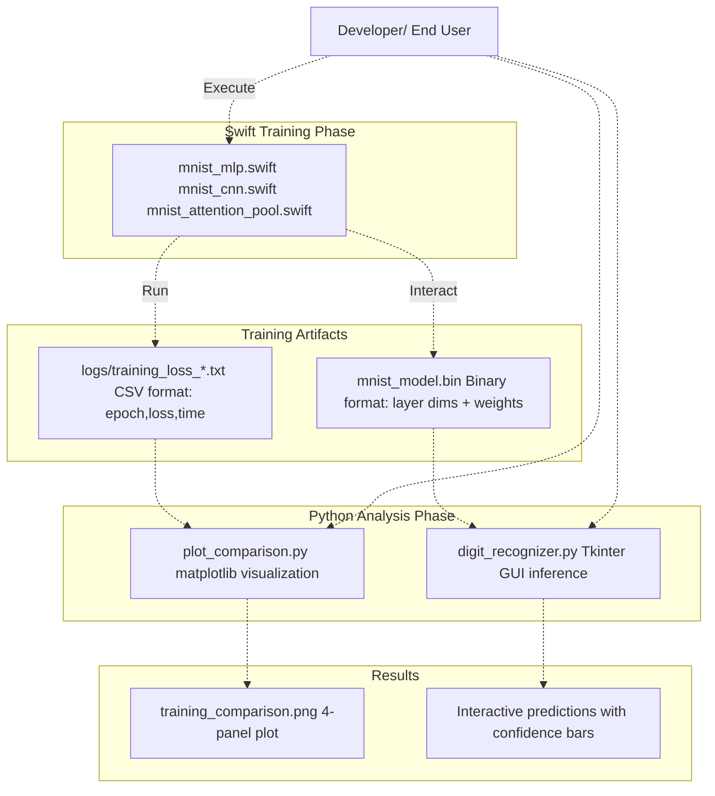
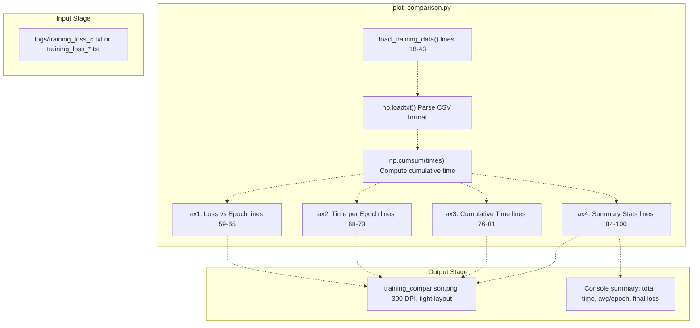
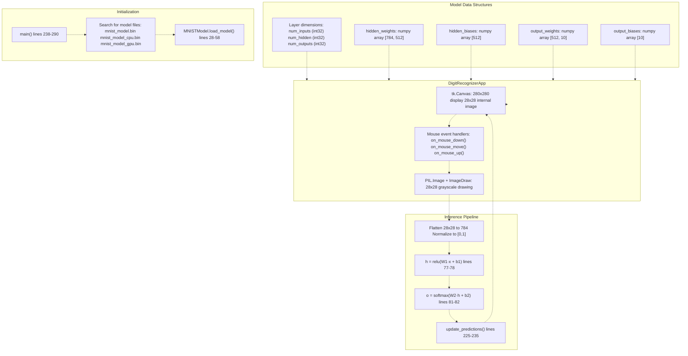
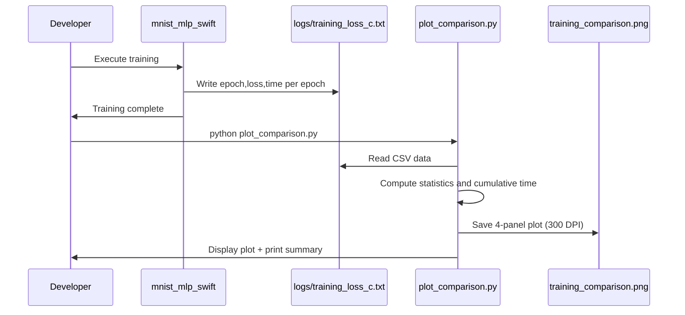
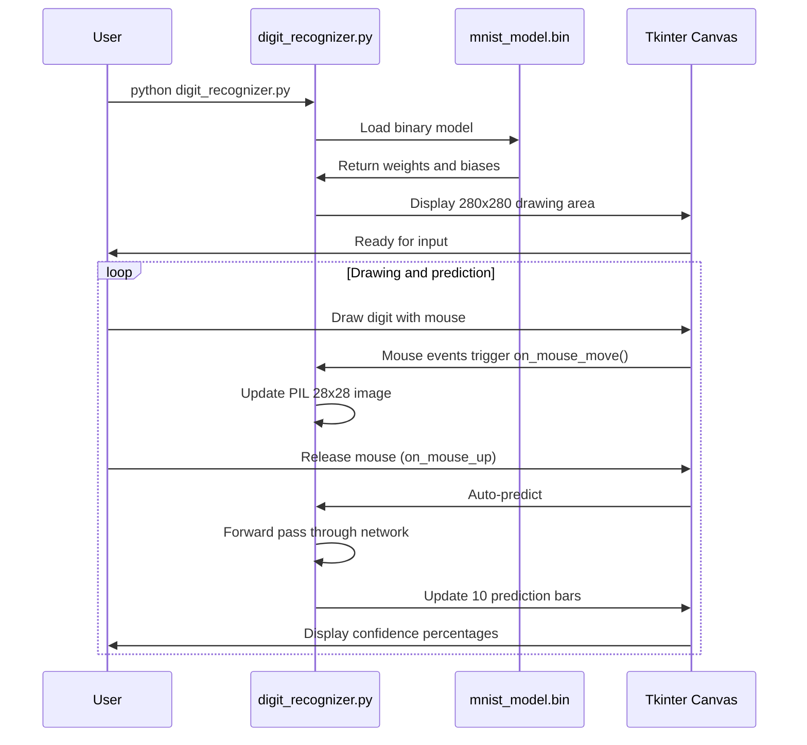

# Python Utilities

> **Relevant source files**
> * [README.md](https://github.com/ThalesMMS/Swift-Neural-Networks/blob/3a1c4fc2/README.md)
> * [digit_recognizer.py](https://github.com/ThalesMMS/Swift-Neural-Networks/blob/3a1c4fc2/digit_recognizer.py)
> * [plot_comparison.py](https://github.com/ThalesMMS/Swift-Neural-Networks/blob/3a1c4fc2/plot_comparison.py)
> * [requirements.txt](https://github.com/ThalesMMS/Swift-Neural-Networks/blob/3a1c4fc2/requirements.txt)

## Purpose and Scope

This page documents the Python utilities provided for post-processing and inference in the Swift-Neural-Networks repository. These utilities operate on artifacts produced by the Swift training systems, enabling visualization of training metrics and interactive inference with trained models.

The Python ecosystem consists of two primary tools:

* **Training visualization** via `plot_comparison.py` - for detailed documentation, see [Training Visualization](#6.1)
* **Interactive digit recognition** via `digit_recognizer.py` - for detailed documentation, see [Interactive Digit Recognizer](#6.2)

For information about the Swift training systems that produce the artifacts consumed by these utilities, see [Training Systems](#4). For details on the binary model format, see [Model Binary Format](#8). For the CSV log format, see [Training Logs Format](#9).

**Sources:**

* [README.md L18-L21](https://github.com/ThalesMMS/Swift-Neural-Networks/blob/3a1c4fc2/README.md#L18-L21)
* [README.md L192-L212](https://github.com/ThalesMMS/Swift-Neural-Networks/blob/3a1c4fc2/README.md#L192-L212)

---

## System Integration

The Python utilities operate in a post-training role, consuming outputs from the Swift training executables. They provide analysis and deployment capabilities without modifying the training pipeline.

### Workflow Position



**Sources:**

* [README.md L24-L28](https://github.com/ThalesMMS/Swift-Neural-Networks/blob/3a1c4fc2/README.md#L24-L28)
* Diagram 1 and Diagram 3 from architecture overview

---

## Component Overview

### plot_comparison.py

A matplotlib-based visualization tool that parses training logs and generates multi-panel performance plots.

| Function | Purpose | Input | Output |
| --- | --- | --- | --- |
| `load_training_data(filepath, max_epochs)` | Parse CSV log file | `logs/training_loss_*.txt` | epochs, losses, times arrays |
| `main()` | Generate 4-panel visualization | Training data arrays | `training_comparison.png` |

The tool generates four subplots:

1. Training loss vs. epoch
2. Time per epoch
3. Cumulative training time
4. Summary statistics panel

**Sources:**

* [plot_comparison.py L1-L120](https://github.com/ThalesMMS/Swift-Neural-Networks/blob/3a1c4fc2/plot_comparison.py#L1-L120)
* [README.md L192-L198](https://github.com/ThalesMMS/Swift-Neural-Networks/blob/3a1c4fc2/README.md#L192-L198)

### digit_recognizer.py

An interactive Tkinter-based GUI application for real-time digit recognition using trained MLP models.

| Class/Function | Purpose | Key Methods |
| --- | --- | --- |
| `MNISTModel` | Model loading and inference | `load_model()`, `predict()`, `relu()`, `softmax()` |
| `DigitRecognizerApp` | GUI and drawing interface | `setup_ui()`, `on_mouse_move()`, `predict()`, `update_predictions()` |
| `main()` | Application entry point | Model file selection and initialization |

**Sources:**

* [digit_recognizer.py L1-L291](https://github.com/ThalesMMS/Swift-Neural-Networks/blob/3a1c4fc2/digit_recognizer.py#L1-L291)
* [README.md L200-L206](https://github.com/ThalesMMS/Swift-Neural-Networks/blob/3a1c4fc2/README.md#L200-L206)

---

## Code Entity Mapping

### Training Visualization Pipeline



**Sources:**

* [plot_comparison.py L18-L120](https://github.com/ThalesMMS/Swift-Neural-Networks/blob/3a1c4fc2/plot_comparison.py#L18-L120)

### Interactive Inference Pipeline



**Sources:**

* [digit_recognizer.py L16-L84](https://github.com/ThalesMMS/Swift-Neural-Networks/blob/3a1c4fc2/digit_recognizer.py#L16-L84)  - MNISTModel class
* [digit_recognizer.py L87-L236](https://github.com/ThalesMMS/Swift-Neural-Networks/blob/3a1c4fc2/digit_recognizer.py#L87-L236)  - DigitRecognizerApp class
* [digit_recognizer.py L238-L290](https://github.com/ThalesMMS/Swift-Neural-Networks/blob/3a1c4fc2/digit_recognizer.py#L238-L290)  - main function

---

## Input Data Formats

### CSV Training Logs

The Python visualization tool expects CSV files in the format produced by Swift training executables:

```
epoch,loss,time
1,0.523456,0.84
2,0.312789,0.82
3,0.198234,0.81
...
```

| Field | Type | Description |
| --- | --- | --- |
| epoch | integer | Epoch number (1-indexed) |
| loss | float | Training loss for the epoch |
| time | float | Epoch duration in seconds |

**Default log file locations:**

* `logs/training_loss_c.txt` - MLP default
* `logs/training_loss_cnn.txt` - CNN model
* `logs/training_loss_attention_mnist.txt` - Attention model

**Sources:**

* [plot_comparison.py L18-L43](https://github.com/ThalesMMS/Swift-Neural-Networks/blob/3a1c4fc2/plot_comparison.py#L18-L43)
* [README.md L24-L30](https://github.com/ThalesMMS/Swift-Neural-Networks/blob/3a1c4fc2/README.md#L24-L30)

### Binary Model Format

The digit recognizer loads models saved in double-precision binary format:

| Offset | Size | Type | Content |
| --- | --- | --- | --- |
| 0x00 | 4 bytes | int32 | num_inputs (784) |
| 0x04 | 4 bytes | int32 | num_hidden (512 default) |
| 0x08 | 4 bytes | int32 | num_outputs (10) |
| 0x0C | 8×784×512 | double[] | hidden_weights row-major |
| ... | 8×512 | double[] | hidden_biases |
| ... | 8×512×10 | double[] | output_weights row-major |
| ... | 8×10 | double[] | output_biases |

**Expected file:** `mnist_model.bin` (default location)

**Sources:**

* [digit_recognizer.py L28-L58](https://github.com/ThalesMMS/Swift-Neural-Networks/blob/3a1c4fc2/digit_recognizer.py#L28-L58)
* [README.md L28](https://github.com/ThalesMMS/Swift-Neural-Networks/blob/3a1c4fc2/README.md#L28-L28)

---

## Dependencies and Installation

### Requirements

The Python utilities require the following packages:

```
numpy
matplotlib
```

Additional implicit dependencies for GUI functionality:

* `tkinter` (standard library, platform-dependent)
* `PIL` / `Pillow` (for image manipulation)

**Sources:**

* [requirements.txt L1-L3](https://github.com/ThalesMMS/Swift-Neural-Networks/blob/3a1c4fc2/requirements.txt#L1-L3)

### Installation

Install dependencies using pip:

```
pip install -r requirements.txt
```

The `tkinter` library is typically included with Python distributions but may require separate installation on some Linux systems:

```
# Ubuntu/Debiansudo apt-get install python3-tk# Fedorasudo dnf install python3-tkinter
```

**Sources:**

* [README.md L208-L212](https://github.com/ThalesMMS/Swift-Neural-Networks/blob/3a1c4fc2/README.md#L208-L212)

---

## Usage Patterns

### Training Visualization Workflow



**Sources:**

* [plot_comparison.py L45-L120](https://github.com/ThalesMMS/Swift-Neural-Networks/blob/3a1c4fc2/plot_comparison.py#L45-L120)
* [README.md L192-L198](https://github.com/ThalesMMS/Swift-Neural-Networks/blob/3a1c4fc2/README.md#L192-L198)

### Interactive Inference Workflow



**Sources:**

* [digit_recognizer.py L171-L204](https://github.com/ThalesMMS/Swift-Neural-Networks/blob/3a1c4fc2/digit_recognizer.py#L171-L204)  - Mouse event handlers
* [digit_recognizer.py L213-L236](https://github.com/ThalesMMS/Swift-Neural-Networks/blob/3a1c4fc2/digit_recognizer.py#L213-L236)  - Prediction workflow
* [digit_recognizer.py L238-L290](https://github.com/ThalesMMS/Swift-Neural-Networks/blob/3a1c4fc2/digit_recognizer.py#L238-L290)  - Main initialization

---

## Error Handling

### plot_comparison.py

| Condition | Behavior |
| --- | --- |
| Log file not found | Prints warning, returns None values |
| Invalid CSV format | Catches exception, prints error message |
| Empty or single-epoch data | Reshapes array, handles gracefully |
| Max epochs exceeded | Truncates data to max_epochs |

**Sources:**

* [plot_comparison.py L24-L43](https://github.com/ThalesMMS/Swift-Neural-Networks/blob/3a1c4fc2/plot_comparison.py#L24-L43)

### digit_recognizer.py

| Condition | Behavior |
| --- | --- |
| No model file found | Searches for alternates, prints available options |
| Invalid model file | Catches FileNotFoundError, prints error message |
| Incorrect file format | Binary read may fail with struct.error |
| Missing tkinter | Runtime ImportError at module load |

**Sources:**

* [digit_recognizer.py L238-L282](https://github.com/ThalesMMS/Swift-Neural-Networks/blob/3a1c4fc2/digit_recognizer.py#L238-L282)

---

## Command-Line Interface

### plot_comparison.py

No command-line arguments. Configuration is hardcoded:

```
LOG_DIR = "./logs"OUTPUT_FILE = "training_comparison.png"LOG_FILE = f"{LOG_DIR}/training_loss_c.txt"
```

**Sources:**

* [plot_comparison.py L11-L16](https://github.com/ThalesMMS/Swift-Neural-Networks/blob/3a1c4fc2/plot_comparison.py#L11-L16)

### digit_recognizer.py

Optional argument for model selection:

```
python digit_recognizer.py [serial|cpu|gpu|cuda]
```

If no argument provided, automatically searches for available model files in order:

1. `mnist_model.bin` (default)
2. `mnist_model_cpu.bin`
3. `mnist_model_gpu.bin`

**Sources:**

* [digit_recognizer.py L240-L273](https://github.com/ThalesMMS/Swift-Neural-Networks/blob/3a1c4fc2/digit_recognizer.py#L240-L273)

Refresh this wiki

Last indexed: 5 January 2026 ([3a1c4f](https://github.com/ThalesMMS/Swift-Neural-Networks/commit/3a1c4fc2))

### On this page

* [Python Utilities](#6-python-utilities)
* [Purpose and Scope](#6-purpose-and-scope)
* [System Integration](#6-system-integration)
* [Workflow Position](#6-workflow-position)
* [Component Overview](#6-component-overview)
* [plot_comparison.py](#6-plot_comparisonpy)
* [digit_recognizer.py](#6-digit_recognizerpy)
* [Code Entity Mapping](#6-code-entity-mapping)
* [Training Visualization Pipeline](#6-training-visualization-pipeline)
* [Interactive Inference Pipeline](#6-interactive-inference-pipeline)
* [Input Data Formats](#6-input-data-formats)
* [CSV Training Logs](#6-csv-training-logs)
* [Binary Model Format](#6-binary-model-format)
* [Dependencies and Installation](#6-dependencies-and-installation)
* [Requirements](#6-requirements)
* [Installation](#6-installation)
* [Usage Patterns](#6-usage-patterns)
* [Training Visualization Workflow](#6-training-visualization-workflow)
* [Interactive Inference Workflow](#6-interactive-inference-workflow)
* [Error Handling](#6-error-handling)
* [plot_comparison.py](#6-plot_comparisonpy-1)
* [digit_recognizer.py](#6-digit_recognizerpy-1)
* [Command-Line Interface](#6-command-line-interface)
* [plot_comparison.py](#6-plot_comparisonpy-2)
* [digit_recognizer.py](#6-digit_recognizerpy-2)

Ask Devin about Swift-Neural-Networks