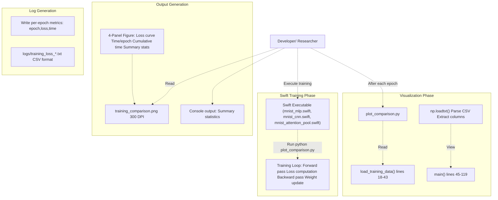
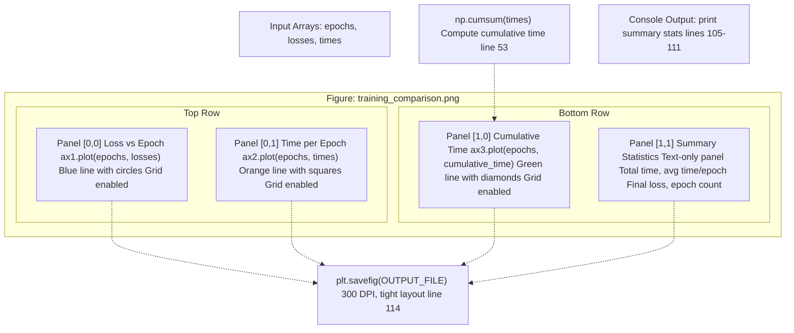
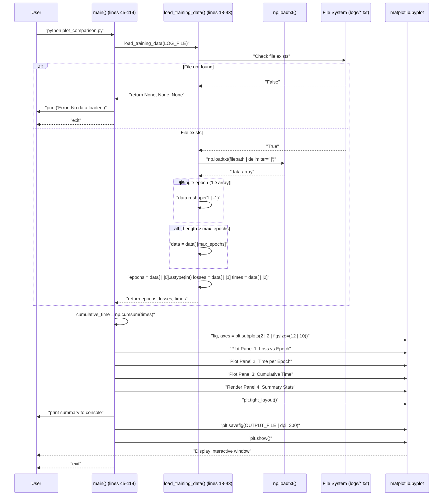

# Training Visualization

> **Relevant source files**
> * [README.md](https://github.com/ThalesMMS/Swift-Neural-Networks/blob/3a1c4fc2/README.md)
> * [plot_comparison.py](https://github.com/ThalesMMS/Swift-Neural-Networks/blob/3a1c4fc2/plot_comparison.py)
> * [requirements.txt](https://github.com/ThalesMMS/Swift-Neural-Networks/blob/3a1c4fc2/requirements.txt)

## Purpose and Scope

This document describes the `plot_comparison.py` utility, which analyzes training logs produced by Swift training executables and generates multi-panel visualizations of model performance. The tool reads CSV log files containing per-epoch metrics and produces a comprehensive training summary with loss curves, timing analysis, and statistical summaries.

For information about the training systems that generate these logs, see [Training Systems](#4). For the log file format specification, see [Training Logs Format](#9). For interactive model inference, see [Interactive Digit Recognizer](#6.2).

**Sources:** [README.md L1-L217](https://github.com/ThalesMMS/Swift-Neural-Networks/blob/3a1c4fc2/README.md#L1-L217)

 [plot_comparison.py L1-L120](https://github.com/ThalesMMS/Swift-Neural-Networks/blob/3a1c4fc2/plot_comparison.py#L1-L120)

---

## System Overview

The training visualization system operates as a post-processing tool in the machine learning workflow. After Swift training executables complete their execution and write performance metrics to CSV files, `plot_comparison.py` parses these logs and generates a four-panel visualization showing training loss progression, timing characteristics, and summary statistics.



**Sources:** [plot_comparison.py L1-L120](https://github.com/ThalesMMS/Swift-Neural-Networks/blob/3a1c4fc2/plot_comparison.py#L1-L120)

 [README.md L192-L198](https://github.com/ThalesMMS/Swift-Neural-Networks/blob/3a1c4fc2/README.md#L192-L198)

---

## Input Format: Training Logs

The visualization tool expects CSV log files with three columns per row, representing per-epoch training metrics. The file format is simple and human-readable:

| Column | Name | Type | Description |
| --- | --- | --- | --- |
| 0 | epoch | int | Epoch number (1-indexed) |
| 1 | loss | float | Training loss value for the epoch |
| 2 | time | float | Wall-clock time in seconds for the epoch |

Example log file content:

```
1,2.301853,0.734
2,0.458392,0.721
3,0.312045,0.719
4,0.245612,0.722
5,0.204398,0.720
```

The `load_training_data()` function [plot_comparison.py L18-L43](https://github.com/ThalesMMS/Swift-Neural-Networks/blob/3a1c4fc2/plot_comparison.py#L18-L43)

 handles file loading with the following characteristics:

* Uses `np.loadtxt()` with comma delimiter [plot_comparison.py L29](https://github.com/ThalesMMS/Swift-Neural-Networks/blob/3a1c4fc2/plot_comparison.py#L29-L29)
* Handles single-epoch edge case by reshaping 1D arrays [plot_comparison.py L30-L31](https://github.com/ThalesMMS/Swift-Neural-Networks/blob/3a1c4fc2/plot_comparison.py#L30-L31)
* Supports `max_epochs` parameter to truncate long training runs [plot_comparison.py L34-L35](https://github.com/ThalesMMS/Swift-Neural-Networks/blob/3a1c4fc2/plot_comparison.py#L34-L35)
* Returns tuple of `(epochs, losses, times)` as NumPy arrays [plot_comparison.py L40](https://github.com/ThalesMMS/Swift-Neural-Networks/blob/3a1c4fc2/plot_comparison.py#L40-L40)
* Returns `(None, None, None)` if file missing or parsing fails [plot_comparison.py L26](https://github.com/ThalesMMS/Swift-Neural-Networks/blob/3a1c4fc2/plot_comparison.py#L26-L26)  [plot_comparison.py L43](https://github.com/ThalesMMS/Swift-Neural-Networks/blob/3a1c4fc2/plot_comparison.py#L43-L43)

**Sources:** [plot_comparison.py L18-L43](https://github.com/ThalesMMS/Swift-Neural-Networks/blob/3a1c4fc2/plot_comparison.py#L18-L43)

---

## Configuration and File Paths

The visualization system uses hardcoded configuration constants at the module level:

```
LOG_DIR = "./logs"OUTPUT_FILE = "training_comparison.png"LOG_FILE = f"{LOG_DIR}/training_loss_c.txt"
```

| Constant | Value | Purpose |
| --- | --- | --- |
| `LOG_DIR` | `"./logs"` | Directory containing training log files [plot_comparison.py L12](https://github.com/ThalesMMS/Swift-Neural-Networks/blob/3a1c4fc2/plot_comparison.py#L12-L12) |
| `OUTPUT_FILE` | `"training_comparison.png"` | Output filename for generated visualization [plot_comparison.py L13](https://github.com/ThalesMMS/Swift-Neural-Networks/blob/3a1c4fc2/plot_comparison.py#L13-L13) |
| `LOG_FILE` | `"./logs/training_loss_c.txt"` | Default input log file path [plot_comparison.py L16](https://github.com/ThalesMMS/Swift-Neural-Networks/blob/3a1c4fc2/plot_comparison.py#L16-L16) |

Note that the hardcoded `LOG_FILE` path points to a specific training run. To analyze different training sessions, users must modify line 16 to reference the appropriate log file (e.g., `training_loss_mps.txt`, `training_loss_cnn.txt`, `training_loss_attention_mnist.txt`).

**Sources:** [plot_comparison.py L11-L16](https://github.com/ThalesMMS/Swift-Neural-Networks/blob/3a1c4fc2/plot_comparison.py#L11-L16)

 [README.md L29-L30](https://github.com/ThalesMMS/Swift-Neural-Networks/blob/3a1c4fc2/README.md#L29-L30)

---

## Visualization Structure

The `main()` function [plot_comparison.py L45-L119](https://github.com/ThalesMMS/Swift-Neural-Networks/blob/3a1c4fc2/plot_comparison.py#L45-L119)

 generates a 2×2 subplot grid with four distinct visualizations plus console output:



### Panel Specifications

**Panel 1: Training Loss** [plot_comparison.py L59-L65](https://github.com/ThalesMMS/Swift-Neural-Networks/blob/3a1c4fc2/plot_comparison.py#L59-L65)

* **Purpose:** Shows training loss convergence over epochs
* **X-axis:** Epoch number
* **Y-axis:** Loss value
* **Style:** Blue line (`#1f77b4`) with circle markers, linewidth 2
* **Grid:** Enabled with 30% transparency, dashed lines

**Panel 2: Time per Epoch** [plot_comparison.py L67-L73](https://github.com/ThalesMMS/Swift-Neural-Networks/blob/3a1c4fc2/plot_comparison.py#L67-L73)

* **Purpose:** Displays per-epoch training time to identify performance variations
* **X-axis:** Epoch number
* **Y-axis:** Time in seconds
* **Style:** Orange line (`#ff7f0e`) with square markers, linewidth 2
* **Grid:** Enabled with 30% transparency, dashed lines

**Panel 3: Cumulative Training Time** [plot_comparison.py L75-L81](https://github.com/ThalesMMS/Swift-Neural-Networks/blob/3a1c4fc2/plot_comparison.py#L75-L81)

* **Purpose:** Shows total elapsed training time as a function of epochs
* **X-axis:** Epoch number
* **Y-axis:** Cumulative time in seconds
* **Style:** Green line (`#2ca02c`) with diamond markers, linewidth 2
* **Grid:** Enabled with 30% transparency, dashed lines
* **Data transformation:** Uses `np.cumsum(times)` [plot_comparison.py L53](https://github.com/ThalesMMS/Swift-Neural-Networks/blob/3a1c4fc2/plot_comparison.py#L53-L53)

**Panel 4: Summary Statistics** [plot_comparison.py L83-L100](https://github.com/ThalesMMS/Swift-Neural-Networks/blob/3a1c4fc2/plot_comparison.py#L83-L100)

* **Purpose:** Displays aggregate training metrics as formatted text
* **Content:** * Total training time (sum of all epoch times) * Average time per epoch (mean of epoch times) * Final training loss (last epoch's loss value) * Total number of epochs completed
* **Style:** Monospace font, centered text, light gray background box

**Sources:** [plot_comparison.py L45-L119](https://github.com/ThalesMMS/Swift-Neural-Networks/blob/3a1c4fc2/plot_comparison.py#L45-L119)

---

## Execution Flow

The following sequence diagram illustrates the complete execution flow when a user invokes the visualization tool:



**Sources:** [plot_comparison.py L18-L119](https://github.com/ThalesMMS/Swift-Neural-Networks/blob/3a1c4fc2/plot_comparison.py#L18-L119)

---

## Dependencies

The visualization system requires two Python packages specified in `requirements.txt`:

| Package | Version | Usage |
| --- | --- | --- |
| `numpy` | (any) | Array operations, CSV parsing via `np.loadtxt()`, cumulative sum via `np.cumsum()` |
| `matplotlib` | (any) | Figure generation, subplot management, plotting primitives, PNG export |

Install dependencies via:

```
pip install -r requirements.txt
```

**Sources:** [requirements.txt L1-L3](https://github.com/ThalesMMS/Swift-Neural-Networks/blob/3a1c4fc2/requirements.txt#L1-L3)

 [README.md L208-L212](https://github.com/ThalesMMS/Swift-Neural-Networks/blob/3a1c4fc2/README.md#L208-L212)

---

## Usage Example

Standard workflow for visualizing training results:

1. **Train a model** (generates logs automatically): ``` ./mnist_mlp_swift --mps --epochs 10# Writes logs/training_loss_mps.txt ```
2. **Update log file path** in `plot_comparison.py` [plot_comparison.py L16](https://github.com/ThalesMMS/Swift-Neural-Networks/blob/3a1c4fc2/plot_comparison.py#L16-L16) : ``` LOG_FILE = f"{LOG_DIR}/training_loss_mps.txt" ```
3. **Run visualization tool**: ``` python plot_comparison.py ```
4. **Review outputs**: * Console displays summary statistics [plot_comparison.py L105-L111](https://github.com/ThalesMMS/Swift-Neural-Networks/blob/3a1c4fc2/plot_comparison.py#L105-L111) * PNG file generated at `training_comparison.png` [plot_comparison.py L114](https://github.com/ThalesMMS/Swift-Neural-Networks/blob/3a1c4fc2/plot_comparison.py#L114-L114) * Interactive matplotlib window opens for inspection [plot_comparison.py L116](https://github.com/ThalesMMS/Swift-Neural-Networks/blob/3a1c4fc2/plot_comparison.py#L116-L116)

Sample console output:

```
==================================================
TRAINING SUMMARY
==================================================
Total Training Time: 7.21 seconds
Average Time/Epoch:  0.72 seconds
Final Loss:          0.204398
==================================================

✓ Graph saved to: training_comparison.png
```

**Sources:** [README.md L192-L198](https://github.com/ThalesMMS/Swift-Neural-Networks/blob/3a1c4fc2/README.md#L192-L198)

 [plot_comparison.py L104-L116](https://github.com/ThalesMMS/Swift-Neural-Networks/blob/3a1c4fc2/plot_comparison.py#L104-L116)

---

## Limitations and Considerations

### Hardcoded File Path

The tool currently requires manual editing of the `LOG_FILE` constant [plot_comparison.py L16](https://github.com/ThalesMMS/Swift-Neural-Networks/blob/3a1c4fc2/plot_comparison.py#L16-L16)

 to analyze different training runs. No command-line argument parsing is implemented.

### Single File Processing

The tool processes only one log file per execution. The filename `plot_comparison.py` suggests multi-file comparison functionality, but the implementation only handles a single input file.

### Max Epochs Parameter

The `load_training_data()` function accepts a `max_epochs` parameter [plot_comparison.py L18](https://github.com/ThalesMMS/Swift-Neural-Networks/blob/3a1c4fc2/plot_comparison.py#L18-L18)

 defaulting to 10, but the `main()` function does not expose this parameter, so it cannot be customized without code modification.

### Missing Error Recovery

If the log file is malformed (e.g., wrong number of columns), the NumPy `loadtxt()` call [plot_comparison.py L29](https://github.com/ThalesMMS/Swift-Neural-Networks/blob/3a1c4fc2/plot_comparison.py#L29-L29)

 will raise an exception that is caught generically [plot_comparison.py L41-L43](https://github.com/ThalesMMS/Swift-Neural-Networks/blob/3a1c4fc2/plot_comparison.py#L41-L43)

 but provides minimal diagnostic information.

### Figure Size and DPI

The figure size is hardcoded to 12×10 inches [plot_comparison.py L56](https://github.com/ThalesMMS/Swift-Neural-Networks/blob/3a1c4fc2/plot_comparison.py#L56-L56)

 and DPI to 300 [plot_comparison.py L114](https://github.com/ThalesMMS/Swift-Neural-Networks/blob/3a1c4fc2/plot_comparison.py#L114-L114)

 These values are suitable for high-resolution displays but may not be optimal for all use cases.

**Sources:** [plot_comparison.py L18-L119](https://github.com/ThalesMMS/Swift-Neural-Networks/blob/3a1c4fc2/plot_comparison.py#L18-L119)

---

## Integration with Training Systems

The visualization tool is designed to work with log files produced by any of the Swift training executables:

| Training System | Default Log File | Documentation |
| --- | --- | --- |
| MNIST MLP | `logs/training_loss_c.txt` | See [MNIST MLP Implementation](#4.1) |
| MNIST CNN | `logs/training_loss_cnn.txt` | See [MNIST CNN Implementation](#4.2) |
| MNIST Attention | `logs/training_loss_attention_mnist.txt` | See [Attention Model Implementation](#4.3) |

All training systems write logs in the same CSV format (epoch, loss, time), ensuring compatibility with the visualization tool regardless of model architecture or backend selection.

**Sources:** [README.md L29-L30](https://github.com/ThalesMMS/Swift-Neural-Networks/blob/3a1c4fc2/README.md#L29-L30)

 [README.md L192-L198](https://github.com/ThalesMMS/Swift-Neural-Networks/blob/3a1c4fc2/README.md#L192-L198)

Refresh this wiki

Last indexed: 5 January 2026 ([3a1c4f](https://github.com/ThalesMMS/Swift-Neural-Networks/commit/3a1c4fc2))

### On this page

* [Training Visualization](#6.1-training-visualization)
* [Purpose and Scope](#6.1-purpose-and-scope)
* [System Overview](#6.1-system-overview)
* [Input Format: Training Logs](#6.1-input-format-training-logs)
* [Configuration and File Paths](#6.1-configuration-and-file-paths)
* [Visualization Structure](#6.1-visualization-structure)
* [Panel Specifications](#6.1-panel-specifications)
* [Execution Flow](#6.1-execution-flow)
* [Dependencies](#6.1-dependencies)
* [Usage Example](#6.1-usage-example)
* [Limitations and Considerations](#6.1-limitations-and-considerations)
* [Hardcoded File Path](#6.1-hardcoded-file-path)
* [Single File Processing](#6.1-single-file-processing)
* [Max Epochs Parameter](#6.1-max-epochs-parameter)
* [Missing Error Recovery](#6.1-missing-error-recovery)
* [Figure Size and DPI](#6.1-figure-size-and-dpi)
* [Integration with Training Systems](#6.1-integration-with-training-systems)

Ask Devin about Swift-Neural-Networks