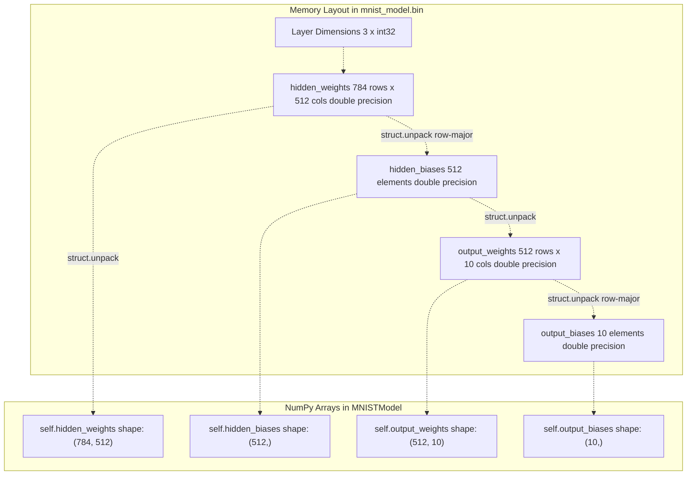
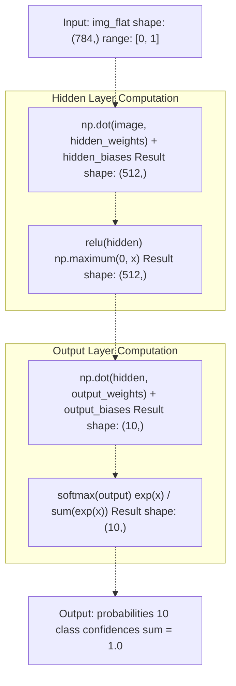
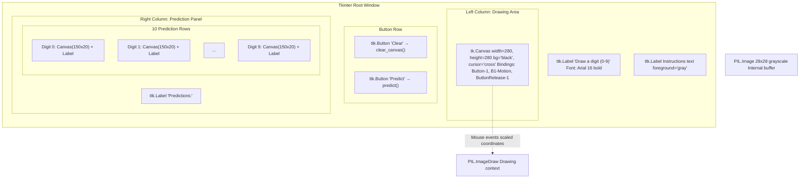
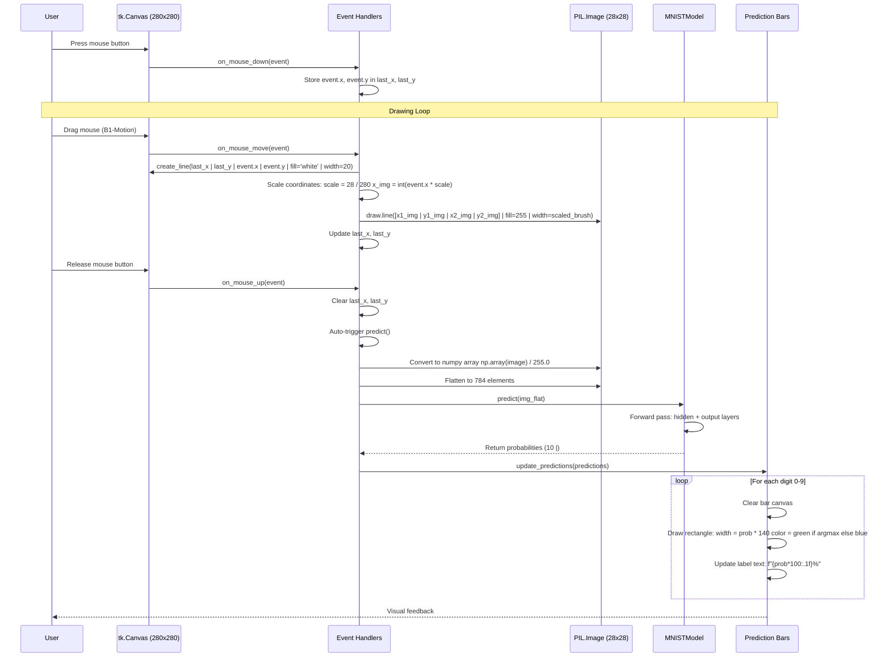
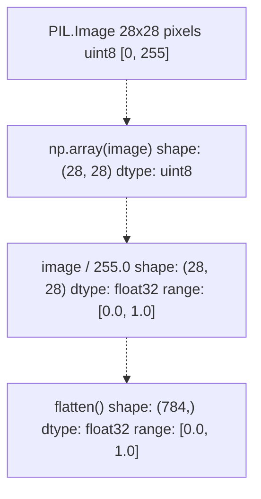
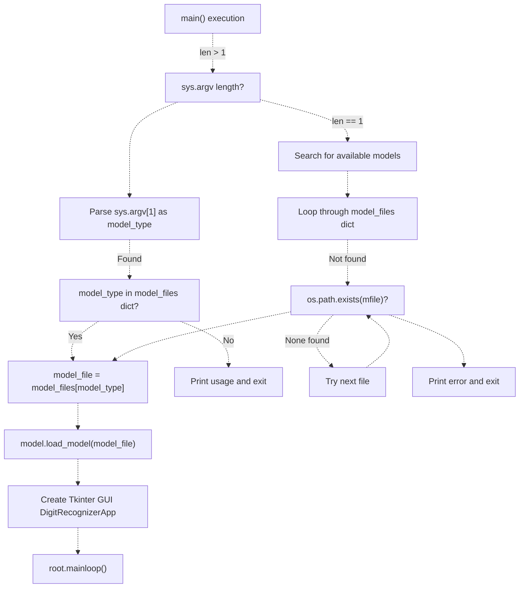
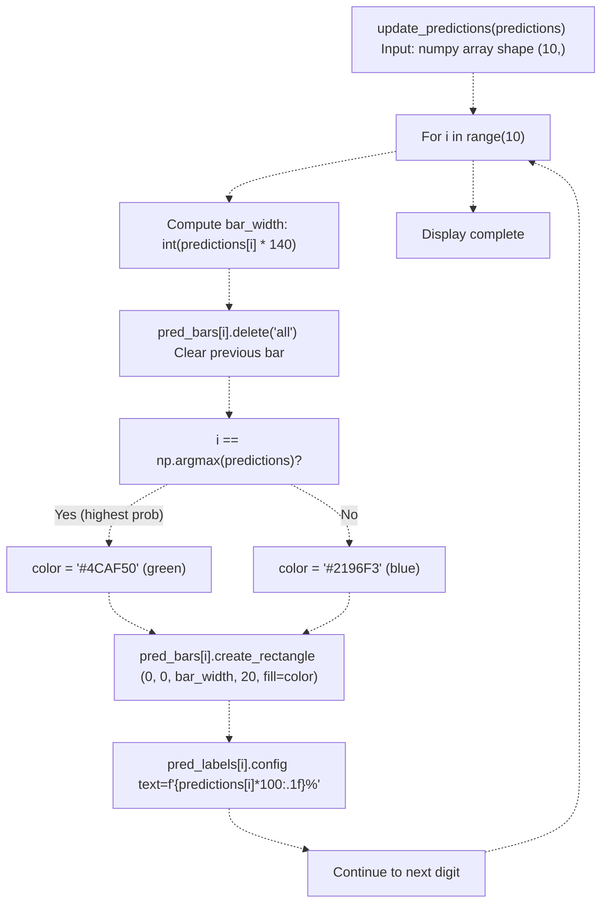
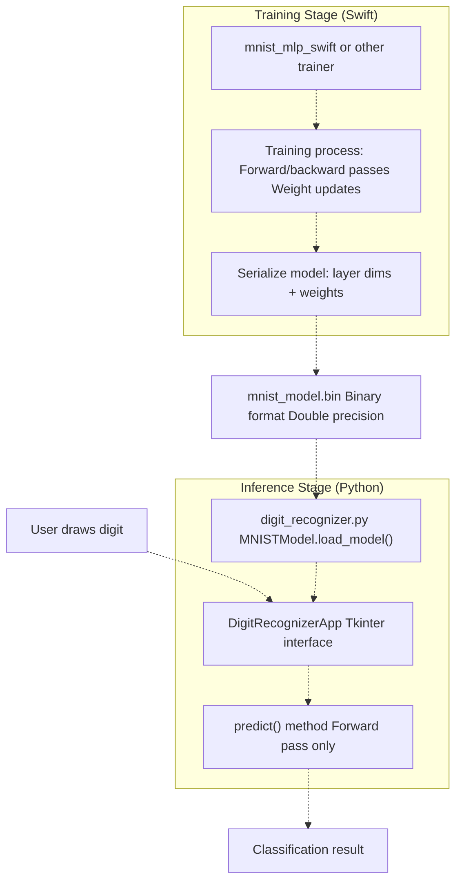

# Interactive Digit Recognizer

> **Relevant source files**
> * [README.md](https://github.com/ThalesMMS/Swift-Neural-Networks/blob/3a1c4fc2/README.md)
> * [digit_recognizer.py](https://github.com/ThalesMMS/Swift-Neural-Networks/blob/3a1c4fc2/digit_recognizer.py)

## Purpose and Scope

This document describes the `digit_recognizer.py` Python application, which provides an interactive graphical user interface for testing trained MNIST models. The application allows users to draw handwritten digits on a canvas and receive real-time classification predictions from a previously trained neural network. This tool serves as the inference and deployment component of the system, consuming binary model files produced by the Swift training executables.

For information about model training, see [MNIST MLP Implementation](4a%20MNIST-MLP-Implementation.md). For details on the binary model format consumed by this application, see [Model Binary Format](8%20Model-Binary-Format.md). For training visualization utilities, see [Training Visualization](6a%20Training-Visualization.md).

**Sources:** [Project overview and setup](https://github.com/ThalesMMS/Swift-Neural-Networks/blob/3a1c4fc2/README.md#L200-L212)

 [digit_recognizer.py L1-L14](https://github.com/ThalesMMS/Swift-Neural-Networks/blob/3a1c4fc2/digit_recognizer.py#L1-L14)

---

## System Architecture

The digit recognizer consists of two primary classes: `MNISTModel` for loading and executing neural network inference, and `DigitRecognizerApp` for managing the Tkinter GUI and user interactions.

### Component Diagram

```mermaid
flowchart TD

MAIN["main() Entry point"]
MODEL_INIT["init() Initialize weights/biases"]
MODEL_LOAD["load_model(filename) Read binary format"]
MODEL_PREDICT["predict(image) Forward pass"]
MODEL_RELU["relu(x) Static activation"]
MODEL_SOFTMAX["softmax(x) Static activation"]
APP_INIT["init(root, model) Initialize GUI"]
APP_SETUP["setup_ui() Create widgets"]
APP_MOUSE_DOWN["on_mouse_down(event) Track start point"]
APP_MOUSE_MOVE["on_mouse_move(event) Draw lines"]
APP_MOUSE_UP["on_mouse_up(event) Trigger prediction"]
APP_CLEAR["clear_canvas() Reset drawing"]
APP_PREDICT["predict() Run inference"]
APP_UPDATE["update_predictions(predictions) Update bars"]
BINARY["mnist_model.bin Binary weights file"]
TK["tkinter.Tk() GUI root window"]
PIL["PIL Image/ImageDraw 28x28 drawing buffer"]

BINARY -.-> MODEL_LOAD
TK -.-> MAIN
PIL -.-> APP_INIT

subgraph digit_recognizer.py ["digit_recognizer.py"]
    MAIN
    MAIN -.-> MODEL_INIT
    MAIN -.-> MODEL_LOAD
    MAIN -.-> APP_INIT

subgraph subGraph1 ["DigitRecognizerApp Class"]
    APP_INIT
    APP_SETUP
    APP_MOUSE_DOWN
    APP_MOUSE_MOVE
    APP_MOUSE_UP
    APP_CLEAR
    APP_PREDICT
    APP_UPDATE
end

subgraph subGraph0 ["MNISTModel Class"]
    MODEL_INIT
    MODEL_LOAD
    MODEL_PREDICT
    MODEL_RELU
    MODEL_SOFTMAX
end
end
```



**Sources:** [digit_recognizer.py L16-L85](https://github.com/ThalesMMS/Swift-Neural-Networks/blob/3a1c4fc2/digit_recognizer.py#L16-L85)

 [digit_recognizer.py L87-L236](https://github.com/ThalesMMS/Swift-Neural-Networks/blob/3a1c4fc2/digit_recognizer.py#L87-L236)

 [digit_recognizer.py L238-L290](https://github.com/ThalesMMS/Swift-Neural-Networks/blob/3a1c4fc2/digit_recognizer.py#L238-L290)

---

## Model Loading Process

The `MNISTModel` class implements binary deserialization of trained model weights. The `load_model` method reads the model file produced by Swift training executables.

### Binary Format Structure

| Offset | Data Type | Description | Size |
| --- | --- | --- | --- |
| 0x00 | `int32` | `num_inputs` (typically 784) | 4 bytes |
| 0x04 | `int32` | `num_hidden` (typically 512) | 4 bytes |
| 0x08 | `int32` | `num_outputs` (typically 10) | 4 bytes |
| 0x0C | `double[]` | Hidden layer weights (row-major: `num_inputs` × `num_hidden`) | 8 × 784 × 512 |
| +offset | `double[]` | Hidden layer biases (`num_hidden`) | 8 × 512 |
| +offset | `double[]` | Output layer weights (row-major: `num_hidden` × `num_outputs`) | 8 × 512 × 10 |
| +offset | `double[]` | Output layer biases (`num_outputs`) | 8 × 10 |

The loading process reads layer dimensions first, allocates NumPy arrays, then unpacks weight matrices row-by-row using the `struct` module with format specifier `'d'` for double-precision floats.

**Code Reference:** [digit_recognizer.py L28-L58](https://github.com/ThalesMMS/Swift-Neural-Networks/blob/3a1c4fc2/digit_recognizer.py#L28-L58)

### Weight Matrix Organization



**Sources:** [digit_recognizer.py L28-L58](https://github.com/ThalesMMS/Swift-Neural-Networks/blob/3a1c4fc2/digit_recognizer.py#L28-L58)

 README.md

---

## Inference Pipeline

The `predict` method implements a forward pass through the two-layer MLP architecture without gradient computation. This matches the architecture defined in the Swift training code.

### Forward Pass Computation



**Mathematical Formulation:**

1. **Hidden Layer:** `hidden = ReLU(image · W₁ + b₁)` where `W₁ ∈ ℝ^(784×512)`, `b₁ ∈ ℝ^512`
2. **Output Layer:** `logits = hidden · W₂ + b₂` where `W₂ ∈ ℝ^(512×10)`, `b₂ ∈ ℝ^10`
3. **Probabilities:** `p = softmax(logits)` where `p[i] = exp(logits[i]) / Σⱼ exp(logits[j])`

**Sources:** [digit_recognizer.py L71-L84](https://github.com/ThalesMMS/Swift-Neural-Networks/blob/3a1c4fc2/digit_recognizer.py#L71-L84)

 [digit_recognizer.py L60-L69](https://github.com/ThalesMMS/Swift-Neural-Networks/blob/3a1c4fc2/digit_recognizer.py#L60-L69)

---

## GUI Components

The `DigitRecognizerApp` class creates a Tkinter interface with three primary regions: drawing canvas, prediction display, and control buttons.

### Layout Structure



**Key Instance Variables:**

| Variable | Type | Purpose |
| --- | --- | --- |
| `self.canvas` | `tk.Canvas` | 280×280 pixel display canvas for user drawing |
| `self.image` | `PIL.Image` | 28×28 grayscale buffer (internal representation) |
| `self.draw` | `PIL.ImageDraw` | Drawing context for PIL image |
| `self.pred_bars` | `list[tk.Canvas]` | 10 bar canvases for visualization |
| `self.pred_labels` | `list[ttk.Label]` | 10 labels showing percentage values |
| `self.last_x`, `self.last_y` | `int` | Previous mouse coordinates for line drawing |

**Sources:** [digit_recognizer.py L90-L170](https://github.com/ThalesMMS/Swift-Neural-Networks/blob/3a1c4fc2/digit_recognizer.py#L90-L170)

 [digit_recognizer.py L96-L101](https://github.com/ThalesMMS/Swift-Neural-Networks/blob/3a1c4fc2/digit_recognizer.py#L96-L101)

 [digit_recognizer.py L137-L154](https://github.com/ThalesMMS/Swift-Neural-Networks/blob/3a1c4fc2/digit_recognizer.py#L137-L154)

---

## Drawing and Prediction Workflow

The application implements real-time drawing with automatic prediction triggering. Mouse events are processed to draw on both the display canvas and the internal 28×28 buffer simultaneously.

### Event Processing Flow



**Coordinate Scaling:** The display canvas operates at 280×280 pixels for better visibility, while the internal PIL image maintains MNIST's native 28×28 resolution. The scaling factor `scale = 28 / 280 = 0.1` is applied to mouse coordinates before drawing to the internal buffer.

**Sources:** [digit_recognizer.py L171-L204](https://github.com/ThalesMMS/Swift-Neural-Networks/blob/3a1c4fc2/digit_recognizer.py#L171-L204)

 [digit_recognizer.py L213-L223](https://github.com/ThalesMMS/Swift-Neural-Networks/blob/3a1c4fc2/digit_recognizer.py#L213-L223)

 [digit_recognizer.py L225-L235](https://github.com/ThalesMMS/Swift-Neural-Networks/blob/3a1c4fc2/digit_recognizer.py#L225-L235)

---

## Data Preprocessing

Before inference, the drawn image undergoes normalization to match the training data distribution.

### Preprocessing Pipeline



**Implementation:** [digit_recognizer.py L214-L217](https://github.com/ThalesMMS/Swift-Neural-Networks/blob/3a1c4fc2/digit_recognizer.py#L214-L217)

```
img_array = np.array(self.image).astype(np.float32) / 255.0img_flat = img_array.flatten()
```

This preprocessing matches the normalization applied during training, where MNIST pixel values (originally uint8 in [0, 255]) are divided by 255.0 to produce float values in [0.0, 1.0].

**Sources:** [digit_recognizer.py L213-L223](https://github.com/ThalesMMS/Swift-Neural-Networks/blob/3a1c4fc2/digit_recognizer.py#L213-L223)

---

## Command-Line Interface

The application accepts an optional command-line argument specifying which model file to load.

### Model File Selection



**Model File Mapping:**

| Argument | File Name | Description |
| --- | --- | --- |
| `serial` | `mnist_model.bin` | Default model from Swift training |
| `cpu` | `mnist_model_cpu.bin` | Alternative CPU model |
| `gpu` | `mnist_model_gpu.bin` | Alternative GPU model |
| `cuda` | `mnist_model_gpu.bin` | CUDA model (same as GPU) |

**Usage Examples:**

```
# Load default model (searches for any available model)python digit_recognizer.py# Load specific model typepython digit_recognizer.py serialpython digit_recognizer.py gpu
```

**Sources:** [digit_recognizer.py L238-L286](https://github.com/ThalesMMS/Swift-Neural-Networks/blob/3a1c4fc2/digit_recognizer.py#L238-L286)

 [digit_recognizer.py L240-L246](https://github.com/ThalesMMS/Swift-Neural-Networks/blob/3a1c4fc2/digit_recognizer.py#L240-L246)

---

## Prediction Display

The prediction panel displays class probabilities as horizontal bar charts with percentage labels. The predicted class (highest probability) is highlighted with a distinct color.

### Bar Visualization Logic



**Bar Width Calculation:** Each bar canvas has a width of 150 pixels, but the rectangle width is computed as `int(predictions[i] * 140)`, leaving a 10-pixel margin. This means a probability of 1.0 (100%) displays as a 140-pixel bar.

**Color Coding:**

* **Green (`#4CAF50`):** Predicted class (highest probability)
* **Blue (`#2196F3`):** All other classes

**Sources:** [digit_recognizer.py L225-L235](https://github.com/ThalesMMS/Swift-Neural-Networks/blob/3a1c4fc2/digit_recognizer.py#L225-L235)

---

## Technical Implementation Details

### Canvas Drawing Parameters

| Parameter | Value | Purpose |
| --- | --- | --- |
| `canvas_size` | 280 | Display canvas dimensions (pixels) |
| `brush_size` | 20 | Brush diameter for display canvas (pixels) |
| PIL image size | 28×28 | Native MNIST resolution |
| PIL brush size | `max(1, int(brush_size * scale))` | Scaled brush for internal buffer |
| Scale factor | 0.1 | Ratio of PIL size to display size (28/280) |

### Mouse Event Bindings

| Event | Handler | Description |
| --- | --- | --- |
| `<Button-1>` | `on_mouse_down` | Left mouse button press |
| `<B1-Motion>` | `on_mouse_move` | Mouse movement while button held |
| `<ButtonRelease-1>` | `on_mouse_up` | Left mouse button release |

The application uses `capstyle=tk.ROUND` for line drawing to create smooth, continuous strokes rather than segmented rectangular lines.

**Sources:** [digit_recognizer.py L95-L108](https://github.com/ThalesMMS/Swift-Neural-Networks/blob/3a1c4fc2/digit_recognizer.py#L95-L108)

 [digit_recognizer.py L126-L128](https://github.com/ThalesMMS/Swift-Neural-Networks/blob/3a1c4fc2/digit_recognizer.py#L126-L128)

 [digit_recognizer.py L183-L194](https://github.com/ThalesMMS/Swift-Neural-Networks/blob/3a1c4fc2/digit_recognizer.py#L183-L194)

---

## Dependencies

The application requires the following Python packages:

| Package | Purpose |
| --- | --- |
| `numpy` | Numerical operations, array manipulation, inference computation |
| `tkinter` | GUI framework (standard library, but may require separate install on some systems) |
| `Pillow` (PIL) | Image creation, drawing primitives, pixel buffer management |

**Installation:**

```
pip install -r requirements.txt
```

**Sources:** [Project overview and setup](https://github.com/ThalesMMS/Swift-Neural-Networks/blob/3a1c4fc2/README.md#L208-L212)

 [digit_recognizer.py L7-L13](https://github.com/ThalesMMS/Swift-Neural-Networks/blob/3a1c4fc2/digit_recognizer.py#L7-L13)

---

## Integration with Training Pipeline

The digit recognizer serves as the final stage in the machine learning workflow, consuming artifacts produced by the Swift training executables.

### Data Flow Integration



The binary model file acts as the interface contract between training and inference systems. The model must be trained before the digit recognizer can function. If no model file exists, the application displays an error message and exits gracefully.

**Sources:** [digit_recognizer.py L238-L286](https://github.com/ThalesMMS/Swift-Neural-Networks/blob/3a1c4fc2/digit_recognizer.py#L238-L286)

 **Sources**: [Project overview and setup](https://github.com/ThalesMMS/Swift-Neural-Networks/blob/3a1c4fc2/README.md#L200-L212)


### On this page

* [Interactive Digit Recognizer](#6.2-interactive-digit-recognizer)
* [Purpose and Scope](#6.2-purpose-and-scope)
* [System Architecture](#6.2-system-architecture)
* [Component Diagram](#6.2-component-diagram)
* [Model Loading Process](#6.2-model-loading-process)
* [Binary Format Structure](#6.2-binary-format-structure)
* [Weight Matrix Organization](#6.2-weight-matrix-organization)
* [Inference Pipeline](#6.2-inference-pipeline)
* [Forward Pass Computation](#6.2-forward-pass-computation)
* [GUI Components](#6.2-gui-components)
* [Layout Structure](#6.2-layout-structure)
* [Drawing and Prediction Workflow](#6.2-drawing-and-prediction-workflow)
* [Event Processing Flow](#6.2-event-processing-flow)
* [Data Preprocessing](#6.2-data-preprocessing)
* [Preprocessing Pipeline](#6.2-preprocessing-pipeline)
* [Command-Line Interface](#6.2-command-line-interface)
* [Model File Selection](#6.2-model-file-selection)
* [Prediction Display](#6.2-prediction-display)
* [Bar Visualization Logic](#6.2-bar-visualization-logic)
* [Technical Implementation Details](#6.2-technical-implementation-details)
* [Canvas Drawing Parameters](#6.2-canvas-drawing-parameters)
* [Mouse Event Bindings](#6.2-mouse-event-bindings)
* [Dependencies](#6.2-dependencies)
* [Integration with Training Pipeline](#6.2-integration-with-training-pipeline)
* [Data Flow Integration](#6.2-data-flow-integration)

Ask Devin about Swift-Neural-Networks