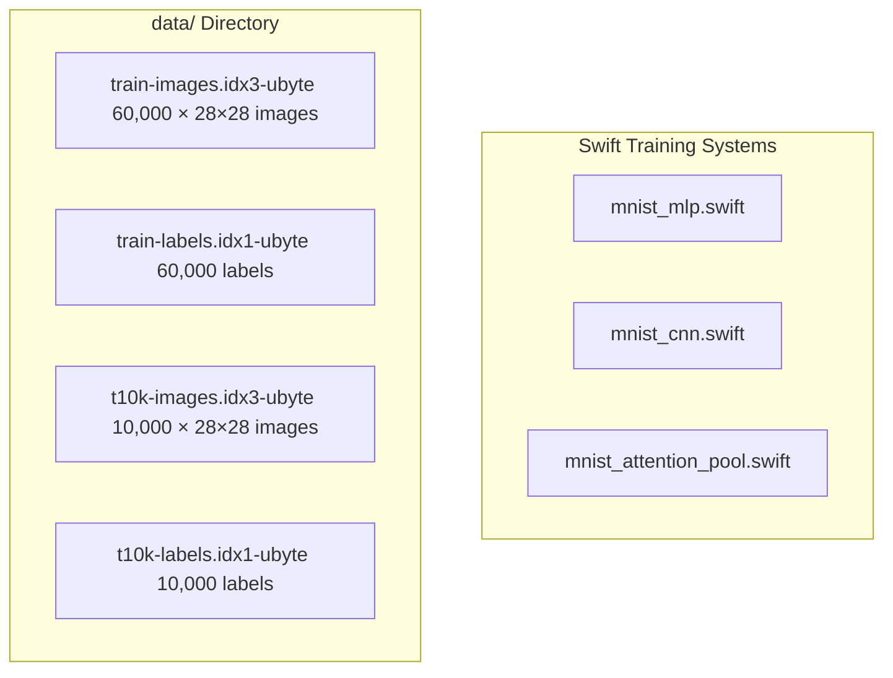
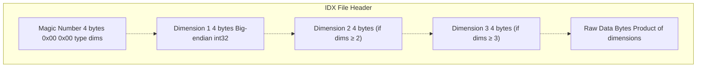
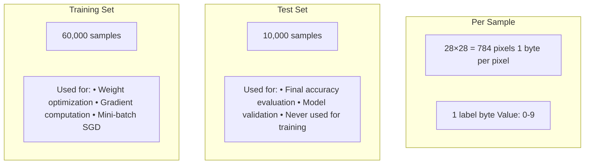
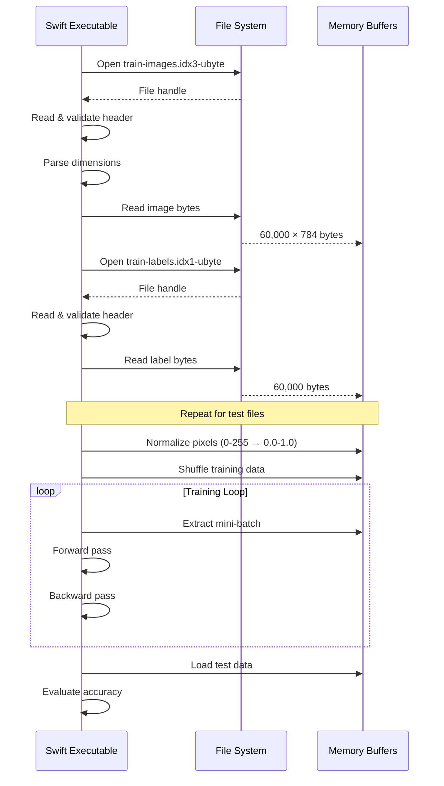
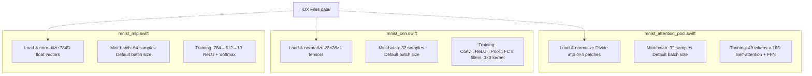

# MNIST Dataset

> **Relevant source files**
> * [README.md](https://github.com/ThalesMMS/Swift-Neural-Networks/blob/3a1c4fc2/README.md)
> * [data/t10k-images-idx3-ubyte/t10k-images-idx3-ubyte](https://github.com/ThalesMMS/Swift-Neural-Networks/blob/3a1c4fc2/data/t10k-images-idx3-ubyte/t10k-images-idx3-ubyte)
> * [data/t10k-images.idx3-ubyte](https://github.com/ThalesMMS/Swift-Neural-Networks/blob/3a1c4fc2/data/t10k-images.idx3-ubyte)
> * [data/t10k-labels-idx1-ubyte/t10k-labels-idx1-ubyte](https://github.com/ThalesMMS/Swift-Neural-Networks/blob/3a1c4fc2/data/t10k-labels-idx1-ubyte/t10k-labels-idx1-ubyte)
> * [data/t10k-labels.idx1-ubyte](https://github.com/ThalesMMS/Swift-Neural-Networks/blob/3a1c4fc2/data/t10k-labels.idx1-ubyte)

This document describes the MNIST (Modified National Institute of Standards and Technology) dataset used for training digit classification models in this codebase. It covers the dataset structure, IDX binary file format, file organization in the repository, and how the training systems consume this data.

For information about how specific model architectures use this dataset, see [Training Systems](4%20Training-Systems.md). For details on the binary model format that stores trained weights, see [Model Binary Format](8%20Model-Binary-Format.md).

---

## Purpose and Overview

The MNIST dataset is a collection of 70,000 grayscale handwritten digit images (0-9) used as a standard benchmark for image classification tasks. The dataset is split into 60,000 training samples and 10,000 test samples. Each image is 28×28 pixels with pixel values ranging from 0-255 representing grayscale intensity.

This codebase stores the dataset in the standardized IDX binary format developed by Yann LeCun. All Swift training implementations ([mnist_mlp.swift](4a%20MNIST-MLP-Implementation.md), [mnist_cnn.swift](4b%20MNIST-CNN-Implementation.md), [mnist_attention_pool.swift](4c%20Attention-Model-Implementation.md)) load data from these IDX files during training and evaluation.

**Sources:** [Project overview and setup](https://github.com/ThalesMMS/Swift-Neural-Networks/blob/3a1c4fc2/README.md#L178-L191)

---

## Dataset Files and Organization

The MNIST dataset consists of four IDX-format binary files stored in the `data/` directory:

| File Name | Type | Count | Dimensions | Description |
| --- | --- | --- | --- | --- |
| `train-images.idx3-ubyte` | Images | 60,000 | 28×28×1 | Training set images |
| `train-labels.idx1-ubyte` | Labels | 60,000 | Single byte | Training set labels (0-9) |
| `t10k-images.idx3-ubyte` | Images | 10,000 | 28×28×1 | Test set images |
| `t10k-labels.idx1-ubyte` | Labels | 10,000 | Single byte | Test set labels (0-9) |

The file naming convention uses `t10k` (ten thousand) to indicate the test set, while training files use the full `train` prefix.



**Sources:** [Project overview and setup](https://github.com/ThalesMMS/Swift-Neural-Networks/blob/3a1c4fc2/README.md#L178-L191)

 [data/train-images.idx3-ubyte](https://github.com/ThalesMMS/Swift-Neural-Networks/blob/3a1c4fc2/data/train-images.idx3-ubyte)

 [data/train-labels.idx1-ubyte](https://github.com/ThalesMMS/Swift-Neural-Networks/blob/3a1c4fc2/data/train-labels.idx1-ubyte)

 [data/t10k-images.idx3-ubyte](https://github.com/ThalesMMS/Swift-Neural-Networks/blob/3a1c4fc2/data/t10k-images.idx3-ubyte)

 [data/t10k-labels.idx1-ubyte](https://github.com/ThalesMMS/Swift-Neural-Networks/blob/3a1c4fc2/data/t10k-labels.idx1-ubyte)

---

## IDX Binary File Format

The IDX format is a simple binary format for storing multi-dimensional arrays. Each file begins with a magic number that encodes the data type and number of dimensions, followed by dimension sizes, then the raw data.

### Header Structure



### Magic Number Format

The magic number is a 4-byte value structured as:

* Byte 0: Always `0x00`
* Byte 1: Always `0x00`
* Byte 2: Data type code * `0x08` = unsigned byte (ubyte) * `0x09` = signed byte * `0x0B` = short (2 bytes) * `0x0C` = int (4 bytes) * `0x0D` = float (4 bytes) * `0x0E` = double (8 bytes)
* Byte 3: Number of dimensions

### MNIST-Specific Headers

**Image Files** (`idx3-ubyte`):

```yaml
Magic: 0x00000803 (unsigned byte, 3 dimensions)
Dim 1: Number of images (60000 or 10000)
Dim 2: Rows (28)
Dim 3: Columns (28)
Data: image_count × 28 × 28 bytes
```

**Label Files** (`idx1-ubyte`):

```yaml
Magic: 0x00000801 (unsigned byte, 1 dimension)
Dim 1: Number of labels (60000 or 10000)
Data: label_count bytes (values 0-9)
```

**Sources:** [data/train-images.idx3-ubyte L1](https://github.com/ThalesMMS/Swift-Neural-Networks/blob/3a1c4fc2/data/train-images.idx3-ubyte#L1-L1)

 [data/train-labels.idx1-ubyte L1](https://github.com/ThalesMMS/Swift-Neural-Networks/blob/3a1c4fc2/data/train-labels.idx1-ubyte#L1-L1)

 [data/t10k-images.idx3-ubyte L1](https://github.com/ThalesMMS/Swift-Neural-Networks/blob/3a1c4fc2/data/t10k-images.idx3-ubyte#L1-L1)

 [data/t10k-labels.idx1-ubyte L1](https://github.com/ThalesMMS/Swift-Neural-Networks/blob/3a1c4fc2/data/t10k-labels.idx1-ubyte#L1-L1)

---

## Data Characteristics

### Image Properties

* **Dimensions:** 28 × 28 pixels
* **Channels:** 1 (grayscale)
* **Pixel Format:** 8-bit unsigned integers (0-255)
* **Encoding:** Raw byte values, no compression
* **Layout:** Row-major order (left-to-right, top-to-bottom)

### Label Properties

* **Range:** 0-9 (ten classes for digits)
* **Format:** Single byte per label
* **Encoding:** Direct integer representation (no one-hot encoding in raw data)

### Dataset Statistics



**Sources:** [README.md L6-L7](https://github.com/ThalesMMS/Swift-Neural-Networks/blob/3a1c4fc2/README.md#L6-L7)

 **Sources**: [Project overview and setup](https://github.com/ThalesMMS/Swift-Neural-Networks/blob/3a1c4fc2/README.md#L178-L185)

---

## Obtaining the Dataset

The MNIST dataset files are not included in the repository by default due to size constraints. They must be downloaded separately and placed in the `data/` directory.

### Download Sources

1. **Kaggle Dataset:** * URL: [https://www.kaggle.com/datasets/hojjatk/mnist-dataset](https://www.kaggle.com/datasets/hojjatk/mnist-dataset) * Provides all four IDX files in a single archive
2. **Original Yann LeCun Site:** * URL: [http://yann.lecun.com/exdb/mnist/](http://yann.lecun.com/exdb/mnist/) * Individual gzipped files that need to be decompressed

### Required Setup

The codebase expects the following file structure:

```
Swift-Neural-Networks/
└── data/
    ├── train-images.idx3-ubyte
    ├── train-labels.idx1-ubyte
    ├── t10k-images.idx3-ubyte
    └── t10k-labels.idx1-ubyte
```

All training executables will fail if these files are not present in the `data/` directory.

**Sources:** [Project overview and setup](https://github.com/ThalesMMS/Swift-Neural-Networks/blob/3a1c4fc2/README.md#L188-L190)

---

## Usage in Training Systems

### Data Loading Process



### Data Flow Through Model Architectures



### Preprocessing Steps

Each training system performs the following preprocessing:

1. **Load Raw Data:** Read IDX files from disk
2. **Validate Headers:** Check magic numbers and dimensions
3. **Normalize Pixels:** Convert bytes (0-255) to floats (0.0-1.0)
4. **Shuffle Training Data:** Randomize order for each epoch
5. **Batch Formation:** Group samples into mini-batches
6. **Architecture-Specific Transform:** * MLP: Flatten 28×28 → 784D vector * CNN: Preserve 28×28 spatial structure * Attention: Divide into 7×7 grid of 4×4 patches

**Sources:** README.md

---

## Data Format in Memory

### Raw Pixel Values (Pre-normalization)

Each pixel is stored as an unsigned 8-bit integer:

* `0` = Black (no intensity)
* `255` = White (maximum intensity)
* Values in between represent gray shades

### Normalized Values (Post-normalization)

For neural network training, pixels are normalized to floating-point:

* Original byte value ÷ 255.0
* Range: [0.0, 1.0]
* Helps with gradient stability and convergence

### Label Encoding

Labels remain as integer class indices during training:

* Not one-hot encoded in data files
* Converted to one-hot during loss computation (implicitly in softmax)
* Example: Label `3` → Softmax target at index 3

**Sources:** [README.md L6-L7](https://github.com/ThalesMMS/Swift-Neural-Networks/blob/3a1c4fc2/README.md#L6-L7)

 README.md

---

## Git Configuration

The dataset files are excluded from version control to prevent repository bloat:

* **Tracked:** Source code, configuration, README
* **Ignored:** `data/*.idx3-ubyte`, `data/*.idx1-ubyte`

Developers must download the dataset independently after cloning the repository. The `.gitignore` file contains patterns to exclude these large binary files.

**Sources:** README.md

---

## Dataset Variants and Alternatives

While this codebase uses the standard MNIST dataset, there are related datasets that could be substituted:

* **Fashion-MNIST:** 28×28 grayscale images of clothing items (same format)
* **EMNIST:** Extended MNIST with letters and digits
* **KMNIST:** Japanese Kuzushiji characters
* **QMNIST:** Extended test set with 60,000 additional samples

All use the same IDX format and dimensions, making them compatible with minimal code changes.

**Sources:** [Project overview and setup](https://github.com/ThalesMMS/Swift-Neural-Networks/blob/3a1c4fc2/README.md#L178-L190)


### On this page

* [MNIST Dataset](7%20MNIST-Dataset.md)
* [Purpose and Overview](7%20MNIST-Dataset.md)
* [Dataset Files and Organization](7%20MNIST-Dataset.md)
* [IDX Binary File Format](7%20MNIST-Dataset.md)
* [Header Structure](7%20MNIST-Dataset.md)
* [Magic Number Format](7%20MNIST-Dataset.md)
* [MNIST-Specific Headers](7%20MNIST-Dataset.md)
* [Data Characteristics](7%20MNIST-Dataset.md)
* [Image Properties](7%20MNIST-Dataset.md)
* [Label Properties](7%20MNIST-Dataset.md)
* [Dataset Statistics](7%20MNIST-Dataset.md)
* [Obtaining the Dataset](7%20MNIST-Dataset.md)
* [Download Sources](7%20MNIST-Dataset.md)
* [Required Setup](7%20MNIST-Dataset.md)
* [Usage in Training Systems](7%20MNIST-Dataset.md)
* [Data Loading Process](7%20MNIST-Dataset.md)
* [Data Flow Through Model Architectures](7%20MNIST-Dataset.md)
* [Preprocessing Steps](7%20MNIST-Dataset.md)
* [Data Format in Memory](7%20MNIST-Dataset.md)
* [Raw Pixel Values (Pre-normalization)](7%20MNIST-Dataset.md)
* [Normalized Values (Post-normalization)](7%20MNIST-Dataset.md)
* [Label Encoding](7%20MNIST-Dataset.md)
* [Git Configuration](7%20MNIST-Dataset.md)
* [Dataset Variants and Alternatives](7%20MNIST-Dataset.md)

Ask Devin about Swift-Neural-Networks