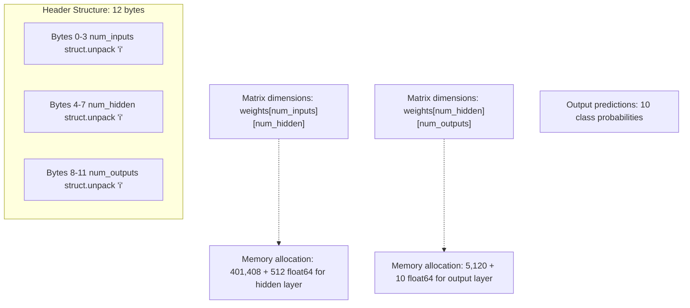
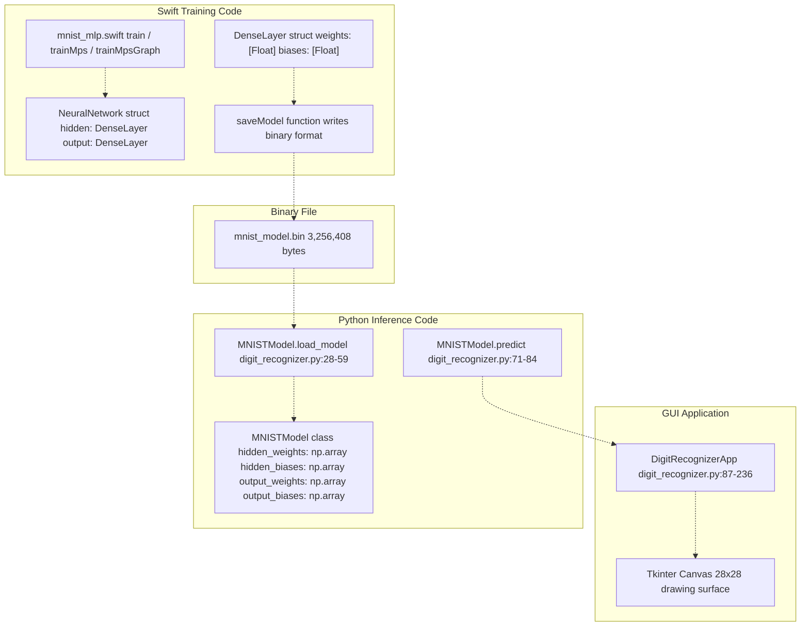
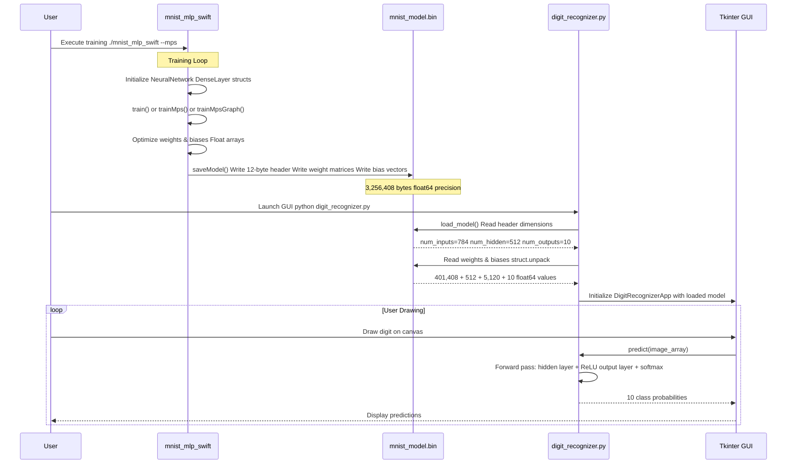

# Model Binary Format

> **Relevant source files**
> * [README.md](https://github.com/ThalesMMS/Swift-Neural-Networks/blob/3a1c4fc2/README.md)
> * [digit_recognizer.py](https://github.com/ThalesMMS/Swift-Neural-Networks/blob/3a1c4fc2/digit_recognizer.py)
> * [mlp_simple.swift](https://github.com/ThalesMMS/Swift-Neural-Networks/blob/3a1c4fc2/mlp_simple.swift)
> * [mnist_cnn.swift](https://github.com/ThalesMMS/Swift-Neural-Networks/blob/3a1c4fc2/mnist_cnn.swift)
> * [mnist_mlp.swift](https://github.com/ThalesMMS/Swift-Neural-Networks/blob/3a1c4fc2/mnist_mlp.swift)

## Purpose and Scope

This document describes the binary serialization format used to save and load trained neural network models in the Swift-Neural-Networks repository. The format stores the complete state of a two-layer MLP (Multi-Layer Perceptron) network, including layer dimensions, weights, and biases.

The binary format is specifically designed for the MLP architecture (784→512→10) used in MNIST classification. For information about the network architecture itself, see [MNIST MLP Implementation](4a%20MNIST-MLP-Implementation.md). For interactive inference using saved models, see [Interactive Digit Recognizer](6b%20Interactive-Digit-Recognizer.md).

**Sources:** [README.md L10](https://github.com/ThalesMMS/Swift-Neural-Networks/blob/3a1c4fc2/README.md#L10-L10)

 README.md

 [digit_recognizer.py L1-L59](https://github.com/ThalesMMS/Swift-Neural-Networks/blob/3a1c4fc2/digit_recognizer.py#L1-L59)

---

## File Structure Overview

The binary model file (`mnist_model.bin`) consists of a header section followed by sequential weight and bias data for each layer. All data is stored in a platform-dependent binary format without any compression or encoding.

| Section | Data Type | Count | Size (bytes) | Description |
| --- | --- | --- | --- | --- |
| Header: `num_inputs` | `int32` | 1 | 4 | Input layer size (784) |
| Header: `num_hidden` | `int32` | 1 | 4 | Hidden layer size (512) |
| Header: `num_outputs` | `int32` | 1 | 4 | Output layer size (10) |
| Hidden layer weights | `float64` | 784 × 512 | 3,211,264 | Matrix stored row-major |
| Hidden layer biases | `float64` | 512 | 4,096 | Bias vector |
| Output layer weights | `float64` | 512 × 10 | 40,960 | Matrix stored row-major |
| Output layer biases | `float64` | 10 | 80 | Bias vector |
| **Total** |  |  | **3,256,408** | Complete model file |

**Sources:** [digit_recognizer.py L28-L59](https://github.com/ThalesMMS/Swift-Neural-Networks/blob/3a1c4fc2/digit_recognizer.py#L28-L59)

---

## Binary Layout Diagram

```mermaid
flowchart TD

OW["output_weights 5,120 float64 values 40,960 bytes shape: [512, 10]"]
HEADER["File Header 12 bytes"]
INPUT["num_inputs: int32 bytes 0-3 value: 784"]
HIDDEN["num_hidden: int32 bytes 4-7 value: 512"]
OUTPUT["num_outputs: int32 bytes 8-11 value: 10"]
HW["hidden_weights 401,408 float64 values 3,211,264 bytes shape: [784, 512]"]
HB["hidden_biases 512 float64 values 4,096 bytes shape: [512]"]
OB["output_biases 10 float64 values 80 bytes shape: [10]"]

subgraph subGraph3 ["mnist_model.bin File Structure"]
    HEADER
    HEADER -.-> INPUT
    OUTPUT -.-> HW
    HB -.-> OW

subgraph subGraph2 ["Output Layer Parameters"]
    OW
    OB
    OW -.-> OB
end

subgraph subGraph1 ["Hidden Layer Parameters"]
    HW
    HB
    HW -.-> HB
end

subgraph subGraph0 ["Layer Dimensions"]
    INPUT
    HIDDEN
    OUTPUT
    INPUT -.-> HIDDEN
    HIDDEN -.-> OUTPUT
end
end
```



**Sources:** [digit_recognizer.py L28-L59](https://github.com/ThalesMMS/Swift-Neural-Networks/blob/3a1c4fc2/digit_recognizer.py#L28-L59)

---

## Data Types and Precision

The binary format uses two fundamental data types:

### Integer Type (int32)

* **Size:** 4 bytes
* **Usage:** Layer dimension metadata in the header
* **Format:** Signed 32-bit integer
* **Endianness:** Platform-dependent (native byte order)

### Floating Point Type (float64)

* **Size:** 8 bytes per value
* **Usage:** All weight and bias parameters
* **Format:** IEEE 754 double-precision floating point
* **Precision:** ~15-17 decimal digits
* **Range:** ±2.23×10⁻³⁰⁸ to ±1.80×10³⁰⁸

The choice of double precision ensures numerical stability during inference and allows models trained on different platforms to produce consistent results despite minor floating-point variations.

**Sources:** [digit_recognizer.py L32-L56](https://github.com/ThalesMMS/Swift-Neural-Networks/blob/3a1c4fc2/digit_recognizer.py#L32-L56)

---

## Layer Dimension Header

The first 12 bytes of the file encode the network architecture as three consecutive 32-bit integers:



These dimensions are read sequentially by the Python inference code:

```
# digit_recognizer.py:32-34self.num_inputs = struct.unpack('i', f.read(4))[0]self.num_hidden = struct.unpack('i', f.read(4))[0]self.num_outputs = struct.unpack('i', f.read(4))[0]
```

**Sources:** [digit_recognizer.py L32-L34](https://github.com/ThalesMMS/Swift-Neural-Networks/blob/3a1c4fc2/digit_recognizer.py#L32-L34)

---

## Weight Matrix Storage Format

Weight matrices are stored in **row-major order** (C/Python convention), where consecutive memory locations represent consecutive elements within a row.

### Hidden Layer Weights

The hidden layer weight matrix has shape `[num_inputs, num_hidden]` = `[784, 512]`:

```
Row 0:  W[0,0]   W[0,1]   W[0,2]   ... W[0,511]
Row 1:  W[1,0]   W[1,1]   W[1,2]   ... W[1,511]
Row 2:  W[2,0]   W[2,1]   W[2,2]   ... W[2,511]
...
Row 783: W[783,0] W[783,1] W[783,2] ... W[783,511]
```

Each row is read sequentially:

```css
# digit_recognizer.py:38-42self.hidden_weights = np.zeros((self.num_inputs, self.num_hidden))for i in range(self.num_inputs):    weights_data = f.read(8 * self.num_hidden)    self.hidden_weights[i, :] = struct.unpack(f'{self.num_hidden}d', weights_data)
```

### Output Layer Weights

The output layer weight matrix has shape `[num_hidden, num_outputs]` = `[512, 10]`, stored identically in row-major order.

```css
# digit_recognizer.py:49-52self.output_weights = np.zeros((self.num_hidden, self.num_outputs))for i in range(self.num_hidden):    weights_data = f.read(8 * self.num_outputs)    self.output_weights[i, :] = struct.unpack(f'{self.num_outputs}d', weights_data)
```

**Sources:** [digit_recognizer.py L38-L52](https://github.com/ThalesMMS/Swift-Neural-Networks/blob/3a1c4fc2/digit_recognizer.py#L38-L52)

---

## Bias Vector Storage Format

Bias vectors are stored as sequential arrays of `float64` values immediately following their corresponding weight matrices:

### Hidden Layer Biases

* **Shape:** `[512]`
* **Storage:** 512 consecutive `float64` values
* **Total bytes:** 4,096

```css
# digit_recognizer.py:45-46biases_data = f.read(8 * self.num_hidden)self.hidden_biases = np.array(struct.unpack(f'{self.num_hidden}d', biases_data))
```

### Output Layer Biases

* **Shape:** `[10]`
* **Storage:** 10 consecutive `float64` values
* **Total bytes:** 80

```css
# digit_recognizer.py:55-56biases_data = f.read(8 * self.num_outputs)self.output_biases = np.array(struct.unpack(f'{self.num_outputs}d', biases_data))
```

**Sources:** [digit_recognizer.py L45-L46](https://github.com/ThalesMMS/Swift-Neural-Networks/blob/3a1c4fc2/digit_recognizer.py#L45-L46)

 [digit_recognizer.py L55-L56](https://github.com/ThalesMMS/Swift-Neural-Networks/blob/3a1c4fc2/digit_recognizer.py#L55-L56)

---

## Code Implementation Mapping



**Sources:** [mnist_mlp.swift L426-L430](https://github.com/ThalesMMS/Swift-Neural-Networks/blob/3a1c4fc2/mnist_mlp.swift#L426-L430)

 [mnist_mlp.swift L417-L424](https://github.com/ThalesMMS/Swift-Neural-Networks/blob/3a1c4fc2/mnist_mlp.swift#L417-L424)

 [digit_recognizer.py L16-L85](https://github.com/ThalesMMS/Swift-Neural-Networks/blob/3a1c4fc2/digit_recognizer.py#L16-L85)

 [digit_recognizer.py L87-L236](https://github.com/ThalesMMS/Swift-Neural-Networks/blob/3a1c4fc2/digit_recognizer.py#L87-L236)

---

## File Format Compatibility

### Endianness Considerations

The binary format uses **native byte order** without explicit endianness markers. This means:

* Models saved on **little-endian systems** (x86, ARM in little-endian mode) cannot be directly loaded on big-endian systems
* Most modern systems (Intel/AMD, Apple Silicon, modern ARM) use little-endian encoding
* Cross-platform compatibility is maintained within the common little-endian ecosystem

### Precision Requirements

The format mandates `float64` (double precision) storage, even though Swift training may use `Float` (32-bit) internally:

* Swift `Float` values are **implicitly promoted** to `double` during serialization
* Python inference expects `float64` precision
* This ensures numerical consistency across training and inference platforms

### Struct Packing

The format uses **no padding or alignment bytes**:

* Data is tightly packed with no gaps
* File size is deterministic based on layer dimensions
* Compatible with `struct.unpack` in Python without special alignment flags

**Sources:** [digit_recognizer.py L32-L56](https://github.com/ThalesMMS/Swift-Neural-Networks/blob/3a1c4fc2/digit_recognizer.py#L32-L56)

---

## Usage in the System

### Model Generation

The MLP training implementation produces `mnist_model.bin` after completing the training loop:

```
./mnist_mlp_swift --mps --epochs 10 --batch 64
```

This creates `mnist_model.bin` in the repository root containing the trained parameters from the `NeuralNetwork` struct defined in [mnist_mlp.swift L426-L430](https://github.com/ThalesMMS/Swift-Neural-Networks/blob/3a1c4fc2/mnist_mlp.swift#L426-L430)

### Model Consumption

The Python digit recognizer loads the model on startup:

```
model = MNISTModel()model.load_model('mnist_model.bin')
```

The loaded parameters are used for inference in the GUI application:

```
# digit_recognizer.py:71-84def predict(self, image):    hidden = np.dot(image, self.hidden_weights) + self.hidden_biases    hidden = self.relu(hidden)    output = np.dot(hidden, self.output_weights) + self.output_biases    output = self.softmax(output)    return output
```

**Sources:** [Project overview and setup](https://github.com/ThalesMMS/Swift-Neural-Networks/blob/3a1c4fc2/README.md#L115-L120)

 [digit_recognizer.py L28-L84](https://github.com/ThalesMMS/Swift-Neural-Networks/blob/3a1c4fc2/digit_recognizer.py#L28-L84)

---

## File Lifecycle



**Sources:** [mnist_mlp.swift L1-L1626](https://github.com/ThalesMMS/Swift-Neural-Networks/blob/3a1c4fc2/mnist_mlp.swift#L1-L1626)

 [digit_recognizer.py L28-L236](https://github.com/ThalesMMS/Swift-Neural-Networks/blob/3a1c4fc2/digit_recognizer.py#L28-L236)

 **Sources**: [Project overview and setup](https://github.com/ThalesMMS/Swift-Neural-Networks/blob/3a1c4fc2/README.md#L202-L206)

---

## Limitations and Design Trade-offs

### No Versioning

The format lacks a version identifier or magic number:

* **Risk:** Incompatible changes to layer dimensions break loading silently
* **Mitigation:** The Python loader validates dimensions after reading the header ([digit_recognizer.py L36](https://github.com/ThalesMMS/Swift-Neural-Networks/blob/3a1c4fc2/digit_recognizer.py#L36-L36) )

### Fixed Architecture

The format is tightly coupled to two-layer MLPs:

* **Cannot store:** CNN models, attention models, or networks with different depths
* **Reason:** The three-integer header assumes exactly two layers
* **Alternative formats:** CNN and attention models do not use this serialization format

### Platform Dependencies

Native byte order and lack of metadata limit portability:

* **Endianness:** Must match between writer (Swift) and reader (Python)
* **Floating-point:** Assumes IEEE 754 compliance (standard on modern hardware)

### No Compression

The format stores raw floating-point values without compression:

* **File size:** ~3.1 MB for the default 512-hidden-unit model
* **Benefit:** Simplicity and fast loading
* **Trade-off:** Larger disk footprint compared to compressed formats

**Sources:** [digit_recognizer.py L28-L59](https://github.com/ThalesMMS/Swift-Neural-Networks/blob/3a1c4fc2/digit_recognizer.py#L28-L59)

 [README.md L10](https://github.com/ThalesMMS/Swift-Neural-Networks/blob/3a1c4fc2/README.md#L10-L10)

---

## Related Model Formats

This repository implements model serialization only for the MLP architecture. Other architectures generate alternative output formats:

* **CNN Model** (`mnist_cnn.swift`): Generates `logs/training_loss_cnn.txt` but **no binary model file** (README.md )
* **Attention Model** (`mnist_attention_pool.swift`): Generates `logs/training_loss_attention_mnist.txt` but **no binary model file** (README.md )

For CNN and attention architectures, see [MNIST CNN Implementation](4b%20MNIST-CNN-Implementation.md) and [Attention Model Implementation](4c%20Attention-Model-Implementation.md).

**Sources:** README.md


### On this page

* [Model Binary Format](8%20Model-Binary-Format.md)
* [Purpose and Scope](8%20Model-Binary-Format.md)
* [File Structure Overview](8%20Model-Binary-Format.md)
* [Binary Layout Diagram](8%20Model-Binary-Format.md)
* [Data Types and Precision](8%20Model-Binary-Format.md)
* [Integer Type ( int32 )](8%20Model-Binary-Format.md)
* [Floating Point Type ( float64 )](8%20Model-Binary-Format.md)
* [Layer Dimension Header](8%20Model-Binary-Format.md)
* [Weight Matrix Storage Format](8%20Model-Binary-Format.md)
* [Hidden Layer Weights](8%20Model-Binary-Format.md)
* [Output Layer Weights](8%20Model-Binary-Format.md)
* [Bias Vector Storage Format](8%20Model-Binary-Format.md)
* [Hidden Layer Biases](8%20Model-Binary-Format.md)
* [Output Layer Biases](8%20Model-Binary-Format.md)
* [Code Implementation Mapping](8%20Model-Binary-Format.md)
* [File Format Compatibility](8%20Model-Binary-Format.md)
* [Endianness Considerations](8%20Model-Binary-Format.md)
* [Precision Requirements](8%20Model-Binary-Format.md)
* [Struct Packing](8%20Model-Binary-Format.md)
* [Usage in the System](8%20Model-Binary-Format.md)
* [Model Generation](8%20Model-Binary-Format.md)
* [Model Consumption](8%20Model-Binary-Format.md)
* [File Lifecycle](8%20Model-Binary-Format.md)
* [Limitations and Design Trade-offs](8%20Model-Binary-Format.md)
* [No Versioning](8%20Model-Binary-Format.md)
* [Fixed Architecture](8%20Model-Binary-Format.md)
* [Platform Dependencies](8%20Model-Binary-Format.md)
* [No Compression](8%20Model-Binary-Format.md)
* [Related Model Formats](8%20Model-Binary-Format.md)

Ask Devin about Swift-Neural-Networks