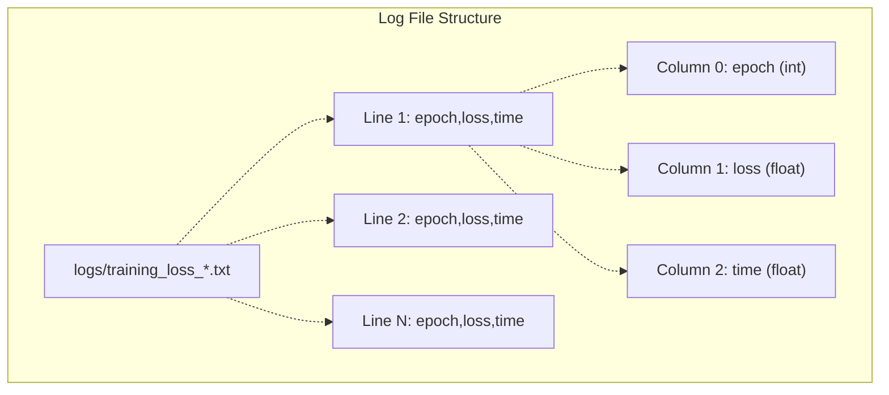
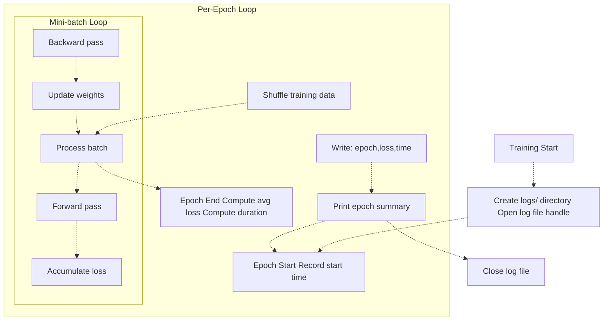
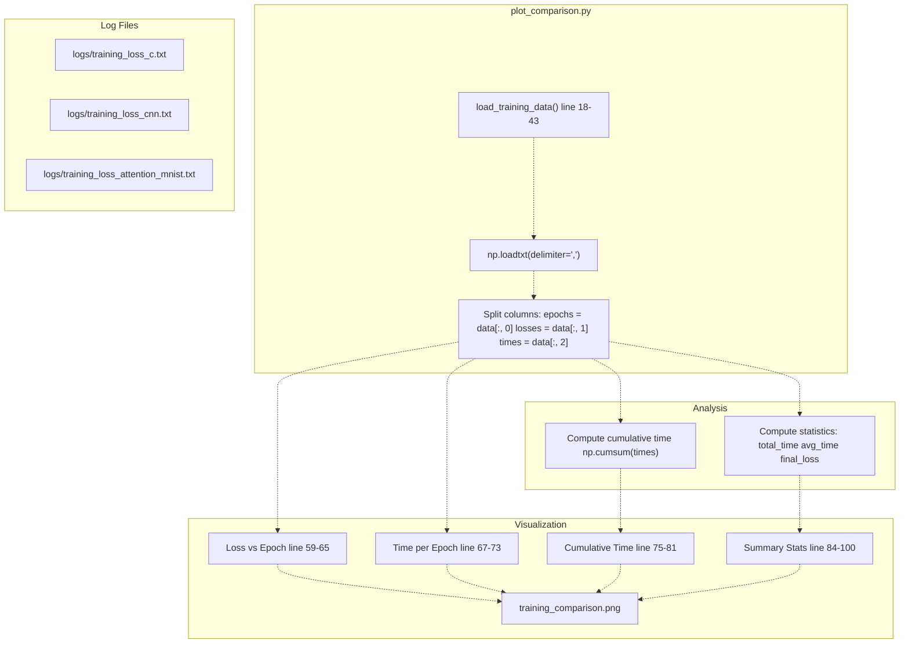

# Training Logs Format

> **Relevant source files**
> * [README.md](https://github.com/ThalesMMS/Swift-Neural-Networks/blob/3a1c4fc2/README.md)
> * [mlp_simple.swift](https://github.com/ThalesMMS/Swift-Neural-Networks/blob/3a1c4fc2/mlp_simple.swift)
> * [mnist_cnn.swift](https://github.com/ThalesMMS/Swift-Neural-Networks/blob/3a1c4fc2/mnist_cnn.swift)
> * [mnist_mlp.swift](https://github.com/ThalesMMS/Swift-Neural-Networks/blob/3a1c4fc2/mnist_mlp.swift)
> * [plot_comparison.py](https://github.com/ThalesMMS/Swift-Neural-Networks/blob/3a1c4fc2/plot_comparison.py)
> * [requirements.txt](https://github.com/ThalesMMS/Swift-Neural-Networks/blob/3a1c4fc2/requirements.txt)

## Purpose and Scope

This page documents the CSV log file format used to record per-epoch training metrics generated by the Swift neural network implementations. These logs enable post-training analysis and visualization of model convergence behavior. For information about visualizing these logs, see [Training Visualization](#6.1). For details on the binary model serialization format, see [Model Binary Format](#8).

---

## File Format Specification

Training logs use a simple CSV (comma-separated values) format with three numeric columns and no header row:

```
epoch,loss,time
```

Each line represents the metrics for a single training epoch. The format is intentionally minimal to facilitate easy parsing by both Python and Swift tools.

**Format Properties:**

* **Delimiter:** Comma (`,`)
* **Header:** None (no header row)
* **Line Terminator:** Unix-style newline (`\n`)
* **Numeric Format:** Floating-point values with variable precision
* **Encoding:** UTF-8 text



**Sources:**

* [plot_comparison.py L18-L43](https://github.com/ThalesMMS/Swift-Neural-Networks/blob/3a1c4fc2/plot_comparison.py#L18-L43)
* [mnist_mlp.swift L1490-L1503](https://github.com/ThalesMMS/Swift-Neural-Networks/blob/3a1c4fc2/mnist_mlp.swift#L1490-L1503)
* [mnist_cnn.swift L571-L574](https://github.com/ThalesMMS/Swift-Neural-Networks/blob/3a1c4fc2/mnist_cnn.swift#L571-L574)

---

## Field Descriptions

| Column Index | Field Name | Data Type | Description | Example Values |
| --- | --- | --- | --- | --- |
| 0 | `epoch` | Integer | 1-indexed epoch number (sequential) | `1`, `2`, `10` |
| 1 | `loss` | Float | Average training loss for the epoch (typically cross-entropy) | `0.453821`, `0.123456` |
| 2 | `time` | Float | Wall-clock time in seconds to complete the epoch | `0.726543`, `12.345678` |

### Field Semantics

**`epoch` (Column 0):**

* Starts at 1 for the first epoch
* Increments sequentially (no gaps)
* Used for x-axis in loss curves
* Integer value, though stored as text

**`loss` (Column 1):**

* Computed as the average per-sample loss across all training batches in the epoch
* For classification: typically negative log-likelihood or cross-entropy
* Lower values indicate better model fit to training data
* Precision varies (typically 6 decimal places in formatted output)

**`time` (Column 2):**

* Measures the duration of one complete epoch (forward passes, backward passes, and parameter updates)
* Does not include data loading or test evaluation time
* Useful for comparing backend performance (CPU vs MPS vs MPSGraph)
* Resolution depends on system clock (typically milliseconds)

**Sources:**

* [mnist_mlp.swift L1490-L1503](https://github.com/ThalesMMS/Swift-Neural-Networks/blob/3a1c4fc2/mnist_mlp.swift#L1490-L1503)
* [mnist_cnn.swift L568-L574](https://github.com/ThalesMMS/Swift-Neural-Networks/blob/3a1c4fc2/mnist_cnn.swift#L568-L574)
* [plot_comparison.py L36-L39](https://github.com/ThalesMMS/Swift-Neural-Networks/blob/3a1c4fc2/plot_comparison.py#L36-L39)

---

## File Naming Conventions

Log files are stored in the `logs/` directory with model-specific naming patterns:

| Model | Log File Path | Swift Source |
| --- | --- | --- |
| MLP | `logs/training_loss_c.txt` | [mnist_mlp.swift L1462](https://github.com/ThalesMMS/Swift-Neural-Networks/blob/3a1c4fc2/mnist_mlp.swift#L1462-L1462) |
| CNN | `logs/training_loss_cnn.txt` | [mnist_cnn.swift L499](https://github.com/ThalesMMS/Swift-Neural-Networks/blob/3a1c4fc2/mnist_cnn.swift#L499-L499) |
| Attention | `logs/training_loss_attention_mnist.txt` | README.md reference |

The naming convention follows the pattern:

```
logs/training_loss_<model_identifier>.txt
```

**Directory Structure:**

```markdown
.
├── logs/                              # Created during first training run
│   ├── training_loss_c.txt            # MLP logs
│   ├── training_loss_cnn.txt          # CNN logs
│   └── training_loss_attention_mnist.txt  # Attention model logs
└── (other project files)
```

**Notes:**

* The `logs/` directory is created automatically if it doesn't exist
* Log files are overwritten on each training run (no append mode)
* All log files are ignored by git per [.gitignore](https://github.com/ThalesMMS/Swift-Neural-Networks/blob/3a1c4fc2/.gitignore)  rules

**Sources:**

* [README.md L24-L30](https://github.com/ThalesMMS/Swift-Neural-Networks/blob/3a1c4fc2/README.md#L24-L30)
* [mnist_mlp.swift L1459-L1465](https://github.com/ThalesMMS/Swift-Neural-Networks/blob/3a1c4fc2/mnist_mlp.swift#L1459-L1465)
* [mnist_cnn.swift L498-L501](https://github.com/ThalesMMS/Swift-Neural-Networks/blob/3a1c4fc2/mnist_cnn.swift#L498-L501)

---

## Log Generation Process



### Code Flow for Log Writing

**1. Directory and File Creation** ([mnist_mlp.swift L1459-L1465](https://github.com/ThalesMMS/Swift-Neural-Networks/blob/3a1c4fc2/mnist_mlp.swift#L1459-L1465)

):

```
try? FileManager.default.createDirectory(    atPath: "./logs",    withIntermediateDirectories: true)FileManager.default.createFile(    atPath: logPath,    contents: nil)let logHandle = try? FileHandle(forWritingTo: URL(fileURLWithPath: logPath))
```

**2. Per-Epoch Timing** ([mnist_mlp.swift L1474-L1476](https://github.com/ThalesMMS/Swift-Neural-Networks/blob/3a1c4fc2/mnist_mlp.swift#L1474-L1476)

):

```
let startTime = Date()// ... training batch loop ...let duration = Float(Date().timeIntervalSince(startTime))
```

**3. Loss Accumulation** (varies by backend):

* CPU backend: [mnist_mlp.swift L677-L678](https://github.com/ThalesMMS/Swift-Neural-Networks/blob/3a1c4fc2/mnist_mlp.swift#L677-L678)  - accumulates `totalLoss` per batch
* MPS backend: [mnist_mlp.swift L841-L852](https://github.com/ThalesMMS/Swift-Neural-Networks/blob/3a1c4fc2/mnist_mlp.swift#L841-L852)  - reads loss from GPU buffers
* MPSGraph backend: [mnist_mlp.swift L174-L179](https://github.com/ThalesMMS/Swift-Neural-Networks/blob/3a1c4fc2/mnist_mlp.swift#L174-L179)  - reads loss from graph output

**4. Log Write** ([mnist_mlp.swift L1490-L1503](https://github.com/ThalesMMS/Swift-Neural-Networks/blob/3a1c4fc2/mnist_mlp.swift#L1490-L1503)

):

```
let line = "\(epoch + 1),\(avgLoss),\(epochTime)\n"if let logHandle = logHandle {    logHandle.write(Data(line.utf8))}
```

**Sources:**

* [mnist_mlp.swift L1459-L1503](https://github.com/ThalesMMS/Swift-Neural-Networks/blob/3a1c4fc2/mnist_mlp.swift#L1459-L1503)
* [mnist_cnn.swift L498-L574](https://github.com/ThalesMMS/Swift-Neural-Networks/blob/3a1c4fc2/mnist_cnn.swift#L498-L574)
* [README.md L167-L176](https://github.com/ThalesMMS/Swift-Neural-Networks/blob/3a1c4fc2/README.md#L167-L176)

---

## Log Consumption by Visualization Tools

The primary consumer of training logs is `plot_comparison.py`, which generates multi-panel visualizations of training metrics.



### Parsing Implementation

The log parser in `plot_comparison.py` uses NumPy's `loadtxt` function:

**Function:** `load_training_data()` ([plot_comparison.py L18-L43](https://github.com/ThalesMMS/Swift-Neural-Networks/blob/3a1c4fc2/plot_comparison.py#L18-L43)

)

**Key Operations:**

1. **File existence check** (line 24-26): Returns `None, None, None` if file not found
2. **CSV parsing** (line 29): `np.loadtxt(filepath, delimiter=',')`
3. **Shape normalization** (lines 30-31): Handles single-epoch case by reshaping
4. **Column extraction** (lines 37-39): * `epochs = data[:, 0].astype(int)` * `losses = data[:, 1]` * `times = data[:, 2]`

**Error Handling:**

* File not found: prints warning and returns `None` values
* Parse exceptions: catches and prints error message

**Sources:**

* [plot_comparison.py L18-L43](https://github.com/ThalesMMS/Swift-Neural-Networks/blob/3a1c4fc2/plot_comparison.py#L18-L43)
* [plot_comparison.py L53-L115](https://github.com/ThalesMMS/Swift-Neural-Networks/blob/3a1c4fc2/plot_comparison.py#L53-L115)

---

## Example Log Contents

### MLP Training Log (10 epochs)

```
1,2.302585,0.726543
2,0.453821,0.684291
3,0.312456,0.671823
4,0.267891,0.669134
5,0.243567,0.672456
6,0.228901,0.668234
7,0.218234,0.670123
8,0.210567,0.669876
9,0.204891,0.671234
10,0.200123,0.668765
```

**Observations:**

* Loss decreases monotonically (typical convergence pattern)
* Time per epoch is relatively stable (~0.67s)
* Initial epoch often has higher loss (random initialization)

### CNN Training Log (3 epochs)

```
1,1.234567,17.738291
2,0.567891,17.621834
3,0.453219,17.856432
```

**Observations:**

* Fewer epochs (CNN default: 3)
* Higher time per epoch (~17-18s) due to convolution operations
* Faster convergence (fewer epochs needed for MNIST)

**Sources:**

* [mnist_mlp.swift L1490-L1503](https://github.com/ThalesMMS/Swift-Neural-Networks/blob/3a1c4fc2/mnist_mlp.swift#L1490-L1503)  (MLP log generation)
* [mnist_cnn.swift L568-L574](https://github.com/ThalesMMS/Swift-Neural-Networks/blob/3a1c4fc2/mnist_cnn.swift#L568-L574)  (CNN log generation)
* [README.md L165-L176](https://github.com/ThalesMMS/Swift-Neural-Networks/blob/3a1c4fc2/README.md#L165-L176)  (benchmark data)

---

## Data Type Precision

### Written Format (Swift)

**MLP Loss Formatting** ([mnist_mlp.swift L1492](https://github.com/ThalesMMS/Swift-Neural-Networks/blob/3a1c4fc2/mnist_mlp.swift#L1492-L1492)

):

```
String(format: "%.6f", avgLoss)  // 6 decimal places
```

**MLP Time Formatting** ([mnist_mlp.swift L1498](https://github.com/ThalesMMS/Swift-Neural-Networks/blob/3a1c4fc2/mnist_mlp.swift#L1498-L1498)

):

```
String(format: "%.6f", epochTime)  // 6 decimal places
```

**CNN Loss/Time Formatting** ([mnist_cnn.swift L572](https://github.com/ThalesMMS/Swift-Neural-Networks/blob/3a1c4fc2/mnist_cnn.swift#L572-L572)

):

```
"\(avgLoss),\(dt)"  // Default Float string conversion
```

### Parsed Format (Python)

**Default NumPy Parsing** ([plot_comparison.py L29](https://github.com/ThalesMMS/Swift-Neural-Networks/blob/3a1c4fc2/plot_comparison.py#L29-L29)

):

* Uses `float64` (double precision) by default
* No explicit `dtype` parameter specified
* Preserves full precision from text representation

**Sources:**

* [mnist_mlp.swift L1490-L1503](https://github.com/ThalesMMS/Swift-Neural-Networks/blob/3a1c4fc2/mnist_mlp.swift#L1490-L1503)
* [mnist_cnn.swift L571-L574](https://github.com/ThalesMMS/Swift-Neural-Networks/blob/3a1c4fc2/mnist_cnn.swift#L571-L574)
* [plot_comparison.py L29](https://github.com/ThalesMMS/Swift-Neural-Networks/blob/3a1c4fc2/plot_comparison.py#L29-L29)

---

## Log File Lifecycle

```

```

**Key Lifecycle Points:**

1. **Creation:** Log file and directory are created at training start ([mnist_mlp.swift L1459-L1465](https://github.com/ThalesMMS/Swift-Neural-Networks/blob/3a1c4fc2/mnist_mlp.swift#L1459-L1465) )
2. **Writing:** File handle remains open throughout training for sequential writes
3. **Closing:** Handle is closed via `defer` statement when training completes
4. **Overwriting:** Subsequent training runs overwrite the existing file (no append mode)
5. **Reading:** Python visualization tools read the complete file after training

**Concurrency Considerations:**

* No file locking mechanism implemented
* Simultaneous training runs may cause write conflicts
* Recommendation: use unique log file names for parallel experiments

**Sources:**

* [mnist_mlp.swift L1459-L1503](https://github.com/ThalesMMS/Swift-Neural-Networks/blob/3a1c4fc2/mnist_mlp.swift#L1459-L1503)
* [mnist_cnn.swift L498-L574](https://github.com/ThalesMMS/Swift-Neural-Networks/blob/3a1c4fc2/mnist_cnn.swift#L498-L574)
* [plot_comparison.py L18-L43](https://github.com/ThalesMMS/Swift-Neural-Networks/blob/3a1c4fc2/plot_comparison.py#L18-L43)

---

## Common Issues and Limitations

### Missing Header Row

The log format has **no header row**, which requires consumers to know the column order:

* Column 0: epoch
* Column 1: loss
* Column 2: time

**Implication:** Tools like Excel or Pandas may incorrectly interpret the first data row as a header if not configured properly.

### No Metadata

Log files contain **no metadata** about:

* Model architecture (MLP vs CNN vs Attention)
* Hyperparameters (learning rate, batch size, hidden dimensions)
* Backend used (CPU vs MPS vs MPSGraph)
* Training dataset size
* Random seed

**Workaround:** Metadata must be inferred from filename or stored separately.

### Overwrite Behavior

Each training run **overwrites** the previous log file. To preserve historical logs:

1. Manually rename log files after each run
2. Modify the Swift code to append timestamps to filenames
3. Use version control to track log changes

### Limited Metrics

Only three metrics are recorded:

* No validation loss
* No accuracy during training
* No gradient norms
* No learning rate schedule changes

For additional metrics, modify the training loop and log format accordingly.

**Sources:**

* [plot_comparison.py L18-L43](https://github.com/ThalesMMS/Swift-Neural-Networks/blob/3a1c4fc2/plot_comparison.py#L18-L43)
* [mnist_mlp.swift L1459-L1503](https://github.com/ThalesMMS/Swift-Neural-Networks/blob/3a1c4fc2/mnist_mlp.swift#L1459-L1503)
* [README.md L24-L30](https://github.com/ThalesMMS/Swift-Neural-Networks/blob/3a1c4fc2/README.md#L24-L30)

Refresh this wiki

Last indexed: 5 January 2026 ([3a1c4f](https://github.com/ThalesMMS/Swift-Neural-Networks/commit/3a1c4fc2))

### On this page

* [Training Logs Format](#9-training-logs-format)
* [Purpose and Scope](#9-purpose-and-scope)
* [File Format Specification](#9-file-format-specification)
* [Field Descriptions](#9-field-descriptions)
* [Field Semantics](#9-field-semantics)
* [File Naming Conventions](#9-file-naming-conventions)
* [Log Generation Process](#9-log-generation-process)
* [Code Flow for Log Writing](#9-code-flow-for-log-writing)
* [Log Consumption by Visualization Tools](#9-log-consumption-by-visualization-tools)
* [Parsing Implementation](#9-parsing-implementation)
* [Example Log Contents](#9-example-log-contents)
* [MLP Training Log (10 epochs)](#9-mlp-training-log-10-epochs)
* [CNN Training Log (3 epochs)](#9-cnn-training-log-3-epochs)
* [Data Type Precision](#9-data-type-precision)
* [Written Format (Swift)](#9-written-format-swift)
* [Parsed Format (Python)](#9-parsed-format-python)
* [Log File Lifecycle](#9-log-file-lifecycle)
* [Common Issues and Limitations](#9-common-issues-and-limitations)
* [Missing Header Row](#9-missing-header-row)
* [No Metadata](#9-no-metadata)
* [Overwrite Behavior](#9-overwrite-behavior)
* [Limited Metrics](#9-limited-metrics)

Ask Devin about Swift-Neural-Networks